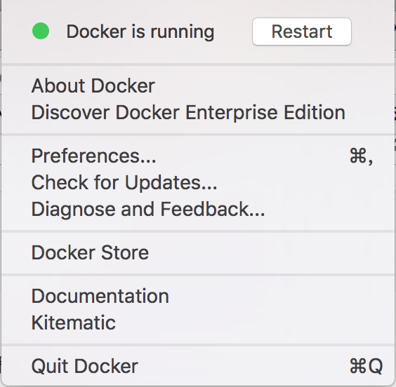
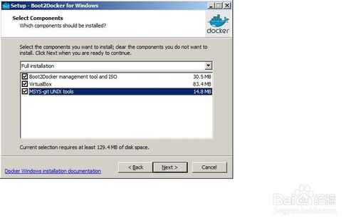
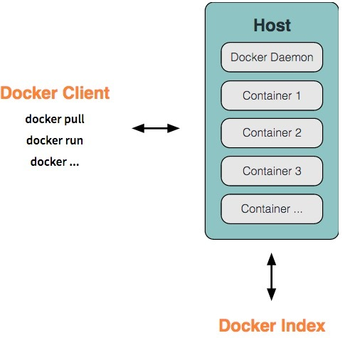
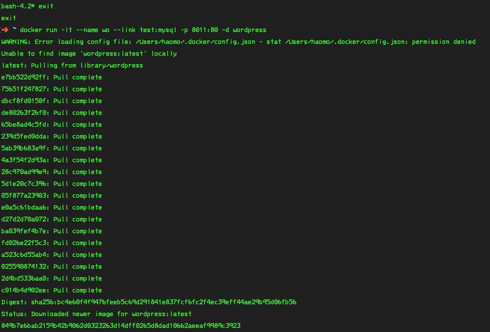
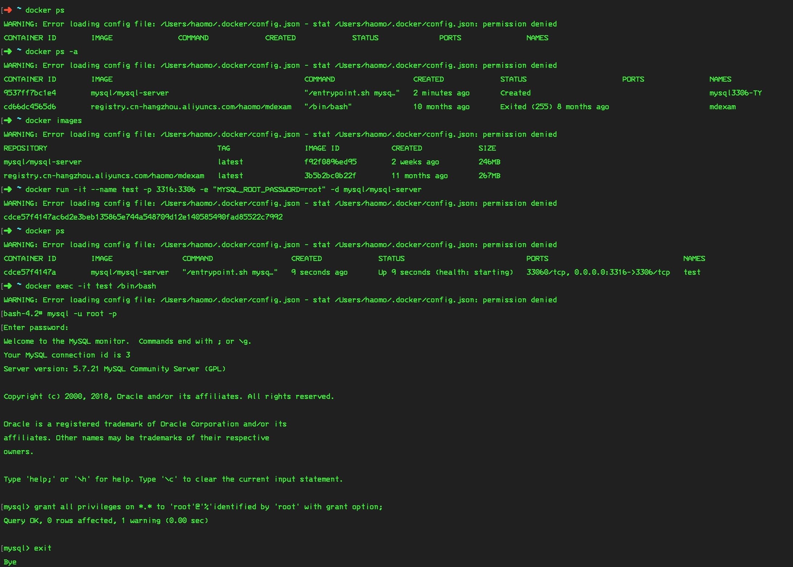

# Docker

#### 作者：高天阳
#### 邮箱：13683265113@163.com

```
更改历史

* 2018-8-10	    高天阳	    修改WordPress实例
* 2018-5-31	    高天阳	    补充实例
* 2018-2-5	    高天阳	    补充命令内容
* 2017-9-13	    高天阳	    补充命令内容
* 2017-7-3      高天阳	    初始化文档

```

## 1 Docker介绍

### 1.1 docker简介

**Docker**是一个开源的应用容器引擎，让开发者可以打包他们的应用及依赖包到一个可移植的容器中，然后发布到任何流行的**Linux**机器上，也可以实现虚拟化。容器是完全使用沙箱机制，相互之间不会有任何接口。

作为新手，可以简单理解为**Docker**就是轻量级的**VM**虚似机。

### 1.2 Docker是什么？

**Docker**是一个程序运行、测试、交付的开放平台，**Docker**被设计为能够使你快速地交付应用。在**Docker**中，你可以将你的程序分为不同的基础部分，对于每一个基础部分都可以当做一个应用程序来管理。**Docker**能够帮助你快速地测试、快速地编码、快速地交付，并且缩短你从编码到运行应用的周期。

**Docker**使用轻量级的容器虚拟化平台，并且结合工作流和工具，来帮助你管理、部署你的应用程序。

在其核心，**Docker**实现了让几乎任何程序都可以在一个安全、隔离的容器中运行。安全和隔离可以使你可以同时在机器上运行多个容器。

容器轻量级的特性，意味着你可以得到更多的硬件性能。

围绕着容器的虚拟化工具和平台，可以在以下几个方面为你提供帮助：

* 帮助你把应用程序\(包括其余的支持组件\)放入到Docker容器中。
* 分发和转移你的容器至你的团队其它成员来进行进一步的开发和测试。
* 部署这些应用程序至你的生产环境，不论是本地的数据中心还是云平台

### 1.3 Docker企业版和社区版

**Docker**在2017年的3月1号之后，Docker的版本命名开始发生变化，同时将**CE**版本和**EE**版本进行分开。**CE**为社区版本，免费使用，**EE**为企业版本，收费的。

国内公司使用**CentOS**居多，初学者建议直接上手**CentOS**，不同的操作系统，在命令上有细微不同。

* 小知识点：**CentOS**是使用**RedHat**源码编译，因为商标的原因所以命名不同。


## 2 Docker安装

### 2.1 Mac安装Docker

##### 2.1.1 下载Docker for OS X Installer {#11-下载docker-for-os-x-installer}

###### 下载链接[https://docs.docker.com/docker-for-mac/](https://docs.docker.com/docker-for-mac/) {#下载链接httpsdocsdockercomdocker-for-mac}

##### 2.1.2 安装

将**Docker**拖到**Application**中

然后它会要求你输入密码以获得更高的权限，输入密码即可~~

安装完成！

打开**Docker**后\(如下图所示\)，状态栏中可以看到**Docker**的标志，点开会有“Docker is running”的字样，便可以在终端操作



### 2.2 Windows下安装

#### 2.2.1 下载

官网下载boot2docker for windows 1.2

#### 2.2.2 双击打开

需要安装3个部分（如下图所示）



#### 2.3 查看环境变量

安装完成后查看环境变量

**Path**中是否包含**boot2docker**和**Git**

#### 2.4 重启电脑

未开启**vt-x**的在**bios**中开启**vt-x**

#### 2.5 启动docker

桌面上双击boot2docker start.sh

#### 2.6 等待启动

#### 2.7 完成

## 3 Docker的主要组成

**Docker**有两个主要的部件：

* Docker: 开源的容器虚拟化平台。
* Docker Hub: 用于分享、管理Docker容器的Docker SaaS平台。

## 4 Docker的架构

```
   Docker使用客户端-服务器\(client-server\)架构模式。Docker客户端会与Docker守护进程进行通信。Docker守护 进程会处理复杂繁重的任务，例如建立、运行、发布你的Docker容器。Docker客户端和守护进程可以运行在同一个系统上，当然你也可以使用 Docker客户端去连接一个远程的Docker守护进程。Docker客户端和守护进程之间通过socket或者RESTful API进行通信。

```



### 4.1 Docker守护进程

如上图所示，**Docker**守护进程运行在一台主机上。用不并不直接和守护进程进行交互，而是通过**Docker**客户端间接和其通信。

### 4.2 Docker客户端

**Docker**客户端，实际上是`docker`的二进制程序，是主要的用户与**Docker**交互方式。它接收用户指令并且与背后的**Docker**守护进程通信，如此来回往复。

### 4.3 Docker的内部

要理解**Docker**的内部构建，必须知道以下三种部件：

* Docker镜像 \(Docker images\)。
* Docker仓库 \(Docker registeries\)。
* Docker容器\(Docker containers\)。

#### 4.3.1 Docker镜像

Docker镜像是一个只读的模板。举个例子，一个镜像可以包含一个运行在Apache上的Web应用和其使用的Ubuntu操作系统。

镜像是用来创建容器的。Docker提供了简单的放来来建立新的镜像或者升级现有的镜像，你也可以下载别人已经创建好的镜像。     Docker镜像是Docker的**构造**部分。

* 镜像概念:可以把镜像看做类(java类 JavaScript类)

#### 4.3.2 Docker仓库

Docker仓库用来保存镜像。可以理解为代码控制中的代码仓库。同样的，Docker仓库也有公有和私有的概念。公有的Docker仓库名字是[Docker Hub](http://hub.docker.com/)。Docker Hub提供了庞大的镜像集合供使用。这些镜像可以是你自己创建的，或者你也可以在别人的镜像基础上创建。Docker仓库是Docker的**分发**部分。

#### 4.3.3 Docker容器

Docker容器和文件夹很类似。一个Docker容器包含了所有的某个应用运行所需要的环境。每一个Docker容器都是从Docker镜像创建 的。Docker容器可以运行、开始、停止、移动和删除。每一个Docker容器都是独立和安全的应用平台。Docker容器是Docker的**运行**部分。

* 容器概念:可以把容器看做实例(及new java对象, new JavaScript对象)
* 镜像和容器的关系: Image container = new Image(); 容器是基于镜像创建的

## 5 创建Docker应用的详解

### 5.1 ubuntu应用

以**ubuntu**镜像为例： 这个镜像被称为基础镜像，及**Docker**官方提供的（看做它就是个ubuntu的虚拟机）只是一个裸机

以上说了**ubuntu**只是个镜像，我们是不能直接用的，我们最终用到的是容器及"镜像new出来的东西"

### 5.2 搜索镜像

* 首先查看docker的镜像仓库中是否有ubuntu这个镜像

```angular2html
docker search ubuntu
```

```
➜  ~ docker search ubuntu
NAME                                                   DESCRIPTION                                     STARS     OFFICIAL   AUTOMATED
ubuntu                                                 Ubuntu is a Debian-based Linux operating s...   6509      [OK]
dorowu/ubuntu-desktop-lxde-vnc                         Ubuntu with openssh-server and NoVNC            128                  [OK]
rastasheep/ubuntu-sshd                                 Dockerized SSH service, built on top of of...   97                   [OK]
ansible/ubuntu14.04-ansible                            Ubuntu 14.04 LTS with ansible                   86                   [OK]
ubuntu-upstart                                         Upstart is an event-based replacement for ...   77        [OK]
```

* 上图中我们可以看到有我们需要的ubuntu镜像 接下来就把它拉去到本地吧！

### 5.3 拉取镜像

要从docker的镜像仓库中拉去ubuntu这个镜像到本地

```angular2html
docker pull ubuntu
```

```angular2html
➜  ~ docker pull ubuntu
Using default tag: latest
latest: Pulling from library/ubuntu
d5c6f90da05d: Downloading [==========================>                        ]  25.18MB/47.26MB
1300883d87d5: Download complete
c220aa3cfc1b: Download complete
2e9398f099dc: Download complete
dc27a084064f: Download complete
```

### 5.4 查看本地下载镜像

```angular2html
docker images
```

```angular2html
➜  ~ docker images
REPOSITORY                                       TAG                 IMAGE ID            CREATED             SIZE
ubuntu                                           latest              ccc7a11d65b1        3 weeks ago         120MB
mysql/mysql-server                               latest              3157d7f55f8d        5 weeks ago         241MB
registry.cn-hangzhou.aliyuncs.com/haomo/mdexam   zf                  e00964020355        2 months ago        1.64GB
busybox                                          latest              c30178c5239f        2 months ago        1.11MB
juu                                              latest              452596e4f289        2 months ago        118MB
yd/mysql                                         latest              4e84d647f316        3 months ago        586MB
nginx                                            latest              958a7ae9e569        3 months ago        109MB
ubuntu                                           \<\none\>\              ebcd9d4fca80        3 months ago        118MB
mysql
```

* 在刚装的情况下应该只显示一个ubuntu镜像 其他镜像是我装的可以忽略

### 5.5 创建第一个容器

```angular2html
docker run -i -t ubuntu /bin/bash
docker run -it --name mdexam --hostname mdexam -d -p - /Users/liuranran/webwork/skilleee:/opt/work \[路径\] /bin/bash
```

```
➜  ~ docker run -i -t ubuntu /bin/bash
root@c6d35db61f33:/# exit
```

* 上面用run命令创建一个给予ubuntu镜像的容器 -i -t参数是调出容器内的shell可以与容器进行交互 exit 退出容器（退出及关闭容器）

### 5.6 查看已启动的容器

```angular2html
docker ps
```

```angular2html
➜  ~ docker ps
CONTAINER ID        IMAGE               COMMAND             CREATED             STATUS              PORTS               NAMES
```

* docker ps 是查看已启动的容器 加个-a参数查看全部的容器(包括没启动的)

### 5.7 查看所有容器

```angular2html
docker ps -a
```

```angular2html
➜  ~ docker ps -a
查看所有容器

➜  ~ docker ps -a
CONTAINER ID        IMAGE                                               COMMAND                  CREATED             STATUS                      PORTS                               NAMES
3b7409112eb8        ubuntu                                              "/bin/bash"              5 minutes ago       Exited (0) 5 minutes ago                                        sharp_williams
```

* 我们可以看到的信息有这个容器的id(3b7409112eb8) 给予哪个镜像创建的(ubuntu) 还有就是这个容器的名称(sharp_williams)名称是随机分配的

### 5.8 启动容器

```
docker start c6d35db61f33
```

```angular2html
➜  ~ docker start c6d35db61f33
c6d35db61f33
➜  ~ docker ps
CONTAINER ID        IMAGE               COMMAND             CREATED             STATUS              PORTS               NAMES
c6d35db61f33        ubuntu              "/bin/bash"         7 minutes ago       Up 4 seconds                            silly_aryabhata
```

* docker start c6d35db61f33(容器id) 启动容器 可以使用docker ps -a 查看容器id
* docker ps 查看我们刚刚启动的容器

### 5.9 关闭容器

```
docker stop c6d35db61f33
```

```
➜  ~ docker stop c6d35db61f33
c6d35db61f33
➜  ~ docker ps
CONTAINER ID        IMAGE               COMMAND             CREATED             STATUS              PORTS               NAMES
➜  ~
```

* docker stop c6d35db61f33(容器id) 关闭这个容器
* docker ps 查看已启动的容器这里显示没有,及已被关闭

### 5.10 与容器进行交互

```
docker start c6d35db61f33
```
```
➜  ~ docker start c6d35db61f33
c6d35db61f33
➜  ~ docker ps
CONTAINER ID        IMAGE               COMMAND             CREATED             STATUS              PORTS               NAMES
c6d35db61f33        ubuntu              "/bin/bash"         14 minutes ago      Up 9 seconds                            silly_aryabhata
➜  ~ docker exec -i -t c6d35db61f33 /bin/bash
root@c6d35db61f33:/#
```

* 要与容器进行交互首先要保证这个容器是启动的，docker start c6d35db61f33 运行id为c6d35db61f33的容器
* docker ps 查看已启动的容器
* docker exec -i -t c6d35db61f33 /bin/bash 调出容器的shell与容器进行交互 在容器内新开一个shell交互退出时exit不退出容器

### 5.11 创建一个指定名称为testDocker的容器

```
docker run -i -t --name testDocker ubuntu /bin/bash
```

```
➜  ~ docker run -i -t --name testDocker ubuntu /bin/bash
root@31fd4713f7da:/#
➜  ~ docker ps -a
CONTAINER ID        IMAGE                                               COMMAND                  CREATED             STATUS                      PORTS                               NAMES
31fd4713f7da        ubuntu                                              "/bin/bash"              31 seconds ago      Exited (0) 14 seconds ago                                       testDocker
```

* --name参数可以指定创建容器的名称

### 5.12 创建一个后台进行的容器

```
docker run--name testDocker -d ubuntu /bin/bash
```

```
➜  ~ docker run--name testDocker -d ubuntu /bin/bash
2b6be9c242276b3969d6b8e36f5d07337f770bfe6c64a43fb51054824e995c67
➜  ~ docker ps
CONTAINER ID        IMAGE               COMMAND             CREATED             STATUS              PORTS               NAMES
2b6be9c24227        ubuntu              "/bin/bash"         44 seconds ago      Up 43 seconds 
```

### 5.13 attach 附着容器

```
docker attach 2b6be9c24227
```

```
➜  ~ docker attach 2b6be9c24227
root@2b6be9c24227:/#
root@2b6be9c24227:/# exit
exit
➜  ~
➜  ~ docker ps
CONTAINER ID        IMAGE               COMMAND             CREATED             STATUS              PORTS               NAMES
➜  ~
```

* --docker attach 2b6be9c24227 附着到这个容器在创建时的shell交互 当exit退出时容器也跟着停止（一般用exec）

### 5.14 查看容器日志

```
docker logs 2b6be9c24227
```

* 查看容器日志docker logs 2b6be9c24227(容器id)

### 5.15 查看容器内部运行的进程

```
docker top testDocker
```

```
➜  ~ docker top testDocker
PID                 USER                TIME                COMMAND
3162                root                0:00                /bin/bash
➜  ~
```

* docker top testDocker(容器名/ID都可以)

```
docker top testDocker
```

```
➜  ~ docker top testDocker
PID                 USER                TIME                COMMAND
3162                root                0:00                /bin/bash
➜  ~
```

### 5.16 自动重启容器

```
docker run --restart=on-failure:5 --name testR1 -d ubuntu /bin/sh -c "while true; do echo hello world; sleep 1; done"
```

* --restart 标志被设置为always,无论容器的退出代码是什么，Docker都会自动重启该容器,除了always ，我们还可以将这个标志设置为on-failure,
这样，只有当容器的退出代码为非0值的时候，才会自动启动，另外，on-failure还接受一个可选的重启次数，如：--restart=on-failure:5

### 5.17 深入容器

查看容器

``` 
docker inspect testR1
```

```
➜  ~ docker inspect testR1
[
{
"Id": "553badc90f4cbb430791dad29c597c3ec46fb6d825c3951e79d73f884d404069",
"Created": "2017-09-04T07:07:10.607876379Z",
"Path": "/bin/sh",
"Args": [
"-c",
"while true; do echo hello world; sleep 1; done"
],
"State": {
"Status": "running",
"Running": true,
"Paused": false,
"Restarting": false,
"OOMKilled": false,
..........
```

docker inspect 容器名称 查看容器构造

### 5.18 删除容器

```
docker rm 2b6be9c24227
```

```
➜  ~ docker rm 2b6be9c24227
```

* docker rm 容器id或者容器名都可以，注意：运行中的容器时删除不了的，必须停止之后进行删除

### 5.19 删除镜像

```
docker rmi c90f4cbb43079
```

* docker rmi 镜像名称/或者镜像id

### 5.20 端口映射

```
docker rmi c90f4cbb43079
```

* docker rmi 镜像名称/或者镜像id

### 5.21 映射到宿主机的指定端口

```
docker run -it -p 8080:80 --name test ubuntu /bin/bash
```

* -p 8080:80 将容器内的80端口映射到宿主机的8080端口上

### 5.22 卷

```
docekr run -it -v /opt/tomcat8/:/opt/tomcat8/ --name test ubuntu /bin/bash
```

* -v 将宿主机的/opt/tomcat8目录挂在(共享)到容器内的/opt/tomcat8/下 (及改变容器该是改变宿主机上的tomcat8下的文件他们同时都会被改变)

### 5.23 查看容器端口映射情况

```
docekr port test1 80
```

* 查看test1容器的80端口的映射情况(映射到宿主机的哪个端口)

### 5.24 将文件拷贝到容器内

```
docker cp /pot/project/ c90f4cbb43079:/tomcat8/webapps/
```

* 将宿主机/pot/project/文件夹拷贝到id为c90f4cbb43079容器的/tomcat8/webapps/目录下

### 5.25 将容器的文件拷贝到宿主机

```
docker cp c90f4cbb43079:/tomcat8/webapps/ /pot/project/
```

* 将id为c90f4cbb43079容器的/tomcat8/webapps/目录拷贝到宿主机/pot/project/文件夹下

### 5.26 常用指令

* docker images

* docker ps \(列出所有正在运行的命令\)

/*docker run -it --name mdexam --hostname mdexam -d -p - /Users/liuranran/webwork/skilleee:/opt/work \[路径\] /bin/bash*/

docker exec -it centos /bin/bash进入centos

docker commit \[ id\] centos:latest  
docker push centos:latest

docker stop mdexam

docker start mdexam

## 6 最佳实践

### 6.1 WordPress服务

#### 6.1.1 查看docker正在运行的命令

```angular2html
➜  ~ docker ps
```

```angular2html
CONTAINER ID    IMAGE   COMMAND     CREATED     STATUS      PORTS       NAMES
```

#### 6.1.2 查看docker全部正在运行的命令

```angular2html
➜  ~ docker ps -a
```

```angular2html
CONTAINER ID    IMAGE   COMMAND     CREATED     STATUS      PORTS       NAMES
```

#### 6.1.3 查看docker容器

```angular2html
➜  ~ docker images
```

```angular2html
REPOSITORY           TAG                 IMAGE ID            CREATED             SIZE
mysql/mysql-server   latest              1fdf3806e715        26 hours ago        309MB
wordpress            latest              9414c91da9a8        6 days ago          408MB
mysql                latest              7bbe2074ef0a        6 days ago          484MB
```

#### 6.1.4 起`mysql`容器，命名为`mysql3306-TY`

```angular2html
➜  ~ docker run --name mysql3306-TY -p 3306:3306 -e "MYSQL_ROOT_PASSWORD=root" -d mysql
```

```angular2html
cdce57f4147ac6d2e3beb135865e744a548709d12e140585490fad85522c7992
```

#### 6.1.5 查看docker正在运行的命令

```angular2html
➜  ~ docker ps
```

```angular2html
CONTAINER ID        IMAGE               COMMAND                  CREATED             STATUS              PORTS                    NAMES
a1e5380e57b0        mysql               "docker-entrypoint.s…"   2 hours ago         Up 2 hours          0.0.0.0:3306->3306/tcp   mysql3306-TY
```

#### 6.1.6 ~~进入test容器~~（最新版本mysql不需要再修改访问权限）

```angular2html
➜  ~ docker mysql3306-TY -it test /bin/bash
```

```angular2html
WARNING: Error loading config file: /Users/haomo/.docker/config.json - stat /Users/haomo/.docker/config.json: permission denied
```

#### 6.1.7 ~~进入mysql并输入密码~~`root`（最新版本mysql不需要再修改访问权限）

```angular2html
bash-4.2# mysql -u root -p 
```

```angular2html
Welcome to the MySQL monitor.  Commands end with ; or \g.
Your MySQL connection id is 3
Server version: 5.7.21 MySQL Community Server (GPL)

Copyright (c) 2000, 2018, Oracle and/or its affiliates. All rights reserved.

Oracle is a registered trademark of Oracle Corporation and/or its
affiliates. Other names may be trademarks of their respective
owners.

Type 'help;' or '\h' for help. Type '\c' to clear the current input statement.
```

#### 6.1.8 ~~修改权限~~（最新版本mysql不需要再修改访问权限）

```angular2html
mysql> grant all privileges on *.* to 'root'@'%'identified by 'root' with grant option;
```

```angular2html
Query OK, 0 rows affected, 1 warning (0.00 sec)
```

#### 6.1.9 ~~退出mysql~~（最新版本mysql不需要再修改访问权限）

```
mysql> exit
```

```angular2html
Bye
```

#### 6.1.10 ~~退出test容器~~（最新版本mysql不需要再修改访问权限）

```
bash-4.2# exit
```

```angular2html
exit
```

#### 6.1.11 安装WordPress

```angular2html
➜  ~ docker run --name some-wordpress --link mysql3306-TY:mysql -p 8080:80 -d wordpress
```

```angular2html
WARNING: Error loading config file: /Users/haomo/.docker/config.json - stat /Users/haomo/.docker/config.json: permission denied
Unable to find image 'wordpress:latest' locally
latest: Pulling from library/wordpress
e7bb522d92ff: Pull complete 
75651f247827: Pull complete 
dbcf8fd0150f: Pull complete 
de80263f26f0: Pull complete 
65be8ad4c5fd: Pull complete 
239d5fed0dda: Pull complete 
5ab39b683a9f: Pull complete 
4a3f54f2d93a: Pull complete 
28c970ad99e9: Pull complete 
5d1e20c7c396: Pull complete 
05f877a23903: Pull complete 
e0a5c61bdaa6: Pull complete 
d27d2d70a072: Pull complete 
ba039fef4b7e: Pull complete 
fd026e22f5c3: Pull complete 
a523c6d55ab4: Pull complete 
025590874132: Pull complete 
2d4bd5336aa0: Pull complete 
c014b4d902ee: Pull complete 
Digest: sha256:bc4e60f4f9476feeb5c69d291841e837fcf6fc2f4ec39eff44ae29b95d06fb56
Status: Downloaded newer image for wordpress:latest
849b7e6bab2159b42b9062d0323263d14dff0265d8dad10662aeeaf9989c3923
```




### 6.2 在docker中起项目

#### 6.2.1 连接服务器
```
$ ssh member@haomo-tech.com
```

#### 6.2.2 下载镜像

```
$ docker pull [镜像名称]
ps. docker pull node
```

#### 6.2.3 查看已下载的镜像

```
$ docker image //查看已下载的镜像
```

#### 6.2.4 运行镜像(需要创建容器时就指定映射端口号)

```
$ docker run -it -d --name [容器名称] -p [映射端口号] [镜像名称]
ps. docker run -it -d --name zjkapp -p 8088:80 node
```

#### 6.2.5 进入容器

```
4.docker exec -it [容器名称] /bin/bash
ps. docker exec -it zjkapp /bin/bash
```

#### 6.2.6 在容器中创建项目目录

```
$ mkdir -p /var/www/html
```

#### 6.2.7 退出容器

```
$ exit
```

#### 6.2.8 从服务器复制文件至容器

```
$ docker cp [服务器路径] [容器名称]:[容器中路径]
docker cp /var/www/html/zjkapp/ zjkapp:/var/www/html/zjkapp/
```

#### 6.2.9 容器中安装软件

* 如果在容器中需要使用vim或lsof软件 需要先安装

```
$ apt-get update // 更新软件列表
$ apt-get install vim // 安装vim
$ apt-get install lsof // 安装lsof
```

#### 6.2.10 查看端口是否占用

```
$ lsof -i:8081 // 查看8081端口
```

```
COMMAND  PID USER   FD   TYPE    DEVICE SIZE/OFF NODE NAME
node    1628 root   12u  IPv4 171656104      0t0  TCP *:tproxy (LISTEN)
```

#### 6.2.11 杀死对应端口(PID)

```
$ kill -9 [PID] // 查看8081端口
ps. kill -9 1628
```

## 参考资料

* [RUNOOB Docker教程](http://www.runoob.com/docker/docker-tutorial.html)
* [Docker中文文档](http://www.docker.org.cn/)