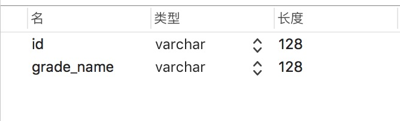
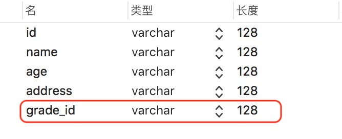
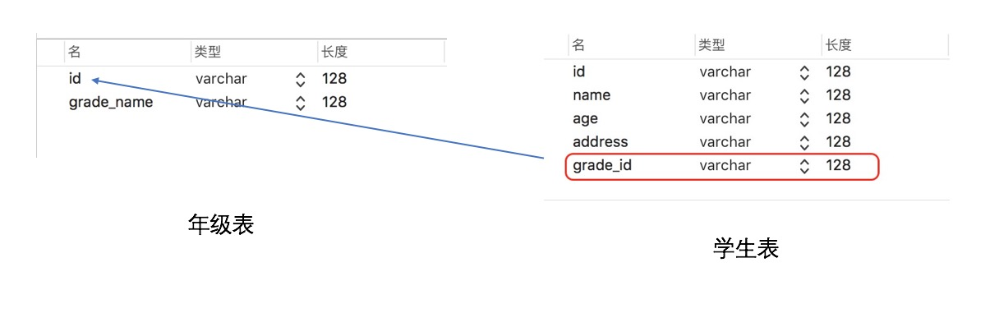
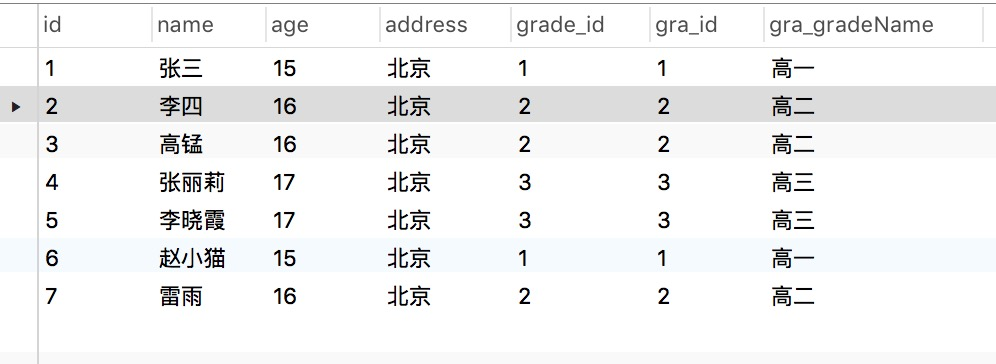

# 创建视图说明

#### 作者：高天阳
#### 邮箱：13683265113@163.com

```angular2html
更改历史

* 2018-5-16	高天阳	完善文档示例
* 2018-5-16	乔继超	初始化文档

```

## 现有如下两张表：

1.年级表（ID，年级名称）



2.学生表（ID，姓名，年龄，地址，年级）




## 现在要满足以下需求

```
创建一张视图，要求这个视图把学生表和年级表的信息都带出来，通过查询这张视图返回学生信息和所对应的年级信息。
```

## 注意

```
若要多表关联，相互关联的两张表之间必须存在关联字段！

再次案例中，关联字段是学生表中的“grade_id”,通过学生表中的“grade_id”找到年级表中的主键ID带出数据

```



## 创建视图

创建视图的基本语句：
```
CREATE VIEW view_name（视图名称）
AS sql查询语句

```

创建学生表和年级表的视图：
```
CREATE VIEW student_grade_view
AS select stu.*,gra.* from student as stu INNER join grade as gra on stu.grade_id=gra.id

注意：‘as’指的是另起一个别名

上述语句展示信息为学生表所有字段和年级表的所有字段(因为都是*)

那么就存在一个问题：两张表共同存在的字段就会重名

怎么解决呢？

第二张表的字段用‘表名.字段名’的方式进行展示，这样就可以给字段名其别名了

那么修改后的语句就是：

CREATE VIEW student_grade_view
AS select stu.*,gra.id as gra_id,gra.grade_name as gra_gradeName from student as stu INNER join grade as gra on stu.grade_id=gra.id

```


## 4 最佳实践

### 4.1 通过表student带出表grade

```
CREATE VIEW student_grade_view
select stu.*,gra.* from student stu left join grade gra on stu.grade_id=gra.id
```
#### 4.1.1 分步骤讲解

* 筛选哪些字段出来

```
select stu.*,gra.*
```

* 从哪个表(起别名)

```
from student stu
```

* 带出哪个表

```
left join grade gra
```

* 通过哪个字段

```
on stu.grade_id=gra.id
```

#### 4.1.2 问题点

* 注意:上面语句存在问题 因为student表和grade表都有id字段 不可一张表同时存在两个相同名称的列 因此需要下面方法将同名的字段取别名

```
CREATE VIEW student_grade_view
AS select stu.*,gra.id as gra_id,gra.grade_name as gra_gradeName from student as stu left join grade as gra on stu.grade_id=gra.id
```

### 4.2 通过表middle带表student和表grade

```
CREATE VIEW student_grade_view
As select stu.*,gra.* from middle mid left join grade gra on mid.grade_id=gra.id left join student stu on mid.student_id=stu.id
```

### 4.3 通过表middle(字段重复写别名)带表student和表grade

```
CREATE VIEW student_grade_view
As select stu.*,mid.id as mid_id,mid.grade_id as mid_grade_id from middle as mid left join student as stu on mid.student_id=stu.id
```

### 4.4 通过表middle带表student再带出表grade

```
CREATE VIEW student_grade_view
As select stu_mid.*,gra.grade_name,gra.id as gra_id from (SELECT stu.*,mid.id as mid_id,mid.grade_id as mid_grade_id from middle as mid left join student as stu on mid.student_id=stu.id) as stu_mid
left join grade gra on stu_mid.grade_id=gra.id
```

### 4.5 通过表student的两个字段带出两次表grade

```
CREATE VIEW student_grade_view
select stu.*,gra.grade_name as gra_gradeName,gra2.grade_name as gra2_gradeName from student stu left join grade gra on stu.grade_id=gra.id left join grade gra2 on stu.grade2_id=gra2.id
```