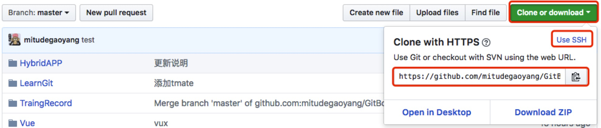
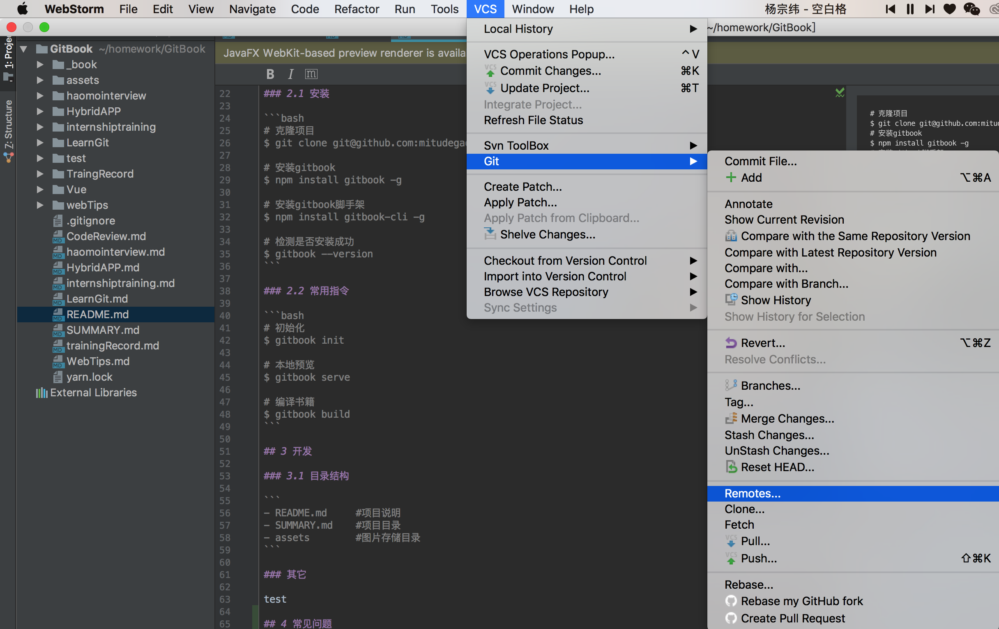
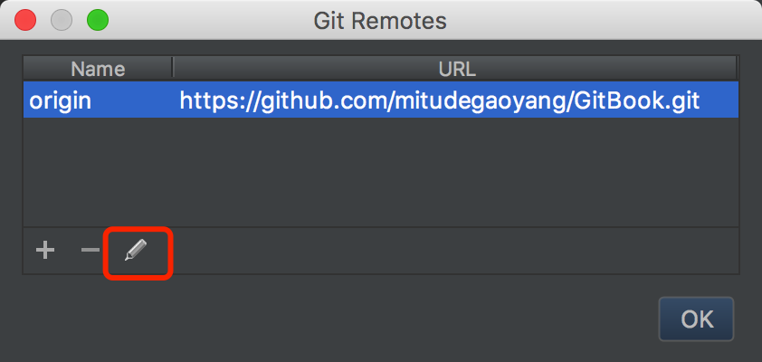

# GitBook

#### 作者：高天阳&王志伟

```
文档须知
* 2018-10-17	高天阳	尝试修复插件无法推送
* 2018-02-12	王志伟	补充资料
* 2017-06-29    高天阳	初始化项目
```

## 1 概述

本项目文档:[Gitbook链接地址](https://mitudegaoyang.gitbooks.io/mybook/content/)，

Gitbook详细说明见:[Gitbook的使用](TraingRecord/GitBook.md)
markdown详细说明见:[Markdown](TraingRecord/markdown.md)
文档书写规范:[培训材料撰写](TraingRecord/TrainingMaterialWriting.md)

## 2 使用

### 2.1 安装

```bash
# 克隆项目
$ git clone git@github.com:mitudegaoyang/GitBook.git

# 安装gitbook
$ npm install gitbook -g

# 安装gitbook脚手架
$ npm install gitbook-cli -g

# 检测是否安装成功
$ gitbook --version
```

### 2.2 常用指令

```bash
# 初始化
$ gitbook init

# 本地预览
$ gitbook serve

# 编译书籍
$ gitbook build
```

## 3 开发

### 3.1 目录结构

```
- README.md     #项目说明
- SUMMARY.md    #项目目录
- assets        #图片存储目录
```

### 3.2 配置文件book.json的使用

#### 3.2.1 插件列表及功能

livereload


"-lunr", "-search","search-plus@^0.0.11",
"-donate@^1.0.2",
"code",
"theme-comscore",
"simple-page-toc@^0.1.1",
"prism@^2.1.0",
"prism-themes@^0.0.2",
"advanced-emoji@^0.2.1",
"anchors@^0.7.1",
"include-codeblock@^3.0.2",
"ace@^0.3.2",
"emphasize@^1.1.0",
"katex@^1.1.3",
"splitter@^0.0.8",
"mermaid-gb3@2.1.0",
"tbfed-pagefooter@^0.0.1",
"expandable-chapters-small@^0.1.7",
"favicon@^0.0.2",
"todo@^0.1.3",
"terminal@^0.3.2",
"alerts@^0.2.0",
"include-csv@^0.1.0",
"markdown-video",
"anchor-navigation-ex",
"embed-pdf",
"chart@^0.2.0"

## 4 常见问题

### 4.1 推送权限不足

设置remotes为https格式

#### 添加远程仓库(https格式)

复制仓库http格式



设置webstorm的gitRemotes为https模式




再次执行push

## 参考

* [webstorm 推送项目到github](https://blog.csdn.net/mjth2014/article/details/80256224)