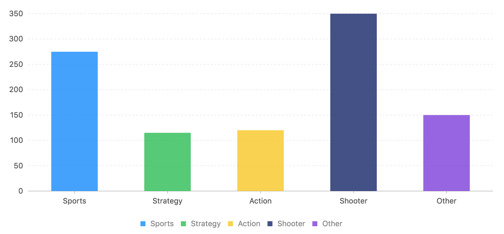
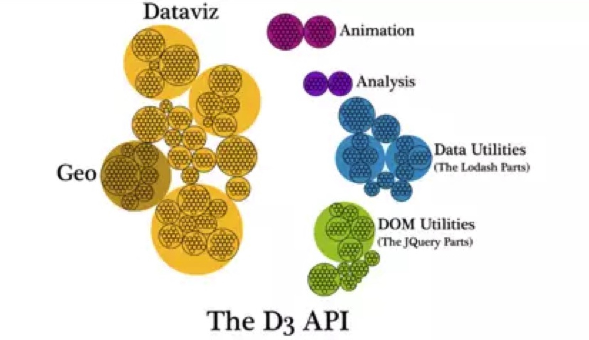

# AutV G2使用

#### 作者：高天阳
#### 邮箱：13683265113@163.com

```
更改历史

* 2019-02-19	    高天阳	初始化文档

```

## 1 简介与特点

### 1.1 简介

G2 是一套基于可视化编码的图形语法，以数据驱动，具有高度的易用性和扩展性，
用户无需关注各种繁琐的实现细节，一条语句即可构建出各种各样的可交互的统计图表。

### 1.2 特点

* 简单、易用
* 完备的可视化编码
* 强大的扩展能力

### 1.3 兼容性

## 2 安装与使用

### 2.1 安装

#### 2.1.1 浏览器引入

既可以通过将脚本下载到本地也可以直接引入在线资源；

```
<!-- 引入在线资源 -->
<script src="{{ url.g2 }}"></script>
```

```
<!-- 引入本地脚本 -->
<script src="./g2.js"></script>
```

#### 2.1.2 通过 npm 安装


我们提供了 G2 npm 包，通过下面的命令即可完成安装

```
npm install @antv/g2 --save
```

成功安装完成之后，即可使用 `import` 或 `require` 进行引用。

```
import G2 from '@antv/g2';

const chart = new G2.Chart({
  container: 'c1',
  width: 600,
  height: 300
});
```

### 2.2 使用

在 G2 引入页面后，我们就已经做好了创建第一个图表的准备了。

下面是以一个基础的柱状图为例开始我们的第一个图表创建。

#### 2.2.1 浏览器引入方式

##### 2.2.1.1 创建 `div` 图表容器

在页面的 `body` 部分创建一个 div，并制定必须的属性 `id`：

##### 2.2.1.2 编写图表绘制代码

创建 `div` 容器后，我们就可以进行简单的图表绘制:

1. 创建 Chart 图表对象，指定图表所在的容器 ID、指定图表的宽高、边距等信息；
1. 载入图表数据源；
1. 使用图形语法进行图表的绘制；
1. 渲染图表。

这部分代码用 `<script></script>`，可以放在页面代码的任意位置（最好的做法是放在 `</body>` 之前）。

```javascript
const data = [
  { genre: 'Sports', sold: 275 },
  { genre: 'Strategy', sold: 115 },
  { genre: 'Action', sold: 120 },
  { genre: 'Shooter', sold: 350 },
  { genre: 'Other', sold: 150 }
]; // G2 对数据源格式的要求，仅仅是 JSON 数组，数组的每个元素是一个标准 JSON 对象。
// Step 1: 创建 Chart 对象
const chart = new G2.Chart({
  container: 'c1', // 指定图表容器 ID
  width : 600, // 指定图表宽度
  height : 300 // 指定图表高度
});
// Step 2: 载入数据源
chart.source(data);
// Step 3：创建图形语法，绘制柱状图，由 genre 和 sold 两个属性决定图形位置，genre 映射至 x 轴，sold 映射至 y 轴
chart.interval().position('genre*sold').color('genre')
// Step 4: 渲染图表
chart.render();
```

完成上述两步之后，保存文件并用浏览器打开，一张柱状图就绘制成功了：



```javascript
var data = [
    {genre: 'Sports', sold: 275},
    {genre: 'Strategy', sold: 115},
    {genre: 'Action', sold: 120},
    {genre: 'Shooter', sold: 350},
    {genre: 'Other', sold: 150},
  ];
  var chart = new G2.Chart({
    container: 'c1',
    forceFit: true,
    height : 400
  });
  chart.source(data);
  chart.interval().position('genre*sold').color('genre')
  chart.render();
```

完整的代码如下：

```
<!DOCTYPE html>
<html>
  <head>
    <meta charset="utf-8">
    <title>柱状图</title>
    <!-- 引入 G2 文件 -->
    <script src="{{ url.g2 }}"></script>
  </head>
  <body>
    <!-- 创建图表容器 -->
    <div id="c1"></div>
    <script>
      const data = [
        { genre: 'Sports', sold: 275 },
        { genre: 'Strategy', sold: 115 },
        { genre: 'Action', sold: 120 },
        { genre: 'Shooter', sold: 350 },
        { genre: 'Other', sold: 150 }
      ]; // G2 对数据源格式的要求，仅仅是 JSON 数组，数组的每个元素是一个标准 JSON 对象。
      // Step 1: 创建 Chart 对象
      const chart = new G2.Chart({
        container: 'c1', // 指定图表容器 ID
        width : 600, // 指定图表宽度
        height : 300 // 指定图表高度
      });
      // Step 2: 载入数据源
      chart.source(data);
      // Step 3：创建图形语法，绘制柱状图，由 genre 和 sold 两个属性决定图形位置，genre 映射至 x 轴，sold 映射至 y 轴
      chart.interval().position('genre*sold').color('genre')
      // Step 4: 渲染图表
      chart.render();
    </script>
  </body>
</html>
```

##### 2.2.1.3 在 Vue 中使用 G2


### 2.3 API

## 3 最佳实践

## 4 同类型技术比较

> D3 、 G2 、 Echarts的比较

1.[Echarts](https://echarts.baidu.com/)

* 简述：

该库为百度团队开发，因其开源免费又容易手上，所以很快流行起来。

正如其名 Echarts，亦如其它的 xxCharts 类库一样，该库中封装了绝大多数常规 chart，用户通过配置 options 参数，就可很容易绘制指定图表。

* 优势：

容易上手：其语法类似 css 的参数配置型语法，学习门槛较低。

图表种类较丰富：因其发布较早且有百度团队维护，其提供的图表类型已能满足绝大部分常规性的业务需求。

* 劣势：

自由度差：参数配置型语法库的本质是调用现成的绘图函数，所以此类库的通病就是定制化能力差，想做出开发者未封装的图表非常难。

代码复用率低：因为此类库封装程度已非常高，所以很难对其进一步抽象和封装。

* 产品受众：无数据可视化知识的前端工程师

2.**G2：**[The Grammar of Graphics](https://antv.alipay.com/zh-cn/g2/3.x/index.html)

* 简述：

该库由蚂蚁金服 antV 团队开发，其设计理念更有学术性，走出了一条与 echarts 不同的产品线路。

正如其名 The Grammar of Graphics -可视化图形语法，该库有着被称为可视化圣经的《The Grammar of Graphics》作理论支撑，将可视化理论与web技术做了非常好的结合。

* 优势：

自由度较高：由可视化理论做基础，没有类似 Echart 的 chart 概念，可用“可视化语法”绘制想要的图表，非常灵活。

例如一根堆积柱形图的坐标系由笛卡尔坐标系改为极坐标系，堆积柱形图就变为了圆环图。

代码复用率较高：因其有一套完善的可视化语法，所以团队或公司可根据自己的 UI 需求，用 g2 做底层库，封装自己的 charts 库。

* 劣势：

学习成本稍高：g2 有理论的加持既是优势也是劣势；优势是更高效了，却也提高了可视化小白的使用门槛。
	
比如理解 g2 的绘图原理至少要知道数据可视化的五种“视觉通道”：数据可以映射到 position, size, color, shape, opacity 五个维度等等。

* 产品受众：

数据可视化工程师希望向数据可视化领域发展的前端工程师

3.**D3：**[Data Driven Documents](https://d3js.org/)

* 简述：

该库几乎凭 Mike Bostock 一人之力完成，且在学术界、专业团队中享有极大声誉。(想自学 D3 的同学请戳 《如何自学 D3》)

该库更接近底层，与 g2、echarts 不同，d3 能直接操作 svg，所以拥有极大的自由度，几乎可以实现任何 2d 的设计需求。

正如其名 Data Driven Documents，其本质是将数据与 DOM 绑定，并将数据映射至 DOM 属性上(这时视觉通道、比例尺转换等理论就可发挥作用喽～)。
	
同时，如下图，d3 长于可视化，而不止于可视化，还提供了数据处理、数据分析、DOM 操作等诸多功能。



* 优势：

掌握 d3 后，限制作品水平的只会是想象力而不再是技术。

* 劣势：

学习门槛较高，对用户的 web 技术、可视化理论、数学逻辑都一定要求。

* 产品受众：

希望向中高水平进阶的可视化工程师

希望向中高水平进阶的前端工程师

题外话：

任何一款工具型产品，在产品设计时都遇到“自由度”和“简便性”两者间的权衡与取舍，而往往这两者很难兼得，我将这种情况称之为“跷跷板难题”。 


这也是为什么 echarts 使用简单而自由度差， d3 自由度好而学习门槛高的原因了。

所以，回到 “哪个更强大” 的问题，这个问题，从不同角度看，会有不同答案。

在我看来，这三款可视化库各有优劣，没有哪款更强大，只有哪款更适合。

就像美图秀秀与 PhotoShop，分别满足了不同人群，不同场景的需求。

## 参考资料

* [D3 vs G2 vs Echarts](https://www.jianshu.com/p/7792544e680c)
