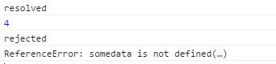

# ES6新特性

#### 作者：王志伟
#### 邮箱：wangzhiwei@yumaomoney.com

```
更改历史

* 2019-06-24        王志伟     Generator 函数
* 2019-06-17        高天阳     添加Promise模块
* 2018-11-20        高天阳     默认参数、模板字符串、增强的对象字面量
* 2018-11-19        高天阳     整理文档
* 2018-11-13        王志伟     初始化文档

```

## 1 简介

ES6是前端开发的主力语言 （Vue、 React）如果你不能熟练掌握 需要补习~

## 2 使用 {#index}

> ES6主要新特性

1. [Functions （函数）in ES6](#Functions)
    1. Default Parameters（默认参数） in ES6
    1. Arrow Functions （箭头函数）in ES6
1. [Strings （字符串）in ES6](#Strings)
    1. Template Literals （模板字符串）in ES6
    1. Multi-line Strings （多行字符串）in ES6
1. [Destructuring Assignment （解构赋值）in ES6](#Destructuring)
1. [Enhanced Object Literals （增强的对象字面量）in ES6](#Enhanced)
1. [Promises in ES6](#Promises)
1. [Block-Scoped Constructs Let and Const（块作用域构造Let and Const）](#LetConst)
1. [Classes（类） in ES6](#Classes)
1. Modules（模块） in ES6
1. [Extension operators（扩展运算符） in ES6](#Extension)
1. [Properties of top-level objects（顶层对象的属性） in ES6](#Properties)
1. [Generator in ES6](#Generator)
    1. [基本概念](#GeneratorBase)
    1. [Yield表达式](#GeneratorYield)
    1. [next方法的参数](#GeneratorNext)

### 2.1 函数 {#Functions} [回到目录](#index)

#### 2.1.1 默认参数

在ES5我们给函数定义参数默认值是怎么样？

```javascript
function action(num, color, url) {
    num = num || 200
    //当传入num时，num为传入的值
    //当没传入参数时，num即有了默认值200
    color = color || 'red';
    url = url || 'http://azat.co';
    return (num, color, url)
}
```

但细心观察的同学们肯定会发现，num传入为0的时候就是false，但是我们实际的需求就是要拿到num = 0，
此时num = 200 明显与我们的实际想要的效果明显不一样

ES6为参数提供了默认值。在定义函数时便初始化了这个参数，以便在参数没有被传递进去时使用。

```javascript
function action(num = 200) {
    console.log(num)
}
action(0)   //
action()    //
action(300) //
```

<!--
action(0)   //0
action()    //200
action(300) //300
-->

#### 2.1.2 箭头函数

```javascript
    //ES5
    var evens = [1,3,5,7];
    var odds = evens.map(function(val){
        return val + 1
    })
    console.log(odds)
    //ES6
    var evens = [1,3,5,7];
    var odds = evens.map(v => v + 1)
    console.log(odds)
```

#### 2.1.3 面试题

> 参数默认值的位置

通常情况下，定义了默认值的参数，应该是函数的尾参数。因为这样比较容易看出来，到底省略了哪些参数。如果非尾部的参数设置默认值，
实际上这个参数是没法省略的。

// 例一

```
function f(x = 1, y) {
  return [x, y];
}
f()             //
f(2)            //
f(, 1)          //
f(undefined, 1) //
```

<!--
f()             // [1, undefined] 
f(2)            // [2, undefined]) 
f(, 1)          // 报错 
f(undefined, 1) // [1, 1]
-->

// 例二

```
function f(x, y = 5, z) {
    return [x, y, z];
}
f()                 //
f(1)                //
f(1, ,2)            //
f(1, undefined, 2)  //
```

<!--
f()                 // [undefined, 5, undefined] 
f(1)                // [1, 5, undefined]
f(1, ,2)            // 报错
f(1, undefined, 2)  // [1, 5, 2]
-->

上面代码中，有默认值的参数都不是尾参数。这时，无法只省略该参数，而不省略它后面的参数，除非显式输入 undefined 。
 如果传入 undefined ，将触发该参数等于默认值， null 则没有这个效果。
 
```javascript
function foo(x = 5, y = 6) {
  console.log(x, y);
}
foo(undefined, null)
```

<!--
// 5 null
-->

上面代码中， x 参数对应 undefined ，结果触发了默认值， y 参数等于 null ，就没有触发默认值。

> 函数的 length 属性

```javascript
function calc(x=0, y=0) {
    // ...
    console.log(x, y)
}
function ajax(url, async = true, dataType = "JSON") {
    // ...
    console.log(url, async, dataType)
}
function foo(a, b, c = 5) {
    // ...
    console.log(a, b, c)
}
console.log(calc.length); //
console.log(ajax.length); //
console.log(foo.length);  //
```

<!--
console.log(calc.length); // 0
console.log(ajax.length); // 1
console.log(foo.length);  // 2
-->

定义了默认参数后，函数的length属性会减少，即有几个默认参数不包含在length的计算当中

```javascript
function foo (a = 0, b, c) {
    console.log(a, b, c)
}
function bar (a, b = 1, c) {
    console.log(a, b, c)
}
console.log(foo.length); //
console.log(bar.length); //
```

<!--
console.log(foo.length); // 0
console.log(bar.length); // 1
-->

如果设置了默认值的参数不是尾参数，那么 length 属性也不再计入后面的参数了。

```javascript
function ajax(url="../user.action", async=true, success) {
    var url = ''; //
    let async = 3; //
    const success = function(){}; //
}
```

<!--
var url = '';   // 允许
let async = 3;  // 报错
const success = function(){}; // 报错
-->

不能用let和const再次声明默认值，var可以

```javascript
function throwIf() {
    throw new Error('少传了参数');
}
 
function ajax(url=throwIf(), async=true, success) {
    return url;
}
ajax(); //
```

<!--
ajax(); // Error: 少传了参数
-->

可以看到这里参数success是一个函数调用，调用ajax时如果没有传第三个参数，
则会执行getCallback函数，该函数返回一个新函数赋值给success。
这是一个很强大的功能，给程序员以很大的想象发挥空间。

一旦设置了参数的默认值，函数进行声明初始化时，参数会形成一个单独的作用域(context)。
等到初始化结束，这个作用域就会消失。这种语法行为， 在不设置参数默认值时，是不会出现的。

```javascript
var x = 1;
function f(x, y = x) { 
    console.log(y);
}
f(2) //
```

<!--
f(2) // 2
-->

上面代码中，参数 y 的默认值等于变量 x 。调用函数 f 时，参数形成一个单独的作用域。
在这个作用域里面，默认值变量 x 指向第一个参数 x ，而不是全局变量x，所以输出是2。

再看下面的例子。

```javascript
let x = 1;
function f(y = x) { 
      let x = 2;
      console.log(y);
}
f() //
```

<!--
f() // 1
-->

上面代码中，函数 f 调用时，参数 y = x 形成一个单独的作用域。这个作用域里面，变量 x 本身没有定义，所以指向外层的全局变量 x 。
函数调用时，函数体内部的局部变量 x 影响不到默认值变量 x 。

```javascript
function bar(x = y, y = 2) {
    return [x, y];
}
bar();  //
```

<!--
报错(y is not defined) 2
-->

默认参数赋值会按照传入参数先后顺序进行，因此未定义就使用会报错

```javascript
var x = 1;
function foo(x = x) {
    // ...
}
foo();  //
```

<!--
报错(x is not defined)
-->

上面代码中，参数 x = x 形成一个单独作用域。实际执行的是 let x = x ，由于暂时性死区的原因，这行代码会报错”x 未定义“。

如果参数的默认值是一个函数，该函数的作用域也遵守这个规则。请看下面的例子。

```javascript
let foo = 'outer';
function bar(func = () => foo ) {
    let foo = 'inner'
    console.log(func());
}
bar();  //
```

<!--
bar();  // outer
-->

上面代码中，函数 bar 的参数 func 的默认值是一个匿名函数，返回值为变量 foo 。
函数参数形成的单独作用域里面，并没有定义变量 foo ，所以 foo 指向 外层的全局变量 foo ，因此输出 outer 。

如果写成下面这样，会如何呢。

```javascript
function bar(func = () => foo) {
    let foo = 'inner';
    console.log(func());
}
bar() //
```

<!--
bar();  // ReferenceError: foo is not defined
-->

上面代码中，匿名函数里面的 foo 指向函数外层，但是函数外层并没有声明变量 foo，所以就报错了。

下面是一个更复杂的例子。

```javascript
    var x = 1;
    function foo(x, y = function() { x = 2; }) {
        var x = 3;
        y(); console.log(x);
    }
    foo() //
    x     //
```

<!--
foo()   // 3
x       // 1
-->

上面代码中，函数 foo 的参数形成一个单独作用域。这个作用域里面，首先声明了变量 x ，然后声明了变量 y ， y 的默认值是一个匿名函数。
这个匿名函数内部的变量 x ，指向同一个作用域的第一个参数 x 。函数 foo 内部又声明了一个内部变量 x ，
该变量与第一个参数 x 由于不是同一个作用域，所以不是同一个变量，因此执行 y 后，内部变量 x 和外部全局变量 x 的值都没变。

```javascript
    var x = 1;
    function foo(x, y = function() { x = 2; }) {
        x = 3;
        y(); console.log(x);
    }
    foo() //
    x     //
```

<!--
foo()   // 2
x       // 1
-->

如果将 var x = 3 的 var 去除，函数 foo 的内部变量 x 就指向第一个参数 x ，与匿名函数内部的 x 是一致的，
所以最后输出的就是 2 ，而外层的全局变量 x 依然不受影响。

### 2.2 字符串 {#Strings} [回到目录](#index)

#### 2.2.1 模板字符串

基本的字符串格式化。将表达式嵌入字符串中进行拼接。用${}来界定。

```javascript
//ES5 
var name = 'Your name is ' + first + ' ' + last + '.';
var url = 'http://localhost:3000/api/messages/' + id;
//ES6
var name = `Your name is ${first} ${last}. `;
var url = `http://localhost:3000/api/messages/${id}`;

//ES5 
var name = 'lux'
console.log('hello' + name)
//ES6
const name = 'lux'
console.log(`hello ${name}`) //hello lux
```

#### 2.2.2 多行字符串

在ES5时我们通过反斜杠(\)来做多行字符串或者字符串一行行拼接。ES6反引号(``)直接搞定。

```javascript
// ES6的多行字符串是一个非常实用的功能。在ES5中，我们不得不使用以下方法来表示多行字符串：

var roadPoem = 'Then took the other, as just as fair,nt'
   + 'And having perhaps the better claimnt'
   + 'Because it was grassy and wanted wear,nt'
   + 'Though as for that the passing therent'
   + 'Had worn them really about the same,nt';
var fourAgreements = 'You have the right to be you.\
   You can only be you when you do your best.';
   
// 然而在ES6中，仅仅用反引号就可以解决了：

var roadPoem = `Then took the other, as just as fair,
   And having perhaps the better claim
   Because it was grassy and wanted wear,
   Though as for that the passing there
   Had worn them really about the same,`;
var fourAgreements = `You have the right to be you.
   You can only be you when you do your best.`;
```

#### 2.2.3 字符串判断、处理

对于字符串 ES6+ 当然也提供了很多厉害也很有意思的方法 说几个常用的。

```javascript
// 1.includes：判断是否包含然后直接返回布尔值
const str = 'hahay'
console.log(str.includes('y')) // true

// 2.repeat: 获取字符串重复n次
const str = 'he'
console.log(str.repeat(3)) // 'hehehe'
//如果你带入小数, Math.floor(num) 来处理
// s.repeat(3.1) 或者 s.repeat(3.9) 都当做成 s.repeat(3) 来处理

// 3. startsWith 和 endsWith 判断是否以 给定文本 开始或者结束
const str =  'hello world!'
console.log(str.startsWith('hello')) // true
console.log(str.endsWith('!')) // true

// 4. padStart 和 padEnd 填充字符串，应用场景：时分秒
setInterval(() => {
    const now = new Date()
    const hours = now.getHours().toString()
    const minutes = now.getMinutes().toString()
    const seconds = now.getSeconds().toString()
    console.log(`${hours.padStart(2, 0)}:${minutes.padStart(2, 0)}:${seconds.padStart(2, 0)}`)
}, 1000)
```

#### 2.2.4 面试题

* 模拟一个模板字符串的实现。

```javascript
let address = '北京海淀区'
let name = 'lala'
let str = '${name}在${address}上班...'
// 模拟一个方法 myTemplate(str) 最终输出 'lala在北京海淀区上班...'
function myTemplate(str) {
    // try it
}
console.log(myTemplate(str)) // lala在北京海淀区上班...
```

参考链接:[面试题：模板字符串的执行问题？](http://bugshouji.com/shareweb/t542)、
[Javascript动态执行JS（new Function与eval比较）](https://www.cnblogs.com/EasonJim/p/6228027.html)

<!--
var str =  'return ' + '`'+str+'`'
let func = new Function('name','address', str);
return func(name,address)
-->

* 实现标签化模板(自定义模板规则)。

```javascript
const name = 'cc'
const gender = 'male'
const hobby = 'basketball'
// 实现tag最终输出 '姓名：**cc**，性别：**male**，爱好：**basketball**'
function tag(strings) {
    // do it
}
const str = tag`姓名：${name}，性别：${gender}，爱好：${hobby}`
console.log(str) // '姓名：**cc**，性别：**male**，爱好：**basketball**'
```

<!--
  //方案1
  let result = `${strings[0]}**${name}**${strings[1]}**${gender}**${strings[2]}**${hobby}**`
  
  //方案2
  let result = '';
  for (let i = 0; i < strings.length-1; i++) {
    result += strings[i];
    result += '**';
    if(i===0){
      result += name
    }else if(i===1){
      result += gender
    }else if(i===2){
      result += hobby
    }
    result += '**';
  }
  //加上最后一个普通字符串。
  result += strings[strings.length - 1];
  return result;
-->

### 2.3 解构赋值 {#Destructuring} [回到目录](#index)

ES6 允许按照一定模式，从数组和对象中提取值，对变量进行赋值，这被称为解构（Destructuring）。
本质上，这种写法属于“模式匹配”，只要等号两边的模式相同，左边的变量就会被赋予对应的值。下面是一些使用嵌套数组进行解构的例子

```javascript
// 以前
let a = 1;
let b = 2;
let c = 3;

// 现在
let [a, b, c] = [1, 2, 3];

let [foo, [[bar], baz]] = [1, [[2], 3]];
foo //
bar //
baz //
let [ , , third] = ["foo", "bar", "baz"];
third //
let [x, , y] = [1, 2, 3];
x //
y //
let [head, ...tail] = [1, 2, 3, 4];
head //
tail //
let [x, y, ...z] = ['a'];
x //
y //
z //
```

如果解构不成功，变量的值就等于undefined

```javascript
let [foo] = [];
let [bar, foo] = [1];
```
另一种情况是不完全解构，即等号左边的模式，只匹配一部分的等号右边的数组。这种情况下，解构依然可以成功。

```javascript
let [x, y] = [1, 2, 3];
x //
y //
let [a, [b], d] = [1, [2, 3], 4];
a //
b //
d //
```

如果等号的右边不是数组（或者严格地说，不是可遍历的结构，参见《Iterator》一章），那么将会报错。

```javascript
let [foo] = 1;
let [foo] = false;
let [foo] = NaN;
let [foo] = undefined;
let [foo] = null;
let [foo] = {};
```

### 2.4 增强的对象字面量 {#Enhanced} [回到目录](#index)

使用对象文本可以做许多让人意想不到的事情！通过ES6，我们可以把ES5中的JSON变得更加接近于一个类。

下面是一个典型ES5对象文本，里面有一些方法和属性：

```javascript
var serviceBase = {port: 3000, url: 'azat.co'},
    getAccounts = function(){return [1,2,3]};
var accountServiceES5 = {
    port: serviceBase.port,
    url: serviceBase.url,
    getAccounts: getAccounts,
    toString: function() {
        return JSON.stringify(this.valueOf());
    },
    getUrl: function() {return "http://" + this.url + ':' + this.port},
    valueOf_1_2_3: getAccounts()
}
```

如果我们想让它更有意思，我们可以用Object.create从serviceBase继承原型的方法：

```javascript
var serviceBase = {port: 3000, url: 'azat.co'},
    getAccounts = function(){return [1,2,3]};
var accountServiceES5ObjectCreate = Object.create(serviceBase)
var accountServiceES5ObjectCreate = {
  getAccounts: getAccounts,
  toString: function() {
    return JSON.stringify(this.valueOf());
  },
  getUrl: function() {return "http://" + this.url + ':' + this.port},
  valueOf_1_2_3: getAccounts()
}
```

```javascript
var serviceBase = {port: 3000, url: 'azat.co'},
    getAccounts = function(){return [1,2,3]};
var accountServiceES5ObjectCreate = Object.create(serviceBase,{
    getAccounts: {
        get: getAccounts
    },
    toString: {
        get: function() {
             return JSON.stringify(this.valueOf());
        }
    },
    getUrl: {
        get: function() {
          return "http://" + this.url + ':' + this.port
        }
    },
    valueOf_1_2_3: {
        value: getAccounts()
    }
})
console.log(accountServiceES5ObjectCreate)
```

我们知道，accountServiceES5ObjectCreate 和accountServiceES5 并不是完全一致的，
因为一个对象(accountServiceES5)在proto对象中将有下面这些属性：


为了方便举例，我们将考虑它们的相似处。所以在ES6的对象文本中，既可以直接分配getAccounts: getAccounts,
也可以只需用一个getAccounts，此外，我们在这里通过proto（并不是通过’proto’）设置属性，如下所示：

```javascript
var serviceBase = {port: 3000, url: 'azat.co'},
getAccounts = function(){return [1,2,3]};
var accountService = {
    __proto__: serviceBase,
    getAccounts,
    // 另外，我们可以调用super防范，以及使用动态key值(valueOf_1_2_3):
    toString() 
    {
      return JSON.stringify((super.valueOf()));
    },
    getUrl() 
    {return "http://" + this.url + ':' + this.port},
    [ 'valueOf_' + getAccounts().join('_') ]: getAccounts()
};
console.log(accountService)
```


ES6对象文本是一个很大的进步对于旧版的对象文本来说。

### 2.5 Promise构造函数 {#Promises} [回到目录](#index)

[廖雪峰的官方网站](https://www.liaoxuefeng.com/wiki/1022910821149312/1023024413276544)

#### 2.5.1 什么是Promise

Promise是一个构造函数，自己身上有all、reject、resolve这几个眼熟的方法，原型上有then、catch等同样很眼熟的方法。

```javascript
var p = new Promise(function(resolve, reject){
    //做一些异步操作
    setTimeout(function(){
        console.log('执行完成');
        resolve('随便什么数据');
    }, 2000);
});
```

Promise的构造函数接收一个参数，是函数，并且传入两个参数：resolve，reject，分别表示异步操作执行成功后的回调函数和异步操作执行失败后的回调函数。
其实这里用“成功”和“失败”来描述并不准确，按照标准来讲，resolve是将Promise的状态置为fullfiled，reject是将Promise的状态置为rejected。
不过在我们开始阶段可以先这么理解，后面再细究概念。
 
在上面的代码中，我们执行了一个异步操作，也就是setTimeout，2秒后，输出“执行完成”，并且调用resolve方法。
 
运行代码，会在2秒后输出“执行完成”。注意！我只是new了一个对象，并没有调用它，我们传进去的函数就已经执行了，这是需要注意的一个细节。
所以我们用Promise的时候一般是包在一个函数中，在需要的时候去运行这个函数，如：

```javascript
function runAsync(){
    var p = new Promise(function(resolve, reject){
        //做一些异步操作
        setTimeout(function(){
            console.log('执行完成');
            resolve('随便什么数据');
        }, 2000);
    });
    return p;            
}
runAsync()
```

这时候你应该有两个疑问：1.包装这么一个函数有毛线用？2.resolve('随便什么数据');这是干毛的？
 
我们继续来讲。在我们包装好的函数最后，会return出Promise对象，也就是说，执行这个函数我们得到了一个Promise对象。
还记得Promise对象上有then、catch方法吧？这就是强大之处了，看下面的代码：

```javascript
runAsync().then(function(data){
    console.log(data);
    //后面可以用传过来的数据做些其他操作
    //......
});
```

在runAsync()的返回上直接调用then方法，then接收一个参数，是函数，并且会拿到我们在runAsync中调用resolve时传的的参数。
运行这段代码，会在2秒后输出“执行完成”，紧接着输出“随便什么数据”。
 
这时候你应该有所领悟了，原来then里面的函数就跟我们平时的回调函数一个意思，能够在runAsync这个异步任务执行完成之后被执行。
这就是Promise的作用了，简单来讲，就是能把原来的回调写法分离出来，在异步操作执行完后，用链式调用的方式执行回调函数。
 
你可能会不屑一顾，那么牛逼轰轰的Promise就这点能耐？我把回调函数封装一下，给runAsync传进去不也一样吗，就像这样：

```javascript
function runAsync(callback){
    setTimeout(function(){
        console.log('执行完成');
        callback('随便什么数据');
    }, 2000);
}

runAsync(function(data){
    console.log(data);
});
```

效果也是一样的，还费劲用Promise干嘛。那么问题来了，有多层回调该怎么办？如果callback也是一个异步操作，而且执行完后也需要有相应的回调函数，
该怎么办呢？总不能再定义一个callback2，然后给callback传进去吧。而Promise的优势在于，可以在then方法中继续写Promise对象并返回，
然后继续调用then来进行回调操作。

#### 2.5.2 链式操作的用法

所以，从表面上看，Promise只是能够简化层层回调的写法，而实质上，Promise的精髓是“状态”，用维护状态、传递状态的方式来使得回调函数能够及时调用，
它比传递callback函数要简单、灵活的多。所以使用Promise的正确场景是这样的：

```javascript
runAsync1()
.then(function(data){
    console.log(data);
    return runAsync2();
})
.then(function(data){
    console.log(data);
    return runAsync3();
})
.then(function(data){
    console.log(data);
});
```

这样能够按顺序，每隔两秒输出每个异步回调中的内容，在runAsync2中传给resolve的数据，能在接下来的then方法中拿到。运行结果如下：


猜猜runAsync1、runAsync2、runAsync3这三个函数都是如何定义的？没错，就是下面这样

```javascript
function runAsync1(){
    var p = new Promise(function(resolve, reject){
        //做一些异步操作
        setTimeout(function(){
            console.log('异步任务1执行完成');
            resolve('随便什么数据1');
        }, 1000);
    });
    return p;
}
function runAsync2(){
    var p = new Promise(function(resolve, reject){
        //做一些异步操作
        setTimeout(function(){
            console.log('异步任务2执行完成');
            resolve('随便什么数据2');
        }, 2000);
    });
    return p;
}
function runAsync3(){
    var p = new Promise(function(resolve, reject){
        //做一些异步操作
        setTimeout(function(){
            console.log('异步任务3执行完成');
            resolve('随便什么数据3');
        }, 2000);
    });
    return p;
}
```
在then方法中，你也可以直接return数据而不是Promise对象，在后面的then中就可以接收到数据了，比如我们把上面的代码修改成这样：

```javascript
runAsync1()
.then(function(data){
    console.log(data);
    return runAsync2();
})
.then(function(data){
    console.log(data);
    return '直接返回数据';  //这里直接返回数据
})
.then(function(data){
    console.log(data);
});
```
那么输出就变成了这样：


#### 2.5.3 reject的用法

到这里，你应该对“Promise是什么玩意”有了最基本的了解。那么我们接着来看看ES6的Promise还有哪些功能。我们光用了resolve，还没用reject呢，
它是做什么的呢？事实上，我们前面的例子都是只有“执行成功”的回调，还没有“失败”的情况，reject的作用就是把Promise的状态置为rejected，
这样我们在then中就能捕捉到，然后执行“失败”情况的回调。看下面的代码。

```javascript
function getNumber(){
    var p = new Promise(function(resolve, reject){
        //做一些异步操作
        setTimeout(function(){
            var num = Math.ceil(Math.random()*10); //生成1-10的随机数
            if(num<=5){
                resolve(num);
            }
            else{
                reject('数字太大了');
            }
        }, 2000);
    });
    return p;            
}

getNumber()
.then(
    function(data){
        console.log('resolved');
        console.log(data);
    }, 
    function(reason, data){
        console.log('rejected');
        console.log(reason);
    }
);
```

getNumber函数用来异步获取一个数字，2秒后执行完成，如果数字小于等于5，我们认为是“成功”了，调用resolve修改Promise的状态。
否则我们认为是“失败”了，调用reject并传递一个参数，作为失败的原因。
 
运行getNumber并且在then中传了两个参数，then方法可以接受两个参数，第一个对应resolve的回调，
第二个对应reject的回调。所以我们能够分别拿到他们传过来的数据。多次运行这段代码，你会随机得到下面两种结果：


或者


#### 2.5.4 catch的用法

我们知道Promise对象除了then方法，还有一个catch方法，它是做什么用的呢？其实它和then的第二个参数一样，用来指定reject的回调，用法是这样：

```javascript
getNumber()
.then(function(data){
    console.log('resolved');
    console.log(data);
})
.catch(function(reason){
    console.log('rejected');
    console.log(reason);
});
```

效果和写在then的第二个参数里面一样。不过它还有另外一个作用：在执行resolve的回调（也就是上面then中的第一个参数）时，
如果抛出异常了（代码出错了），那么并不会报错卡死js，而是会进到这个catch方法中。请看下面的代码：

```javascript
getNumber()
.then(function(data){
    console.log('resolved');
    console.log(data);
    console.log(somedata); //此处的somedata未定义
})
.catch(function(reason){
    console.log('rejected');
    console.log(reason);
});
```

在resolve的回调中，我们console.log(somedata);而somedata这个变量是没有被定义的。如果我们不用Promise，
代码运行到这里就直接在控制台报错了，不往下运行了。但是在这里，会得到这样的结果：



也就是说进到catch方法里面去了，而且把错误原因传到了reason参数中。即便是有错误的代码也不会报错了，这与我们的try/catch语句有相同的功能。

#### 2.5.5 all的用法

Promise的all方法提供了并行执行异步操作的能力，并且在所有异步操作执行完后才执行回调。
我们仍旧使用上面定义好的runAsync1、runAsync2、runAsync3这三个函数，看下面的例子：

```javascript
Promise
.all([runAsync1(), runAsync2(), runAsync3()])
.then(function(results){
    console.log(results);
});
```

用Promise.all来执行，all接收一个数组参数，里面的值最终都算返回Promise对象。这样，三个异步操作的并行执行的，
等到它们都执行完后才会进到then里面。那么，三个异步操作返回的数据哪里去了呢？都在then里面呢，
all会把所有异步操作的结果放进一个数组中传给then，就是上面的results。所以上面代码的输出结果就是：


有了all，你就可以并行执行多个异步操作，并且在一个回调中处理所有的返回数据，是不是很酷？有一个场景是很适合用这个的，
一些游戏类的素材比较多的应用，打开网页时，预先加载需要用到的各种资源如图片、flash以及各种静态文件。所有的都加载完后，我们再进行页面的初始化。

#### 2.5.6 race的用法

all方法的效果实际上是「谁跑的慢，以谁为准执行回调」，那么相对的就有另一个方法「谁跑的快，以谁为准执行回调」，
这就是race方法，这个词本来就是赛跑的意思。race的用法与all一样，我们把上面runAsync1的延时改为1秒来看一下：

```javascript
Promise
.race([runAsync1(), runAsync2(), runAsync3()])
.then(function(results){
    console.log(results);
});
```

这三个异步操作同样是并行执行的。结果你应该可以猜到，1秒后runAsync1已经执行完了，此时then里面的就执行了。结果是这样的：


你猜对了吗？不完全，是吧。在then里面的回调开始执行时，runAsync2()和runAsync3()并没有停止，仍旧再执行。于是再过1秒后，输出了他们结束的标志。
 
这个race有什么用呢？使用场景还是很多的，比如我们可以用race给某个异步请求设置超时时间，并且在超时后执行相应的操作，代码如下：

```javascript
//请求某个图片资源
function requestImg(){
    var p = new Promise(function(resolve, reject){
        var img = new Image();
        img.onload = function(){
            resolve(img);
        }
        img.src = 'xxxxxx';
    });
    return p;
}

//延时函数，用于给请求计时
function timeout(){
    var p = new Promise(function(resolve, reject){
        setTimeout(function(){
            reject('图片请求超时');
        }, 5000);
    });
    return p;
}

Promise
.race([requestImg(), timeout()])
.then(function(results){
    console.log(results);
})
.catch(function(reason){
    console.log(reason);
});
```

requestImg函数会异步请求一张图片，我把地址写为"xxxxxx"，所以肯定是无法成功请求到的。timeout函数是一个延时5秒的异步操作。
我们把这两个返回Promise对象的函数放进race，于是他俩就会赛跑，如果5秒之内图片请求成功了，那么遍进入then方法，执行正常的流程。
如果5秒钟图片还未成功返回，那么timeout就跑赢了，则进入catch，报出“图片请求超时”的信息。运行结果如下：


> 练习

下面代码如何输出(理解Promise异步调用的操作)

```javascript
var promise = new Promise(function(resolve){
    console.log(1);
    resolve(3);
});
promise.then(function(value){
    console.log(value);
});
console.log(2);
```

下面代码如何输出(理解then())

```javascript
function testPromise(ready) {
    return new Promise(function(resolve,reject){
        if(ready) {
            resolve("hello world");
        }else {
            reject("No thanks");
        }
    });
};
// 方法调用
testPromise(true).then(function(msg){
    console.log(msg);
}).then(testPromise2)
  .then(testPromise3);
function testPromise2(){
    console.log(2);
}
function testPromise3(){
    console.log(3);
}
```

下面代码如何输出(理解每次调用then都会返回一个新创建的promise对象)

```javascript
var promise1 = new Promise(function(resolve){
    resolve(1);
});
var thenPromise = promise1.then(function(value){
    console.log(value);
});
var catchPromise = thenPromise.catch(function(error){
    console.log(error);
});
console.log(promise1 !== thenPromise);
console.log(thenPromise !== catchPromise);
```

```javascript
var promise1 = new Promise(function(resolve){
    resolve(1);
});
promise1.then(function(value){
    return value * 2;
});
promise1.then(function(value){
    return value * 2;
});
promise1.then(function(value){
    console.log("1"+value);
});
```

```javascript
var promise1 = new Promise(function(resolve){
    resolve(2);
});
promise1.then(function(value){
    return value * 2;
}).then(function(value){
    return value * 2;
}).then(function(value){
    console.log("1"+value);
});
```

下面代码如何输出(理解Promise.all)

```javascript
var promise1 = new Promise(function(resolve){
    setTimeout(function(){
        resolve(1);
    },3000);
});
var promise2 = new Promise(function(resolve){
    setTimeout(function(){
        resolve(2);
    },1000);
});
Promise.all([promise1,promise2]).then(function(value){
    console.log(value);
});
```
下面代码如何输出(理解Promise.race)

```javascript
// `delay`毫秒后执行resolve
function timerPromise(delay){
    return new Promise(function(resolve){
        setTimeout(function(){
            resolve(delay);
        },delay);
    });
}
// 任何一个promise变为resolve或reject 的话程序就停止运行
Promise.race([
    timerPromise(1),
    timerPromise(32),
    timerPromise(64),
    timerPromise(128)
]).then(function (value) {
    console.log(value);
});
```
```javascript
var runPromise = new Promise(function(resolve){
    setTimeout(function(){
        console.log(1);
        resolve(2);
    },500);
});
var runPromise2 = new Promise(function(resolve){
    setTimeout(function(){
        console.log(3);
        resolve(4);
    },1000);
});
// 第一个promise变为resolve后程序停止
Promise.race([runPromise,runPromise2]).then(function(value){
    console.log(value);
});
```

[关于ES6的Promise的使用](https://www.jianshu.com/p/1ec8d1c4e287)

### 2.6 块作用域构造Let and Const {#LetConst} [回到目录](#index)

#### 2.6.1 Let 命令

用来声明变量。它的用法类似于var ，但是所声明的变量，只在let 命令所在的代码块内有效。

```javascript
 {
    let a = 123
    var b =456
  }
  console.log(a) //
  console.log(b) //
  // 不存在变量提升
  console.log(foo); //
  var foo = 2;

  console.log(bar); //
  let bar = 2;

```
变量i 是var 命令声明的，在全局范围内都有效，所以全局只有一个变量i
变量i 是let 声明的，当前的i 只在本轮循环有效，所以每一次循环的i 其实都是一个新的变量，

如果每一轮循环的变量i 都是重新声明的，那它怎么知道上一轮循环的值，从而计算出本轮循环的值？

```javascript
    //for 循环的计数器，就很合适使用let 命令
    var a = []
    for (let i = 0; i < 10; i++) {
        a[i] = function () {
            console.log(i);
            // 这里的i
        }
    }
    a[6]() // 10
    a[7]()

    console.log(i)// ? 10
    let i = 10 // 报错
```
答案：这是因为 JavaScript 引擎内部会记住上一轮循环的值，初始化本轮的变量i 时，就在上一轮循环的基础上进行计算

for 循环还有一个特别之处，就是设置循环变量的那部分是一个父作用域，而循环体内部是一个单独的子作用域。

```javascript
    for (let i = 0; i < 3; i++) {
        let i = 'abc';
        console.log(i);
    }

```

暂时性死区

```javascript
    var tmp = 123;
    if (true) {
        // TDZ开始
        tmp = 'abc'; // ReferenceError
        console.log(tmp); // ReferenceError
        let tmp; // TDZ结束
        console.log(tmp); // undefined
        tmp = 123;
        console.log(tmp); // 123
    }
```

答案：
上面代码中，存在全局变量tmp ，但是块级作用域内let 又声明了一个局部变量tmp ，导致后者绑定这个块级作用域，所以在let 声明变量前，对tmp 赋值会报错。
ES6 明确规定，如果区块中存在let 和const 命令，这个区块对这些命令声明的变量，从一开始就形成了封闭作用域。凡是在声明之前就使用这些变量，就会报错。

```javascript
    typeof x; // ReferenceError
    let x;
    typeof a // "undefined"
```

注意：养成良好的变成习惯，变量一定要在声明之后使用

```javascript
    function bar(x = y, y = 2) {
        return [x, y];
    }
    bar(); //
```

不允许重复声明

```javascript
    function func() {
        let a = 10;
        var a = 1; //
    }

    function func() {
        let a = 10;
        let a = 1; //
    }

    function func(arg) {
        let arg; //
    }

    function func(arg) {
        {
            let arg; //
        }
    }
```

#### 2.6.2 块作用域

内层变量可能会覆盖外层变量

```javascript
    var tmp = new Date();
    function f() {
        console.log(tmp);
        if (false) {
            var tmp = 'hello world';
        }
    }
    f(); //
```

用来计数的循环变量泄露为全局变量

```javascript
    var s = 'hello';
    for (var i = 0; i < s.length; i++) {
        console.log(s[i]);
    }
    console.log(i);
```
ES6 的块级作用域

```javascript
function f1() {
    let n = 5;
    if (true) {
        let n = 10;
    }
    console.log(n);
}
```

// IIFE 写法(立即执行函数)
(function () {
    var tmp = ...; //此处是块级（私有）作用域
    ...
}());
// 块级作用域写法
{
    let tmp = ...;
    ...
}
```

#### 2.6.3 const

```
    //ES5中的写法 大写
    Object.defineProperty(window,"PI2",{
        value: 3.1415926,
        writable: false
    })
    //ES6
    const PI = 3.1415926
    console.log(PI)
    PI = 4
```

声明一个只读的常量。一旦声明，常量的值就不能改变。

```
    const PI = 3.1415;
    PI // 3.1415
    PI = 3;
    // TypeError: Assignment to constant variable.

    const foo //
```
const 声明的变量不得改变值，这意味着， const 一旦声明变量，就必须立即初始化，不能留到以后赋值。
同样存在暂时性死区 不可重复声明

```
const a = [];
a.push('Hello'); //
a.length = 0; //
a = ['Dave']; //
```

对象冻结

```javascript
    const foo = Object.freeze({});
    // 常规模式时，下面一行不起作用；
    // 严格模式时，该行会报错
    foo.prop = 123;
```

### 2.7 类 {#Classes} [回到目录](#index)


显式
对于其他的逻辑来说，显式就是清楚且明确的指定了实现内容
隐式
只要实现类的方法签名和返回值与接口定义的一致即视为接口的实现，并无显式的（清晰的、明确的）指定。
强类型
java、.NET、Python等都是强制类型定义的。也就是说，一旦一个变量被指定了某个数据类型，如果不经过强制转换，那么它就永远是这个数据类型了。
弱类型
数据类型可以被忽略的语言。它与强类型定义语言相反, 一个变量可以赋不同数据类型的值。

### 2.8 模块

### 2.9 扩展运算符 {#Extension} [回到目录](#index)

扩展运算符就是三个点（...）它好比rest参数的逆运算 ，将一个数组转为用逗号分隔的参数序列

```
console.log(...[1,2,3])
//
console.log(1,...[1,2,3],3)
//
[...document.querySelectorAll('div')]
//
```
该运算符 主要用于函数调用

```
function push(array, ...items) {
array.push(...items);
}
function add(x, y) {
return x + y;
}
const numbers = [4, 38];
add(...numbers)

```

上面代码中， array.push(...items) 和add(...numbers) 这两行，都是函数的调用，它们的都使用了扩展运算符。该运算符将一个数组，变为参数序
列。

扩展运算符与正常的函数参数可以结合使用，非常灵活。

```
function f(v, w, x, y, z) { }
const args = [0, 1];
f(-1, ...args, 2, ...[3]);
```

```
const arr = [
...(x > 0 ? ['a'] : []),
'b',
];

[...[], 1]
//
```
由于扩展运算符可以展开数组，所以不再需要apply 方法，将数组转为函数的参数了。

```
// ES5 的写法
function f(x, y, z) {
// ...
}
var args = [0, 1, 2];
f.apply(null, args);


Function.apply(obj,args)方法能接收两个参数
obj：这个对象将代替Function类里this对象
args：这个是数组，它将作为参数传给Function（args-->arguments）

         call:和apply的意思一样,只不过是参数列表不一样.

 Function.call(obj,[param1[,param2[,…[,paramN]]]])
obj：这个对象将代替Function类里this对象
params：这个是一个参数列表

// ES6的写法
function f(x, y, z) {
// ...
}
let args = [0, 1, 2];
f(...args);


// ES5 的写法
Math.max.apply(null, [14, 3, 77])
// ES6 的写法
Math.max(...[14, 3, 77])
// 等同于
Math.max(14, 3, 77);


// ES5的 写法
var arr1 = [0, 1, 2];
var arr2 = [3, 4, 5];
Array.prototype.push.apply(arr1, arr2);
// ES6 的写法
let arr1 = [0, 1, 2];
let arr2 = [3, 4, 5];
arr1.push(...arr2);

上面代码的 ES5 写法中， push 方法的参数不能是数组，所以只好通过apply 方法变通使用push 方法。有了扩展运算符，就可以直接将数组传入push 方
法。
```

##扩展运算符的应用
1复制数组
数组是复合的数据类型，直接复制的话，只是复制了指向底层数据结构的指针，而不是克隆一个全新的数组。

```
const a1 = [1, 2];
const a2 = a1;
a2[0] = 2;
a1 // [2, 2]
上面代码中， a2 并不是a1 的克隆，而是指向同一份数据的另一个指针。修改a2 ，会直接导致a1 的变化。

concat()连接两个数组

const a1 = [1, 2];
const a2 = a1.concat();
a2[0] = 2;
a1 // [1, 2]
上面代码中， a1 会返回原数组的克隆，再修改a2 就不会对a1 产生影响。

扩展运算符提供了复制数组的简便写法。
const a1 = [1, 2];
// 写法一
const a2 = [...a1];
// 写法二
const [...a2] = a1;
上面的两种写法， a2 都是a1 的克隆。
```


2合并数组
```
扩展运算符提供了数组合并的新写法。
// ES5
[1, 2].concat(more)
// ES6
[1, 2, ...more]
var arr1 = ['a', 'b'];
var arr2 = ['c'];
var arr3 = ['d', 'e'];
// ES5的合并数组
arr1.concat(arr2, arr3);
// [ 'a', 'b', 'c', 'd', 'e' ]
// ES6的合并数组
[...arr1, ...arr2, ...arr3]
// [ 'a', 'b', 'c', 'd', 'e' ]

```

3与解构赋值结合
```
// ES5
a = list[0], rest = list.slice(1)
// ES6
[a, ...rest] = list

下面是另外一些例子。
const [first, ...rest] = [1, 2, 3, 4, 5];
first // 1
rest // [2, 3, 4, 5]
const [first, ...rest] = [];
first // undefined
rest // []
const [first, ...rest] = ["foo"];
first // "foo"
rest // []
如果将扩展运算符用于数组赋值，只能放在参数的最后一位，否则会报错。
const [...butLast, last] = [1, 2, 3, 4, 5];
// 报错
const [first, ...middle, last] = [1, 2, 3, 4, 5];
// 报错
```

4字符串

```
扩展运算符还可以将字符串转为真正的数组。
[...'hello']
// [ "h", "e", "l", "l", "o" ]
上面的写法，有一个重要的好处，那就是能够正确识别四个字节的 Unicode 字符。
'x\uD83D\uDE80y'.length // 4
[...'x\uD83D\uDE80y'].length // 3
上面代码的第一种写法，JavaScript 会将四个字节的 Unicode 字符，识别为 2 个字符，采用扩展运算符就没有这个问题。因此，正确返回字符串长度的
函数，可以像下面这样写。
function length(str) {
return [...str].length;
}
length('x\uD83D\uDE80y') // 3
凡是涉及到操作四个字节的 Unicode 字符的函数，都有这个问题。因此，最好都用扩展运算符改写。
let str = 'x\uD83D\uDE80y';
str.split('').reverse().join('')
// 'y\uDE80\uD83Dx'
[...str].reverse().join('')
// 'y\uD83D\uDE80x'
上面代码中，如果不用扩展运算符，字符串的reverse 操作就不正确。

```

5实现了 Iterator 接口的对象

```
任何 Iterator 接口的对象（参阅 Iterator 一章），都可以用扩展运算符转为真正的数组。
let nodeList = document.querySelectorAll('div');
let array = [...nodeList];
上面代码中， querySelectorAll 方法返回的是一个nodeList 对象。它不是数组，而是一个类似数组的对象。这时，扩展运算符可以将其转为真正的数
组，原因就在于NodeList 对象实现了 Iterator 。
对于那些没有部署 Iterator 接口的类似数组的对象，扩展运算符就无法将其转为真正的数组。
let arrayLike = {
'0': 'a',
'1': 'b',
'2': 'c',
length: 3
};
// TypeError: Cannot spread non-iterable object.
let arr = [...arrayLike];
上面代码中， arrayLike 是一个类似数组的对象，但是没有部署 Iterator 接口，扩展运算符就会报错。这时，可以改为使用arr=Array.from(arrayLike) 方法将
arrayLike 转为真正的数组。
```

6Map 和 Set 结构，Generator 函数

```
扩展运算符内部调用的是数据结构的 Iterator 接口，因此只要具有 Iterator 接口的对象，都可以使用扩展运算符，比如 Map 结构。
let map = new Map([
[1, 'one'],
[2, 'two'],
[3, 'three'],
]);
let arr = [...map.keys()]; // [1, 2, 3]
Generator 函数运行后，返回一个遍历器对象，因此也可以使用扩展运算符。
const go = function*(){
yield 1;
yield 2;
yield 3;
};
[...go()] // [1, 2, 3]
上面代码中，变量go 是一个 Generator 函数，执行后返回的是一个遍历器对象，对这个遍历器对象执行扩展运算符，就会将内部遍历得到的值，转为一
个数组。
如果对没有 Iterator 接口的对象，使用扩展运算符，将会报错。
const obj = {a: 1, b: 2};
let arr = [...obj]; // TypeError: Cannot spread non-iterable object
```

### 2.10 顶层对象的属性 {#Properties} [回到目录](#index)

任何 Iterator 接口的对象（参阅 Iterator 一章），都可以用扩展运算符转为真正的数组。
let nodeList = document.querySelectorAll('div');
let array = [...nodeList];

```javascript
    window.a = 1;
    a // 1
    a = 2;
    window.a // 2
```
上面代码中，顶层对象的属性赋值与全局变量的赋值，是同一件事。
顶层对象的属性与全局变量挂钩，被认为是 JavaScript 语言最大的设计败笔之一。这样的设计带来了几个很大的问题，首先是没法在编译时就报出变量未
声明的错误，只有运行时才能知道（因为全局变量可能是顶层对象的属性创造的，而属性的创造是动态的）；其次，程序员很容易不知不觉地就创建了全
局变量（比如打字出错）；最后，顶层对象的属性是到处可以读写的，这非常不利于模块化编程。另一方面， window 对象有实体含义，指的是浏览器的窗
口对象，顶层对象是一个有实体含义的对象，也是不合适的。
ES6 为了改变这一点，一方面规定，为了保持兼容性， var 命令和function 命令声明的全局变量，依旧是顶层对象的属性；另一方面规定， let 命令、
const 命令、class 命令声明的全局变量，不属于顶层对象的属性。也就是说，从 ES6 开始，全局变量将逐步与顶层对象的属性脱钩。

```javascript
    var a = 1;
    // 如果在 Node 的 REPL 环境，可以写成 global.a
    // 或者采用通用方法，写成 this.a
    window.a // 1
    let b = 1;
    window.b //
```

### 2.11 Generator 函数的语法 {#Generator} [回到目录](#index)
[廖雪峰的官方网站](https://www.liaoxuefeng.com/wiki/1022910821149312/1023024381818112)

[ES6入门标准.pdf]()

#### 2.11.1 基本概念 {#GeneratorBase}

Generator 函数是 ES6 提供的一种异步编程解决方案，语法行为与传统函数完全不同。

Generator 函数有多种理解角度。从语法上，首先可以把它理解成，Generator 函数是一个状态机，封装了多个内部状态。
执行 Generator 函数会返回一个遍历器对象，也就是说，Generator 函数除了状态机，还是一个遍历器对象生成函数。返回的遍历器对象，可以依次遍
历 Generator 函数内部的每一个状态。

形式上，Generator 函数是一个普通函数，但是有两个特征。一是， function 关键字与函数名之间有一个星号；二是，函数体内部使用yield 表达式，
定义不同的内部状态（ yield 在英语里的意思就是“产出”）。

```javascript
function* helloWorldGenerator(){
yield 'Hello';
yield 'World';
return 'ending'
}
var hw = helloWorldGenerator()
```

上面代码定义了一个 Generator 函数helloWorldGenerator ，它内部有两个yield 表达式（ hello 和world ），即该函数有三个状态：hello，world 和
return 语句（结束执行）。

然后，Generator 函数的调用方法与普通函数一样，也是在函数名后面加上一对圆括号。不同的是，调用 Generator 函数后，该函数并不执行，返回的
也不是函数运行结果，而是一个指向内部状态的指针对象，也就是上一章介绍的遍历器对象（Iterator Object）。

下一步，必须调用遍历器对象的next 方法，使得指针移向下一个状态。也就是说，每次调用next 方法，内部指针就从函数头部或上一次停下来的地方开
始执行，直到遇到下一个yield 表达式（或return 语句）为止。换言之，Generator 函数是分段执行的， yield 表达式是暂停执行的标记，而next 方法
可以恢复执行。

```javascript
hw.next();
// { value: 'Hello', done: false }
hw.next();
// { value: 'World', done: false }
hw.next();
// { value: 'ending', done: true }
hw.next();
// { value: undefined, done: true }
```

上面代码一共调用了四次next 方法。

第一次调用，Generator 函数开始执行，直到遇到第一个yield 表达式为止。next 方法返回一个对象，它的value 属性就是当前yield 表达式的值
hello ， done 属性的值false ，表示遍历还没有结束。

第二次调用，Generator 函数从上次yield 表达式停下的地方，一直执行到下一个yield 表达式。next 方法返回的对象的value 属性就是当前yield 表
达式的值world ， done 属性的值false ，表示遍历还没有结束。

第三次调用，Generator 函数从上次yield 表达式停下的地方，一直执行到return 语句（如果没有return 语句，就执行到函数结束）。next 方法返回
的对象的value 属性，就是紧跟在return 语句后面的表达式的值（如果没有return 语句，则value 属性的值为undefined ）， done 属性的值true ，表
示遍历已经结束。

第四次调用，此时 Generator 函数已经运行完毕， next 方法返回对象的value 属性为undefined ， done 属性为true 。以后再调用next 方法，返回的
都是这个值。

总结一下，调用 Generator 函数，返回一个遍历器对象，代表 Generator 函数的内部指针。以后，每次调用遍历器对象的next 方法，就会返回一个有
着value 和done 两个属性的对象。value 属性表示当前的内部状态的值，是yield 表达式后面那个表达式的值； done 属性是一个布尔值，表示是否遍历
结束。

```
function * foo(x,y){...}
function *foo(x,y){...}
function* foo(x,y){...}
function*foo(x,y){...}
```

ES6没有规定，星号的具体位置，由于 Generator 函数仍然是普通函数，所以一般的写法是上面的第三种，即星号紧跟在function 关键字后面。本书也采用这种写法。

#### 2.11.2 Yield 表达式 {#GeneratorYield}

由于 Generator 函数返回的遍历器对象，只有调用next 方法才会遍历下一个内部状态，所以其实提供了一种可以暂停执行的函数。
yield 表达式就是暂停标志。

遍历器对象的next 方法的运行逻辑如下。

1.遇到yield 表达式，就暂停执行后面的操作，并将紧跟在yield 后面的那个表达式的值，作为返回的对象的value 属性值。
1.下一次调用next 方法时，再继续往下执行，直到遇到下一个yield 表达式。
1.如果没有再遇到新的yield 表达式，就一直运行到函数结束，直到return 语句为止，并将return 语句后面的表达式的值，
作为返回的对象的value属性值。
1.如果该函数没有return 语句，则返回的对象的value 属性值为undefined 。

需要注意的是， yield 表达式后面的表达式，只有当调用next 方法、内部指针指向该语句时才会执行，
因此等于为 JavaScript 提供了手动的“惰性求值”（Lazy Evaluation）的语法功能。

```javascript
(function(){
    yield 1
})()
// SyntaxError: Unexpected number

```

另外需要注意， yield 表达式只能用在 Generator 函数里面，用在其他地方都会报错。

```javascript
var arr = [1,[[2,3],4],[5,6]] // 目标 输出 1,2,3,4,5,6
var flat = function*(a){
    a.forEach(function(item){
        if(typeof item!=='number'){
            yield* flat(item)
        }else{
            yield item
        }
    })
}
for(var f of flat(arr)){
    console.log(f)
}

```
上面代码也会产生句法错误，因为forEach 方法的参数是一个普通函数，但是在里面使用了yield 表达式（这个函数里面还使用了yield* 表达式，详细介
绍见后文）。一种修改方法是改用for 循环。

```javascript
var arr = [1,[[2,3],4],[5,6]] // 目标 输出 1,2,3,4,5,6
var flat = function* (a){
   for(var i =0;i<a.length;i++){
        if(typeof a[i]!=='number'){
            yield* flat(a[i])
        }else{
            yield a[i]
        }
    }
}
for(var f of flat(arr)){
    console.log(f)
}

```

```javascript
function* demo() {
    console.log('Hello' + yield); // SyntaxError
    console.log('Hello' + yield 123); // SyntaxError
    console.log('Hello' + (yield)); // OK
    console.log('Hello' + (yield 123)); // OK
}
```

```javascript
function* demo() {
    foo(yield 'a', yield 'b'); // OK
    let input = yield; // OK
}
var foo = function(a){
  console.log(a)
}
```

yield 表达式如果用在另一个表达式之中，必须放在圆括号里面

```javascript
var myIterable = {};
myIterable[Symbol.iterator] = function* () {
    yield 1;
    yield 2;
    yield 3;
};
for(var f of myIterable){
  console.log(f)
} // 1, 2, 3
```

上面代码中，Generator 函数赋值给Symbol.iterator 属性，从而使得myIterable 对象具有了 Iterator 接口，可以被... 运算符遍历了。

#### 2.11.3 next 方法的参数 {#GeneratorNext}

yield 表达式本身没有返回值，或者说总是返回undefined 。next 方法可以带一个参数，该参数就会被当作上一个yield 表达式的返回值。

```javascript
function* f() {
    for(var i = 0; true; i++) {
        var reset = yield i;
        if(reset) { i = -1; }
    }
}
var g = f();
g.next() // { value: 0, done: false }
g.next() // { value: 1, done: false }
g.next(true) // { value: 0, done: false }
```

上面代码先定义了一个可以无限运行的 Generator 函数f ，如果next 方法没有参数，每次运行到yield 表达式，变量reset 的值总是undefined 。当
next 方法带一个参数true 时，变量reset 就被重置为这个参数（即true ），因此i 会等于-1 ，下一轮循环就会从-1 开始递增。

这个功能有很重要的语法意义。Generator 函数从暂停状态到恢复运行，它的上下文状态（context）是不变的。通过next 方法的参数，就有办法在
Generator 函数开始运行之后，继续向函数体内部注入值。也就是说，可以在 Generator 函数运行的不同阶段，从外部向内部注入不同的值，从而调整
函数行为。

```javascript
function* foo(x) {
    var y = 2 * (yield (x + 1));
    var z = yield (y / 3);
    return (x + y + z);
}
var a = foo(5);
a.next() // Object{value:6, done:false}
a.next() // Object{value:NaN, done:false}
a.next() // Object{value:NaN, done:true}
var b = foo(5);
b.next() // { value:6, done:false }
b.next(12) // { value:8, done:false }
b.next(13) // { value:42, done:true }
```

上面代码中，第二次运行next 方法的时候不带参数，导致 y 的值等于2 * undefined （即NaN ），除以 3 以后还是NaN ，因此返回对象的value 属性也
等于NaN 。第三次运行Next 方法的时候不带参数，所以z 等于undefined ，返回对象的value 属性等于5 + NaN + undefined ，即NaN 。

如果向next 方法提供参数，返回结果就完全不一样了。上面代码第一次调用b 的next 方法时，返回x+1 的值6 ；第二次调用next 方法，将上一次yield
表达式的值设为12 ，因此y 等于24 ，返回y / 3 的值8 ；第三次调用next 方法，将上一次yield 表达式的值设为13 ，因此z 等于13 ，这时x 等于5 ，
y 等于24 ，所以return 语句的值等于42 。

注意，由于next 方法的参数表示上一个yield 表达式的返回值，所以在第一次使用next 方法时，传递参数是无效的。V8 引擎直接忽略第一次使用next
方法时的参数，只有从第二次使用next 方法开始，参数才是有效的。从语义上讲，第一个next 方法用来启动遍历器对象，所以不用带有参数。
再看一个通过next 方法的参数，向 Generator 函数内部输入值的例子。

> 练习1

```javascript
function* generator(){
    yield 1;
    yield 2;
    yield 3;
}
var gen = generator();
while((tmp=gen.next()).done === false){
    console.log(tmp.value);
}
```

输出结果为

> 练习2

```javascript
function* generator(){
    yield 1;
    yield* ["a","b","c","d"];
    yield 3;
}
var gen=generator();
while((tmp=gen.next()).done === false){
  console.log(tmp.value);
}
```

输出结果为

> 练习3

```javascript
function* numbers () {
     yield 1;
     yield 2;
   
     return 'numbers';
 }
 
function* delegate () {
     var str = yield* numbers();
     console.log(str);
     
     yield 3;

     return 'delegate';
}

var iterator = delegate();
console.log(iterator.next()) // 第一次输出
console.log(iterator.next()) // 第二次输出
console.log(iterator.next()) // 第三次输出
console.log(iterator.next()) // 第四次输出
```

```javascript
/**
  * 第一次输出结果
  * { value: 1, done: false }
  */
console.log(iterator.next()) // 第一次输出
 
 /**
  * 第二次输出结果
  * { value: 2, done: false }
  */
console.log(iterator.next()) // 第二次输出
 
 /**
  * 第三次输出结果
  * numbers
  * { value: 3, done: false }
  */
console.log(iterator.next()) // 第三次输出
 
 /**
  * 第四次输出结果
  * { value: 'delegate', done: true }
  */
console.log(iterator.next()) // 第四次输出
```

1. 第二次输出时，输出一行内容，其中的 value 值仍为 numbers 函数的返回值。此时，done 属性为 false。
1. 第三次输出时，输出两行内容。第一行内容为 delegate 函数中 console.log(str) 输出的，值为 numbers 函数的返回值。
1. 第四次输出时，输出一行内容，其中的 value 值为 delegate 函数的返回值。此时，done 属性为 true。

> 练习4

```javascript
function* withparam(x){
    var y=yield x;
        yield y;
}
var wt=withparam(3);
console.log(wt.next());
console.log(wt.next());
```

next()方法中可以传入一个参数，这个参数会作为上一个yield语句的返回值的，如果不传参数，yield语句中生成器函数内的返回值是undefined。

```javascript
/**
  * 第一次输出结果
  * { value: 3, done: false }
  */
console.log(wt.next()) // 第一次输出
 /**
  * 第二次输出结果
  * { value: undefined, done: false }
  */
console.log(wt.next()) // 第二次输出
```

第二个next调用的时候的value是undefined的。现在我们给第二个next传入参数，

```javascript
function* withparam(x){
    var y=yield x;
        yield y;
}
var wt=withparam(3);
console.log(wt.next());
console.log(wt.next(5));
```

第二个next传入了5，所以y被赋值为5。记住永远不要做往第一个next中传入参数的傻事，
因为next传入的参数会作为上一个yield语句中生成器函数内部的返回值，而第一个next执行时，没有上一个yield语句，也就没有接收参数的地方。

```javascript
/**
  * 第一次输出结果
  * { value: 3, done: false }
  */
console.log(wt.next()) // 第一次输出
 /**
  * 第二次输出结果
  * { value: 5, done: false }
  */
console.log(wt.next()) // 第二次输出
```

## 参考资料

* [ES6这些就够了](https://www.jianshu.com/p/287e0bb867ae)
* [es6的十大特性](https://www.jianshu.com/p/53fe8b56cfb0)
* [廖雪峰的官方网站-Promise](https://www.liaoxuefeng.com/wiki/1022910821149312/1023024413276544)
* [ES6 Promise 用法讲解](https://www.cnblogs.com/whybxy/p/7645578.html)
* [关于ES6的Promise的使用](https://www.jianshu.com/p/1ec8d1c4e287)
* [ES6的生成器函数（generator）function*,yield,yield*学习使用](http://www.webfront-js.com/articaldetail/113.html)
