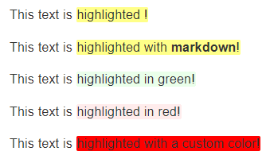

# GitBook更多配置

#### 作者：高天阳
#### 邮箱：13683265113@163.com

```
更改历史

* 2019-07-24	    高天阳	初始化文档
```

## 全局配置

配置根目录下book.json文件

### title 设置书本的标题

`“title” : “私人笔记”`

### author 作者的相关信息

`“author” : “gaotianyang”`

### description 本书的简单描述

`“description” : “gaotianyang的私人笔记”`

### language Gitbook使用的语言

版本2.6.4中可选的语言如下：

en, ar, bn, cs, de, en, es, fa, fi, fr, he, it, ja, ko, no, pl, pt, ro, ru, sv, uk, vi, zh-hans, zh-tw

例如，配置使用简体中文

`“language” : “zh-hans”`

### links 在左侧导航栏添加链接信息

```json
{
    "links": {
        "sidebar": {
            "Home": "https://www.baidu.com"
        }
    }
}
```

### styles 自定义页面样式

```json
{
    "styles": {
        "website": "styles/website.css",
        "ebook": "styles/ebook.css",
        "pdf": "styles/pdf.css",
        "mobi": "styles/mobi.css",
        "epub": "styles/epub.css"
    }
}
```

例如使`h1 h2`标签有下划线， 可以在`website.css`中设置

```css
h1 , h2{
    border-bottom: 1px solid #EEEEEE;
}
```

## plugins 插件列表

### 配置使用的插件

```json
{
    "plugins": [
        "-search",
        "back-to-top-button",
        "expandable-chapters-small",
        "insert-logo"
    ]
}
```

其中`"-search"`中的 `-` 符号代表去除默认自带的插件

Gitbook默认自带有5个插件：

* highlight：代码高亮
* search：导航栏查询功能（不支持中文）
* sharing：右上角分享功能
* font-settings：字体设置（最上方的"A"符号）
* livereload：为GitBook实时重新加载

### 插件属性配置pluginsConfig

配置插件的属性

例如配置`insert-logo`的属性：

```json
{
    "pluginsConfig": {
        "insert-logo": {
            "url": "images/logo.png",
            "style": "background: none; max-height: 30px; min-height: 30px"
        }
    }
}
```

## 一些实用插件

记录一些实用的插件

用法：在book.json中添加以下内容。然后执行`gitbook install`，
或者使用NPM安装（单独安装推荐NPM）`npm install gitbook-plugin-插件名`，
也可以从源码GitHub地址中下载，放到`node_modules`文件夹里（GitHub地址在进入插件地址右侧的GitHub链接）

### back-to-top-button 回到顶部

[GitHub地址](https://github.com/stuebersystems/gitbook-plugin-back-to-top-button)

在book.json中添加以下内容。然后执行`gitbook install`，
或者使用NPM安装（单独安装推荐NPM）`npm install gitbook-plugin-back-to-top-button`，
也可以从源码GitHub地址中下载，放到`node_modules`文件夹里（GitHub地址在进入插件地址右侧的GitHub链接）

```json
{
    "plugins": [
         "back-to-top-button"
    ]
}
```

### Prism 回到顶部

使用 `Prism.js` 为语法添加高亮显示，需要将 `highlight` 插件去掉。该插件自带的主题样式较少，
可以再安装 `prism-themes` 插件，里面多提供了几种样式，具体的样式可以参考[这里](https://github.com/PrismJS/prism-themes)，
在设置样式时要注意设置 css 文件名，而不是样式名。


[GitHub地址](https://github.com/PrismJS/prism-themes)

在book.json中添加以下内容。然后执行`gitbook install`，
或者使用NPM安装（单独安装推荐NPM）`npm install gitbook-plugin-prism`，
也可以从源码GitHub地址中下载，放到`node_modules`文件夹里（GitHub地址在进入插件地址右侧的GitHub链接）

```json
{
    "plugins": [
            "prism",
            "-highlight"
        ],
    "pluginsConfig": {
        "prism": {
            "css": [
                "prism-themes/themes/prism-base16-ateliersulphurpool.light.css"
            ]
        }
    }
}
```

如果需要修改背景色、字体大小等，可以在 `website.css` 定义 `pre[class*="language-"]` 类来修改，下面是一个示例：

```css
pre[class*="language-"] {
    border: none;
    background-color: #f7f7f7;
    font-size: 1em;
    line-height: 1.2em;
}
```
### 导航目录折叠

#### chapter-fold 左侧目录折叠

支持多层目录，点击导航栏的标题名就可以实现折叠扩展。

[GitHub地址](https://github.com/ColinCollins/gitbook-plugin-chapter-fold)

在book.json中添加以下内容。然后执行`gitbook install`，
或者使用NPM安装（单独安装推荐NPM）`npm install gitbook-plugin-chapter-fold`，
也可以从源码GitHub地址中下载，放到`node_modules`文件夹里（GitHub地址在进入插件地址右侧的GitHub链接）

```json
{
    "plugins": [
         "chapter-fold"
    ]
}
```

#### expandable-chapters-small 左侧章节目录可折叠

支持多层目录，比Toggle Chapters好用 只有点击箭头才能实现折叠扩展。不如【2.2.1. chapter-fold 左侧目录折叠】好用

[GitHub地址](https://github.com/chrisjake/gitbook-plugin-expandable-chapters-small)

在book.json中添加以下内容。然后执行`gitbook install`，
或者使用NPM安装（单独安装推荐NPM）`npm install gitbook-plugin-expandable-chapters-small`，
也可以从源码GitHub地址中下载，放到`node_modules`文件夹里（GitHub地址在进入插件地址右侧的GitHub链接）

```json
{
    "plugins": [
         "expandable-chapters-small"
    ]
}
```

#### expandable-chapters 可扩展导航章节

和expandable-chapters-small效果相同，唯一不同的是这个插件的箭头粗

[GitHub地址](https://github.com/DomainDrivenArchitecture/gitbook-plugin-expandable-chapters)

在book.json中添加以下内容。然后执行`gitbook install`，
或者使用NPM安装（单独安装推荐NPM）`npm install gitbook-plugin-expandable-chapters`，
也可以从源码GitHub地址中下载，放到`node_modules`文件夹里（GitHub地址在进入插件地址右侧的GitHub链接）

```json
{
    "plugins": [
         "expandable-chapters"
    ]
}
```

### 代码复制，行号

#### code 代码添加行号&复制按钮（可选）

为代码块添加行号和复制按钮，复制按钮可关闭

单行代码无行号。

[GitHub地址](https://github.com/TGhoul/gitbook-plugin-code)

在book.json中添加以下内容。然后执行`gitbook install`，
或者使用NPM安装（单独安装推荐NPM）`npm install gitbook-plugin-code`，
也可以从源码GitHub地址中下载，放到`node_modules`文件夹里（GitHub地址在进入插件地址右侧的GitHub链接）

```json
{
    "plugins": [
         "code"
    ]
}
```

如果想去掉复制按钮，在book.json的插件配置块更新：

```json
{
    "plugins" : [ "code" ],
    "pluginsConfig": {
          "code": {
          "copyButtons": false
      }
    }
}
```

#### copy-code-button 代码块复制按钮

为代码块添加复制的按钮。

在book.json中添加以下内容。然后执行`gitbook install`，
或者使用NPM安装（单独安装推荐NPM）`npm install gitbook-plugin-copy-code-button`，
也可以从源码GitHub地址中下载，放到`node_modules`文件夹里（GitHub地址在进入插件地址右侧的GitHub链接）

```json
{
    "plugins": [
         "copy-code-button"
    ]
}
```

效果如下图所示


### todo 待做项☑

添加 Todo 功能。默认的 checkbox 会向右偏移 2em，如果不希望偏移，可以在 `website.css` 里加上下面的代码:

```css
input[type=checkbox]{
    margin-left: -2em;
}
```

[GitHub地址](https://github.com/ly-tools/gitbook-plugin-todo)

在book.json中添加以下内容。然后执行`gitbook install`，
或者使用NPM安装（单独安装推荐NPM）`npm install gitbook-plugin-todo`，
也可以从源码GitHub地址中下载，放到`node_modules`文件夹里（GitHub地址在进入插件地址右侧的GitHub链接）

```json
{
    "plugins": ["todo"]
}
```

使用示例：

```
*   [ ]  write some articles
*   [x]  drink a cup of tea
```

### insert-logo 插入logo

将logo插入到导航栏上方中

[GitHub地址](https://github.com/matusnovak/gitbook-plugin-insert-logo)

在book.json中添加以下内容。然后执行`gitbook install`，
或者使用NPM安装（单独安装推荐NPM）`npm install gitbook-plugin-insert-logo`，
也可以从源码GitHub地址中下载，放到`node_modules`文件夹里（GitHub地址在进入插件地址右侧的GitHub链接）

```json
{
  "plugins": [
       "insert-logo"
  ],
  "pluginsConfig": {
    "insert-logo": {
      "url": "images/logo.png",
      "style": "background: none; max-height: 30px; min-height: 30px"
    }
  }
}
```
### 搜索

#### search-pro 高级搜索（支持中文）

[GitHub地址](https://github.com/gitbook-plugins/gitbook-plugin-search-pro)

在book.json中添加以下内容。然后执行`gitbook install`，
或者使用NPM安装（单独安装推荐NPM）`npm install gitbook-plugin-search-pro`，
也可以从源码GitHub地址中下载，放到`node_modules`文件夹里（GitHub地址在进入插件地址右侧的GitHub链接）

```json
{
    "plugins": [
         "-lunr", "-search", "search-pro"
    ]
}
```

#### search-plus 高级搜索（支持中文）

[GitHub地址](https://github.com/lwdgit/gitbook-plugin-search-plus)

在book.json中添加以下内容。然后执行`gitbook install`，
或者使用NPM安装（单独安装推荐NPM）`npm install gitbook-plugin-search-plus`，
也可以从源码GitHub地址中下载，放到`node_modules`文件夹里（GitHub地址在进入插件地址右侧的GitHub链接）

```json
{
    "plugins": [
         "-lunr", "-search", "search-plus"
    ]
}
```

### advanced-emoji 支持emoji表情

[emoij表情列表](http://www.emoji-cheat-sheet.com/)

[GitHub地址](https://github.com/codeclou/gitbook-plugin-advanced-emoji)

在book.json中添加以下内容。然后执行`gitbook install`，
或者使用NPM安装（单独安装推荐NPM）`npm install gitbook-plugin-advanced-emoji`，
也可以从源码GitHub地址中下载，放到`node_modules`文件夹里（GitHub地址在进入插件地址右侧的GitHub链接）

```json
{
    "plugins": [
        "advanced-emoji"
    ]
}
```

### github 在右上角添加github图标

[GitHub地址](https://github.com/GitbookIO/plugin-github)

在book.json中添加以下内容。然后执行`gitbook install`，
或者使用NPM安装（单独安装推荐NPM）`npm install gitbook-plugin-github`，
也可以从源码GitHub地址中下载，放到`node_modules`文件夹里（GitHub地址在进入插件地址右侧的GitHub链接）

```json
{
    "plugins": [ 
        "github" 
    ],
    "pluginsConfig": {
        "github": {
            "url": "https://github.com/zhangjikai"
        }
    }
}
```

效果图：


### Github Buttons 添加项目在 github 上的 star，watch，fork情况

[GitHub地址](https://github.com/azu/gitbook-plugin-github-buttons)

在book.json中添加以下内容。然后执行`gitbook install`，
或者使用NPM安装（单独安装推荐NPM）`npm install gitbook-plugin-github-buttons`，
也可以从源码GitHub地址中下载，放到`node_modules`文件夹里（GitHub地址在进入插件地址右侧的GitHub链接）

```json
{
    "plugins": [
        "github-buttons"
    ],
    "pluginsConfig": {
        "github-buttons": {
            "repo": "zhangjikai/gitbook-use",
            "types": [
                "star",
                "watch",
                "fork"
            ],
            "size": "small"
        }
    }
}
```

### emphasize 为文字加上底色

[GitHub地址](https://github.com/GitbookIO/plugin-emphasize)

在book.json中添加以下内容。然后执行`gitbook install`，
或者使用NPM安装（单独安装推荐NPM）`npm install gitbook-plugin-emphasize`，
也可以从源码GitHub地址中下载，放到`node_modules`文件夹里（GitHub地址在进入插件地址右侧的GitHub链接）

```json
{
    "plugins": [
        "emphasize"
    ]
}
```

然后在markdown / asciidoc内容中，使用以下内容突出显示一些文本：

```markdown
This text is highlighted !
This text is highlighted with **markdown**!
This text is highlighted in green!
This text is highlighted in red!
This text is highlighted with a custom color!
```



### splitter 侧边栏宽度可调节

[GitHub地址](https://github.com/yoshidax/gitbook-plugin-splitter)

在book.json中添加以下内容。然后执行`gitbook install`，
或者使用NPM安装（单独安装推荐NPM）`npm install gitbook-plugin-splitter`，
也可以从源码GitHub地址中下载，放到`node_modules`文件夹里（GitHub地址在进入插件地址右侧的GitHub链接）

```json
{
    "plugins": [
        "splitter"
    ]
}
```

效果图：


### sharing-plus 分享

在book.json中添加以下内容。然后执行`gitbook install`，
或者使用NPM安装（单独安装推荐NPM）`npm install gitbook-plugin-sharing-plus`，
也可以从源码GitHub地址中下载，放到`node_modules`文件夹里（GitHub地址在进入插件地址右侧的GitHub链接）

```json
{
    "plugins": ["-sharing", "sharing-plus"],
    "pluginsConfig": {
        "sharing": {
           "douban": false,
           "facebook": false,
           "google": true,
           "hatenaBookmark": false,
           "instapaper": false,
           "line": true,
           "linkedin": true,
           "messenger": false,
           "pocket": false,
           "qq": false,
           "qzone": true,
           "stumbleupon": false,
           "twitter": false,
           "viber": false,
           "vk": false,
           "weibo": true,
           "whatsapp": false,
           "all": [
               "douban", "facebook", "google", "hatenaBookmark", 
               "instapaper", "linkedin","twitter", "weibo", 
               "messenger","qq", "qzone","viber","vk",
               "pocket", "stumbleupon","whatsapp"
           ]
       }
    }
}
```

其中：

为true的代表直接显示在页面顶端，为false的不显示，不写默认为false

"all"中代表点击分享符号显示出来的

支持网站：

```
"douban", "facebook", "google", "hatenaBookmark", 
"instapaper", "linkedin","twitter", "weibo", 
"messenger","qq", "qzone","viber","vk",
"pocket", "stumbleupon","whatsapp"
```

效果图：


如果想增加其他分享网站，可以自己修改插件文件`button.js`和`package.json`。

首先你要知道那个网站的分享链接的结构（可以随便找其他的网站点击分享看看URL），
比如我增加分享到人人网,链接是这样的结构（红框里的是通用结构，后面内容是不同的。
第一部分表示被分享的URL，第二部分是标题title）：


然后在button.js中的var SITES = {····}中添加一条信息，和上面其他分享的信息类似。
比如我增加的人人网是这样的


在package.json中仿照前面内容添加新网站的信息。比如我添加的人人网：

```json
{
    "renren": {
        "default": false,
        "description": "人人网",
        "type": "boolean"
    }
}
```

### 页脚、版权信息

#### tbfed-pagefooter 页面添加页脚（内容少）

[GitHub地址](https://github.com/zhj3618/gitbook-plugin-tbfed-pagefooter)

在book.json中添加以下内容。然后执行`gitbook install`，
或者使用NPM安装（单独安装推荐NPM）`npm install gitbook-plugin-tbfed-pagefooter`，
也可以从源码GitHub地址中下载，放到`node_modules`文件夹里（GitHub地址在进入插件地址右侧的GitHub链接）

```json
{
    "plugins": [
       "tbfed-pagefooter"
    ],
    "pluginsConfig": {
        "tbfed-pagefooter": {
            "copyright":"Copyright &copy zhangjikai.com 2017",
            "modify_label": "该文件修订时间：",
            "modify_format": "YYYY-MM-DD HH:mm:ss"
        }
    }
}
```

如果想加入一个URL，自己可以去index.js里，把`powered by gitbook`，改成
```
powered by <a href="你的URL" target="_blank">你的名字</a>
```

#### page-copyright 页面页脚版权（内容多）

[GitHub地址](https://github.com/skyFi/gitbook-plugin-page-footer)

在book.json中添加以下内容。然后执行`gitbook install`，
或者使用NPM安装（单独安装推荐NPM）`npm install gitbook-plugin-page-copyright`，
也可以从源码GitHub地址中下载，放到`node_modules`文件夹里（GitHub地址在进入插件地址右侧的GitHub链接）

```json
{
    "plugins" : ["page-copyright"],
    "pluginsConfig" : {
        "page-copyright": {
          "description": "modified at",
          "signature": "你的签名",
          "wisdom": "Designer, Frontend Developer & overall web enthusiast",
          "format": "YYYY-MM-dd hh:mm:ss",
          "copyright": "Copyright &#169; 你的名字",
          "timeColor": "#666",
          "copyrightColor": "#666",
          "utcOffset": "8",
          "style": "normal",
          "noPowered": false
        }
    }
}
```

运行以后有很多信息是原创作者的，
这些配置都在你的插件安装目录`**\node_modules\gitbook-plugin-page-copyright`下的`index.js`中，
自己可以修改。大部分信息都在`defaultOption`中。

那个二维码可以在文件中找到`QRcode`改成自己的，或者直接把所有的`efaultOption.isShowQRCode`改成false

### sectionx 将页面分块显示

用于将页面分成多个部分，并添加按钮以允许读者控制每个部分的可见性

[GitHub地址](https://github.com/ymcatar/gitbook-plugin-sectionx)

[示例地址](https://ymcatar.gitbooks.io/gitbook-test/content/testing_sectionx.html)

在book.json中添加以下内容。然后执行`gitbook install`，
或者使用NPM安装（单独安装推荐NPM）`npm install gitbook-plugin-sectionx`，
也可以从源码GitHub地址中下载，放到`node_modules`文件夹里（GitHub地址在进入插件地址右侧的GitHub链接）

```json
{
    "plugins": [
       "sectionx"
    ]
}
```

使用方法

1. 内容分块：

在`.md`文件中定义一个部分（就是插入下面的字段）。

markdown中示例代码：

```markdown
<!--sec data-title="标题2" data-id="section0" data-show=true ces-->
内容部分2；
<!--endsec-->
```

效果图1：


这里只采用三个参数，其他参数如下所示：

| 参数 | 说明 |
| :---: | :---: |
| data-title | 该部分的标题，它将显示为bootstrap面板的标题（大小为h2）。<br> 请注意，您不能使用`"`标题中的字符，请`& quot;`改用。 |
| data-id | 章节的id，对按钮控制很有用（在下一节中讨论）。 |
| data-show | 默认表示面板内容是否可见的布尔值。<br> true：默认情况下，面板内容对用户可见，面板标题可以单击。<br> false：默认情况下，面板内容对用户隐藏，面板 标题不可点击，只能通过添加自定义按钮查看（在下一节中讨论）。 |
| data-nopd | 一个布尔值，表示该部分是否将隐藏在pdf导出中。 <br> true：面板不会显示在.pdf或.epub中。 |
| data-collapse | 一个布尔值，表示默认情况下是否打开（但仍然可见）该部分。<br> true：默认情况下，面板内容对用户可见，但已关闭。<br> false：默认情况下，面板内容对用户可见，但已打开（默认设置）。 |

2. 添加按钮，控制部分可见性

通过在GitBook中添加内联HTML，以下代码可以添加一个按钮，以允许您查看或隐藏其他部分。

简单来说，就是在【使用1】的内容部分添加一个按钮：

```markdown
<button class="section" target="section1" show="显示下一部分" hide="隐藏下一部分"></button>
```

标签说明：

| 参数 | 说明 |
| :---: | :---: |
| class | 该按钮必须属于类“section”。//这里就是用到 1部分的section |
| target | 当按下时，将切换id为target的部分。|
| show | 隐藏目标部分时按钮上的文本。 |
| hide | 目标部分可见时按钮上的文本。 |

效果图2：


3. 混合使用

将第2节的button块添加到第1节的内容部分

markdown中示例代码：

```markdown
<!--sec data-title="标题1" data-id="section0" data-show=true ces-->
内容部分1；
<button class="section" target="section1" show="显示下一部分" hide="隐藏下一部分"></button>
<!--endsec-->
<!--sec data-title="标题2" data-id="section1" data-show=true ces-->
内容部分2
<!--endsec-->
```

效果图3：


### 生成页内目录

#### page-treeview 生成页内目录

[GitHub地址](https://github.com/aleen42/gitbook-treeview)

在book.json中添加以下内容。然后执行`gitbook install`，
或者使用NPM安装（单独安装推荐NPM）`npm install gitbook-plugin-page-treeview`，
也可以从源码GitHub地址中下载，放到`node_modules`文件夹里（GitHub地址在进入插件地址右侧的GitHub链接）

```json
{
    "plugins": ["page-treeview"]
}
```

非必要的配置项：

```json
{
    "plugins": [
        "page-treeview"
    ],
    "pluginsConfig": {
        "page-treeview": {
            "copyright": "Copyright &#169; aleen42",
            "minHeaderCount": "2",
            "minHeaderDeep": "2"
        }
    }
}
```

偷偷地告诉你，这个插件生成目录以后，下面有一行关于版权的文字。如果想去掉的话，
找到插件目录下的`index.js`文件：`***/node_modules/gitbook-plugin-page-treeview/lib/index.js`
找到大约111行，删除这一行关于`var copyRight`的定义
下面113行的`var insertTreeview`中，删除`+ copyRight`，目前就不显示了
142行中的`'copyright': 'Copyright & #169; aleen42'`,也可以删除
下面161行和163行和111行113行一样的，其实不删除也不显示了。
但是以后执行`gitbook install`就恢复了。

#### simple-page-toc 生成本页目录

需要插入标签，支持1-3级标签

页面顶端生成。另外 GitBook 在处理重复的标题时有些问题，所以尽量不使用重复的标题。

[GitHub地址](https://github.com/stuebersystems/gitbook-plugin-simple-page-toc)

在book.json中添加以下内容。然后执行`gitbook install`，
或者使用NPM安装（单独安装推荐NPM）`npm install gitbook-plugin-simple-page-toc`，
也可以从源码GitHub地址中下载，放到`node_modules`文件夹里（GitHub地址在进入插件地址右侧的GitHub链接）

```json
{
    "plugins" : [
        "simple-page-toc"
    ],
    "pluginsConfig": {
        "simple-page-toc": {
            "maxDepth": 3,
            "skipFirstH1": true
        }
    }
}
```

| 参数 | 说明 |
| :---: | :---: |
| "maxDepth": 3 | 使用深度最多为maxdepth的标题。 |
| "skipFirstH1": true | 排除文件中的第一个h1级标题。|

使用方法: `<!` `-- toc -->`在文本中的某处放置代码注释会将此注释后面的内容生成目录，并插入在标签后方，全文都生成的话就在文首添加。

Ps: 此目录锚点仅支持英文标题，中文标题无法实现跳转。中文文档不推荐使用。

<!-- toc -->

### 悬浮目录

#### page-toc-button 悬浮目录

在book.json中添加以下内容。然后执行`gitbook install`，
或者使用NPM安装（单独安装推荐NPM）`npm install gitbook-plugin-page-toc-button`，
也可以从源码GitHub地址中下载，放到`node_modules`文件夹里（GitHub地址在进入插件地址右侧的GitHub链接）

```json
{
    "plugins" : [ "page-toc-button" ]
}
```

可选配置

```json
{
    "plugins" : [ 
        "page-toc-button" 
    ],
    "pluginsConfig": {
        "page-toc-button": {
            "maxTocDepth": 2,
            "minTocSize": 2
           }
    }
}
```

#### ancre-navigation 悬浮目录和回到顶部

添加Toc到侧边悬浮导航以及回到顶部按钮。

自动在标题前生成列表项："1. " "1.1. " "2. " "2.2. "

需要注意以下两点：

* 本插件只会提取 `h[1-3]` 标签作为悬浮导航
* 只有按照以下顺序嵌套才会被提取

```markdown
# h1
## h2
### h3
必须要以 h1 开始，直接写 h2 不会被提取
## h2
```

在book.json中添加以下内容。然后执行`gitbook install`，
或者使用NPM安装（单独安装推荐NPM）`npm install gitbook-plugin-ancre-navigation`，
也可以从源码GitHub地址中下载，放到`node_modules`文件夹里（GitHub地址在进入插件地址右侧的GitHub链接）

```json
{
    "plugins": [
        "ancre-navigation"
    ]
}
```

#### anchor-navigation-ex 添加Toc到侧边悬浮导航以及回到顶部按钮

需要注意以下两点：

* 本插件只会提取 `h[1-3]` 标签作为悬浮导航
* 只有按照以下顺序嵌套才会被提取

```markdown
# h1
## h2
### h3
必须要以 h1 开始，直接写 h2 不会被提取
## h2
```

[GitHub地址](https://github.com/aleen42/gitbook-anchor-navigation-ex)

在book.json中添加以下内容。然后执行`gitbook install`，
或者使用NPM安装（单独安装推荐NPM）`npm install gitbook-plugin-anchor-navigation-ex`，
也可以从源码GitHub地址中下载，放到`node_modules`文件夹里（GitHub地址在进入插件地址右侧的GitHub链接）

[插件功能定制，参数详解](https://github.com/zq99299/gitbook-plugin-anchor-navigation-ex/blob/master/doc/config.md)

```json
{
    "plugins": [
            "anchor-navigation-ex"
        ],
        "pluginsConfig": {
            "anchor-navigation-ex": {
                "showLevel": true,
                    "associatedWithSummary": true,
                    "printLog": false,
                    "multipleH1": true,
                    "mode": "float",
                    "showGoTop":true,
                    "float": {
                        "floatIcon": "fa fa-navicon", // 配置导航图标，如果你喜欢原先的 锚 图标可以配置为 fa-anchor
                        "showLevelIcon": false,  // 是否显示层级图标
                        "level1Icon": "fa fa-hand-o-right", // 层级的图标css
                        "level2Icon": "fa fa-hand-o-right",
                        "level3Icon": "fa fa-hand-o-right"
                    },
                    "pageTop": {
                        "showLevelIcon": false,
                        "level1Icon": "fa fa-hand-o-right",
                        "level2Icon": "fa fa-hand-o-right",
                        "level3Icon": "fa fa-hand-o-right"
                    }
            }
        }
}
```

图标使用官网默认主题引入的css http://fontawesome.dashgame.com/

其中multipleH1配置选项，如果为true的话，将按照一个md文件有多个H1标题处理，
为false的话，则按照一个md文件只包含一个h1标题处理，最大的区别就是去掉了丑陋的1.xxx 中的1.

生成页面内目录：在页面中增加`<extoc></extoc>`标签，会在此处生成TOC目录

效果如下：

<extoc></extoc>

### klipse 嵌入类似IDE的功能

嵌入一块功能，可在代码段中实时交互，即（输入代码 > 执行结果

[GitHub地址](https://github.com/brian-dawn/gitbook-plugin-klipse)

[Klipse](https://github.com/viebel/klipse)

在book.json中添加以下内容。然后执行`gitbook install`，
或者使用NPM安装（单独安装推荐NPM）`npm install gitbook-plugin-klipse`，
也可以从源码GitHub地址中下载，放到`node_modules`文件夹里（GitHub地址在进入插件地址右侧的GitHub链接）

```json
{
    "plugins": ["klipse"]
}
```

klipse 目前支持下面的语言：

* javascript: evaluation is done with the javascript function eval and pretty printing of the result is done with pretty-format
* clojure`[script]`: evaluation is done with Self-Hosted Clojurescript
* ruby: evaluation is done with Opal
* C++: evaluation is done with JSCPP
* python: evaluation is done with Skulpt
* scheme: evaluation is done with BiwasScheme
* PHP: evaluation is done with Uniter
* BrainFuck
* JSX
* EcmaScript2017
* Google Charts: See Interactive Business Report with Google Charts.

下面是一个python的使用示例，其他语言类似，比如（eval-js）：(.需替换`)

```
...eval-python
    print [x +1 for x in range（10）]
...
```

效果如下所示：


### donate 打赏插件

文章最下面的按钮，点击可弹出图片

[GitHub地址](https://github.com/willin/gitbook-plugin-donate)

在book.json中添加以下内容。然后执行`gitbook install`，
或者使用NPM安装（单独安装推荐NPM）`npm install gitbook-plugin-donate`，
也可以从源码GitHub地址中下载，放到`node_modules`文件夹里（GitHub地址在进入插件地址右侧的GitHub链接）

```json
{
    "plugins": [
        "donate"
    ],
    "pluginsConfig": {
        "donate": {
            "wechat": "微信收款的二维码URL",
            "alipay": "支付宝收款的二维码URL",
            "title": "",
            "button": "赏",
            "alipayText": "支付宝打赏",
            "wechatText": "微信打赏"
        }
    }
}
```

### change_girls 可自动切换的背景

添加背景图片，并且可以自动切换

[GitHub地址](https://github.com/zhenchao125/gitbook-plugin-change_girls)

在book.json中添加以下内容。然后执行`gitbook install`，
或者使用NPM安装（单独安装推荐NPM）`npm install gitbook-plugin-change_girls`，
也可以从源码GitHub地址中下载，放到`node_modules`文件夹里（GitHub地址在进入插件地址右侧的GitHub链接）

```json
{
    "plugins":["change_girls"],

    "pluginsConfig": {
        "change_girls" : {
            "time" : 10,
            "urls" : [
                "girlUrl1", "girlUrl2", "...更多Url"
            ]
        }
    }
}
```

字段说明：

* time：图片的切换时间，单位是秒
* urls： 一个数组，可以定义多个图片，只能使用互联网上的绝对地址


### 警报

这两个警报插件类似，其中的图标文件有些可以共用

#### alerts 警报

这个GitBook插件将块引用转换为漂亮的警报。

在book.json中添加以下内容。然后执行`gitbook install`，
或者使用NPM安装（单独安装推荐NPM）`npm install gitbook-plugin-alerts`，
也可以从源码GitHub地址中下载，放到`node_modules`文件夹里（GitHub地址在进入插件地址右侧的GitHub链接）

```json
{
    "plugins": ["alerts"]
}
```

用法样式：

信息样式

```markdown
> **[info] For info**
>
> Use this for infomation messages.
```
警告样式

```markdown
> **[warning] For warning**
>
> Use this for warning messages.
```

危险样式

```markdown
> **[danger] For danger**
>
> Use this for danger messages.
```

成功样式

```markdown
> **[success] For success**
>
> Use this for success messages.
```

#### flexible-alerts 警报

这个GitBook插件将块引用转换为漂亮的警报。可以在全局和警报特定级别配置外观，
因此输出确实符合您的需求（如下图）。此外，您还可以提供自己的警报类型（比如最后的comment）。


[GitHub地址](https://github.com/zanfab/gitbook-plugin-flexible-alerts)

这个看上面那个链接里的内容更丰富一点

> 用法：
>
> 1) 在你的gitbook的book.json文件中，添加flexible-alerts到插件列表。
>
> 2) 在pluginsConfig中，配置插件以满足您的需求。自定义设置不是必需的。

简单使用

在book.json中添加以下内容。然后执行`gitbook install`，
或者使用NPM安装（单独安装推荐NPM）`npm install gitbook-plugin-flexible-alerts`，
也可以从源码GitHub地址中下载，放到`node_modules`文件夹里（GitHub地址在进入插件地址右侧的GitHub链接）

```json
{
  "plugins": [
    "flexible-alerts"
  ]
}
```
2.markdown文件中编辑

简单的markdown文件写法，效果见上图的第一个图：

```markdown
> [!NOTE]
> 这是一个简单的Note类型的使用，所有的属性都是默认值。
```

上面的`[!NOTE]`是行匹配模式，默认情况下支持类型`NOTE`，`TIP`，`WARNING`和`DANGER`。

可以通过提供有效配置来扩展可用类型（请参阅这一节最下面的示例COMMENT）

个性化使用：

在markdown中的个性化语法

```markdown
> [!type|style:xx|label:xx|icon:xx|className:xx|labelVisibility:xx|iconVisibility:xx]
> 内容部分
```

字段介绍，如果不设置的表示选择默认，除了`!type`都不是必需


| 参数 | 允许的值 | 说明 |
| :---: | :---: | :---: |
| !type | `NOTE`，`TIP`，`WARNING`和`DANGER` | 警告级别设置 |
| style | 以下值之一: `callout`（默认）, `flat`	 | 警告样式，见图19的左右不同 |
| label | 任何文字 | 警告块的标题位置，即Note这个字段位置（不支持中文） |
| icon | 比如： `fa fa-info-circle` | 一个有效的Font Awesome图标，那块小符号 |
| className | CSS类的名称 | 指定css文件，用于指定外观 |
| labelVisibility | 以下值之一：`visible`（默认），`hidden` | 标签是否可见 |
| iconVisibility | 以下值之一：`visible`（默认），`hidden` | 图标是否可见 |

对比：

```markdown
> [!NOTE]
> 这是一个简单的Note类型的使用，所有的属性都是默认值。
---
> [!NOTE|style:flat|lable:Mylable|iconVisibility:hidden]
> "!type":`NOTE`、"style":`flat`、"lable":`自定义标签`、图标不可见
```

效果：


json配置个性化
自定义一个COMMENT类型
在book.json中添加以下内容。然后执行gitbook install，
或者使用NPM安装（单独安装推荐NPM）npm install gitbook-plugin-flexible-alerts，
也可以从源码GitHub地址中下载，放到node_modules文件夹里（GitHub地址在进入插件地址右侧的GitHub链接）：

```json
{
  "plugins": [
    "flexible-alerts"
  ],
  "pluginsConfig": {
    "flexible-alerts": {
      "style": "callout",
      "comment": {
        "label": "Comment",
        "icon": "fa fa-comments",
        "className": "info"
      }
    }
  }
}
```

示例：

```markdown
> [!COMMENT]
> An alert of type 'comment' using style 'callout' with default settings.
```

效果：


### pageview-count 阅读量计数

在book.json中添加以下内容。然后执行`gitbook install`，
或者使用NPM安装（单独安装推荐NPM）`npm install gitbook-plugin-pageview-count`，
也可以从源码GitHub地址中下载，放到`node_modules`文件夹里（GitHub地址在进入插件地址右侧的GitHub链接）

```json
{
    "plugins": [
        "pageview-count"
    ]
}
```

### auto-scroll-table 表格滚动条

为避免表格过宽，增加滚动条

在book.json中添加以下内容。然后执行`gitbook install`，
或者使用NPM安装（单独安装推荐NPM）`npm install gitbook-plugin-auto-scroll-table`，
也可以从源码GitHub地址中下载，放到`node_modules`文件夹里（GitHub地址在进入插件地址右侧的GitHub链接）

```json
{
 "plugins": ["auto-scroll-table"]
}
```

没滚动条刷新一下页面

### Anchors 添加 Github 风格的锚点样式

[GitHub地址](https://github.com/rlmv/gitbook-plugin-anchors)


在book.json中添加以下内容。然后执行`gitbook install`，
或者使用NPM安装（单独安装推荐NPM）`npm install gitbook-plugin-anchors`，
也可以从源码GitHub地址中下载，放到`node_modules`文件夹里（GitHub地址在进入插件地址右侧的GitHub链接）

```json
{
  "plugins" : [ "anchors" ]
}
```

### Ace Plugin

[GitHub地址](https://github.com/ymcatar/gitbook-plugin-ace)

使 GitBook 支持ace 。默认情况下，line-height 为 1，会使代码显得比较挤，而作者好像没提供修改行高的选项，如果需要修改行高，
可以到 node_modules -> github-plugin-ace -> assets -> ace.js 中加入下面两行代码 (30 行左右的位置)：

```javascript
editor.container.style.lineHeight = 1.25;
editor.renderer.updateFontSize();
```
不过上面的做法有个问题就是，每次使用 gitbook install 安装新的插件之后，代码又会重置为原来的样子。
另外可以在 website.css 中加入下面的 css 代码来指定 ace 字体的大小

```css
.aceCode {
  font-size: 14px !important;
}
```

使用插件：

在book.json中添加以下内容。然后执行`gitbook install`，
或者使用NPM安装（单独安装推荐NPM）`npm install gitbook-plugin-ace`，
也可以从源码GitHub地址中下载，放到`node_modules`文件夹里（GitHub地址在进入插件地址右侧的GitHub链接）

```json
{
  "plugins": [
      "ace"
  ]
}
```

### Include Codeblock

使用代码块的格式显示所包含文件的内容. 该文件必须存在。插件提供了一些配置，可以区插件官网查看。
如果同时使用 ace 和本插件，本插件要在 ace 插件前面加载。

[GitHub地址](https://github.com/azu/gitbook-plugin-include-codeblock)

在book.json中添加以下内容。然后执行`gitbook install`，
或者使用NPM安装（单独安装推荐NPM）`npm install gitbook-plugin-include-codeblockk`，
也可以从源码GitHub地址中下载，放到`node_modules`文件夹里（GitHub地址在进入插件地址右侧的GitHub链接）

```json
{
  "plugins": [
      "include-codeblock"
  ],
  "pluginsConfig": {
      "include-codeblock": {
          "template": "ace",
          "unindent": "true",
          "theme": "monokai"
      }
  }
}
```

使用示例:

```css
[import](../assets/demo.css)
```

### 查看图片

#### popup 弹出大图

单击图片，在新页面查看大图。

[GitHub地址](https://github.com/somax/gitbook-plugin-popup)

在book.json中添加以下内容。然后执行`gitbook install`，
或者使用NPM安装（单独安装推荐NPM）`npm install gitbook-plugin-popup`，
也可以从源码GitHub地址中下载，放到`node_modules`文件夹里（GitHub地址在进入插件地址右侧的GitHub链接）

```json
{
  "plugins": [ "popup" ]
}
```

#### lightbox 单击查看图片

新窗口打开图片，大小不变

在book.json中添加以下内容。然后执行`gitbook install`，
或者使用NPM安装（单独安装推荐NPM）`npm install gitbook-plugin-lightbox`，
也可以从源码GitHub地址中下载，放到`node_modules`文件夹里（GitHub地址在进入插件地址右侧的GitHub链接）

```json
{
  "plugins": ["lightbox"]
}
```

### click-reveal 点击显示

默认隐藏，点击可显示。

[GitHub地址](https://github.com/c4software/gitbook-plugin-click-reveal)

在book.json中添加以下内容。然后执行`gitbook install`，
或者使用NPM安装（单独安装推荐NPM）`npm install gitbook-plugin-click-reveal`，
也可以从源码GitHub地址中下载，放到`node_modules`文件夹里（GitHub地址在进入插件地址右侧的GitHub链接）

```json
{
    "plugins": [
        "click-reveal"
    ]
}
```

快速使用：

默认显示的文字是`Click to show`:

```markdown

要被隐藏的内容

```

使用自定义显示文字：

```markdown

要被隐藏的内容

```

用HTML语法也可以：

```
<div class="click_reveal"><span> 点击显示 </span><div><pre><code>隐藏的文字</code></pre></div></div>
```

### custom-favicon 修改标题栏图标

[GitHub地址](https://github.com/Bandwidth/gitbook-plugin-custom-favicon)

在book.json中添加以下内容。然后执行`gitbook install`，
或者使用NPM安装（单独安装推荐NPM）`npm install gitbook-plugin-custom-favicon`，
也可以从源码GitHub地址中下载，放到`node_modules`文件夹里（GitHub地址在进入插件地址右侧的GitHub链接）

```json
{
    "plugins" : ["custom-favicon"],
    "pluginsConfig" : {
        "favicon": "path/to/favicon.ico"
    }
}
```

把`.ico`格式的图标放进项目中。这个路径可以使用相对路径，比如我用的是`./images/a.ico`
注意：这个pluginsConfig和其他的不大一样。图标只能用`.ico`文件。

### accordion 折叠模块

[GitHub地址](https://github.com/artalar/gitbook-plugin-accordion)

[示例](https://artalar.github.io/gitbook-plugin-accordion/)

在book.json中添加以下内容。然后执行`gitbook install`，
或者使用NPM安装（单独安装推荐NPM）`npm install gitbook-plugin-accordion`，
也可以从源码GitHub地址中下载，放到`node_modules`文件夹里（GitHub地址在进入插件地址右侧的GitHub链接）

```json
{
  "plugins": ["accordion"]
}
```

用法：

编辑内容，用下面的标签括起来。

```markdown
%accordion%模块标题%accordion%
内容部分
%/accordion%
```

### hide-element 隐藏元素

[GitHub地址](https://github.com/gonjay/gitbook-plugin-hide-element)

在book.json中添加以下内容。然后执行`gitbook install`，
或者使用NPM安装（单独安装推荐NPM）`npm install gitbook-plugin-hide-element`，
也可以从源码GitHub地址中下载，放到`node_modules`文件夹里（GitHub地址在进入插件地址右侧的GitHub链接）

```json
{
    "plugins": [
        "hide-element"
    ],
    "pluginsConfig": {
        "hide-element": {
            "elements": [".gitbook-link"]
        }
    }
}
```

### Chart 使用 C3.js 或者 Highcharts 绘制图形。

[GitHub地址](https://github.com/csbun/gitbook-plugin-chart)

在book.json中添加以下内容。然后执行`gitbook install`，
或者使用NPM安装（单独安装推荐NPM）`npm install gitbook-plugin-chart`，
也可以从源码GitHub地址中下载，放到`node_modules`文件夹里（GitHub地址在进入插件地址右侧的GitHub链接）

```json
{
    "plugins": [ "chart" ],
    "pluginsConfig": {
        "chart": {
            "type": "c3"
        }
    }
}
```
type 可以是 `c3` 或者 `highcharts`, 默认是 `c3`.

下面是一个c3示例：

```markdown

{
    "data": {
        "type": "bar",
        "columns": [
            ["data1", 30, 200, 100, 400, 150, 250],
            ["data2", 50, 20, 10, 40, 15, 25]
        ],
        "axes": {
            "data2": "y2"
        }
    },
    "axis": {
        "y2": {
            "show": true
        }
    }
}

```

效果如下所示：


{
    "data": {
        "type": "bar",
        "columns": [
            ["data1", 30, 200, 100, 400, 150, 250],
            ["data2", 50, 20, 10, 40, 15, 25]
        ],
        "axes": {
            "data2": "y2"
        }
    },
    "axis": {
        "y2": {
            "show": true
        }
    }
}


### Disqus 添加disqus评论

[GitHub地址](https://github.com/GitbookIO/plugin-disqus)

在book.json中添加以下内容。然后执行`gitbook install`，
或者使用NPM安装（单独安装推荐NPM）`npm install gitbook-plugin-disqus`，
也可以从源码GitHub地址中下载，放到`node_modules`文件夹里（GitHub地址在进入插件地址右侧的GitHub链接）

```json
{
    "plugins": [
        "disqus"
    ],
    "pluginsConfig": {
        "disqus": {
            "shortName": "gitbookuse"
        }
    }
}
```

### Puml 使用 PlantUML 展示 uml 图。

[GitHub地址](https://github.com/GitbookIO/plugin-puml)

[PlantUML 地址](http://plantuml.com/zh/)

在book.json中添加以下内容。然后执行`gitbook install`，
或者使用NPM安装（单独安装推荐NPM）`npm install gitbook-plugin-puml`，
也可以从源码GitHub地址中下载，放到`node_modules`文件夹里（GitHub地址在进入插件地址右侧的GitHub链接）

```json
{
    "plugins": [
        "puml"
    ]
}
```

使用示例：

```markdown

Class Stage
    Class Timeout {
        +constructor:function(cfg)
        +timeout:function(ctx)
        +overdue:function(ctx)
        +stage: Stage
    }
    Stage <|-- Timeout

```

效果如下所示：


### Mermaid-gb3 支持渲染Mermaid图表

[GitHub地址](https://github.com/GitbookIO/plugin-disqus)

在book.json中添加以下内容。然后执行`gitbook install`，
或者使用NPM安装（单独安装推荐NPM）`npm install gitbook-plugin-mermaid-gb3`，
也可以从源码GitHub地址中下载，放到`node_modules`文件夹里（GitHub地址在进入插件地址右侧的GitHub链接）

```json
{
    "plugins": [
        "mermaid-gb3"
    ]
}
```

使用示例:


### 其他：设置导航序号

配置，可以在book.json的pluginsConfig中添加如下：

```json
{
    "pluginsConfig": {
        "theme-default": {
        "showLevel": true
        }
    }
}
```

## 配置示例

```json
{
    "title": "G笔记",
    "description": "好记性不如G笔记",
    "author": "lijiam",
    "output.name": "site",
    "language": "zh-hans",
    "gitbook": "3.2.3",
    "root": ".",
    "links": {
        "sidebar": {
            "首页": "http://www.lijiam.com"
        }
    },
    "plugins": [
        "code",
        "-search",
        "search-pro",
        "github",
        "splitter",
        "tbfed-pagefooter",
        "donate",
        "-sharing",
        "sharing-plus",
        "prism",
        "-highlight",
        "styles-less",
        "toggle-chapters",
        "multipart",
        "ancre-navigation"
    ],
    "pluginsConfig": {
        "github": {
            "url": "https://github.com/lijiam"
        },
        "code": {
            "copyButtons": true
        },
        "tbfed-pagefooter": {
            "copyright": "Copyright © lijiam 2019",
            "modify_label": "本书发布时间：",
            "modify_format": "YYYY-MM-DD HH:mm:ss"
        },
        "donate": {
            "wechat": "/assets/images/wxpay.png",
            "alipay": "/assets/images/alipay.png",
            "title": "",
            "button": "赏",
            "alipayText": "支付宝打赏",
            "wechatText": "微信打赏"
        },
        "sharing": {
            "facebook": true,
            "twitter": true,
            "weibo": true,
            "qq": true,
            "all": [
                "douban",
                "google",
                "qzone",
                "linkedin"
            ]
        },
        "prism": {
            "css": [
                "prismjs/themes/prism-solarizedlight.css"
            ],
            "lang": {
                "flow": "typescript"
            }
        }
    },
    "styles": {
        "website": "assets/styles/website.less",
        "ebook": "assets/styles/ebook.less",
        "pdf": "assets/styles/pdf.less",
        "mobi": "assets/styles/mobi.less",
        "epub": "assets/styles/epub.less"
    }
}
```

## 参考资料

* [GitBook插件整理 - book.json配置](https://www.cnblogs.com/mingyue5826/p/10307051.html)
* [gitbook的插件配置](https://www.cnblogs.com/yonguo123/p/9524024.html)
* [GitBook 插件](http://gitbook.zhangjikai.com/plugins.html)
* [gitbook安装与使用](https://blog.csdn.net/fghsfeyhdf/article/details/88403548)
* [gitbook常用插件简介](https://blog.csdn.net/qq_37149933/article/details/64170653)
* [gitbook安装代码高亮插件：Prism](https://www.crifan.com/gitbook_install_code_highlight_plugin_prism/)
* [gitbook菜单序号设置](https://www.crifan.com/gitbook_add_chapter_index_number/)