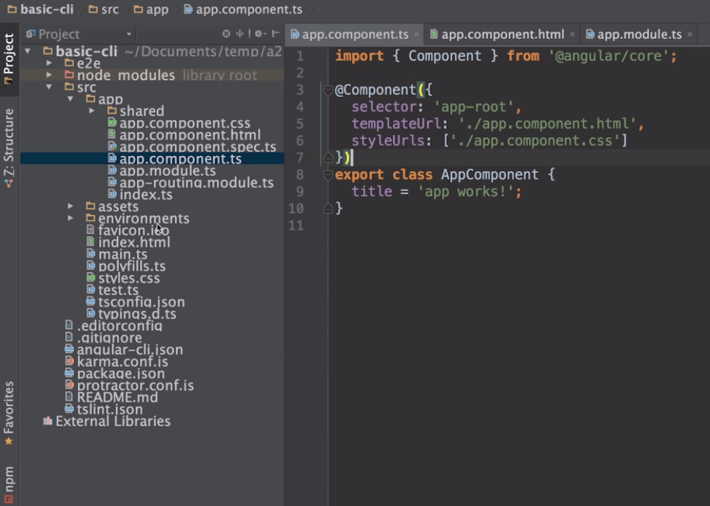
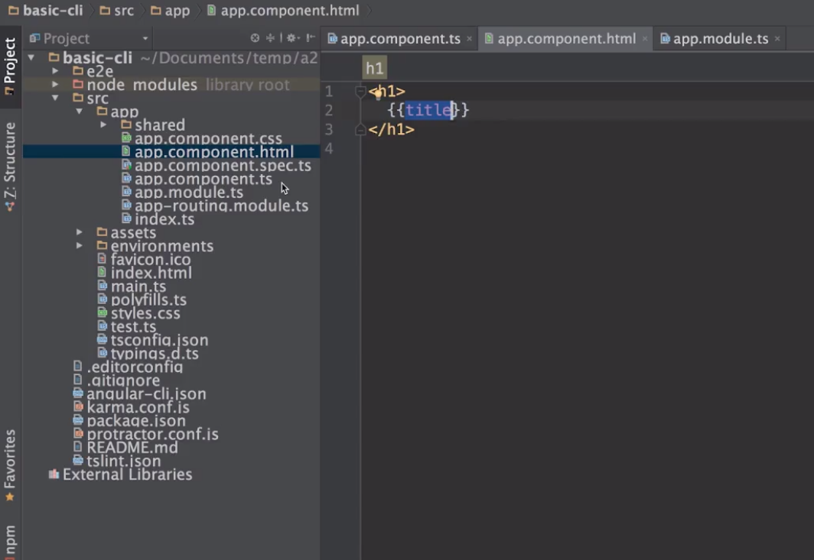

# TypeScript

#### 作者：高天阳
#### 邮箱：13683265113@163.com

```
更改历史

* 2019-07-08	    高天阳	初始化文档

```

## 1 简介与优势

### 1.1 简介

TypeScript是由**微软开发**的，一个**JavaScript超集**，遵循**ES6标准**

> ES5、ES6、JavaScript、TypeScript相互关系是什么？

ES是客户端脚本语言的规范，ES5、ES6是这个规范的不同版本，JavaScript、TypeScript是两种客户端脚本语言，
JavaScript实现了ES5规范，TypeScript实现了ES6规范

### 1.2 优势

* 支持ES6规范(15年发布)
* 强大的IDE支持(错误提示、语法提示、重构)
* Angular2的开发语言

微软+google

## 2 环境配置

* 什么是compiler？为什么需要compiler？

compiler是编译器，把TypeScript编译为JavaScript，使用原因类似babel的使用

* [在线compiler](https://www.tslang.cn/play/index.html)

* 本地compiler

```
npm i -g typescript
```

编写ts文件后，使用命令行，执行`tsc XX.ts`即可在同目录下获得`XX.js`文件

例如编写类

```typescript
export class Hello {}
```

当我们使用IDE时，其会充当compiler，帮助我们进行编译，并把ts文件变更为js文件

## 3 概念、语法和特性

### 3.1 字符串新特性

#### 3.1.1 多行字符串

```typescript
var content = `aaa
bbb
ccc`
```

#### 3.1.2 字符串模板

```typescript
var myname = 'gao tianyang'

var getname = function() {
  return 'gao tianyang'
}
console.log(`hello ${myname}`)
console.log(`hello ${getname()}`)
```

```typescript
var myname = 'gao tianyang'

var getName = function() {
  return 'gao tianyang'
}
console.log(`<div>
<span>${myname}</span>
<span>${getName()}</span>
</div>`)
```

#### 3.1.3 自动拆分字符串

```typescript
function test(template, name, age) {
  console.log(template)
  console.log(name)
  console.log(age)
}

var myname = "gao tianyang"

var getAge = function () {
  return 18
}

test`hello my name is ${myname}, i'm ${getAge()}`
```

### 3.2 参数新特性

#### 3.2.1 参数类型：在参数名称后面使用冒号来制定参数的类型

```typescript
var myname: string  = "gao tianyang"
myname = 13

var alise = "wang zhiwei"
alise = 13

var alise: any = "wang zhiwei"
alise = 13

var age: number = 13

var man: boolean = true

// 是否需要返回值(void-不需要)
function test() : void {
  return ""
}
test()

function test2() : string {
  return ""
}
test2()

function test3(name: string) : string {
  return ""
}
test3(13)

// 自定义类型
class Person {
  name: string;
  age: number;
}

var zhangsan: Person = new Person ()
zhangsan.name = ""
zhangsan.age = 18
```

#### 3.2.2 默认参数：在参数声明后面用等号来指定参数的默认值

```typescript
var myname: string = "gao tiangyang"

function test(a:string, b:string, c:string) {
    console.log(a)
    console.log(b)
    console.log(c)
}
test("x")
test("x","y","z")

// 注意带默认值的参数需要放置在最后
function test2(a:string, b:string, c:string = "c") {
    console.log(a)
    console.log(b)
    console.log(c)
}
test2("x", "y")
```

#### 3.2.3 可选参数：在方法的参数声明后面用问号来标明此参数为可选参数

```typescript
// 注意可选参数需要放置在必选参数后
function test(a:string, b?:string, c:string = "c") {
    console.log(a)
    console.log(b)
    console.log(c)
    console.log(b.length) // 需做处理
}
test("x")

function test2(a?:string, b:string, c:string = "c") {
    console.log(a)
    console.log(b)
    console.log(c)
}
test2("x")
```

### 3.3 函数新特性

#### 3.3.1 Rest and Spread操作符：用来声明任意数量的方法参数

```typescript
function fun1(...args) {
    args.forEach(function(arg) {
      console.log(arg)
    })
}

fun1(1, 2, 3)
fun1(5, 6, 7, 8, 9)
```

> typescript暂不支持的ES6语法

```typescript
function fun1(a, b, c) {
    console.log(a)
    console.log(b)
    console.log(c)
}

var args = [1, 2]
fun1(...args)

var args2 = [4, 5, 6, 7, 8]
fun1(...args2)
```

#### 3.3.2 generator函数：控制函数的执行过程，手工暂停和恢复代码执行

```typescript
function* doSomething() {
    console.log('start')
    
    yield
    
    console.log('end')
}

var func1 = doSomething()

func1.next()
func1.next()
```

```typescript
function* gerStockPrice(stock) {
    while (true) {
        yield Math.random()*100
    }
}

var priceGenerator = gerStockPrice('IBM')

var limitPrice = 15

var price = 100

while (price > limitPrice){
    price = priceGenerator.next().value
    console.log(`the generator return ${price}`)
}

console.log(`buying at ${price}`)
```

#### 3.3.3 destructuring析构表达式：通过表达式将对象或数组拆解成任意数量的变量

##### 3.3.3.1 从对象中取值

> ES5

```javascript
function getStock() {
    return {
        code: 'IBM',
        price: 100
    }
}
var stock = getStock()
var code = stock.code
var price = stock.price
```

> ES6

```typescript
function getStock() {
    return {
        code: 'IBM',
        price: 100
    }
}
var {code, price} = getStock()
console.log(code)
console.log(price)
// var {codex, price} = getStock()
// var {code: codex, price} = getStock()
// console.log(codex)
```

```typescript
function getStock() {
    return {
        code: 'IBM',
        price: {
            price1: 200,
            price2: 400
        },
        other: 'xxx'
    }
}
var {code, price} = getStock()
console.log(code)
console.log(price)
var {code, price: {price2}} = getStock()
console.log(code)
console.log(price2)
```

##### 3.3.3.2 从数组中取值

```typescript
var array1 = [1, 2, 3, 4]
var [number1, number2] = array1

console.log(number1)
console.log(number2)

var [,,number3, number4] = array1

console.log(number3)
console.log(number4)

var [number1,,, number4] = array1

console.log(number1)
console.log(number4)
```

```typescript
// Rest and Spread操作符必须是最后一个参数
var array1 = [1, 2, 3, 4]
var [number1, number2, ...others] = array1

console.log(number1)
console.log(number2)
console.log(others)

function doSomething([number1, number2, ...others]) {
    console.log(number1)
    console.log(number2)
    console.log(others)
}
doSomething(array1)
```

析构表达式的好处 当我们需要从一个对象的属性或者数组的元素里 初始化本地变量时 我们可以写更少的代码

### 3.4 表达式和循环

#### 3.4.1 箭头表达式：用来声明匿名函数，消除传统匿名函数的this指针问题

```typescript
// 单行
var sum = (arg1, arg2) => arg1 + arg2
// 多行
var sum2 = (arg1, arg2) => {
    return arg1 + arg2
}
// 无参数
var sum3 = () => {

}
// 1个参数
var sum4 = arg1 => {
    console.log(arg1)
}
```

```typescript
var myArray = [1,2,3,4,5]

console.log(myArray.filter(value => value%2 == 0))
```

箭头表达式的最大作用不是简化代码 而是解决this关键字的指向问题
ES5的this是调用时的this ES6箭头表达式的this是声明时的this

```typescript
// ES5
function getStock(name: string) {
    this.name = name
    
    setInterval(function() {
      console.log('name is :' + this.name)
    }, 1000)
}

var stock = new getStock('IBM')

// ES6
function getStock2(name: string) {
    this.name = name
    
    setInterval(() => {
      console.log('name is :' + this.name)
    }, 1000)
}

var stock2 = new getStock2('IBM')
```

#### 3.4.2 forEach(), for in 和 for of：

```typescript
var myArray = [1,2,3,4]
myArray.desc = 'for number'

// 忽略属性值 不能打断循环break
myArray.forEach(value => console.log(value))

// 循环对象键值对的键名
for (var n in myArray) {
    if (myArray[n] > 2) break
    console.log(myArray[n])
}

//忽略属性值 可以打断循环做判断
for (var n of myArray) {
    console.log(n)
}
for (var n of myArray) {
    if (n > 2) break
    console.log(n)
}
for (var n of 'for number') {
    console.log(n)
}
```

> 补充

for of循环可以用于任何具有遍历器Iterator的对象上 常见的集合如：数组、map、set以及字符串内置了Iterator(迭代器)

```typescript
Array.prototype[Symbol.iterator];
 
// ƒ values() { [native code] }
 
String.prototype[Symbol.iterator];
 
// ƒ [Symbol.iterator]() { [native code] }
 
Set.prototype[Symbol.iterator];
 
// ƒ values() { [native code] }
 
Map.prototype[Symbol.iterator];
 
// ƒ entries() { [native code] }
 
Object.prototype[Symbol.iterator];
 
// undefined
```

如何让对象可以被for of 遍历，当然是给它添加遍历器，代码如下：

```typescript
Object.prototype[Symbol.iterator] = function() {
    let _this = this
    let index = 0
    let length = Object.keys(_this).length
    return {
        next:() => {
            let value = _this[index]
            let done = (index >= length)
            index++
            return {value,done}
        }
    }
}
```

### 3.5 面向对象特性

#### 3.5.1 TypeScript-类(class)
 
类是TypeScript的核心，使用TypeScript开发时，大部分代码都是写在类里面的

这里会介绍类的定义，构造函数，以及类的继承

##### 3.5.1.1 类的定义

```typescript
// 类的声明
class Person {
    name;
    
    eat () {
        console.log('im eating')
    }
}

// 类的实例化
var p1 = new Person()
p1.name = 'batman'
p1.eat()
// 同一个类 可以new多个实例 每个实例属性方法相同 但状态不同
var p2 = new Person()
p2.name = 'superman'
p2.eat()
```

访问控制符：控制类的属性是否可以在外部访问到

`public`: (公共的) 可以在内外访问（默认值）

```typescript
class Person {
    public name;
    
    public eat () {
        console.log('im eating')
    }
}

var p1 = new Person()
p1.name = 'batman'
p1.eat()
```

`private`: (私有的) 只可以在内部访问

```typescript
class Person {
    private name;
    
    private eat () {
        console.log('im eating')
    }
}

var p1 = new Person()
p1.name = 'batman'
p1.eat()
```

`protected`: (受保护的) 可以在内部和继承的子类访问

```typescript
class Person {
    protected name;
    
    protected eat () {
        console.log('im eating')
    }
}

var p1 = new Person()
p1.name = 'batman'
p1.eat()
```

##### 3.5.1.2 类的构造函数

构造函数`constructor`在类的实例化时被自动调用

```typescript
class Person {
    constructor(){
        console.log('do something')
    }
    
    name;
    
    eat () {
        console.log('im eating')
    }
}

var p1 = new Person()
p1.constructor()
p1.name = 'batman'
p1.eat()
var p2 = new Person()
p2.name = 'superman'
p2.eat()
```

构造函数的使用场景

例如在创建Person类的时候，name必须被指定

```typescript
class Person {
    
    name;
    
    constructor(name: string){
        this.name = name
    }
    
    eat () {
        console.log('im eating')
    }
}

var p1 = new Person()
p1.name = 'batman'
p1.eat()
var p2 = new Person('superman')
p2.eat()
```

简化可写

```typescript
class Person {
    
    constructor(public name: string){
    
    }
    
    eat () {
        console.log(this.name)
    }
}

var p1 = new Person('batman')
p1.eat()
```

注意构造函数的访问控制符不可省略

> 构造函数有、无访问控制符含义不同

```typescript
class Person {
    
    constructor(name: string){
    
    }
    
    eat () {
        console.log(this.name)
    }
}

var p1 = new Person('batman')
p1.eat()
```

##### 3.5.1.3 类的继承

> extends 声明类的继承关系 继承关系是一种'是'的关系

```typescript
class Person {
    
    constructor(public name: string){
    
    }
    
    eat () {
        console.log(this.name)
    }
}

class Employee extends Person {
    code: string
    
    work () {
        console.log('do work')
    }
}

var e1 = new Employee('batman')
e1.eat()
e1.code = '001'
e1.work()
```

> super 调用父类属性

```typescript
class Person {
    constructor(public name: string){
        console.log('im person')
    }
    eat () {
        console.log('im eating')
    }
}

class Employee extends Person {
    constructor(name: string, code: string){
        super(name)
        console.log('im employee')
        this.code = code
    }
    code: string
    
    work () {
        super.eat()
        this.doWork()
    }
    
    doWork () {
        console.log('im working')
    }
    
    // 私有的doWork方法
    // private doWork () {
    //     console.log('im working')
    // }
}

var e1 = new Employee('batman', '002')
e1.work()
```

#### 3.5.2 TypeScript-泛型(generic)

参数化的类型，一般用来限制集合的内容

```typescript
class Person {
    constructor(public name: string){
        console.log('im person')
    }
    eat () {
        console.log('im eating')
    }
}

class Employee extends Person {
    constructor(name: string, code: string){
        super(name)
        console.log('im employee')
        this.code = code
    }
    code: string
    
    work () {
        super.eat()
        this.doWork()
    }
    
    private doWork () {
        console.log('im working')
    }
}

var workers: Array<Person> = []
workers[0] = new Person('ZhangSan')
workers[1] = new Employee('LiSi', '2')
workers[2] = 2

var e1 = new Employee('batman', '002')
e1.work()
```

指定数组只能放某个类型的元素 不能放其他类型的元素

#### 3.5.3 TypeScript-接口(Interface)

用来建立某种代码约定，使得其他开发者在调用某个方法或创建新的类时必须遵循接口所定义的代码约定

用接口声明属性

```typescript
interface IPerson {
    name: string
    age: number
}
class Person {
    constructor(public config: IPerson) {
        
    }
}
var p1 = new Person({
    name: 'zhangsan',
    age: 18
})
var p2 = new Person({
    name: 'zhangsan',
    age: 18,
    other: 'other'
})
var p3 = new Person({
    name: 'zhangsan'
})
```

用接口声明方法

在接口里声明一个方法 所有声明实现接口的类 必须实现此方法

```typescript
interface Animal {
    eat()
}
class Sheep implements Animal {
    eat() {
        console.log('im eat grass')
    }
}
class Tiger implements Animal {
    eat() {
        console.log('im eat meat')
    }
}
```

#### 3.5.4 TypeScript-模块(Module)

模块可以帮助开发者将代码分割为可重用的单元。开发者可以自己决定将模块中的哪些资源(类、方法、变量)暴露出去供外部使用，
哪些资源只能在模块内部使用。

在TypeScript中 一个文件就是一个模块
导出:export 导入:import
通过导出导入 规定本模块对外暴露什么以及需要其他模块提供什么

`a.ts`
```typescript
export var prop1;
var prop2;

export function func1 () {
    
}

function func2 () {
    
}

export class Clazz1 {
    
}

class Clazz2 {
    
}
```

`b.ts`
```typescript
import {prop1, func1, Clazz1} from './a'

console.log(pro1)

function func1();

new Clazz1();

export function func3 () {
    
}
```

一个模块既可以导入 属性、方法、类 同时可以导出 两者相互不影响

#### 3.5.5 TypeScript-注解(annotation)

**注解**为程序的元素(类、方法、变量)加上更直观更名了的**说明**，这些说明信息与程序的业务逻辑无关，而是供指定的**工具**或**框架**使用。




上图中，用angular2框架写的程序，其中`Component`是下面`AppComponent`的一段注解
这个注解本身是由angular2框架所提供的，注解中的一些属性会告诉angular2框架怎么处理`AppComponent`这个类

可以理解为，当angular2框架实例化`AppComponent`这个类时，angular2框架应当加载属性中提供的html及css

#### 3.5.6 TypeScript-类型定义文件(*.d.ts)

类型定义文件用来帮助开发者在TypeScript中使用已有的JavaScript的工具包

如：JQuery

手动获取类型定义文件[DefinitelyTyped项目](https://github.com/DefinitelyTyped/DefinitelyTyped)

工具获取类型定义文件[typings项目](https://github.com/typings/typings)

```
npm install typings --global
typings search jquery

cd ~/项目目录
typings install jquery --save // 未成功使用下面命令
typings install dt~jquery --global --save // 指定前缀也就是源的维护地址
```

遇到jq无法引用的问题 通过`tsconfig.json`配置解决 此配置还加了未使用报错

[TS的tsconfig.json配置](https://www.jianshu.com/p/6d2783f1ab51)
[tsconfig.json编译选项](https://www.cnblogs.com/zaihuilou/p/9556373.html)
[Typings能否基于package.json自动安装d.ts？](https://segmentfault.com/q/1010000005952451)

### 3.6 TypeScript总结

* 介绍了TypeScript的基本概念和优势
* 介绍了如何搭建TypeScript开发环境
* 介绍了TypeScript的的语法和特性

### 3.7 最佳实践

#### 3.7.1 [Vue项目中应用Typescript](./VueAndTypeScript.md)

## 参考资料

* [TypeScript 教程](https://www.runoob.com/typescript/ts-tutorial.html)
* [vue + typescript 新项目起手式](https://segmentfault.com/a/1190000011744210?utm_source=tuicool&utm_medium=referral)
* [使用 TypeScript 来写 Vue](https://blog.csdn.net/kaelyn_X/article/details/85019575)
* [!: 使用场景及问题分析](https://www.tslang.cn/docs/release-notes/typescript-2.7.html)
* [ts 新版本问题总结](https://www.jianshu.com/p/71ac8dd4c46e)
* [计算属性](https://blog.csdn.net/xlelou/article/details/81477391)
* [console报错 eslint](https://blog.csdn.net/weixin_42476786/article/details/85132793)
* [tslint 或者eslint怎样覆盖配置](https://segmentfault.com/q/1010000008691654)
* [ESlint中console.log报错问题](https://blog.csdn.net/weixin_34403976/article/details/89469152)
