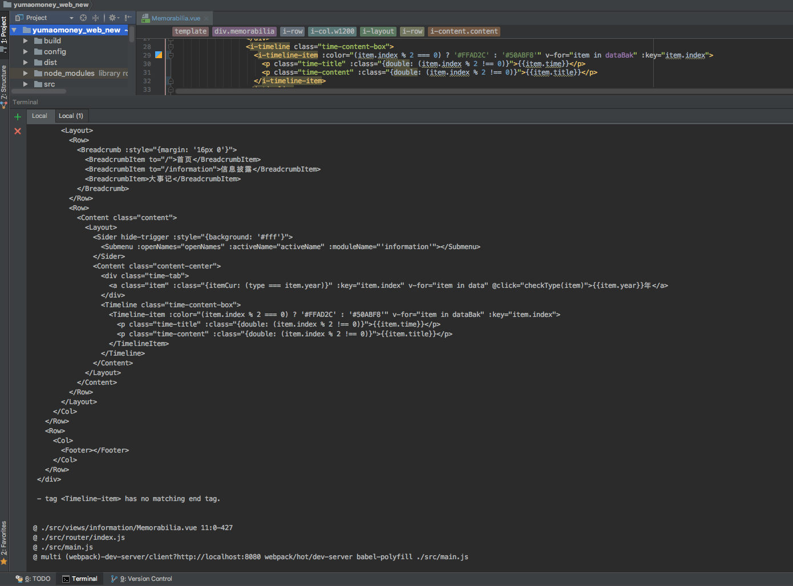
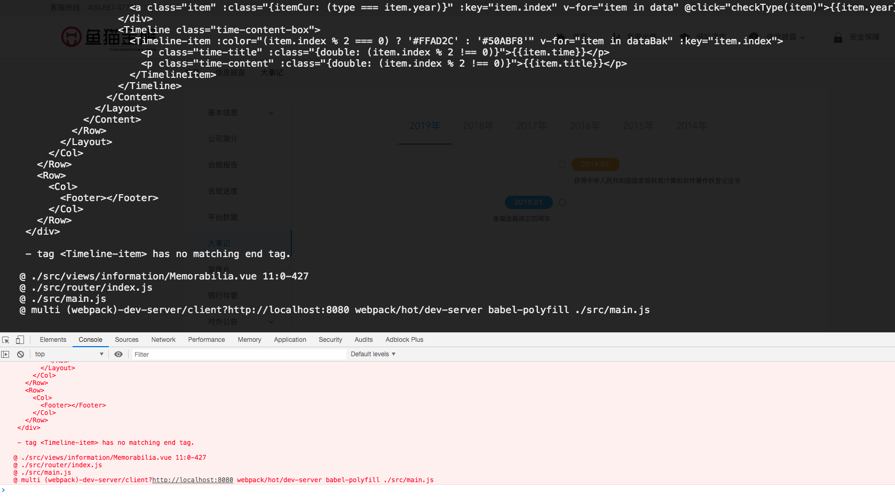
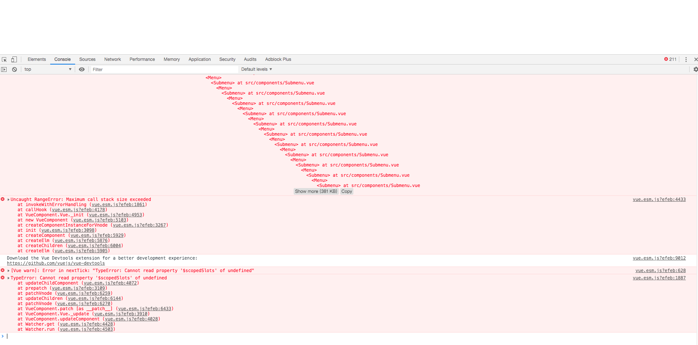

# iView Loader使用

#### 作者：高天阳
#### 邮箱：13683265113@163.com

```
更改历史

* 2019-06-28        高天阳     初始化文档

```

## 1 用途

统一`iView`标签书写规范，所有标签都可以使用首字母大写的形式，包括`Vue`限制的两个标签`Switch`和`Circle`。

虽然不推荐，但通过`loader`选项配置，可以开启所有标签前缀的写法了，比如`i-date-picker`。

[为什么推荐在单文件组件和字符串模板中组件名应该总是 PascalCase 的。](https://cn.vuejs.org/v2/style-guide/#%E6%A8%A1%E6%9D%BF%E4%B8%AD%E7%9A%84%E7%BB%84%E4%BB%B6%E5%90%8D%E5%A4%A7%E5%B0%8F%E5%86%99-%E5%BC%BA%E7%83%88%E6%8E%A8%E8%8D%90)

## 2 使用方法

### 2.1 安装

首先通过`npm`安装`iview-loader`

```
npm install iview-loader --save-dev
```

### 2.2 配置

配置`webpack`(webpack.base.conf.js)，改写平时`vue-loader`的配置，形如：

```js
module: {
    rules: [
        {
            test: /\.vue$/,
            use: [
                {
                    loader: 'vue-loader',
                    options: {
                        
                    }
                },
                {
                    loader: 'iview-loader',
                    options: {
                        prefix: false
                    }
                }
            ]
        }
    ]
}
```

## 2.3 说明

* 可以直接写` <Switch> `和`<Circle> `这两个标签；
* 参数`prefix`设置为`true`后，所有`iView`组件标签名都可以使用前缀`i-`，例如`<i-row>`、`<i-select>`

完整的标签名如下：

```
{
    'i-affix': 'Affix',
    'i-alert': 'Alert',
    'i-anchor': 'Anchor',
    'i-anchor-link': 'AnchorLink',
    'i-auto-complete': 'AutoComplete',
    'i-avatar': 'Avatar',
    'i-back-top': 'BackTop',
    'i-badge': 'Badge',
    'i-breadcrumb': 'Breadcrumb',
    'i-breadcrumb-item': 'BreadcrumbItem',
    'i-button': 'Button',
    'i-button-group': 'ButtonGroup',
    'i-card': 'Card',
    'i-carousel': 'Carousel',
    'i-carousel-item': 'CarouselItem',
    'i-cascader': 'Cascader',
    'i-cell': 'Cell',
    'i-cell-group': 'CellGroup',
    'i-checkbox': 'Checkbox',
    'i-checkbox-group': 'CheckboxGroup',
    'i-circle': 'i-circle',
    'i-col': 'Col',
    'i-collapse': 'Collapse',
    'i-color-picker': 'ColorPicker',
    'i-content': 'Content',
    'i-divider': 'Divider',
    'i-date-picker': 'DatePicker',
    'i-drawer': 'Drawer',
    'i-dropdown': 'Dropdown',
    'i-dropdown-item': 'DropdownItem',
    'i-dropdown-menu': 'DropdownMenu',
    'i-footer': 'Footer',
    'i-form': 'Form',
    'i-form-item': 'FormItem',
    'i-header': 'Header',
    'i-icon': 'Icon',
    'i-input': 'Input',
    'i-input-number': 'InputNumber',
    'i-layout': 'Layout',
    'i-menu': 'Menu',
    'i-menu-group': 'MenuGroup',
    'i-menu-item': 'MenuItem',
    'i-sider': 'Sider',
    'i-submenu': 'Submenu',
    'i-modal': 'Modal',
    'i-option': 'Option',
    'i-option-group': 'OptionGroup',
    'i-page': 'Page',
    'i-panel': 'Panel',
    'i-poptip': 'Poptip',
    'i-progress': 'Progress',
    'i-radio': 'Radio',
    'i-radio-group': 'RadioGroup',
    'i-rate': 'Rate',
    'i-row': 'Row',
    'i-select': 'Select',
    'i-slider': 'Slider',
    'i-spin': 'Spin',
    'i-split': 'Split',
    'i-step': 'Step',
    'i-steps': 'Steps',
    'i-switch': 'i-switch',
    'i-table': 'Table',
    'i-tabs': 'Tabs',
    'i-tab-pane': 'TabPane',
    'i-tag': 'Tag',
    'i-time': 'Time',
    'i-timeline': 'Timeline',
    'i-timeline-item': 'TimelineItem',
    'i-time-picker': 'TimePicker',
    'i-tooltip': 'Tooltip',
    'i-transfer': 'Transfer',
    'i-tree': 'Tree',
    'i-upload': 'Upload'
}
```

## 2.4 最佳实践

## 2.4.1 timeline组件eslint报错

按照iview官方文档中的提示编写时间轴代码如下

```html
<i-timeline class="time-content-box">
    <i-timeline-item>
      <p class="time-title">时间</p>
      <p class="time-content">内容</p>
    </i-timeline-item>
</i-timeline>
```

编译报错如下图



页面报错如下图



> 分析：由于eslint无法识别timeline导致其在编译过程中提示标签未封闭 从而导致编译失败

解决方法

在`main.js`引入`iview`的同时 把`timeline`组件全局注册别名

```javascript
import Vue from 'vue'
import iView from 'iview'
Vue.component('i-time-line-item', iView.TimelineItem)
```

页面中使用别名

```html
<i-timeline class="time-content-box">
    <i-time-line-item>
      <p class="time-title">时间</p>
      <p class="time-content">内容</p>
    </i-time-line-item>
</i-timeline>
```

## 2.4.2 menu组件submenu递归溢出报错

按照iview官方文档中的提示编写时间轴代码如下

```html
<i-menu>
    <i-submenu name="a">
        <template slot="title">
            A
        </template>
        <i-menu-item name="a1" to="/a/a1">B</i-menu-item>
        <i-menu-item name="a2" to="/a/a2">C</i-menu-item>
    </i-submenu>
    <i-menu-item name="b" to="/b">
      B
    </i-menu-item>
    <i-menu-item name="c" to="/c">
      C
    </i-menu-item>
</i-menu>
```

页面报错如下图



> 分析：暂时未查出问题原因 猜测是iview-loader中重命名的组件与iview原本的组件存在冲突 导致的异常

解决方法同上

在`main.js`引入`iview`的同时 把`submenu`组件全局注册别名

```javascript
import Vue from 'vue'
import iView from 'iview'
Vue.component('i-ym-submenu', iView.Submenu)
```

页面中使用别名

```html
<i-menu>
    <i-ym-submenu name="a">
        <template slot="title">
            A
        </template>
        <i-menu-item name="a1" to="/a/a1">B</i-menu-item>
        <i-menu-item name="a2" to="/a/a2">C</i-menu-item>
    </i-ym-submenu>
    <i-menu-item name="b" to="/b">
      B
    </i-menu-item>
    <i-menu-item name="c" to="/c">
      C
    </i-menu-item>
</i-menu>
```

## 参考资料

* [iView Loader](https://www.iviewui.com/docs/guide/iview-loader)
