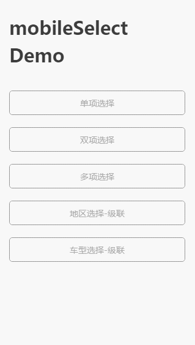
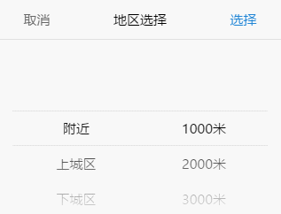
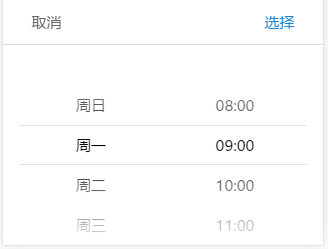
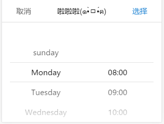
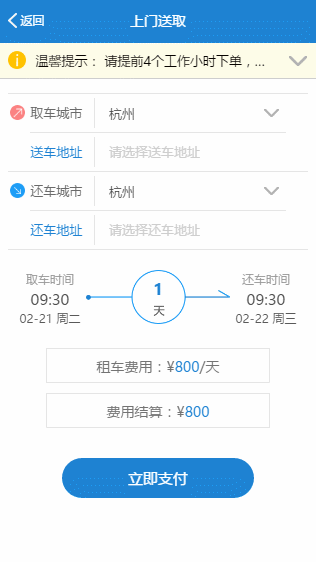

# mobileSelect.js使用

#### 作者：高天阳
#### 邮箱：13683265113@163.com

```
更改历史

* 2018-10-29        高天阳     初始化文档

```

## 1 简介与特点

### 1.1 简介


最新版本[下载地址(2017-09-21更新)](https://github.com/onlyhom/mobileSelect.js )： 

写给不熟悉github的同学：点击页面右侧的绿色按钮【Clone or download】即可下载
版本持续更新中，遇到有什么bug或建议可以在Issues中提出来，我会在工作之余尽力解答。

遇到bug先不要着急，请先确认是否在github中下载的最新版本，有一些别的网站也收录了这个插件，
但是版本滞后，一些新特性还没有更新，以及存留着一些老bug。

### 1.2 特点

* 原生js移动端选择控件，不依赖任何库
* 可传入普通数组或者json数组
* 可根据传入的参数长度，自动渲染出对应的列数，支持单项到多项选择
* 自动识别是否级联
* 选择成功后，提供自定义回调函数callback() 返回当前选择索引位置、以及选择的数据（数组/json）
* 每次手势滑动结束后，也提供一个回调函数transitionEnd() 返回当前选择索引位置、以及选择的数据（数组/json）
* 能够在已经实例化控件后，提供update函数，传其他参数再次渲染
* 提供重定位函数

### 1.3 演示

手机扫描二维码预览：


动态图预览：



## 2 安装

> 方式一 标签引入：

```
<link rel="stylesheet" type="text/css" href="css/mobileSelect.css">
<script src="js/mobileSelect.js" type="text/javascript"></script>
```

> 方式二 npm：

```
npm install mobile-select -D
```

在你的js文件中import：

```
import MobileSelect from 'mobile-select'
```

## 3 使用

### 3.1 普通数组格式-非联动

```
<div id="trigger1"></div> <!--页面中别漏了这个trigger-->

<script type="text/javascript">
var mobileSelect1 = new MobileSelect({
    trigger: '#trigger1', 
    title: '单项选择',  
    wheels: [
                {data:['周日','周一','周二','周三','周四','周五','周六']}
            ],
    position:[2] //初始化定位
});
</script>
```

### 3.2 json格式-非联动

```
<div id="trigger2"></div>

<script type="text/javascript">
var mobileSelect2 = new MobileSelect({
    trigger: '#trigger2',
    title: '地区选择',
    wheels: [
                {data:[
                    {id:'1',value:'附近'},
                    {id:'2',value:'上城区'},
                    {id:'3',value:'下城区'},
                    {id:'4',value:'江干区'},
                    {id:'5',value:'拱墅区'},
                    {id:'6',value:'西湖区'}
                ]},
                {data:[
                    {id:'1',value:'1000米'},
                    {id:'2',value:'2000米'},
                    {id:'3',value:'3000米'},
                    {id:'4',value:'5000米'},
                    {id:'5',value:'10000米'}
                ]}
            ],
    callback:function(indexArr, data){
        console.log(data); //返回选中的json数据
    } 
});
</script>
```

### 3.3 json格式-联动

```
<div id="trigger3"></div>

<script type="text/javascript">
  var mobileSelect3 = new MobileSelect({
      trigger: '#trigger3',
      title: '地区选择-联动',
      wheels: [
                  {data:[
                      {
                          id:'1',
                          value:'附近',
                          childs:[
                              {id:'1',value:'1000米'},
                              {id:'2',value:'2000米'},
                              {id:'3',value:'3000米'},
                              {id:'4',value:'5000米'},
                              {id:'5',value:'10000米'}
                          ]
                      },
                      {id:'2',value:'上城区'},
                      {id:'3',value:'下城区'},
                      {id:'4',value:'江干区'},
                      {id:'5',value:'拱墅区'},
                      {id:'6',value:'西湖区'}
                  ]}
              ],
      position:[0,1],
      callback:function(indexArr, data){
          console.log(data); //返回选中的json数据
      } 
  });
</script>
```

效果图



### 3.4 在vue-cli中如何使用

```
npm install mobile-select -D
1
<template>
    <div>
        <div id="trigger4">单项选择</div>
    </div>
</template>

<script>
    import MobileSelect from 'mobile-select'

    export default {
        mounted() {
            var mobileSelect4 = new MobileSelect({
                trigger: "#trigger4",
                title: "单项选择",
                wheels: [
                    {data: ["周日","周一","周二","周三","周四","周五","周六"]}
                ],
                callback:function(indexArr, data){
                    console.log(data);
                }
            });
        }
    }
</script
```

### 3.5 数据字段名映射

```
<div id="trigger5"></div>

<script type="text/javascript">
    //假如你的数据的字段名为id,title,children
    //与mobileSelect的id,value,childs字段名不匹配
    //可以用keyMap属性进行字段名映射
    var mobileSelect5 = new MobileSelect({
        trigger: '#trigger5',
        title: '数据字段名映射',
        wheels: [
                    {data:[
                        {
                            id:'1',
                            title:'A',
                            children:[
                                {id:'A1',title:'A-a'},
                                {id:'A2',title:'A-b'},
                                {id:'A3',title:'A-c'}
                            ]
                        },
                        {
                            id:'1',
                            title:'B',
                            children:[
                                {id:'B1',title:'B-a'},
                                {id:'B2',title:'B-b'},
                                {id:'B3',title:'B-c'}
                            ]
                        },
                    ]}
                ],
        keyMap: {
            id:'id',
            value: 'title',
            childs :'children'
        },         
        callback:function(indexArr, data){
            console.log(data);
        }
    });
</script>
```

### 3.6 参数

| 选项 | 默认值 | 类型 | 描述 |
| :---: | :---: | :---: | :---: |
| trigger | 必填参数 无默认值 | String | 触发对象的id/class/tag |
| wheels | 必填参数 无默认值 | Array | 数据源,需要显示的数据 |
| title | '' | String | 控件标题 |
| position | `[0,0,0,…]` | Array | 初始化定位 |
| connector | ' ' | String | 多个轮子时，多个值中间的连接符，默认是空格 |
| callback | function(indexArr, data){} | function | 选择成功后触发的回调函数，返回indexArr、data |
| transitionEnd | function(indexArr, data){} | function | 每一次手势滑动结束后触发的回调函数,返回indexArr、data |
| ensureBtnText | '确认' | String | 确认按钮的文本内容 |
| cancelBtnText | '取消' | String | 取消按钮的文本内容 |
| ensureBtnColor | '#1e83d3' | String | 确认按钮的文本颜色 |
| cancelBtnColor | '#666666' | String | 取消按钮的文本颜色 |
| titleColor | '#000000' | String | 控件标题的文本颜色 |
| titleBgColor | '#ffffff' | String | 控件标题的背景颜色 |
| textColor | '#000000' | String | 轮子内文本的颜色 |
| bgColor | '#ffffff' | String | 轮子背景颜色 |
| keyMap | {id:'id', value:'value', childs:'childs'} | Object | 字段名映射，适用于字段名不匹配id,value,childs的数据格式 |
| triggerDisplayData | true | Boolean | 在点击确认时，trigger的innerHtml是否变为选择的数据。（如果trigger里面还有其他元素，则可以设置为false；如果需要在别的地方显示数据，则可用callback返回的数据自行拼接） |

注：回调函数中返回的参数含义如下

* indexArr是当前选中的索引数组 如`[0,0,1]`代表有三个轮子 选中的数据是第一个轮子的第0个数据、第二个轮子的第0个数据、第三个轮子的第1个数据
* data是当前选中的json数据 如`[{id:’1’,value:’hello’},{id:’2’,value:’world’}]`

### 3.7 功能函数：

| 函数名 | 参数 | 描述 |
| setTitle() | string | 设置控件的标题 |
| locatePosition() | sliderIndex, posIndex | 传入位置数组，重新定位轮子选中的位置 |
| updateWheel() | sliderIndex, data | 重新渲染指定的轮子 |
| updateWheels() | data | 重新渲染所有轮子(仅限级联数据格式使用) |
| show() | 无参 | 唤起弹窗组件 |
| getValue() | 无参 | 获取组件选择的值 |

注：功能函数中需要传递的参数含义如下

* sliderIndex 代表的是要修改的轮子的索引
* posIndex 代表位置索引

## 4 示例
 
### 4.1 功能函数demo：

```
<div id="day"></div>

var mySelect = new MobileSelect({
    trigger: '#day', 
    wheels: [
                {data:['周日','周一','周二','周三','周四','周五','周六']},
                {data:['08:00','09:00','10:00','11:00','12:00','13:00','14:00']}
            ],
    position:[1,1] //初始化定位 两个轮子都选中在索引1的选项
});

//----------------------------------------------
//进行基础的实例化之后，对实例用功能函数操作 

// mySelect.setTitle('啦啦啦(๑•̀ㅁ•́ฅ)'); 
// 设置控件的标题

// mySelect.updateWheel(0,['sunday','Monday','Tuesday','Wednesday','Thursday','Friday','Saturday']);
// 更新第0个轮子的数据，数据变为英文的星期几

// mySelect.locatePosition(1,0);
// 重新定位第1个轮子的位置，将第1个轮子的第0个数据改为当前选中。
// (第1个轮子是指右边的轮子，左边的轮子是第0个)
```





### 4.2 ajax异步填充数据demo：

```
<!-- ************ 非级联格式 ************ -->

<div id="trigger6"></div>

<script type="text/javascript">
    var mobileSelect6 = new MobileSelect({
        trigger: '#trigger6',
        title: 'ajax填充数据-非级联',
        wheels: [
                    {data:[
                        {id:'1',value:'请选择地区'},
                    ]},
                    {data:[
                        {id:'1',value:'请选择距离'},
                    ]}
                ],        
        callback:function(indexArr, data){
            console.log(data);
        }
    });

    $.ajax({
        type: "POST",
        url: "xxxx",
        data: {},
        dataType: "json",
        success: function(res){
            //这里假设获取到的res.data.area为：
            // [
            //     {id:'1',value:'附近'},
            //     {id:'2',value:'福田区'},
            //     {id:'3',value:'罗湖区'},
            //     {id:'4',value:'南山区'}
            // ]

            //这里假设获取到的res.data.distance为：
            // [
            //     {id:'1',value:'200米'},
            //     {id:'2',value:'300米'},
            //     {id:'3',value:'400米'}
            // ]

            mobileSelect6.updateWheel(0, res.data.area); //更改第0个轮子
            mobileSelect6.updateWheel(1, res.data.distance); //更改第1个轮子
        }
    });
</script>


<!-- ************ 级联格式 ************ -->

<div id="trigger7"></div>

<script type="text/javascript">
    var mobileSelect7 = new MobileSelect({
        trigger: '#trigger7',
        title: 'ajax填充数据-级联',
        wheels: [
                    {data:[
                        {
                            id:'1',
                            value:'',
                            childs:[
                                {id:'A1',value:''},
                            ]
                        }
                    ]}
                ],        
        callback:function(indexArr, data){
            console.log(data);
        }
    });

    $.ajax({
        type: "POST",
        url: "xxxx",
        data: {},
        dataType: "json",
        success: function(res){
            //这里假设获取到的res.data为：
            // [{
            //     id:'1',
            //     value:'更新后数据',
            //     childs:[
            //         {id:'A1',value:'apple'},
            //         {id:'A2',value:'banana'},
            //         {id:'A3',value:'orange'}
            //     ]
            // }]
            mobileSelect7.updateWheels(res.data);
        }
    });
</script>
```

### 4.3 项目demo：

使用transitionEnd()、callback()、updateWheel()、locatePostion()函数实现如下功能：

* 选择当天日期时，不得超过今天已过时辰。
* 选择取车时间后，还车时间不得超过取车时间（包括日期和时间）。



## 参考资料

* [js手机移动端选择插件 mobileSelect.js](https://blog.csdn.net/oulihong123/article/details/58327247/)
