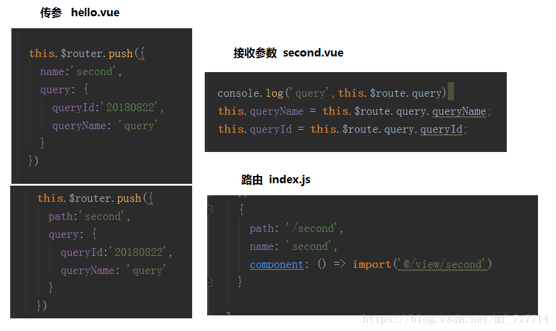
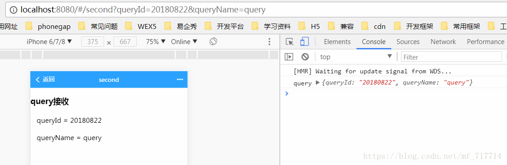
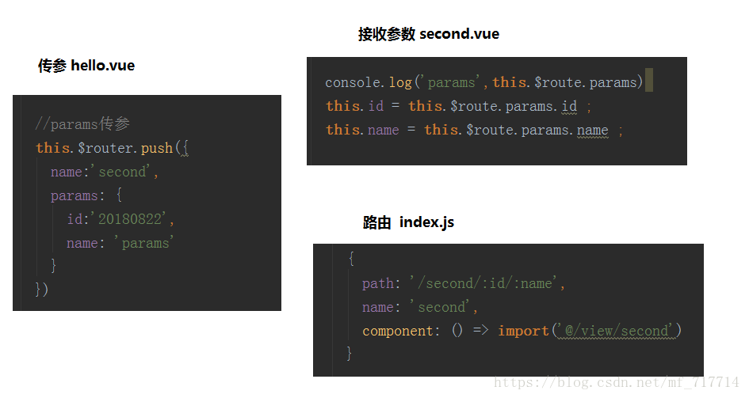
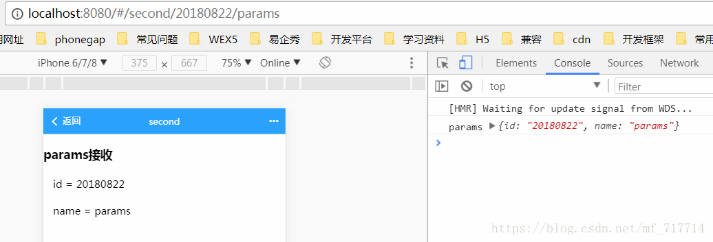
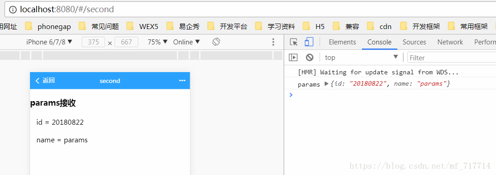
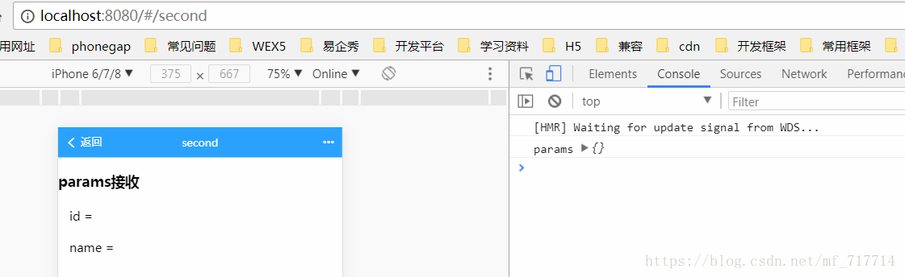
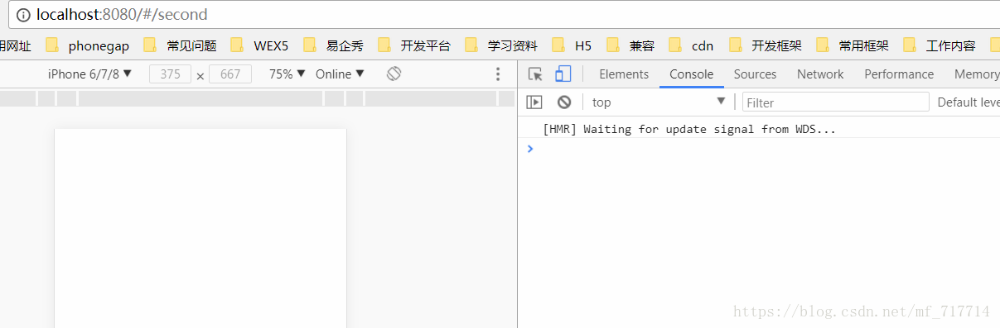

# vue-router使用

#### 作者：高天阳
#### 邮箱：13683265113@163.com

```
更改历史

* 2018-10-29        高天阳     初始化文档

```

## 1 介绍

路由：控制组件之间的跳转，不会实现请求、不用页面刷新，直接跳转-切换组件

## 2 安装

本地环境安装路由插件vue-router：

```
cnpm install vue-router --save-dev  
```

* 没有安装淘宝镜像的可以将`cnpm`替换成`npm`

想要安装的可以看这篇[文章](http://www.cnblogs.com/padding1015/p/7162024.html)，（打开搜索`镜像`即可跳转到对应位置）

## 3 配置

两种配置方法：在main.js中 || 在src/router文件夹下的index.js中

这里只说在src/router/index.js中的

* 引入

``` 
import Vue from 'vue'
import Router from 'vue-router'
```

注意这个Router是自定义的名字，这里叫这个名字后，下边都要用到的

* 使用/注册：

```
Vue.use(Router)
```

* 配置

配置路由

```
export default new Router({
  routes: [
   {
        path : ‘/’,  //到时候地址栏会显示的路径
        name : ‘Home’,
        component :  Home   // Home是组件的名字，这个路由对应跳转到的组件。。注意component没有加“s”.
    },
    {
        path : ‘/content’,
        name : ‘Content’,
        component :  Content
    }
],
    mode: "history"
})
```

* 引入路由对应的组件地址

``` 
import Home from '@/components/Home'
import Home from '@/components/Content’
```

* 在main.js中调用index.js的配置

```
import router from './router'
```

* App.vue页面使用（展示）路由：<!-- 展示router -->

把这个标签放到对应位置

```
<router-view></router-view>
```

* 路由切换（原来的<a href=”XXX.html”>等地方）：把切换标签和链接改成

```
<router-link  to="/">切换到Home组件</router-link>
<router-link  to="/content">切换到Content组件</router-link>
```

> 这里，to里边的参数和配置时，path的路径一样即可

## 4 示例

`/src/main.js`

```
import Vue from 'vue'
import App from './App'
import router from 'vue-router'

/* eslint-disable no-new */
new Vue({
  router,
  render: h => h(App)
}).$mount('#app-box')
```

`/src/router/index.js`

```
import Vue from 'vue'
import Router from 'vue-router'
import Container from '../components/container/Container'
import Start from '../components/start/Start'
import Gesture from '../components/start/gesture/Gesture'
import Registered from '../components/start/registered/Registered'
import RegisteredDetail from '../components/start/registered/RegisteredDetail'
import Lending from '../components/lending/Lending'
import FinanceDetail from '../components/lending/financeDetail/FinanceDetail'

Vue.use(Router)

export default new Router({
  routes: [
    {
      path: '/',
      redirect: '/start'
    },
    {
      path: '/start',
      component: Container,
      children: [
        {
          path: '/',
          component: Start
        },
        {
          path: 'gesture',
          component: Gesture
        },
        {
          path: 'registered',
          component: Container,
          children: [
            {
              path: '/',
              component: Registered
            },
            {
              path: 'registeredDetail',
              component: RegisteredDetail
            }
          ]
        }
      ]
    },
    {
      path: '/lending',
      component: Container,
      children: [
        {
          path: '/',
          component: Lending
        },
        {
          path: 'financeDetail',
          name: 'financeDetail',
          component: FinanceDetail
        }
      ]
    },
  ]
})
```

## 5 最佳实践

### 5.1 Vue Router 的params和query传参的使用和区别

首先简单来说明一下`$router`和`$route`的区别

```
//$router : 是路由操作对象，只写对象
//$route : 路由信息对象，只读对象

//操作 路由跳转
this.$router.push({
      name:'hello',
      params:{
          name:'word',
          age:'11'
     }
})

//读取 路由参数接收
this.name = this.$route.params.name
this.age = this.$route.params.age
```

#### 5.1.1 query传递参数

我看了很多人都说query传参要用path来引入，params传参要用name来引入，只是我测试了一下，query使用name来引入也可以传参，使用path也可以。

```
//query传参，使用name跳转
this.$router.push({
    name:'second',
    query: {
        queryId:'20180822',
        queryName: 'query'
    }
})

//query传参，使用path跳转
this.$router.push({
    path:'second',
    query: {
        queryId:'20180822',
        queryName: 'query'
    }
})

//query传参接收
this.queryName = this.$route.query.queryName
this.queryId = this.$route.query.queryId
```



最终不管是path引入还是name引入效果都一样如下图



#### 5.1.2 params传递参数

注：使用params传参只能使用name进行引入

使用params传参

```
//params传参 使用name
this.$router.push({
  name:'second',
  params: {
    id:'20180822',
     name: 'query'
  }
})

//params接收参数
this.id = this.$route.params.id 
this.name = this.$route.params.name 

//路由

{
path: '/second/:id/:name',
name: 'second',
component: () => import('@/view/second')
}
```



效果如下图



需要注意的是：

* params是路由的一部分,必须要在路由后面添加参数名。query是拼接在url后面的参数，没有也没关系。
* params一旦设置在路由，params就是路由的一部分，如果这个路由有params传参，但是在跳转的时候没有传这个参数，
会导致跳转失败或者页面会没有内容。

如果路由后面没有 /:id/:name效果如下图，地址栏没有参数



但是如果你刷新一下，就会发现页面失败，效果如下图



因此我们不可能让用户不要刷新，所以我们必须在路由后面加上 /:id/:name

如果使用path进行传参

```
//params传参 使用path
this.$router.push({
  path:'second',
   params: {
    id:'20180822',
     name: 'query'
  }
})

//params接收参数
this.id = this.$route.params.id
this.name = this.$route.params.name 
```

效果如下图

使用path传参什么效果都没有。



#### 5.1.3 总结

1. 传参可以使用params和query两种方式。
1. 使用params传参只能用name来引入路由，即push里面只能是name:’xxxx’,不能是path:’/xxx’,
因为params只能用name来引入路由，如果这里写成了path，接收参数页面会是undefined！！！。
1. 使用query传参使用path来引入路由。
1. params是路由的一部分,必须要在路由后面添加参数名。query是拼接在url后面的参数，没有也没关系。
1. 二者还有点区别，直白的来说query相当于get请求，页面跳转的时候，可以在地址栏看到请求参数，
而params相当于post请求，参数不会再地址栏中显示。

## 参考资料

* [官方文档](https://router.vuejs.org/zh/)
* [router配置位置](https://www.cnblogs.com/padding1015/p/7884861.html)
* [Vue Router 的params和query传参的使用和区别](https://blog.csdn.net/mf_717714/article/details/81945218)
    