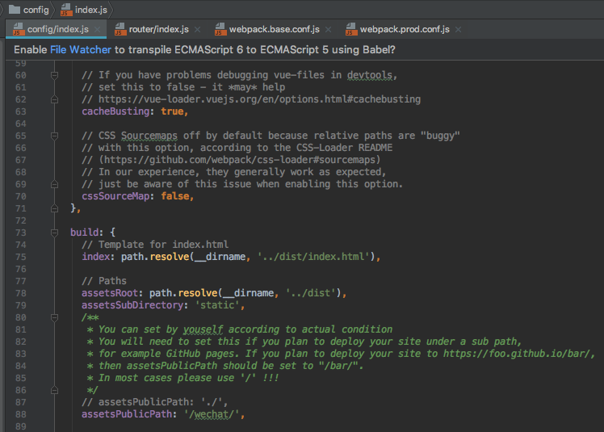
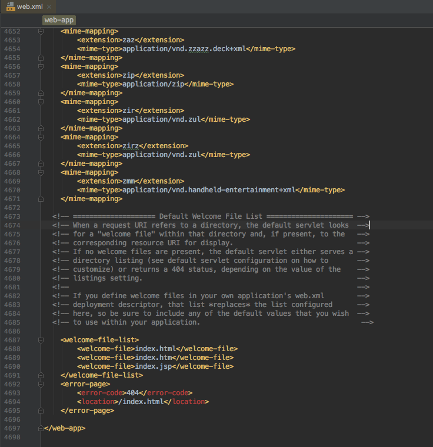

# vue-router使用

#### 作者：高天阳
#### 邮箱：13683265113@163.com

```
更改历史

* 2018-10-29        高天阳     初始化文档
* 2019-03-19        高天阳     添加vue-router history模式示例

```

## 1 介绍

路由：控制组件之间的跳转，不会实现请求、不用页面刷新，直接跳转-切换组件

## 2 安装

本地环境安装路由插件vue-router：

```
cnpm install vue-router --save-dev  
```

* 没有安装淘宝镜像的可以将`cnpm`替换成`npm`

想要安装的可以看这篇[文章](http://www.cnblogs.com/padding1015/p/7162024.html)，（打开搜索`镜像`即可跳转到对应位置）

## 3 配置

两种配置方法：在main.js中 || 在src/router文件夹下的index.js中

这里只说在src/router/index.js中的

* 引入

``` 
import Vue from 'vue'
import Router from 'vue-router'
```

注意这个Router是自定义的名字，这里叫这个名字后，下边都要用到的

* 使用/注册：

```
Vue.use(Router)
```

* 配置

配置路由

```javascript
export default new Router({
  routes: [
    {
        path: '/',  // 到时候地址栏会显示的路径
        name: 'Home',
        component: Home   // Home是组件的名字，这个路由对应跳转到的组件。。注意component没有加“s”.
    },
    {
        path: '/content',
        name: 'Content',
        component: Content
    }
  ]
})
```

* 引入路由对应的组件地址

```
import Home from '@/components/Home'
import Home from '@/components/Content’
```

* 在main.js中调用index.js的配置

```
import router from './router'
```

* App.vue页面使用（展示）路由：<!-- 展示router -->

把这个标签放到对应位置

```
<router-view></router-view>
```

* 路由切换（原来的<a href=”XXX.html”>等地方）：把切换标签和链接改成

```
<router-link  to="/">切换到Home组件</router-link>
<router-link  to="/content">切换到Content组件</router-link>
```

> 这里，to里边的参数和配置时，path的路径一样即可

## 4 示例

`/src/main.js`

```javascript
import Vue from 'vue'
import App from './App'
import router from 'vue-router'

/* eslint-disable no-new */
new Vue({
  router,
  render: h => h(App)
}).$mount('#app-box')
```

`/src/router/index.js`

```javascript
import Vue from 'vue'
import Router from 'vue-router'
import Container from '../components/container/Container'
import Start from '../components/start/Start'
import Gesture from '../components/start/gesture/Gesture'
import Registered from '../components/start/registered/Registered'
import RegisteredDetail from '../components/start/registered/RegisteredDetail'
import Lending from '../components/lending/Lending'
import FinanceDetail from '../components/lending/financeDetail/FinanceDetail'

Vue.use(Router)

export default new Router({
  routes: [
    {
      path: '/',
      redirect: '/start'
    },
    {
      path: '/start',
      component: Container,
      children: [
        {
          path: '/',
          component: Start
        },
        {
          path: 'gesture',
          component: Gesture
        },
        {
          path: 'registered',
          component: Container,
          children: [
            {
              path: '/',
              component: Registered
            },
            {
              path: 'registeredDetail',
              component: RegisteredDetail
            }
          ]
        }
      ]
    },
    {
      path: '/lending',
      component: Container,
      children: [
        {
          path: '/',
          component: Lending
        },
        {
          path: 'financeDetail',
          name: 'financeDetail',
          component: FinanceDetail
        }
      ]
    }
  ]
})
```

## 5 最佳实践

### 5.1 Vue Router 的params和query传参的使用和区别

首先简单来说明一下`$router`和`$route`的区别

```javascript
//$router : 是路由操作对象，只写对象
//$route : 路由信息对象，只读对象

//操作 路由跳转
this.$router.push({
      name:'hello',
      params:{
          name:'word',
          age:'11'
     }
})

//读取 路由参数接收
this.name = this.$route.params.name
this.age = this.$route.params.age
```

#### 5.1.1 query传递参数

我看了很多人都说query传参要用path来引入，params传参要用name来引入，只是我测试了一下，query使用name来引入也可以传参，使用path也可以。

```javascript
//query传参，使用name跳转
this.$router.push({
    name:'second',
    query: {
        queryId:'20180822',
        queryName: 'query'
    }
})

//query传参，使用path跳转
this.$router.push({
    path:'second',
    query: {
        queryId:'20180822',
        queryName: 'query'
    }
})

//query传参接收
this.queryName = this.$route.query.queryName
this.queryId = this.$route.query.queryId
```


最终不管是path引入还是name引入效果都一样如下图


#### 5.1.2 params传递参数

注：使用params传参只能使用name进行引入

使用params传参

```
//params传参 使用name
this.$router.push({
  name:'second',
  params: {
    id:'20180822',
     name: 'query'
  }
})

//params接收参数
this.id = this.$route.params.id 
this.name = this.$route.params.name 

//路由

{
path: '/second/:id/:name',
name: 'second',
component: () => import('@/view/second')
}
```


效果如下图


需要注意的是：

* params是路由的一部分,必须要在路由后面添加参数名。query是拼接在url后面的参数，没有也没关系。
* params一旦设置在路由，params就是路由的一部分，如果这个路由有params传参，但是在跳转的时候没有传这个参数，
会导致跳转失败或者页面会没有内容。

如果路由后面没有 /:id/:name效果如下图，地址栏没有参数


但是如果你刷新一下，就会发现页面失败，效果如下图


因此我们不可能让用户不要刷新，所以我们必须在路由后面加上 /:id/:name

如果使用path进行传参

```
//params传参 使用path
this.$router.push({
  path:'second',
   params: {
    id:'20180822',
     name: 'query'
  }
})

//params接收参数
this.id = this.$route.params.id
this.name = this.$route.params.name 
```

效果如下图

使用path传参什么效果都没有。


#### 5.1.3 总结

1. 传参可以使用params和query两种方式。
1. 使用params传参只能用name来引入路由，即push里面只能是name:’xxxx’,不能是path:’/xxx’,
因为params只能用name来引入路由，如果这里写成了path，接收参数页面会是undefined！！！。
1. 使用query传参使用path来引入路由。
1. params是路由的一部分,必须要在路由后面添加参数名。query是拼接在url后面的参数，没有也没关系。
1. 二者还有点区别，直白的来说query相当于get请求，页面跳转的时候，可以在地址栏看到请求参数，
而params相当于post请求，参数不会再地址栏中显示。

### 5.2 Vue-Router的History模式

`vue-router` 默认 hash 模式 —— 使用 URL 的 hash 来模拟一个完整的 URL，于是当 URL 改变时，页面不会重新加载。

如果不想要很丑的 hash，我们可以用路由的 **history** 模式，这种模式充分利用 `history.pushState` API 来完成 URL 跳转而无须重新加载页面。

```
const router = new VueRouter({
  mode: 'history',
  routes: [...]
})
```

当你使用 history 模式时，URL 就像正常的 url，例如 `http://yoursite.com/user/id`，也好看！

不过这种模式要玩好，还需要后台配置支持。因为我们的应用是个单页客户端应用，如果后台没有正确的配置，
当用户在浏览器直接访问 `http://oursite.com/user/id` 就会返回 404，这就不好看了。

所以呢，你要在服务端增加一个覆盖所有情况的候选资源：如果 URL 匹配不到任何静态资源，则应该返回同一个 `index.html` 页面，
这个页面就是你 app 依赖的页面。

### 5.2.1 前端配置

#### 5.2.1.1 路由配置

> 修改后 uri跳转时携带固定url前缀

```
// src/router/index.js
export const constantRouterMap = [...]
export default new Router({
  mode: 'history', // hisroty模式
  base: '/wechat/', // 路由跳转时携带url
  routes: constantRouterMap // 路由结构
})
```

> 原跳转为 `http://localhost:8081/home`=>`http://localhost:8081/content`

> 现跳转为 `http://localhost:8081/wechat/home`=>`http://localhost:8081/wechat/content`


#### 5.2.1.2 配置文件

> 修改后js、css资源请求地址为`assetsPublicPath`+打包地址

```
// config/index.js
build: {
    // Template for index.html
    index: path.resolve(__dirname, '../dist/index.html'),
    
    // Paths
    assetsRoot: path.resolve(__dirname, '../dist'),
    assetsSubDirectory: 'static',
    /**
     * You can set by youself according to actual condition
     * You will need to set this if you plan to deploy your site under a sub path,
     * for example GitHub pages. If you plan to deploy your site to https://foo.github.io/bar/,
     * then assetsPublicPath should be set to "/bar/".
     * In most cases please use '/' !!!
     */
    // assetsPublicPath: './',
    assetsPublicPath: '/wechat/',
    
    /**
     * Source Maps
     */
    
    productionSourceMap: true,
    // https://webpack.js.org/configuration/devtool/#production
    devtool: '#source-map',
    
    // Run the build command with an extra argument to
    // View the bundle analyzer report after build finishes:
    // `npm run build --report`
    // Set to `true` or `false` to always turn it on or off
    bundleAnalyzerReport: process.env.npm_config_report
}
```



### 5.2.2 后端配置

#### 5.2.2.1 tomcat配置文件

> 修改后页面刷新404时指向index.html

```
// tomcat-x/conf/web.xml

<error-page> 
    <error-code>404</error-code> 
    <location>/index.html</location> 
</error-page>
```



#### 5.2.2.2 项目配置文件

> 修改后异常页面404指向404.html

```
// tomcat-x/webapps/ROOT/WEB-INF/web.xml

<error-page> 
    <error-code>404</error-code> 
    <location>/404.html</location> 
</error-page>
```


### 5.2.3 采坑记录

之前为处理js、css打包后找不到 修改了webpack配置文件 导致在修改history模式时 资源路径不正常

```
// build/webpack.base.conf.js

let webpackConfig = {
  context: path.resolve(__dirname, '../'),
  entry: {
    app: './src/main.js'
  },
  output: {
    path: config.build.assetsRoot,
    filename: '[name].js',
    publicPath: process.env.NODE_ENV === 'production'
      ? './'+config.build.assetsPublicPath // 此处'./'+应省略
      : './'+config.dev.assetsPublicPath // 此处'./'+应省略
  }
  // ...
}
```


若不修改`webpack.base.conf.js` 可修改`webpack.prod.conf.js`

```
// build/webpack.prod.conf.js
const webpackConfig = merge(baseWebpackConfig, {
  module: {
    rules: utils.styleLoaders({
      sourceMap: config.build.productionSourceMap,
      extract: true,
      usePostCSS: true
    })
  },
  devtool: config.build.productionSourceMap ? config.build.devtool : false,
  output: {
    publicPath: '/wechat/', // 添加打包时资源请求前缀为/wechat/
    path: config.build.assetsRoot,
    filename: utils.assetsPath('js/[name].[chunkhash].js'),
    chunkFilename: utils.assetsPath('js/[id].[chunkhash].js')
  }
  // ...
}
```


## 参考资料

* [官方文档](https://router.vuejs.org/zh/)
* [router配置位置](https://www.cnblogs.com/padding1015/p/7884861.html)
* [Vue Router 的params和query传参的使用和区别](https://blog.csdn.net/mf_717714/article/details/81945218)
    