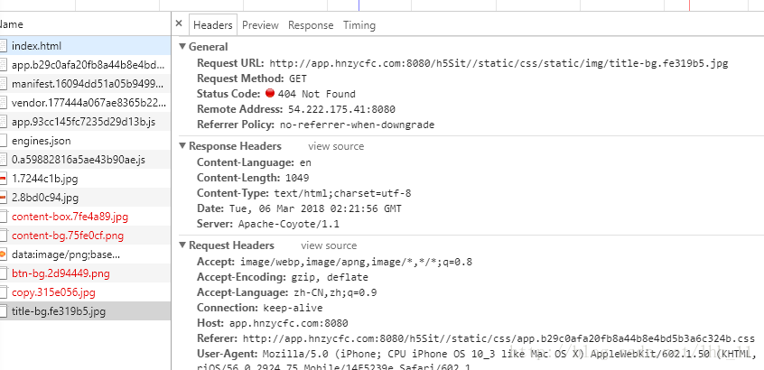
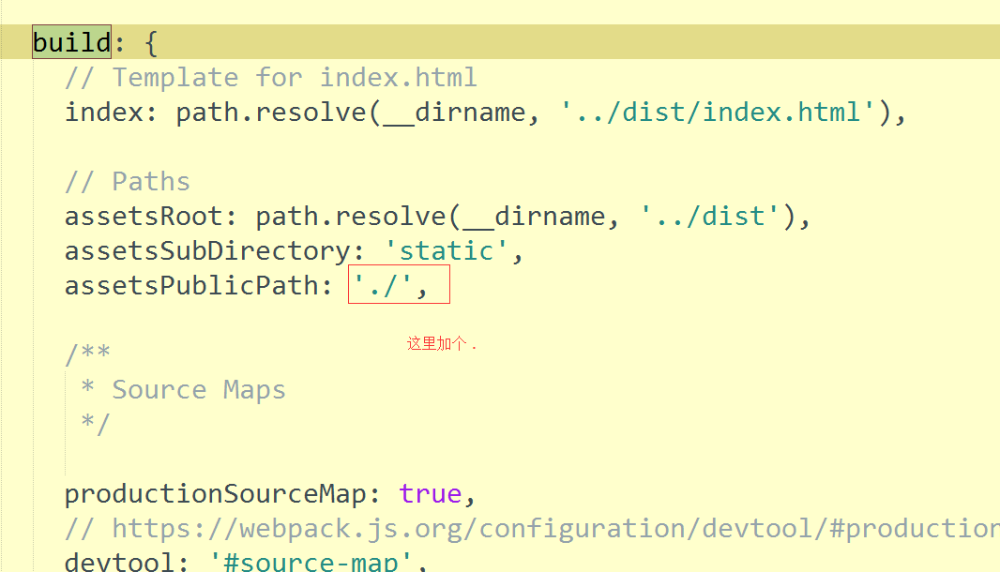
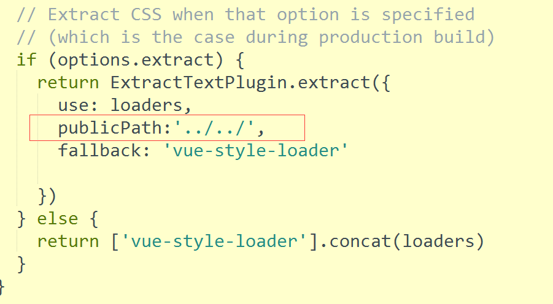
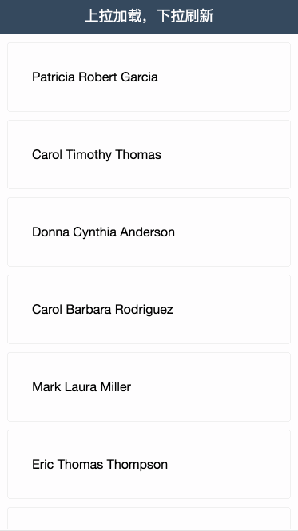
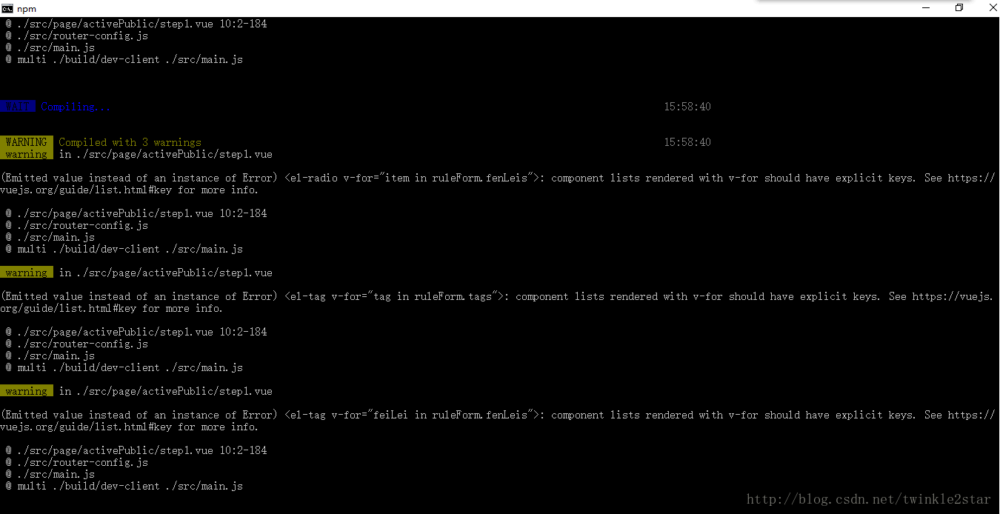

# VUX使用

#### 作者：高天阳
#### 邮箱：13683265113@163.com

```
更改历史

* 2018-10-22        高天阳     补充安装与使用、最佳实践
* 2018-10-15        高天阳     初始化文档

```

## 1 简介

`VUX`（读音`[v’ju:z]`，同`views`）是基于`WeUI`和`Vue`(2.x)开发的移动端UI组件库，主要服务于微信页面。

基于`webpack + vue-loader + vux`可以快速开发移动端页面，配合`vux-loader`方便你在`WeUI`的基础上定制需要的样式。

`vux-loader`保证了组件按需使用，因此不用担心最终打包了整个VUX的组件库代码。

`VUX`并不完全依赖于`WeUI`，`VUX`在`WeUI`的基础上扩展了多个常用组件，但是尽量保持整体UI样式接近`WeUI`的设计规范。

> VUX 并不是一个能解决所有场景的完美解决方案(实际上也没有一个方案能解决所有问题)，也会出现某些`bug`或者某些特性不支持，
所以如果遇到问题麻烦及时不带情绪正确反馈，我们乐于及时解决描述详细方便重现的问题。
> 
> 即使你不直接使用`VUX`组件代码, 你依然可以参考`VUX`代码来实现自己的组件库。如果一定程度上帮助到了你，那么维护这个项目也就有所意义。

#### 提示

> VUX 是库而非框架，虽然有专用的 vux-loader，但并不影响你自由地使用其他组件库或者工具库。
> 
> VUX 使用的 CSS 预处理工具是 less(同 WeUI)，但(利益于 .vue 单文件组件的灵活性)这并不影响你使用 SASS 等其他预处理器。
> 
> 用以表示该组件库时请使用大写名字 VUX，用在说明版本号时使用小写 vux@2.x。

### 在使用VUX之前

> 如果你刚从后端转到前端，可能会被目前前端(表面的)工程复杂度惊吓到，但是放心，使用`vue-cli`从模板创建项目可以快速开始编码、构建，
仅仅是几行简单的命令不是么？

在使用VUX之前需要你至少已经会使用`Vue`，同时需要你大概了解`Node.js`，`npm`，`cnpm`，`yarn`这些东西。

> 建议`Node.js`版本在`7.6.0`以上。

#### 相关工具

------

#### WeUI

VUX样式基于[`WeUI`](https://github.com/Tencent/weui)，但是你不必通过使用VUX来使用`WeUI`。
简单的页面你可以直接引入`WeUI`样式。详细请参考[`WeUI 文档`](https://github.com/Tencent/weui)。

#### Vue

VUX基于`Vue`的组件库，意味着你需要有`Vue`的基础知识。

如果还没有了解过，建议先看看[Vue官方文档](https://cn.vuejs.org/)。

#### Webpack

如果你直接使用`vux2`模板，你可以暂时不用了解。当你需要自定义一些配置时自然就能很快了解了。

[Webpack 文档](https://webpack.js.org/)

#### vue-cli

Vue 官方用于快速创建项目的工具。

```
npm install vue-cli -g
```

或者使用 yarn

```
yarn global add vue-cli
```

[vue-cli 文档](https://github.com/vuejs/vue-cli)

#### vue-loader

webpack loader，用于编译`.vue`文件，官方模板已经帮你配置好。

[vue-loader 文档](https://vue-loader.vuejs.org/)

#### vux-loader

VUX组件库的webpack loader，实现按需加载等功能。它不是替代`vue-loader`而是配合`vue-loader`使用。
如果你使用vux2模板，暂不需要手动使用它。

## 2 安装和使用

### 2.1 安装

> 如果你从没使用过 VUX，请参考 快速入门。
>
> 不推荐使用 umd 方式引用组件，但是如果不得不使用，可以参考 umd 构建

直接安装或者更新：

```
npm install vux --save
```

或者使用`yarn`

```
yarn add vux // 安装
yarn upgrade vux // 更新
```

如果你想直接从Github安装，请指定 `v2` 分支

```
npm install git://github.com/airyland/vux.git#v2
```

如果你是从`0.x`更新，请参考： [更新到2.x](https://doc.vux.li/zh-CN/install/upgrade-to-vux2.html)

> vux2必须配合vux-loader使用, 请在build/webpack.base.conf.js里参照如下代码进行配置：

```
const vuxLoader = require('vux-loader')
const webpackConfig = originalConfig // 原来的 module.exports 代码赋值给变量 webpackConfig

module.exports = vuxLoader.merge(webpackConfig, {
  plugins: ['vux-ui']
})
```

> vux@0.x 已经停止维护，请尽快迁移到 vue@2.x & vuex@2.x & vux@2.x，虽然要花点时间，但是完全值得。

### 2.2 快速开始

> vux@2.x 推荐webpack+vue-loader方式的开发，如果要使用umd文件，请参照文档。
不建议使用引入script的方式进行开发，因为它会带来一系列的开发、维护、效率、部署问题。
> 
> Life is short, use webpack.

#### vux2 模板

------

> vux2 模板 fork 自 webpack 模板，基本和官方同步。

默认为 webpack2 模板

```
npm install vue-cli -g # 如果还没安装
vue init airyland/vux2 projectPath

cd projectPath
npm install --registry=https://registry.npm.taobao.org # 或者 cnpm install 或者  yarn
npm run dev #  或者  yarn dev
```

#### 使用淘宝 npm 镜像

------

**cnpm**

你可以直接使用 cnpm 来加速模块下载。

**yarn**

或者如果你已经用上了 yarn，建议配置淘宝源：

```
yarn config set registry https://registry.npm.taobao.org
yarn
```

### 2.3 手动配置使用

> 注意的是下面事项并非表示 VUX 使用繁琐，部分只是出于确保有正确的依赖和配置，而部分是出于优化。

> 请将`babel-loader`的配置写到`.babelrc`里而不是使用`options`，否则可能会出错。

折腾能力强的同学参考一下，下面即`airyland/vux2`模板主要处理的事项:

* 引入`reset.less`，默认样式不包含reset，并且部分用户自己有一套reset样式，因此需要在`App.vue`进行手动引入

```
<style lang="less">
@import '~vux/src/styles/reset.less';
</style>
```

* 配置`vue-loader`通过配置vux-loader实现）

```
// vux-loader
plugins: [{
  name: 'vux-ui'
}]
```

* 配置`babel-loader`以正确编译 VUX 的js源码（通过配置vux-loader实现）

```vue
plugins: [{
  name: 'vux-ui'
}]
```

* 安装`less-loader`以正确编译less源码

```
npm install less less-loader --save-dev
```

* 安装`yaml-loader`以正确进行语言文件读取

```
npm install yaml-loader --save-dev
```

* 添加`viewport`meta

```
<meta name="viewport" content="width=device-width,initial-scale=1,user-scalable=0">
```

* 添加`Fastclick`移除移动端点击延迟

```
const FastClick = require('fastclick')
FastClick.attach(document.body)
```

* 添加`vue-router`（如果不需要前端路由，可忽略）

```
import VueRouter from 'vue-router'
Vue.use(VueRouter)
```

* 添加 webpack plugin, 在构建后去除重复css代码（通过配置vux-loader实现）

```
plugins: [{
  name: 'duplicate-style'
}]
```

* 如果你使用`webpack-simple`模板或者 webpack 配置里缺少 .vue extension 配置，请记得配置：

```
resolve: {
  extensions: ['.js', '.vue', '.json']
```

### 2.4 代码示例

* .vue文件中调用组件

```
<template>
  <div>
    <group>
      <cell title="title" value="value"></cell>
    </group>
  </div>
</template>

<script>
import { Group, Cell } from 'vux'

export default {
  components: {
    Group,
    Cell
  }
}
</script>
```

* main.js中调用plugin

```
import { AlertPlugin, ToastPlugin } from 'vux'

Vue.use(AlertPlugin)
Vue.use(ToastPlugin)

// 详细使用请参考对应组件文档
```

## 3 定制

### 3.1 主题颜色配置

#### 配置插件

> 暂时只支持配合`vux-loader`使用。
>  
> 注意的是主题文件不能引入其他less文件，只能为简单变量列表。

请配置vux-loader的`less-theme`插件，指定用以覆盖的less文件路径：

```
{
  name: 'less-theme',
  path: 'src/styles/theme.less' // 相对项目根目录路径
}
```

#### 可配置颜色

源码地址：https://github.com/airyland/vux/blob/v2/src/styles/variable.less

> 更多配置需求请通过 issue 提出。

#### demo站点的示例配置

源代码地址：https://github.com/airyland/vux/blob/v2/src/theme.less

#### 内部如何实现的？

`vux-loader`在每个`less`文件的编译过程中重写了`less-loader`的变量参数，使其能直接覆盖原来变量。

## 4 开发

### 4.1 路由

### 4.2 在Nuxt.js中使用

### 4.3 TypeScript 支持

### 4.4 Ajax 请求

### 4.5 点击延迟

### 4.6 使用微信 jssdk
 
### 4.7 添加谷歌统计
 
### 4.8 页面切换显示 Loading

### 4.9 异步加载组件

### 4.10 区分测试环境和生产环境

### 4.11 全局公共函数

### 4.12 autoprefix 配置

### 4.13 禁用 eslint

## 5 vux-loader

### 5.1 vux-loader 是什么？

### 5.2 安装使用

### 5.3 插件列表

## 6 最佳实践

### 6.1 vue-router配置方式

#### 介绍

路由：控制组件之间的跳转，不会实现请求、不用页面刷新，直接跳转-切换组件

#### 安装

本地环境安装路由插件vue-router：

```
cnpm install vue-router --save-dev  
```

* 没有安装淘宝镜像的可以将`cnpm`替换成`npm`

想要安装的可以看这篇[文章](http://www.cnblogs.com/padding1015/p/7162024.html)，（打开搜索`镜像`即可跳转到对应位置）

#### 配置

两种配置方法：在main.js中 || 在src/router文件夹下的index.js中

这里只说在src/router/index.js中的

* 引入

``` 
import Vue from 'vue'
import Router from 'vue-router'
```

注意这个Router是自定义的名字，这里叫这个名字后，下边都要用到的

* 使用/注册：

```
Vue.use(Router)
```

* 配置

配置路由

```
export default new Router({
  routes: [
   {
        path : ‘/’,  //到时候地址栏会显示的路径
        name : ‘Home’,
        component :  Home   // Home是组件的名字，这个路由对应跳转到的组件。。注意component没有加“s”.
    },
    {
        path : ‘/content’,
        name : ‘Content’,
        component :  Content
    }
],
    mode: "history"
})
```

* 引入路由对应的组件地址

``` 
import Home from '@/components/Home'
import Home from '@/components/Content’
```

* 在main.js中调用index.js的配置

```
import router from './router'
```

* App.vue页面使用（展示）路由：<!-- 展示router -->

把这个标签放到对应位置

```
<router-view></router-view>
```

* 路由切换（原来的<a href=”XXX.html”>等地方）：把切换标签和链接改成

```
<router-link  to="/">切换到Home组件</router-link>
<router-link  to="/content">切换到Content组件</router-link>
```

> 这里，to里边的参数和配置时，path的路径一样即可

#### 示例

`/src/main.js`

```
import Vue from 'vue'
import App from './App'
import router from 'vue-router'

/* eslint-disable no-new */
new Vue({
  router,
  render: h => h(App)
}).$mount('#app-box')
```

`/src/router/index.js`

```
import Vue from 'vue'
import Router from 'vue-router'
import Container from '../components/container/Container'
import Start from '../components/start/Start'
import Gesture from '../components/start/gesture/Gesture'
import Registered from '../components/start/registered/Registered'
import RegisteredDetail from '../components/start/registered/RegisteredDetail'
import Lending from '../components/lending/Lending'
import FinanceDetail from '../components/lending/financeDetail/FinanceDetail'

Vue.use(Router)

export default new Router({
  routes: [
    {
      path: '/',
      redirect: '/start'
    },
    {
      path: '/start',
      component: Container,
      children: [
        {
          path: '/',
          component: Start
        },
        {
          path: 'gesture',
          component: Gesture
        },
        {
          path: 'registered',
          component: Container,
          children: [
            {
              path: '/',
              component: Registered
            },
            {
              path: 'registeredDetail',
              component: RegisteredDetail
            }
          ]
        }
      ]
    },
    {
      path: '/lending',
      component: Container,
      children: [
        {
          path: '/',
          component: Lending
        },
        {
          path: 'financeDetail',
          name: 'financeDetail',
          component: FinanceDetail
        }
      ]
    },
  ]
})
```

### 6.2 VUX tabber切换图标及字体颜色

通过path判断当前页面，并切换选中tabbar，如果tabbar不多，使用组件一般方式即可(即在每个子模块引入tabbar并写好默认选中项)

`/src/App.vue`

```
<!-- 入口文件 -->
<template>
  <div id="app">
    <!-- 视图层 -->
    <router-view></router-view>
    <div class="footer-box" v-if="$route.path === '/events' || $route.path === '/lending' || $route.path === '/user'">
      <!-- 底部选项卡 -->
      <tabbar class="footer-fixed">
        <tabbar-item link="/lending" :selected="$route.path === '/lending'">
          
          
          <span slot="label">首页</span>
        </tabbar-item>
        <tabbar-item link="/events" :selected="$route.path === '/events'">
          
          
          <span slot="label">活动</span>
        </tabbar-item>
        <tabbar-item link="/user" :selected="$route.path === '/user'">
          
          
          <span slot="label">我的</span>
        </tabbar-item>
      </tabbar>
    </div>
  </div>
</template>

<script>
  // 引入 vux tabbar 组件
  import { Tabbar, TabbarItem, XHeader } from 'vux'
  export default {
    name: 'app',
    components: {
      Tabbar,
      TabbarItem,
      XHeader
    }
  }
</script>

<style src="./assets/style/main.less"></style>
<style lang="less">
  @import '~vux/src/styles/reset.less';
</style>
```

### 6.3 报错处理:Failed to load resource: net::ERR_FILE_NOT_FOUND

> Failed to load resource: net::ERR_FILE_NOT_FOUND或者vue dist文件下的index.html没显示

```
vue-cli  npm run dev 可以看到，但是通过dist文件下的index.html直接打开没显示，没看到  

知乎上：webpack.prod.conf.js 中output添加参数publicPath:'./'

具体：

在webpack.base.conf.js里

publicPath: process.env.NODE_ENV === 'production'
     ? './' +config.build.assetsPublicPath
     : './' + config.dev.assetsPublicPath
```

#### vue的图片路径，和背景图片路径打包后错误解决




* 找到 config->index.js里面，如下修改



* 找到 build->utils.js,在里面加入一句publicPath:’../../’



配置修改完成，接下来，使用有两种方式，这里一般和文件结构有关，下面是我的文件结构下的使用

1、图片资源放在 assets->img文件夹下面

img标签引入图片

```

```

css使用图片

```
background: url('../assets/img/loginback.png') no-repeat top left ;
```

2、图片资源放在static->img文件夹下面

img标签引入图片

```
<br>
```

css使用图片

```
background: url('../../static/img/loginback.png') no-repeat top left ;
```

### 6.4 x-header、tabbar固定位置

```
<template>
  <div id="app">
    <router-view></router-view>
    <div class="footer-box" v-if="$route.path === '/events' || $route.path === '/lending' || $route.path === '/user'">
      <tabbar class="footer-fixed">
        <tabbar-item link="/lending" :selected="$route.path === '/lending'">
          
          
          <span slot="label">首页</span>
        </tabbar-item>
        <tabbar-item link="/events" :selected="$route.path === '/events'">
          
          
          <span slot="label">活动</span>
        </tabbar-item>
        <tabbar-item link="/user" :selected="$route.path === '/user'">
          
          
          <span slot="label">我的</span>
        </tabbar-item>
      </tabbar>
    </div>
  </div>
</template>

<script>
  import { Tabbar, TabbarItem, XHeader } from 'vux'
  export default {
    name: 'app',
    components: {
      Tabbar,
      TabbarItem,
      XHeader
    }
  }
</script>

<style src="./assets/style/main.less"></style>
<style lang="less">
  @import '~vux/src/styles/reset.less';
</style>
```

此处组件fix失效是因为在app.vue引用tabbar导致的，若在子页面分别引用不会影响固定效果

处理方案:

添加class 固定于页面底部

`../src/assets/style/main.less`

```
.header-fixed{
  position: fixed;
  top: 0;
  z-index: 500;
  width: 100%;
}
#app .footer-fixed{
  position: fixed;
  bottom: 0;
}
.header-box{
  padding-top: 46px;
}
.footer-box{
  padding-bottom: 53px;
}
```

### 6.5 下拉加载更多

先上效果图



* 创建项目

使用vue-cli 创建一个vue项目

安装vux，可以参考：[vux快速入门](https://doc.vux.li/zh-CN/install/biolerplate.html)

* 配置

官方文档中声明，该组件已经不再维护，也不建议使用，大部分情况下也不需要用到该组件。
建议使用第三方相关组件，相关 issue 将不会处理。不知道作者为啥不维护了，明明需求挺多的
        
我没有用demo里的 LoadMore 组件，用的是 Scroller里自带的 use-pullup, use-pulldown 下面是我的配置

代码示例:

```
<template>
  <div>
    <scroller use-pullup :pullup-config="pullupDefaultConfig" @on-pullup-loading="loadMore"
              use-pulldown :pulldown-config="pulldownDefaultConfig" @on-pulldown-loading="refresh"
              lock-x ref="scrollerBottom" height="-48">
      <div>
        <group label-width="4.5em" label-margin-right="2em" label-align="right" v-for="item in list" :key="item.key">
          <panel :list="item.panel" :type="item.type" @on-img-error="onImgError" @click.native="goto(item)"></panel>
          <x-progress :percent="item.progress" :show-cancel="false"></x-progress>
        </group>
      </div>
    </scroller>
  </div>
</template>
```

```
<script>
  import axios from 'axios'
  import _ from 'lodash'
  import { Group, Panel, XProgress, Scroller } from 'vux'

  const pulldownDefaultConfig = {
    content: '下拉刷新',
    height: 40,
    autoRefresh: true,
    downContent: '下拉刷新',
    upContent: '释放后刷新',
    loadingContent: '正在刷新...',
    clsPrefix: 'xs-plugin-pulldown-'
  }
  const pullupDefaultConfig = {
    content: '上拉加载更多',
    pullUpHeight: 60,
    height: 40,
    autoRefresh: false,
    downContent: '释放后加载',
    upContent: '上拉加载更多',
    loadingContent: '加载中...',
    clsPrefix: 'xs-plugin-pullup-'
  }

  export default {
    name: 'Lending',
    components: {
      Group,
      Panel,
      XProgress,
      Scroller
    },
    data () {
      return {
        list: [],
        curPage: 1,
        swiper_index: 1,
        pullupDefaultConfig: pullupDefaultConfig,
        pulldownDefaultConfig: pulldownDefaultConfig
      }
    },
    methods: {
      swiper_onIndexChange (index) {
        this.swiper_index = index
      },
      onImgError (item, $event) {
        console.log(item, $event)
      },
      /**
       * 刷新页面
       */
      refresh () {
        console.log('refresh')
      },
      /**
       * 加载更多列表
       */
      loadMore () {
        var self = this
        console.log('加载更多')
        self.$refs.scrollerBottom.donePullup()
        self.curPage++
        self.getList()
      },
      /**
       * 获取列表
       */
      getList () {
        var self = this
        axios.get(process.env.BASE_API + '/financeJson.do', {params: { 'curPage': self.curPage }})
          .then(function (res) {
            _.each(res.data, function (v, k) {
              var item = {
                data: v,
                key: v.id,
                type: '4',
                progress: parseInt(v.progress),
                panel: [
                  {
                    title: v.borrowTitle,
                    desc: '融资额度:' + v.borrowAmount + ' 期限：' + v.deadline,
                    meta: {
                      source: '年利率',
                      date: '7% + ' + (parseInt(v.annualRate) - 7) + '%',
                      other: '完成比例： ' + parseInt(v.progress) + '%'
                    }
                  }
                ]
              }
              self.list.push(item)
            })
          })
          .catch(function (error) {
            console.log(error)
          })
      },
      goto (item) {
        var self = this
        self.$router.push({name: 'financeDetail', params: {data: item}})
      }
    },
    created () {
      var self = this
      self.getList()
    }
  }
</script>
```

### 6.6 警告处理:warning：component lists rendered with v-for should have explicit keys

> 命令行warning(Emitted value instead of an instance of Error)。
component lists rendered with v-for should have explicit keys。
See https://vuejs.org/guide/list.html#key for more info. 

截图如下:



这里只是推荐使用key. 
原本的代码如下：

```
<el-tag
    v-for = "feiLei of ruleForm.fenLeis"          
    :closable = "true"
    type = "primary"
    @close = "handleCloseFenLei(feiLei)">{{feiLei.name}}
</el-tag>
```

运行时显示warning，添加：key即可，如下：

```
<el-tag
    v-for = "feiLei of ruleForm.fenLeis"
    :key="feiLei1"        
    :closable = "true"
    type = "primary"
    @close = "handleCloseFenLei(feiLei)">{{feiLei.name}}
</el-tag>
```

这样就不会报错啦，具体看文档，key不是必须的，仅仅是warning

### 6.7 Vue下路由History模式打包后页面空白

### 6.8 scroller下拉失败回弹

### 6.9 打包后css引用图片资源找不到

### 6.10 打包后js引用图片资源找不到

### 6.11 上传图片组件

### 6.12 上传图片组件引入报错

### 6.13 报错处理：exports is not defined

### 6.14 报错处理：Default export is not declared in imported module

### 6.15 vux中fullpage的使用

### 6.16 Vue Router 的params和query传参的使用和区别

### 6.17 vux框架组件自定义样式

### 6.18 vux-cell title 插槽使用

### 6.19 vux-cell title 插槽可添加样式并使得超长文字隐藏

### 6.20 复制至剪贴板插件

### 6.21 vue-cookies使用

### 6.22 级联选择器使用

## 7 同类型技术比较

## 参考资料

* [router配置位置](https://www.cnblogs.com/padding1015/p/7884861.html)
* [tabber切换图标及颜色](https://blog.csdn.net/wandoumm/article/details/80168445)
* [打包报错处理：Failed to load resource: net::ERR_FILE_NOT_FOUND](https://blog.csdn.net/lhb_11/article/details/79455015)
* [x-header、tabbar固定位置](https://github.com/airyland/vux/issues/285)
* [下拉加载更多](https://www.jb51.net/article/132455.htm)
* [警告处理：warning：component lists rendered with v-for should have explicit keys](https://blog.csdn.net/twinkle2star/article/details/73741120)
* [Vue下路由History模式打包后页面空白](https://blog.csdn.net/sky2714/article/details/80887081)
* [scroller下拉失败回弹](https://blog.csdn.net/hh_liweihong/article/details/77066023)
* [打包后css引用图片资源找不到](https://blog.csdn.net/gdut_luoyifei/article/details/79001397)
* [打包后js引用图片资源找不到](https://blog.csdn.net/github_37533433/article/details/78937645)
* [上传图片组件](https://www.npmjs.com/package/vux-uploader)
* [上传图片组件引入报错](https://blog.csdn.net/wandoumm/article/details/80167708)
* [报错处理：exports is not defined](https://segmentfault.com/q/1010000011817644/a-1020000011818193)
* [报错处理：Default export is not declared in imported module](https://segmentfault.com/q/1010000004664827)
* 上一个问题可参考yumaomoney_WeChat/src/components/container/Container.vue，export default为必要内容。
* [vux中fullpage的使用](https://www.jb51.net/article/108893.htm)
* VChart异步加载表格数据时，tooltip在初始化、请求后需要渲染两次，否则无法加载具体比例。
* [Vue Router 的params和query传参的使用和区别](https://blog.csdn.net/mf_717714/article/details/81945218)
* [vux框架组件自定义样式](https://blog.csdn.net/linggty/article/details/81512211)
* [vux cell title 插槽使用](https://segmentfault.com/q/1010000014234606/a-1020000014653614)
* vux cell title插槽可添加样式并使得超长文字隐藏。demo在：Message.vue
* [复制至剪贴板插件](https://www.cnblogs.com/wyhlightstar/p/8950430.html)
* [vue-cookies](https://www.cnblogs.com/s313139232/p/9341762.html)
* [级联选择器](https://blog.csdn.net/oulihong123/article/details/58327247/)
