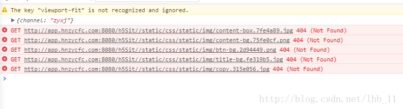

# VUX使用

#### 作者：高天阳
#### 邮箱：13683265113@163.com

```
更改历史

* 2018-10-30        高天阳     补充最佳实践
* 2018-10-29        高天阳     整理文档、补充最佳实践
* 2018-10-22        高天阳     补充安装与使用、最佳实践
* 2018-10-15        高天阳     初始化文档

```

## 1 简介

`VUX`（读音`[v’ju:z]`，同`views`）是基于`WeUI`和`Vue`(2.x)开发的移动端UI组件库，主要服务于微信页面。

基于`webpack + vue-loader + vux`可以快速开发移动端页面，配合`vux-loader`方便你在`WeUI`的基础上定制需要的样式。

`vux-loader`保证了组件按需使用，因此不用担心最终打包了整个VUX的组件库代码。

`VUX`并不完全依赖于`WeUI`，`VUX`在`WeUI`的基础上扩展了多个常用组件，但是尽量保持整体UI样式接近`WeUI`的设计规范。

> VUX 并不是一个能解决所有场景的完美解决方案(实际上也没有一个方案能解决所有问题)，也会出现某些`bug`或者某些特性不支持，
所以如果遇到问题麻烦及时不带情绪正确反馈，我们乐于及时解决描述详细方便重现的问题。
> 
> 即使你不直接使用`VUX`组件代码, 你依然可以参考`VUX`代码来实现自己的组件库。如果一定程度上帮助到了你，那么维护这个项目也就有所意义。

#### 提示

> VUX 是库而非框架，虽然有专用的 vux-loader，但并不影响你自由地使用其他组件库或者工具库。
> 
> VUX 使用的 CSS 预处理工具是 less(同 WeUI)，但(利益于 .vue 单文件组件的灵活性)这并不影响你使用 SASS 等其他预处理器。
> 
> 用以表示该组件库时请使用大写名字 VUX，用在说明版本号时使用小写 vux@2.x。

### 在使用VUX之前

> 如果你刚从后端转到前端，可能会被目前前端(表面的)工程复杂度惊吓到，但是放心，使用`vue-cli`从模板创建项目可以快速开始编码、构建，
仅仅是几行简单的命令不是么？

在使用VUX之前需要你至少已经会使用`Vue`，同时需要你大概了解`Node.js`，`npm`，`cnpm`，`yarn`这些东西。

> 建议`Node.js`版本在`7.6.0`以上。

#### 相关工具

------

#### WeUI

VUX样式基于[`WeUI`](https://github.com/Tencent/weui)，但是你不必通过使用VUX来使用`WeUI`。
简单的页面你可以直接引入`WeUI`样式。详细请参考[`WeUI 文档`](https://github.com/Tencent/weui)。

#### Vue

VUX基于`Vue`的组件库，意味着你需要有`Vue`的基础知识。

如果还没有了解过，建议先看看[Vue官方文档](https://cn.vuejs.org/)。

#### Webpack

如果你直接使用`vux2`模板，你可以暂时不用了解。当你需要自定义一些配置时自然就能很快了解了。

[Webpack 文档](https://webpack.js.org/)

#### vue-cli

Vue 官方用于快速创建项目的工具。

```
npm install vue-cli -g
```

或者使用 yarn

```
yarn global add vue-cli
```

[vue-cli 文档](https://github.com/vuejs/vue-cli)

#### vue-loader

webpack loader，用于编译`.vue`文件，官方模板已经帮你配置好。

[vue-loader 文档](https://vue-loader.vuejs.org/)

#### vux-loader

VUX组件库的webpack loader，实现按需加载等功能。它不是替代`vue-loader`而是配合`vue-loader`使用。
如果你使用vux2模板，暂不需要手动使用它。

## 2 安装和使用

### 2.1 安装

> 如果你从没使用过 VUX，请参考 快速入门。
>
> 不推荐使用 umd 方式引用组件，但是如果不得不使用，可以参考 umd 构建

直接安装或者更新：

```
npm install vux --save
```

或者使用`yarn`

```
yarn add vux // 安装
yarn upgrade vux // 更新
```

如果你想直接从Github安装，请指定 `v2` 分支

```
npm install git://github.com/airyland/vux.git#v2
```

如果你是从`0.x`更新，请参考： [更新到2.x](https://doc.vux.li/zh-CN/install/upgrade-to-vux2.html)

> vux2必须配合vux-loader使用, 请在build/webpack.base.conf.js里参照如下代码进行配置：

```
const vuxLoader = require('vux-loader')
const webpackConfig = originalConfig // 原来的 module.exports 代码赋值给变量 webpackConfig

module.exports = vuxLoader.merge(webpackConfig, {
  plugins: ['vux-ui']
})
```

> vux@0.x 已经停止维护，请尽快迁移到 vue@2.x & vuex@2.x & vux@2.x，虽然要花点时间，但是完全值得。

### 2.2 快速开始

> vux@2.x 推荐webpack+vue-loader方式的开发，如果要使用umd文件，请参照文档。
不建议使用引入script的方式进行开发，因为它会带来一系列的开发、维护、效率、部署问题。
> 
> Life is short, use webpack.

#### vux2 模板

------

> vux2 模板 fork 自 webpack 模板，基本和官方同步。

默认为 webpack2 模板

```
npm install vue-cli -g # 如果还没安装
vue init airyland/vux2 projectPath

cd projectPath
npm install --registry=https://registry.npm.taobao.org # 或者 cnpm install 或者  yarn
npm run dev #  或者  yarn dev
```

#### 使用淘宝 npm 镜像

------

**cnpm**

你可以直接使用 cnpm 来加速模块下载。

**yarn**

或者如果你已经用上了 yarn，建议配置淘宝源：

```
yarn config set registry https://registry.npm.taobao.org
yarn
```

### 2.3 手动配置使用

> 注意的是下面事项并非表示 VUX 使用繁琐，部分只是出于确保有正确的依赖和配置，而部分是出于优化。

> 请将`babel-loader`的配置写到`.babelrc`里而不是使用`options`，否则可能会出错。

折腾能力强的同学参考一下，下面即`airyland/vux2`模板主要处理的事项:

* 引入`reset.less`，默认样式不包含reset，并且部分用户自己有一套reset样式，因此需要在`App.vue`进行手动引入

```
<style lang="less">
@import '~vux/src/styles/reset.less';
</style>
```

* 配置`vue-loader`通过配置vux-loader实现）

```
// vux-loader
plugins: [{
  name: 'vux-ui'
}]
```

* 配置`babel-loader`以正确编译 VUX 的js源码（通过配置vux-loader实现）

```
plugins: [{
  name: 'vux-ui'
}]
```

* 安装`less-loader`以正确编译less源码

```
npm install less less-loader --save-dev
```

* 安装`yaml-loader`以正确进行语言文件读取

```
npm install yaml-loader --save-dev
```

* 添加`viewport`meta

```
<meta name="viewport" content="width=device-width,initial-scale=1,user-scalable=0">
```

* 添加`Fastclick`移除移动端点击延迟

```
const FastClick = require('fastclick')
FastClick.attach(document.body)
```

* 添加`vue-router`（如果不需要前端路由，可忽略）

```
import VueRouter from 'vue-router'
Vue.use(VueRouter)
```

* 添加 webpack plugin, 在构建后去除重复css代码（通过配置vux-loader实现）

```
plugins: [{
  name: 'duplicate-style'
}]
```

* 如果你使用`webpack-simple`模板或者 webpack 配置里缺少 .vue extension 配置，请记得配置：

```
resolve: {
  extensions: ['.js', '.vue', '.json']
```

### 2.4 代码示例

* .vue文件中调用组件

```
<template>
  <div>
    <group>
      <cell title="title" value="value"></cell>
    </group>
  </div>
</template>

<script>
import { Group, Cell } from 'vux'

export default {
  components: {
    Group,
    Cell
  }
}
</script>
```

* main.js中调用plugin

```
import { AlertPlugin, ToastPlugin } from 'vux'

Vue.use(AlertPlugin)
Vue.use(ToastPlugin)

// 详细使用请参考对应组件文档
```

## 3 定制

### 3.1 主题颜色配置

#### 配置插件

> 暂时只支持配合`vux-loader`使用。
>  
> 注意的是主题文件不能引入其他less文件，只能为简单变量列表。

请配置vux-loader的`less-theme`插件，指定用以覆盖的less文件路径：

```
{
  name: 'less-theme',
  path: 'src/styles/theme.less' // 相对项目根目录路径
}
```

#### 可配置颜色

源码地址：https://github.com/airyland/vux/blob/v2/src/styles/variable.less

> 更多配置需求请通过 issue 提出。

#### demo站点的示例配置

源代码地址：https://github.com/airyland/vux/blob/v2/src/theme.less

#### 内部如何实现的？

`vux-loader`在每个`less`文件的编译过程中重写了`less-loader`的变量参数，使其能直接覆盖原来变量。

## 4 开发

### 4.1 路由

推荐直接使用官方[`vue-router`](https://github.com/vuejs/vue-router)，
VUX部分组件支持`link`属性直接支持`vue-router`的路由参数，`vux2`模板内置了`vue-router`。

> ~~如果使用了过渡(转场动画)，在`iPhone`上使用`左划返回`时动画会再执行一遍，目前没有找到可行的处理方法，如果你有处理方案，欢迎`PR`。~~
> https://github.com/airyland/vux/pull/2259

### 4.2 在Nuxt.js中使用

请直接参考源码目录[/ssr/nuxt](https://github.com/airyland/vux/tree/v2/ssr/nuxt)

### 4.3 TypeScript 支持

> 即将支持

### 4.4 Ajax 请求

> `AjaxPlugin` 插件依赖于 [axios](https://github.com/axios/axios)
> 详细 API 文档请查看：[axios](https://github.com/axios/axios)

#### 版本要求

`AjaxPlugin`在`vux@^2.1.0-rc.20`开始支持

#### 引入

`main.js`入口文件中引入：

```
import { AjaxPlugin } from 'vux'
Vue.use(AjaxPlugin)
```

#### 兼容性问题

需要注意的是`axios`是基于`Promise`的，因此如果你需要兼容低版本浏览器([caniuse](https://caniuse.com/#feat=promises))，需要引入`polyfill`。

`Polyfill`推荐使用 [es6-promise](https://github.com/stefanpenner/es6-promise)

```
require('es6-promise').polyfill()
```

#### 全局使用

```
Vue.http.post('/api').then()
```

#### 组件中使用

```
export default {
  created () {
    this.$http.post('/api').then(({data}) => {
      console.log(data)
    })
  }
}
```

### 4.5 点击延迟

> 直接使用`WeUI`样式并引入`fastclick`会导致一些点击问题，VUX组件内部已经做了相关处理。

#### 引入 fastclick

在`main.js`里引用`fastclick`

```
const FastClick = require('fastclick')
FastClick.attach(document.body)
// done
```

### 4.6 使用微信 jssdk

> 分享接口只有认证公众号才能使用，域名必须备案且在微信后台设置。
> 先确认已经满足使用`jssdk`的要求再进行开发。

`WechatPlugin`插件提供了`commonJS`的引入方式，因此你不需要在`index.html`引入文件。
 
#### 版本要求

`WechatPlugin`在`vux@^2.1.0-rc.19`开始支持

#### 引入

在`main.js`中全局引入：

```
import { WechatPlugin } from 'vux'
Vue.use(WechatPlugin)

console.log(Vue.wechat) // 可以直接访问 wx 对象。
```

#### 组件外使用

考虑到你需要在引入插件后调用`config`方法进行配置，你可以通过`Vue.wechat`在组件外部访问`wx`对象。

`jssdk`需要请求签名配置接口，你可以直接使用 VUX 基于`Axios`封装的`AjaxPlugin`。

```
import { WechatPlugin, AjaxPlugin } from 'vux'
Vue.use(WechatPlugin)
Vue.use(AjaxPlugin)

Vue.http.get('/api', ({data}) => {
  Vue.wechat.config(data.data)
})
```

#### 组件中使用

那么之后任何组件中都可以通过`this.$wechat`访问到`wx`对象。

```
export default {
  created () {
    this.$wechat.onMenuShareTimeline({
      title: 'hello VUX'
    })
  }
}
```

### 4.7 添加谷歌统计

单页面应用切换时要手动发送页面统计，首先在`index.html`或者`main.js`里引入谷歌统计代码：

```
(function(i,s,o,g,r,a,m){i['GoogleAnalyticsObject']=r;i[r]=i[r]||function(){
(i[r].q=i[r].q||[]).push(arguments)},i[r].l=1*new Date();a=s.createElement(o),
m=s.getElementsByTagName(o)[0];a.async=1;a.src=g;m.parentNode.insertBefore(a,m)
})(window,document,'script','https://www.google-analytics.com/analytics.js','ga');

ga('create', 'UA-yourID', 'auto')
ga('send', 'pageview') // 是否要统计着陆页面访问，取决于你的需求，这个不一定需要，会和`router`统计有重复
```

```
// main.js 里，如果你使用了 vue-router
router.afterEach(function (to) {
  if (window.ga) {
    window.ga('set', 'page', to.fullPath) // 你可能想根据请求参数添加其他参数，可以修改这里的 to.fullPath
    window.ga('send', 'pageview')
  }
})
```

### 4.8 页面切换显示 Loading

移动端如果使用异步组件加载那么还是需要一点等待时间的，在网络慢时等待时间会更长。显示`Loading`状态缓解一下用户等待情绪就十分重要。

如果你使用`vue-router`和`vuex`，那么可以很容易实现。

首先，注册一个`module`来保存状态

```
const store = new Vuex.Store({}) // 这里你可能已经有其他 module

store.registerModule('vux', { // 名字自己定义
  state: {
    isLoading: false
  },
  mutations: {
    updateLoadingStatus (state, payload) {
      state.isLoading = payload.isLoading
    }
  }
})
```

然后使用`vue-router`的`beforeEach`和`afterEach`来更改`loading`状态


```
router.beforeEach(function (to, from, next) {
  store.commit('updateLoadingStatus', {isLoading: true})
  next()
})

router.afterEach(function (to) {
  store.commit('updateLoadingStatus', {isLoading: false})
})
```

在`App.vue`里使用`loading`组件并从`vuex`获取`isLoading`状态

```
<loading v-model="isLoading"></loading>
```

```
import { Loading } from 'vux'
import { mapState } from 'vuex'

export default {
  components: {
    Loading
  },
  computed: {
    ...mapState({
      isLoading: state => state.vux.isLoading
    })
  }
}
```

done.

如果你觉得在加载比较快时`Loading`组件一闪而过体验也不大好，那么你可以延迟设置`loading=false`。

### 4.9 异步加载组件

将所有页面组件一次性加载是一个很浪费资源和考验用户耐心的做法，尤其在移动端。

#### 使用方法

`webpack`提供了`code splitting`，你可以按照下面写法实现当切换到特定路由时才加载代码。

需要注意的是`vue-loader@13.0.0`语法有所变更，具体参照发布说明`v13.0.0`

```
// vue-loader@13.0.0 之前
const Foo = () => import('./Foo.vue') // 在 Vue 2.4 + vue-router 2.7 版本下可以正确运行

// vue-loader@13.0.0
const Foo = () => import('./Foo.vue').then(m => m.default)
```

#### 组件打包问题

如果你在不同的进行了代码分割的 .vue 文件引入了相同的组件，在打包时两个路由的代码都会重复打包该组件。

你可以对重复使用的组件在`main.js`进行全局注册，以减少相应 chunk file 的大小并提高下载速度。

### 4.10 区分测试环境和生产环境

### 4.11 全局公共函数

### 4.12 autoprefix 配置

### 4.13 禁用 eslint

## 5 vux-loader

### 5.1 vux-loader 是什么？

### 5.2 安装使用

### 5.3 插件列表

## 6 最佳实践

### 6.1 常见问题及处理

#### 6.1.1 VUX tabber切换图标及字体颜色

通过path判断当前页面，并切换选中tabbar，如果tabbar不多，使用组件一般方式即可(即在每个子模块引入tabbar并写好默认选中项)

`/src/App.vue`

```
<!-- 入口文件 -->
<template>
  <div id="app">
    <!-- 视图层 -->
    <router-view></router-view>
    <div class="footer-box" v-if="$route.path === '/events' || $route.path === '/lending' || $route.path === '/user'">
      <!-- 底部选项卡 -->
      <tabbar class="footer-fixed">
        <tabbar-item link="/lending" :selected="$route.path === '/lending'">
          
          
          <span slot="label">首页</span>
        </tabbar-item>
        <tabbar-item link="/events" :selected="$route.path === '/events'">
          
          
          <span slot="label">活动</span>
        </tabbar-item>
        <tabbar-item link="/user" :selected="$route.path === '/user'">
          
          
          <span slot="label">我的</span>
        </tabbar-item>
      </tabbar>
    </div>
  </div>
</template>

<script>
  // 引入 vux tabbar 组件
  import { Tabbar, TabbarItem, XHeader } from 'vux'
  export default {
    name: 'app',
    components: {
      Tabbar,
      TabbarItem,
      XHeader
    }
  }
</script>

<style src="./assets/style/main.less"></style>
<style lang="less">
  @import '~vux/src/styles/reset.less';
</style>
```

#### 6.1.2 x-header、tabbar固定位置

```
<template>
  <div id="app">
    <router-view></router-view>
    <div class="footer-box" v-if="$route.path === '/events' || $route.path === '/lending' || $route.path === '/user'">
      <tabbar class="footer-fixed">
        <tabbar-item link="/lending" :selected="$route.path === '/lending'">
          
          
          <span slot="label">首页</span>
        </tabbar-item>
        <tabbar-item link="/events" :selected="$route.path === '/events'">
          
          
          <span slot="label">活动</span>
        </tabbar-item>
        <tabbar-item link="/user" :selected="$route.path === '/user'">
          
          
          <span slot="label">我的</span>
        </tabbar-item>
      </tabbar>
    </div>
  </div>
</template>

<script>
  import { Tabbar, TabbarItem, XHeader } from 'vux'
  export default {
    name: 'app',
    components: {
      Tabbar,
      TabbarItem,
      XHeader
    }
  }
</script>

<style src="./assets/style/main.less"></style>
<style lang="less">
  @import '~vux/src/styles/reset.less';
</style>
```

此处组件fix失效是因为在app.vue引用tabbar导致的，若在子页面分别引用不会影响固定效果

处理方案:

添加class 固定于页面底部

`../src/assets/style/main.less`

```
.header-fixed{
  position: fixed;
  top: 0;
  z-index: 500;
  width: 100%;
}
#app .footer-fixed{
  position: fixed;
  bottom: 0;
}
.header-box{
  padding-top: 46px;
}
.footer-box{
  padding-bottom: 53px;
}
```

#### 6.1.3 下拉加载更多

先上效果图


* 创建项目

使用vue-cli 创建一个vue项目

安装vux，可以参考：[vux快速入门](https://doc.vux.li/zh-CN/install/biolerplate.html)

* 配置

官方文档中声明，该组件已经不再维护，也不建议使用，大部分情况下也不需要用到该组件。
建议使用第三方相关组件，相关 issue 将不会处理。不知道作者为啥不维护了，明明需求挺多的
        
我没有用demo里的 LoadMore 组件，用的是 Scroller里自带的 use-pullup, use-pulldown 下面是我的配置

代码示例:

```
<template>
  <div>
    <scroller use-pullup :pullup-config="pullupDefaultConfig" @on-pullup-loading="loadMore"
              use-pulldown :pulldown-config="pulldownDefaultConfig" @on-pulldown-loading="refresh"
              lock-x ref="scrollerBottom" height="-48">
      <div>
        <group label-width="4.5em" label-margin-right="2em" label-align="right" v-for="item in list" :key="item.key">
          <panel :list="item.panel" :type="item.type" @on-img-error="onImgError" @click.native="goto(item)"></panel>
          <x-progress :percent="item.progress" :show-cancel="false"></x-progress>
        </group>
      </div>
    </scroller>
  </div>
</template>
```

```
<script>
  import axios from 'axios'
  import _ from 'lodash'
  import { Group, Panel, XProgress, Scroller } from 'vux'

  const pulldownDefaultConfig = {
    content: '下拉刷新',
    height: 40,
    autoRefresh: true,
    downContent: '下拉刷新',
    upContent: '释放后刷新',
    loadingContent: '正在刷新...',
    clsPrefix: 'xs-plugin-pulldown-'
  }
  const pullupDefaultConfig = {
    content: '上拉加载更多',
    pullUpHeight: 60,
    height: 40,
    autoRefresh: false,
    downContent: '释放后加载',
    upContent: '上拉加载更多',
    loadingContent: '加载中...',
    clsPrefix: 'xs-plugin-pullup-'
  }

  export default {
    name: 'Lending',
    components: {
      Group,
      Panel,
      XProgress,
      Scroller
    },
    data () {
      return {
        list: [],
        curPage: 1,
        swiper_index: 1,
        pullupDefaultConfig: pullupDefaultConfig,
        pulldownDefaultConfig: pulldownDefaultConfig
      }
    },
    methods: {
      swiper_onIndexChange (index) {
        this.swiper_index = index
      },
      onImgError (item, $event) {
        console.log(item, $event)
      },
      /**
       * 刷新页面
       */
      refresh () {
        console.log('refresh')
      },
      /**
       * 加载更多列表
       */
      loadMore () {
        var self = this
        console.log('加载更多')
        self.$refs.scrollerBottom.donePullup()
        self.curPage++
        self.getList()
      },
      /**
       * 获取列表
       */
      getList () {
        var self = this
        axios.get(process.env.BASE_API + '/financeJson.do', {params: { 'curPage': self.curPage }})
          .then(function (res) {
            _.each(res.data, function (v, k) {
              var item = {
                data: v,
                key: v.id,
                type: '4',
                progress: parseInt(v.progress),
                panel: [
                  {
                    title: v.borrowTitle,
                    desc: '融资额度:' + v.borrowAmount + ' 期限：' + v.deadline,
                    meta: {
                      source: '年利率',
                      date: '7% + ' + (parseInt(v.annualRate) - 7) + '%',
                      other: '完成比例： ' + parseInt(v.progress) + '%'
                    }
                  }
                ]
              }
              self.list.push(item)
            })
          })
          .catch(function (error) {
            console.log(error)
          })
      },
      goto (item) {
        var self = this
        self.$router.push({name: 'financeDetail', params: {data: item}})
      }
    },
    created () {
      var self = this
      self.getList()
    }
  }
</script>
```

#### 6.1.4 scroller下拉失败回弹

引用vux中的scroller插件注意事项： 
1、scroller标签内部必须紧套一层div标签 
2、注意scroller的enabled属性，表示可以下拉刷新

#### 6.1.5 Vue下路由History模式打包后页面空白

vue的路由在默认的hash模式下,默认打包一般不会有什么问题,不过hash模式由于url会带有一个#,不美观,而且在微信分享,
授权登录等都会有一些坑.所以history模式也会有一些应用场景.新手往往会碰到history模式打包后页面一片空白的情况,
而且没有资源加载错误的报错信息.这个其实仔细研究下会发现,如果项目直接放的跟目录, 那么是没有问题的,如果是子目录,
那么就会一片空白了.这个vue官方有解释,需要加一个base

```
// base: '/history',
// mode: 'history',
```

这个base即为项目路径.以上两个都解决了,还是会发现,此时只有首页能访问,通过首页点进去其他路由也是可以的,
但是如果在其他路由刷新就有错误了,这个懂history模式的也应该知道,history模式是h5 api的 history.pushState,
相对于是浏览器模拟了一条历史,而真正服务器上没有这个路径资源,为什么hash模式不存在这个问题呢?hash模式是带#,
这个服务器不会解析,相对于还是返回html而已,index.html会根据vue路由去解析,而history模式则会请求服务器上的此地址,
服务器上没有相关路径就会报错了,vue-router的官方文档有介绍各种配置,比如ngnix的配置

```
location / {
  try_files $uri $uri/ /index.html;
}
```

上面这个对于直接项目的根目录是可以的,但是如果项目不是根目录还是会有问题,

```
location /history {
           root   C:/web/static;
 index  index.html index.htm;
  #error_page 404 /history/index.html;
    if (!-e $request_filename) {
        rewrite ^/(.*) /history/index.html last;
        break;
    }
}
```

上面这个是项目路径名为history,这样配置后就不会有vue打包后页面空白问题了,history路由也可以自由访问了,
不过要记得上面说的,非根目录的项目需要加上base 的路径 

#### 6.1.6 打包后css引用图片资源找不到

使用vue打包，通过css引用图片资源。

```
.img {
    height: 500px;
    width: 100%;
    background: url("./assets/img/1.jpg") no-repeat;
    background-size: 100%;
}
```

热更新开发环境的效果是这样


但打完包出来的页面却报找不到资源的错误。


查了一下原因，css引入图片再打包后，style-loader无法设置自己的publicPath，于是我改变了ExtractTextPlugin的css路径publicPath。

```
if (options.extract) {
  return ExtractTextPlugin.extract({
    use: loaders,
    // css 引用图片打包问题
    publicPath: '../../../',
    fallback: 'vue-style-loader'
  })
} else {
  return ['vue-style-loader'].concat(loaders)
}
```

在build一次，没有报错，正常显示！

#### 6.1.7 打包后js引用图片资源找不到

在vue组件的js部分导入图片要使用require的形式导入，否则webpack不能正常导入，因为其路径不符合其解析规范

原因:

1. 在引入图片的时候的地址数据的时候需要使用require来讲图片作为模块引入，这样才会被webpack正确的打包的项目文件中，否则会因为webpack根据依赖打包而找不到指定的图片
1. 如果是在HTML中的img中通过v-bind引入引入图片,src为对应的数据变量的话也是需要使用require来将图片作为模块引入才会被webpack正常打包
1. 在HTML中直接书写的img地址以及css中引入的图片地址无需使用其他手段正常引用即可被webpack正常打包


#### 6.1.8 vux框架组件自定义样式

##### 6.1.8.1 全局方式

> 方法一 在webpack.base.conf.js文件中配置

```
{
    name: 'less-theme', 
    path: 'src/styles/theme.less' // 相对项目根目录路径
}
```


然后在配置的路径写入对应的.less文件，类似下图这样


##### 6.1.8.2 局部方式

> 方法二 使用/deep/或>>>

在引用的组件包一个div，例如类名为sample

要改变里面组件样式可以用在`<style>`标签中用`.sample /deep/ xxxxx`组件样式类来选择


> 注意:/deep/在less和sass中不支持，本人在使用>>>测试的时候没有生效

#### 6.1.9 vux-cell title 插槽使用

```
<group>
    <cell title="消息中心">
        <span slot="default"><span style="vertical-align:middle;"></span> <badge text="99"></badge></span>
    </cell>
    <cell>
        <span slot="title" class="edit-left">手机号码</span>
        <span slot="default">{{phone}}</span>
    </cell>
    <cell title="第三方登录授权" >
        <span slot="default"></span>
    </cell>
    <cell title="登录密码">
        <span slot="default"></span>
    </cell>
</group>
```

* 注意:样式被修改，可能是公共样式或其他模块样式在打包后被修改

vux cell title插槽可添加样式并使得超长文字隐藏。
可参考/yumaomoney_WeChat/src/components/user/message/Message.vue `.cell-overflow`

#### 6.1.10 输入框验证

##### 使用is-type的情况

vux使用x-input情形如下：

表单中需要填写手机号，填完手机号之后，进行提交。点击“提交”按钮的时候，
需要判断手机号是否通过校验，vux提供了is-type内置验证器，我们省去了自己校验手机号的过程。


有3点需要注意:

1. x-input控件上加了 ref ，加了ref才能使用this.$refs.mobile.valid
1. x-input控件上加required将其变成必填项
1. @click需要加上 .native 才能触发submitData方法

[参考文章地址](https://www.jianshu.com/p/33d7e674dbe6)

##### 使用vux-ui自定义表单验证

[参考文章地址](http://www.php.cn/js-tutorial-399235.html)

```
<x-input type="number" v-model="code" placeholder="请输入验证码" :is-type="codeValue" ref="refcode" @on-change="keyDown" />
<x-button action-type="submit" :disabled="disabled">完成</x-button>
 export default {
    data() {
      return{
        code: '',
        disabled: true,
        codeValue: function(value){
          return {
            valid: value.length === 4,
            msg: "验证码有误!"
          }
        }
      }
    },
    methods: {
      keyDown(){
        if(this.$refs.refcode.valid == true && this.code != ''){
          this.disabled = false;
        }else{
          this.disabled = true;
        }
      }
    }
  }
```

表单内容都填写无误之后，提交表单的按钮才能被触发（如图）


注意：使用x-input组件的@on-change事件，及使用ref

示例：可参考yumaomoney_WeChat/src/components/user/reviseLogin/ReviseLogin.vue

```
<template>
  <div>
    <x-header>修改登录密码</x-header>
    <group>
      <x-input v-model="data.code" :min="8" :max="16" type="password" title="原密码 " placeholder="请输入原密码"
               ref="refcode" @on-change="keyDown()" required></x-input>
    </group>
    <group>
      <x-input v-model="data.newCode" :min="8" :max="16" type="password" title="新密码 "
               :is-type="positive" ref="refnewCode" @on-change="keyDown()" placeholder="含字母和数字8-16位字符" required></x-input>
      <x-input v-model="data.newCodeBak" :min="8" :max="16" type="password" title="确认密码"
               :is-type="positive" ref="refnewCodeBak" @on-change="keyDown()" placeholder="含字母和数字8-16位字符" required></x-input>
    </group>
    <div class="pt20 ">
      <div class="submit-box">
        <x-button @click.native="save" type="primary" :disabled="data.disabled">修改登录密码</x-button>
      </div>
    </div>
    <toast v-model="data.toastSame" type="warn" :time="1000" is-show-mask text="新密码与原密码不能相同" position="middle"></toast>
    <toast v-model="data.toastDifferent" type="warn" :time="1000" is-show-mask text="两次密码不相同" position="middle"></toast>
  </div>
</template>

<script>
  import { Group, Cell, XHeader, XInput, XButton, Toast } from 'vux'

  export default {
    name: 'ReviseLogin',
    components: {
      Group,
      Cell,
      XHeader,
      XInput,
      XButton,
      Toast
    },
    data () {
      return {
        data: {
          code: '',
          newCode: '',
          newCodeBak: '',
          disabled: true,
          toastSame: false,
          toastDifferent: false
        },
        positive: function (value) {
          if (value.search(/[0-9]/) === -1) {
            return {
              msg: '登录密码必须包含数字'
            }
          } else if (value.search(/[a-zA-Z]/) === -1) {
            return {
              msg: '登录密码必须包含字母'
            }
          } else {
            return {
              valid: value.length < 16,
              msg: '登录密码由8-16位字母和数字组成'
            }
          }
        }
      }
    },
    methods: {
      save () {
        var self = this
        if (self.data.code === self.data.newCode) {
          self.data.toastSame = true
        } else if (self.data.newCode !== self.data.newCodeBak) {
          self.data.toastDifferent = true
        } else {
          console.log(self.data)
        }
      },
      keyDown () {
        var self = this
        if (self.$refs.refcode.valid === true && self.data.code !== '' &&
          self.$refs.refnewCode.valid === true && self.data.newCode !== '' &&
          self.$refs.refnewCodeBak.valid === true && self.data.newCodeBak !== ''
        ) {
          self.data.disabled = false
        } else {
          self.data.disabled = true
        }
      }
    }
  }
</script>
```

效果图如下:


#### 6.1.11 声明公共变量、函数

在项目中，经常有些函数和变量是需要复用，比如说网站服务器地址，从后台拿到的：用户的登录token，
用户的地址信息等，这时候就需要设置一波全局变量和全局函数，这两个设置不太难，而且有一些共通之处。

##### 定义全局变量

###### 原理：

设置一个专用的的全局变量模块文件，模块里面定义一些变量初始状态，用export default 暴露出去，
在main.js里面使用Vue.prototype挂载到vue实例上面或者在其它地方需要使用时，引入该模块便可。

###### 全局变量模块文件：

Global.vue文件：

```
<script>
const serverSrc='www.baidu.com';
const token='12345678';
const hasEnter=false;
const userSite="中国钓鱼岛";
  export default
  {
    userSite,//用户地址
    token,//用户token身份
    serverSrc,//服务器地址
    hasEnter,//用户登录状态
  }
</script>
```

###### 1：全局变量专用模块

在需要的地方引用进全局变量模块文件，然后通过文件里面的变量名字获取全局变量参数值。

在text1.vue组件中使用：

```
<template>
    <div>{{ token }}</div>
</template>
 
<script>
import global_ from '../../components/Global'//引用模块进来
export default {
 name: 'text',
data () {
    return {
         token:global_.token,//将全局变量赋值到data里面，也可以直接使用global_.token
        }
    }
}
</script>
<style lang="scss" scoped>
 
</style>
```

###### 2：全局变量模块挂载到Vue.prototype 里

在程序入口的main.js文件里面，将上面那个Global.vue文件挂载到Vue.prototype。

```
import global_ from './components/Global'//引用文件
Vue.prototype.GLOBAL = global_//挂载到Vue实例上面
```

接着在整个项目中不需要再通过引用Global.vue模块文件，直接通过this就可以直接访问Global文件里面定义的全局变量。

text2.vue：

```
<template>
    <div>{{ token }}</div>
</template>
 
<script>
export default {
 name: 'text',
data () {
    return {
         token:this.GLOBAL.token,//直接通过this访问全局变量。
        }
    }
}
</script>
<style lang="scss" scoped>
</style>
```

Vuex也可以设置全局变量：

通过vuex来存放全局变量，这里东西比较多，也相对复杂一些，有兴趣的小伙伴们，可自行查阅资料，折腾一波、

##### 定义全局函数

原理

新建一个模块文件，然后在main.js里面通过Vue.prototype将函数挂载到Vue实例上面，通过this.函数名，来运行函数。

1. 在main.js里面直接写函数

简单的函数可以直接在main.js里面直接写

```
Vue.prototype.changeData = function (){//changeData是函数名
  alert('执行成功');
}
```

组件中调用：

```
this.changeData();//直接通过this运行函数
```

2. 写一个模块文件，挂载到main.js上面。

base.js文件，文件位置可以放在跟main.js同一级，方便引用

```
exports.install = function (Vue, options) {
    Vue.prototype.text1 = function (){ //全局函数1
        alert('执行成功1')
    }
    Vue.prototype.text2 = function (){ //全局函数2
        alert('执行成功2')
    }
}
```
};
main.js入口文件：

```
import base from './base'//引用
Vue.use(base);//将全局函数当做插件来进行注册
```
    
组件里面调用：

```
this.text1()
this.text2()
```

#### 6.1.12 全局注册第三方插件

[全局注册第三方插件](https://www.jb51.net/article/121740.htm)

### 6.2 报错、警告处理

#### 6.2.1 报错处理:Failed to load resource: net::ERR_FILE_NOT_FOUND

> Failed to load resource: net::ERR_FILE_NOT_FOUND或者vue dist文件下的index.html没显示

```
vue-cli  npm run dev 可以看到，但是通过dist文件下的index.html直接打开没显示，没看到  

知乎上：webpack.prod.conf.js 中output添加参数publicPath:'./'

具体：

在webpack.base.conf.js里

publicPath: process.env.NODE_ENV === 'production'
     ? './' +config.build.assetsPublicPath
     : './' + config.dev.assetsPublicPath
```

##### vue的图片路径，和背景图片路径打包后错误解决




* 找到 config->index.js里面，如下修改


* 找到 build->utils.js,在里面加入一句publicPath:’../../’


配置修改完成，接下来，使用有两种方式，这里一般和文件结构有关，下面是我的文件结构下的使用

1、图片资源放在 assets->img文件夹下面

img标签引入图片

```

```

css使用图片

```
background: url('../assets/img/loginback.png') no-repeat top left ;
```

2、图片资源放在static->img文件夹下面

img标签引入图片

```
<br>
```

css使用图片

```
background: url('../../static/img/loginback.png') no-repeat top left ;
```

#### 6.2.2 警告处理:warning：component lists rendered with v-for should have explicit keys

> 命令行warning(Emitted value instead of an instance of Error)。
component lists rendered with v-for should have explicit keys。
See https://vuejs.org/guide/list.html#key for more info. 

截图如下:


这里只是推荐使用key. 
原本的代码如下：

```
<el-tag
    v-for = "feiLei of ruleForm.fenLeis"          
    :closable = "true"
    type = "primary"
    @close = "handleCloseFenLei(feiLei)">{{feiLei.name}}
</el-tag>
```

运行时显示warning，添加：key即可，如下：

```
<el-tag
    v-for = "feiLei of ruleForm.fenLeis"
    :key="feiLei1"        
    :closable = "true"
    type = "primary"
    @close = "handleCloseFenLei(feiLei)">{{feiLei.name}}
</el-tag>
```

这样就不会报错啦，具体看文档，key不是必须的，仅仅是warning

#### 6.2.3 报错处理：exports is not defined

在引入插件后，控制台报错`Uncaught ReferenceError: exports is not defined`

处理方法：

* 引入插件需重新编译，重新`npm run dev`
* webpack 2后不允许混合使用import和module.exports
    * 统一修改为`export default XXX`
    * 找到`.babelrcf`删除`transform-runtime`
* 去掉 { "modules": false }其中{ "modules": false }阻止了babel进行模块转换，具体见[modules配置的说明](https://babeljs.io/docs/en/babel-preset-env/)。
    * 将modules改为默认设置即可
    * 删除该配置


#### 6.2.4 报错处理：Default export is not declared in imported module


升级 webstorm 到 2016.1 即可解决，以前的版本有这个规则但是没选项关闭

可参考yumaomoney_WeChat/src/components/container/Container.vue，export default为必要内容。

## 7 同类型技术比较

## 8 课后练习

1. 初始化项目
1. 配置路由，并创建3个页面(要求1级2个，二级1个)
1. 使用VUX组件，编写demo页(必须使用组件: XHeader、Cell、XInput)
1. 路由跳转并传参(A页面传参至B页面，使用query传参方式；B页面input输入内容传参至C页面，使用params传参方式，C页面返回后，B页面输入框重新渲染之前的数据；)
1. 编辑B页面，使用三种方式引入图片资源(css、js、img)
1. 声明全局变量，并使用
1. 声明全局函数，并使用
1. 声明全局样式，并使用
1. 引入axios插件并使用
1. 引入lodash插件并使用

## 参考资料

* 常见问题及处理
    * [tabber切换图标及颜色](https://blog.csdn.net/wandoumm/article/details/80168445)
    * [x-header、tabbar固定位置](https://github.com/airyland/vux/issues/285)
    * [下拉加载更多](https://www.jb51.net/article/132455.htm)
    * [scroller下拉失败回弹](https://blog.csdn.net/hh_liweihong/article/details/77066023)
    * [Vue下路由History模式打包后页面空白](https://blog.csdn.net/sky2714/article/details/80887081)
    * [打包后css引用图片资源找不到](https://blog.csdn.net/gdut_luoyifei/article/details/79001397)
    * [打包后js引用图片资源找不到](https://blog.csdn.net/github_37533433/article/details/78937645)
    * [vux框架组件自定义样式](https://blog.csdn.net/linggty/article/details/81512211)
    * [vux cell title 插槽使用](https://segmentfault.com/q/1010000014234606/a-1020000014653614)
    * [输入框验证](https://blog.csdn.net/honnyee/article/details/80691445)
    * [VUE 全局变量的几种实现方式](https://www.jianshu.com/p/7547ff8760c3)
    * [在vue项目中如何定义全局变量全局函数](https://blog.csdn.net/sinat_17775997/article/details/78341907?locationNum=9&fps=1)
    * [全局注册第三方插件](https://www.jb51.net/article/121740.htm)
* 报错的处理
    * [打包报错处理：Failed to load resource: net::ERR_FILE_NOT_FOUND](https://blog.csdn.net/lhb_11/article/details/79455015)
    * [警告处理：warning：component lists rendered with v-for should have explicit keys](https://blog.csdn.net/twinkle2star/article/details/73741120)
    * [报错处理：exports is not defined](https://segmentfault.com/q/1010000011817644/a-1020000011818193)
    * [报错处理：Default export is not declared in imported module](https://segmentfault.com/q/1010000004664827)
* 插件的使用
    * [vue-router使用](./vue-router.md)
    * [vuex使用](./vuex.md)
    * [vux-uploader使用](./vux-uploader.md)
    * [vux中fullpage的使用](./vue-fullpage.md)
    * [clipboard.js使用](./clipboard.md)
    * [vue-cookies使用](./vue-cookies.md)
    * [mobileSelect.js使用](./mobileSelect.md)
