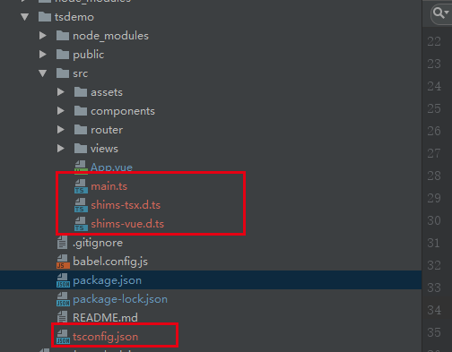

# TypeScript

#### 作者：王志伟
#### 邮箱：13811559314@163.com

```
更改历史

* 2019-07-15	   王志伟	初始化文档

```

Vue CLI内置了TypeScript的支持，并且@vue/cli3提供了TypeScript插件，因此搭建支持TypeScript的vue工程非常方便

## 1 创建工程

使用命令行 初始化项目

```javascript
// 如果没有安装 Vue CLI 就先安装

npm install -g @vue/cli

// 创建一个新工程，并选择 "Manually select features (手动选择特性)" 选项
vue create project-name
```

## 2 添加Typescript 插件
为工程添加TypeScript插件，进入工程目录

```javascript
vue add typescript
// 执行该指令后 会在项目目录中修改、或添加ts文件

```

添加成功后，我们来看下工程结构,插件已将.js文件修改成了.ts

注意：typescript 不适合在已有项目上运行，因为其特殊的语法



vue-cli-plugin-typescript插件除了添加了typescript相关依赖之外，我们需要关注下vue-class-component和vue-property-decorator，这两者是VUE的装饰器，vue-property-decorator依赖vue-class-component，class-style模式下开发时可使代码更加简明、可读，接下来我们会举例介绍怎样更高效、优雅的书写Vue代码


## 3 使用Ts开发Vue

```javascript
// 注意：scrpit中需要指明lang=ts，否则编辑器将不能识别语言类型而报错。
```

### 3.1 添加vue-router

 执行 ` npm i vue-router `  命令添加VueRoter，src下创建router目录、router下创建index.ts文件：

```javascript
import Vue from 'vue'
import Router from 'vue-router'
import User from '../views/User.vue'

Vue.use(Router);

const routes = [
    {
        path: '/',
        component: User
    }
];

const route = new Router({
    mode: 'history',
    routes
});

/* 前置导航守卫 */
route.beforeEach((to, from, next) => {
    // do something before next route
    next()
});

/* 后置导航守卫 */
route.afterEach((to, from) => {
    // do something after route
});

export default route
```
main.ts中加入路由：

```javascript
import Vue from 'vue'
import App from './App.vue'
import router from './router'

Vue.config.productionTip = false;

new Vue({
  render: h => h(App),
    router
}).$mount('#app');

```

### 3.2 创建User.vue
src目录下创建views目录，views下创建User.vue：

```javascript
<template>
    <div>
        name: <input title="name" v-model="name"/><br/>
        age: <input title="age" type="number" v-model="age"/><br/>

        <button type="button" @click="onShowHelloClick">Show Hello</button>
    </div>
</template>

<script lang="ts">
    import { Component, Vue } from 'vue-property-decorator';

    @Component
    export default class User extends Vue {
        showHello = false;
        name: string = '';
        age: number = 0;

        onShowHelloClick() {
            this.showHello = !this.showHello
        }
    }
</script>

<style scoped>

</style>

```
上述写法等价于

```javascript
<script>
    export default {
        name: 'user',
        data () {
            return {
                showHello: false,
                name: '',
                age: 0
            }
        },
        methods: {
            onShowHelloClick () {
                this.showHello = !this.showHello
            }
        }
    }
</script>
```

### 3.3 components、props、watch和计算属性
src/components下创建HelloWorld.vue：

```javascript
<template>
  <div>
    {{hello}}
  </div>
</template>

<script lang="ts">
import {Component, Prop, Vue, Watch} from 'vue-property-decorator';

@Component
export default class HelloWorld extends Vue {
    @Prop({
        type: String,
        required: false,
        default: 'world'
    })
    name!: string;
    @Prop([String,Number])
    age!: number;

    helloName: string = this.name;
    helloAge: number = this.getAgeSync(this.age);

    get hello (): string {
        return `name is: ${this.name}, age is: ${this.age}`
    }

    @Watch('helloName')
    onNameChange(newVal: string, oldVal: string) {
        // do something
    }

    getAgeSync(age: number) :number {
        setTimeout(() => {}, 2000);
        return 10;
    }

}
</script>

<style scoped>

</style>
```

@Prop修饰器声明class属性为vue组件的prop；@Watch声明函数为vue的观察器；函数前添加关键字get，表明该函数为vue的计算属性。以上代码等价于

```javascript
<script>
export default {
    name: 'HelloWorld',
    props: {
        name: {
            type: string, required: false, default: 'world'
        },
        age: {
            type: [string, number]
        }
    },
    data () {
        return {
            helloName: '',
            helloAge: 0
        }
    },
    computed: {
        hello () {
            return `name is: ${this.name}, age is: ${this.age}`
        }
    },
    watch: {
        helloName (newVal, oldVal) {
            // do something
        }
    },
    mounted () {
        this.helloName = this.name
        this.helloAge = this.getAgeSync(this.age)
    },
    methods: {
        getAgeSync(age) {
            setTimeout(() => {}, 2000)
            return 10
        }
    }
}
</script>
```
真是没有对比就没有伤害呀，不管是从语义还是代码量来讲，基于TS的声名式开发值得入坑（ps：这种声明式的语法与Java中的AT标签很相似）。

修改User.vue，使用HelloWorld组件:

```javascript
<template>
    <div>
        name: <input title="name" v-model="name"/><br/>
        age: <input title="age" type="number" v-model="age"/><br/>

        <hello-world v-if="showHello" :name="name" :age="age"/>
        <button type="button" @click="onShowHelloClick">Show Hello</button>
    </div>
</template>

<script lang="ts">
import { Component, Vue } from 'vue-property-decorator';
import HelloWorld from "../components/HelloWorld.vue";

@Component({
    components: {
        HelloWorld
    }
})
export default class User extends Vue {
    showHello = false;
    name: string = '';
    age: number = 0;

    onShowHelloClick() {
        this.showHello = !this.showHello
    }
 }
</script>

<style scoped>

</style>
```
@Component修饰器中的components参数声明了当前组件引入的外部组件。

[@Component修饰器相关参数和使用官方说明](https://github.com/vuejs/vue-class-component)
[vue 修饰器vue-property-decorator官方说明](https://github.com/kaorun343/vue-property-decorator)


