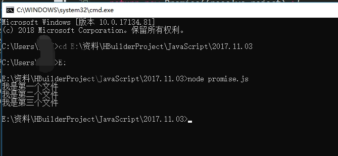

# async/await

#### 作者：高天阳
#### 邮箱：13683265113@163.com

```
更改历史

* 2019-09-19        高天阳     初始化文档

```

## 简介

### 什么是async/await

async [ə'zɪŋk]：这个单词看起来很怪异，它的原型是asynchrony，意为异步。

可能有的人看了这个词想到了放在script标签里的异步脚本，但是此async非彼async，
这个async是ES2017出来的，也是用来处理异步的，和ES6中的promise类似。

### async与Promise、generator有什么差别

nodeJs里面有一个典型的异步操作，下面用三种异步处理方式来读取文件readFile()：

#### promise来读取文件

```
// promise.js
const fs = require("fs");
const read = function(fileName){
    return new Promise((resolve,reject)=>{
        fs.readFile(fileName,(err,data)=>{
            if (err) {
                reject(err);
            } else{
                resolve(data);
            }
        });
    });
};
read('1.txt').then(res=>{
    console.log(res.toString());
    return read('2.txt');  // 返回新的数据，然后输出
}).then(res => {
    console.log(res.toString());
    return read('3.txt');
}).then(res => {
    console.log(res.toString());
});
```

然后用node来运行该文件，打开命令行(win+r)：



因为读取多个文件一般都会作为一个异步来处理，这样就不会阻塞程序的运行，
把fs封装成一个Promise对象，然后在下面返回数据输出，例子中的TXT文件可以写自己的数据

#### generator函数读取文件

```
// generator.js
const fs = require("fs");
const read = function(fileName){
    return new Promise((resolve,reject)=>{
        fs.readFile(fileName,(err,data)=>{
            if (err) {
                reject(err);
            } else{
                resolve(data);
            }
        });
    });
};
function * show(){
    yield read('1.txt');
    yield read('2.txt');
    yield read('3.txt');
}
const s = show();
s.next().value.then(res => {
    console.log(res.toString());
    return s.next().value;
}).then(res => {
    console.log(res.toString());
    return s.next().value;
}).then(res => {
    console.log(res.toString());
});
```

依然用node运行即可，这种方式代码量又高了不少，和Promise方式特别像，
只不过是把读取文件的信息放在了外面，在下面依次手动调用，特别麻烦.

#### async函数读取文件

```
const fs = require("fs");
const read = function(fileName){
    return new Promise((resolve,reject)=>{
        fs.readFile(fileName,(err,data)=>{
            if (err) {
                reject(err);
            } else{
                resolve(data);
            }
        });
    });
};
async function readByAsync(){
    let a1 = await read('1.txt');
    let a2 = await read('2.txt');
    let a3 = await read('3.txt');
    console.log(a1.toString());
    console.log(a2.toString());
    console.log(a3.toString());
}
readByAsync();
```

这个函数和generator函数有些类似，从例子中可以看得出来，async函数在function前面有个async作为标识，
意思就是异步函数，里面有个await搭配使用，每到await的地方就是程序需要等待执行后面的程序，语义化很强.

## 特点

* 语义化强
* 里面的await只能在async函数中使用
* await后面的语句可以是Promise对象、数字、字符串等
* async函数返回的是一个Promise对象
* await语句后的Promise对象变成reject状态时，那么整个async函数会中断，后面的程序不会继续执行

基于上面的async的特点，我们会用到异常捕获机制，学过java的都知道，java中有异常捕获`try...catch...`

什么是`try...catch...`，下面让我们来看一下它的概念。

> try/catch/finally 语句用于处理代码中可能出现的错误信息。
  错误可能是语法错误，通常是程序员造成的编码错误或错别字。
  也可能是拼写错误或语言中缺少的功能（可能由于浏览器差异）。
  **try**语句允许我们定义在执行时进行错误测试的代码块。
  **catch** 语句允许我们定义当 **try** 代码块发生错误时，所执行的代码块。
  **finally** 语句在 try 和 catch 之后无论有无异常都会执行。<br>
  **注意**： catch 和 finally 语句都是可选的，但你在使用 try 语句时必须至少使用一个。<br>
  **提示**： 当错误发生时， JavaScript 会停止执行，并生成一个错误信息。
  使用 [throw](https://www.runoob.com/jsref/jsref-throw.html) 
  语句来创建自定义消息(抛出异常)。如果你将 **throw** 和 **try** 、**catch**一起使用，
  就可以控制程序输出的错误信息。

知道了这个东西是干什么的，那么我们在async中怎么用呢？

```
const fs = require("fs");
const read = function(fileName){
    return new Promise((resolve,reject)=>{
        fs.readFile(fileName,(err,data)=>{
            if (err) {
                reject(err);
            } else{
                resolve(data);
            }
        });
    });
};
async function readByAsync(){
    try{
        let a1 = await read('1.txt');
        let a2 = await read('2.txt');
        let a3 = await read('3.txt');
    }catch(e){
        //TODO handle the exception
    }
    console.log(a1);
    console.log(a2);
    console.log(a3);
}
readByAsync();
```

大家看完了这个async是不是感觉还挺有用的啊，以后工作中async就会替代generator，原理是Promise，所以说特别好用。

## 参考资料

* [深入浅出ES6教程『async函数』](https://www.jianshu.com/p/631f9406c4e0)
* [用 async/await 来处理异步](https://www.cnblogs.com/SamWeb/p/8417940.html)
* [ES6 Async/Await与Promise区别](https://www.cnblogs.com/JeneryYang/p/10113682.html)
