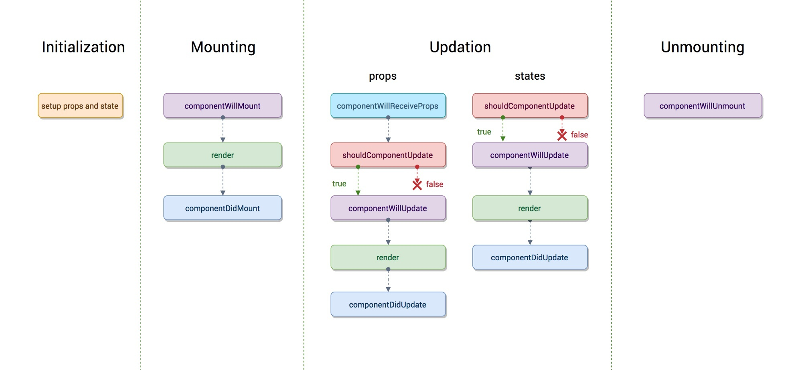
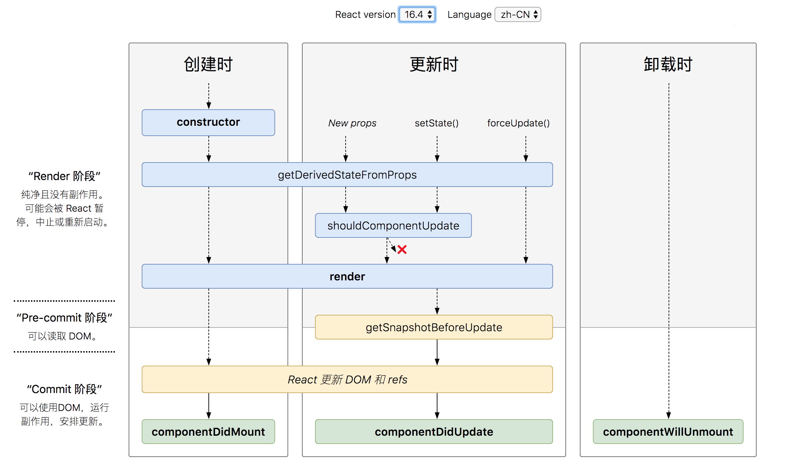
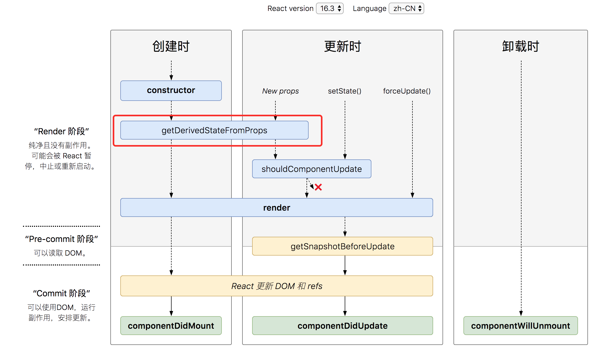

# react生命周期

#### 作者：高天阳
#### 邮箱：13683265113@163.com

```
更改历史

* 2018-09-10        高天阳     初始化文档

```

## React v16.0前的生命周期

其实大部分团队不见得会跟进升到16版本，所以16前的生命周期还是很有必要掌握的，何况16也是基于之前的修改



### 组件初始化`(initialization)阶段`

也就是以下代码中类的构造方法( constructor() ),Test类继承了react Component这个基类，
也就继承这个react的基类，才能有render(),生命周期等方法可以使用，这也说明为什么`函数组件不能使用这些方法`的原因。

`super(props)`用来调用基类的构造方法( constructor() ), 也将父组件的props注入给子组件，
供子组件读取(组件中props只读不可变，state可变)。

而`constructor()`用来做一些组件的初始化工作，如定义this.state的初始内容。

```
import React, { Component } from 'react';

class Test extends Component {
  constructor(props) {
    super(props);
  }
}
```

### 组件的挂载`(Mounting)阶段`

> 此阶段分为componentWillMount，render，componentDidMount三个时期。

#### componentWillMount

在组件挂载到DOM前调用，且只会被调用一次，在这边调用this.setState不会引起组件重新渲染，
也可以把写在这边的内容提前到constructor()中，所以项目中很少用。

#### render

根据组件的props和state（两者的重传递和重赋值，无论值是否有变化，都可以引起组件重新render） ，
return 一个React元素（描述组件，即UI），不负责组件实际渲染工作，
之后由React自身根据此元素去渲染出页面DOM。
render是纯函数（Pure function：函数的返回结果只依赖于它的参数；函数执行过程里面没有副作用），
不能在里面执行this.setState，会有改变组件状态的副作用。

#### componentDidMount

组件挂载到DOM后调用，且只会被调用一次

### 组件的更新`(update)阶段`

在讲述此阶段前需要先明确下react组件更新机制。setState引起的state更新或父组件重新render引起的props更新，
更新后的state和props相对之前无论是否有变化，都将引起子组件的重新render。详细可看
[这篇文章](https://www.cnblogs.com/penghuwan/p/6707254.html)

> 造成组件更新有两类（三种）情况：

#### 父组件重新render

父组件重新render引起子组件重新render的情况有两种，
内容及代码修引自[xiaoyann的回答](https://segmentfault.com/q/1010000006019858)

* 直接使用,每当父组件重新render导致的重传props，子组件将直接跟着重新渲染，无论props是否有变化。
可通过shouldComponentUpdate方法优化。

```
class Child extends Component {
   shouldComponentUpdate(nextProps){ // 应该使用这个方法，否则无论props是否有变化都将会导致组件跟着重新渲染
        if(nextProps.someThings === this.props.someThings){
          return false
        }
    }
    render() {
        return <div>{this.props.someThings}</div>
    }
}
```

* 在componentWillReceiveProps方法中，将props转换成自己的state

```
class Child extends Component {
    constructor(props) {
        super(props);
        this.state = {
            someThings: props.someThings
        };
    }
    componentWillReceiveProps(nextProps) { // 父组件重传props时就会调用这个方法
        this.setState({someThings: nextProps.someThings});
    }
    render() {
        return <div>{this.state.someThings}</div>
    }
}
```

根据官网的描述

> 在该函数(componentWillReceiveProps)中调用 this.setState() 将不会引起第二次渲染。

是因为componentWillReceiveProps中判断props是否变化了，若变化了，this.setState将引起state变化，
从而引起render，此时就没必要再做第二次因重传props引起的render了，不然重复做一样的渲染了。

#### 组件本身调用setState，无论state有没有变化。可通过shouldComponentUpdate方法优化。

```javascript
class Child extends Component {
   constructor(props) {
        super(props);
        this.state = {
          someThings:1
        }
   }
   shouldComponentUpdate(nextStates){ // 应该使用这个方法，否则无论state是否有变化都将会导致组件重新渲染
        if(nextStates.someThings === this.state.someThings){
          return false
        }
    }

   handleClick = () => { // 虽然调用了setState ，但state并无变化
        const preSomeThings = this.state.someThings
         this.setState({
            someThings: preSomeThings
         })
   }

    render() {
        return <div onClick = {this.handleClick}>{this.state.someThings}</div>
    }
}
```

> 此阶段分为componentWillReceiveProps，shouldComponentUpdate，componentWillUpdate，render，componentDidUpdate

* componentWillReceiveProps(nextProps)

此方法只调用于props引起的组件更新过程中，参数nextProps是父组件传给当前组件的新props。
但父组件render方法的调用不能保证重传给当前组件的props是有变化的，
所以在此方法中根据nextProps和this.props来查明重传的props是否改变，以及如果改变了要执行啥，
比如根据新的props调用this.setState出发当前组件的重新render

* shouldComponentUpdate(nextProps, nextState)

此方法通过比较nextProps，nextState及当前组件的this.props，this.state，
返回true时当前组件将继续执行更新过程，返回false则当前组件更新停止，以此可用来减少组件的不必要渲染，优化组件性能。

ps：这边也可以看出，就算componentWillReceiveProps()中执行了this.setState，更新了state，
但在render前（如shouldComponentUpdate，componentWillUpdate），this.state依然指向更新前的state，
不然nextState及当前组件的this.state的对比就一直是true了。

* componentWillUpdate(nextProps, nextState)

此方法在调用render方法前执行，在这边可执行一些组件更新发生前的工作，一般较少用。

* render

render方法在上文讲过，这边只是重新调用。

* componentDidUpdate(prevProps, prevState)

此方法在组件更新后被调用，可以操作组件更新的DOM，prevProps和prevState这两个参数指的是组件更新前的props和state

### 卸载阶段

此阶段只有一个生命周期方法：componentWillUnmount

* componentWillUnmount

此方法在组件被卸载前调用，可以在这里执行一些清理工作，
比如清除组件中使用的定时器，清除componentDidMount中手动创建的DOM元素等，以避免引起内存泄漏。

### React v16.4 的生命周期

> React v16.4 的生命周期图



#### 变更缘由

原来（React v16.0前）的生命周期在React v16推出的Fiber之后就不合适了，因为如果要开启async rendering，
在render函数之前的所有函数，都有可能被执行多次。

原来（React v16.0前）的生命周期有哪些是在render前执行的呢？

* componentWillMount
* componentWillReceiveProps
* shouldComponentUpdate
* componentWillUpdate

如果开发者开了async rendering，而且又在以上这些render前执行的生命周期方法做AJAX请求的话，
那AJAX将被无谓地多次调用...明显不是我们期望的结果。而且在componentWillMount里发起AJAX，
不管多快得到结果也赶不上首次render，而且componentWillMount在服务器端渲染也会被调用到（当然，也许这是预期的结果），
这样的IO操作放在componentDidMount里更合适。

禁止不能用比劝导开发者不要这样用的效果更好，所以除了shouldComponentUpdate，
其他在render函数之前的所有函数（componentWillMount，componentWillReceiveProps，componentWillUpdate）
都被getDerivedStateFromProps替代。

也就是用一个静态函数getDerivedStateFromProps来取代被deprecate的几个生命周期函数，
就是强制开发者在render之前只做无副作用的操作，而且能做的操作局限在根据props和state决定新的state

React v16.0刚推出的时候，是增加了一个componentDidCatch生命周期函数，这只是一个增量式修改，
完全不影响原有生命周期函数；但是，到了React v16.3，大改动来了，引入了两个新的生命周期函数。

#### 新引入了两个新的生命周期函数：`getDerivedStateFromProps`，`getSnapshotBeforeUpdate`

##### getDerivedStateFromProps

getDerivedStateFromProps本来（React v16.3中）是只在创建和更新（由父组件引发部分），
也就是不是不由父组件引发，那么getDerivedStateFromProps也不会被调用，
如自身setState引发或者forceUpdate引发。

> React v16.3 的生命周期图



这样的话理解起来有点乱，在React v16.4中改正了这一点，让getDerivedStateFromProps无论是Mounting还是Updating，
也无论是因为什么引起的Updating，全部都会被调用，具体可看React v16.4 的生命周期图。

> React v16.4后的getDerivedStateFromProps

`static getDerivedStateFromProps(props, state)` 在组件创建时和更新时的render方法之前调用，
它应该返回一个对象来更新状态，或者返回null来不更新任何内容。

##### getSnapshotBeforeUpdate

`getSnapshotBeforeUpdate() `被调用于render之后，可以读取但无法使用DOM的时候。
它使您的组件可以在可能更改之前从DOM捕获一些信息（例如滚动位置）。此生命周期返回的任何值都将作为参数传递给componentDidUpdate（）。

官网给的例子：

```
class ScrollingList extends React.Component {
  constructor(props) {
    super(props);
    this.listRef = React.createRef();
  }

  getSnapshotBeforeUpdate(prevProps, prevState) {
    //我们是否要添加新的 items 到列表?
    // 捕捉滚动位置，以便我们可以稍后调整滚动.
    if (prevProps.list.length < this.props.list.length) {
      const list = this.listRef.current;
      return list.scrollHeight - list.scrollTop;
    }
    return null;
  }

  componentDidUpdate(prevProps, prevState, snapshot) {
    //如果我们有snapshot值, 我们已经添加了 新的items.
    // 调整滚动以至于这些新的items 不会将旧items推出视图。
    // (这边的snapshot是 getSnapshotBeforeUpdate方法的返回值)
    if (snapshot !== null) {
      const list = this.listRef.current;
      list.scrollTop = list.scrollHeight - snapshot;
    }
  }

  render() {
    return (
      <div ref={this.listRef}>{/* ...contents... */}</div>
    );
  }
}
```

## 参考资料

* [详解React生命周期(包括react16版)](https://www.jianshu.com/p/514fe21b9914)
* [【react】利用shouldComponentUpdate钩子函数优化react性能以及引入immutable库的必要性](https://www.cnblogs.com/penghuwan/p/6707254.html)
* [React(v16.8.4)生命周期详解](https://www.cnblogs.com/hezhi/p/10547186.html)
