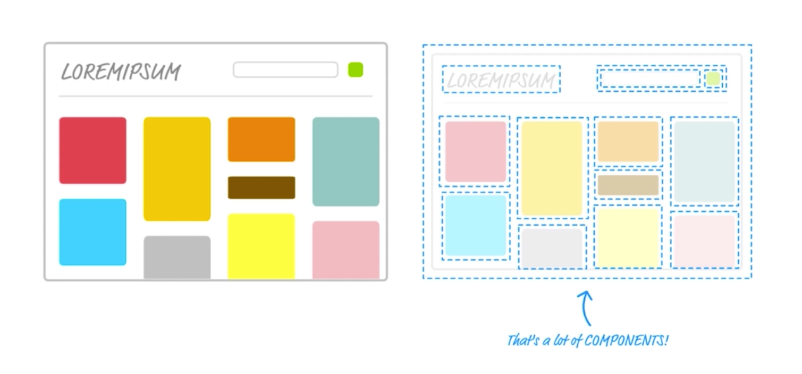

# 初识React

#### 作者：高天阳
#### 邮箱：13683265113@163.com

```
更改历史

* 2019-08-16        高天阳     补充文档
* 2018-07-11        高天阳     初始化文档

```

## React简介

React是一个用于构建用户界面的JAVASCRIPT库，主要用于构建UI，它起源于**Facebook**的内部项目，用来架设Instagram的网站，并于**2013年5月开源**。
截止18年，React已经成为**使用人数最多**的前端框架，拥有着十分**健全的文档与完善的社区**。

React主要有三大类应用

* React JS 主要用于网页应用的构建
* React Native 主要用于原生应用的构建
* React VR 主要用于VR应用(全景视图应用)的构建

### React Fiber是什么

React16之后的版本统称，主要是对底层核心算法进行了优化，引入了优先级的概念、分片的概念，可以使代码运行的更加流畅，尤其是针对一些复杂的动画。

### React 特点

1. **灵活** − React可以与已知的库或框架很好地配合。
1. **JSX** − JSX 是 JavaScript 语法的扩展。React 开发不一定使用 JSX ，但React建议使用它。
1. **单向响应的数据流** − React 实现了单向响应的数据流，从而减少了重复代码，这也是它为什么比传统数据绑定更简单。
1. **组件化开发** − Component-Based 通过 React 构建组件，使得代码更加容易得到复用，能够很好的应用在大项目的开发中。
1. **声明式开发** − Declarative 命令式的局部包装(声明式开发与命令式开发对应)
1. **多端使用** - Learn Once,Write Anywhere 支持客户端与服务器渲染
1. **高效**
  1. − React通过对DOM的模拟，最大限度地减少与DOM的交互。
  1. − 高效的DOM Diff算法，最小化页面重绘

## 快速构建 React 开发环境

安装较新版本的Node.js，并使用npx命令安装React App

[创建新的 React 应用](https://react.docschina.org/docs/create-a-new-react-app.html#create-react-app)

```
npx create-react-app my-app
cd my-app
npm start
```

> **注意**
>
> 第一行的 npx 不是拼写错误 —— 它是 npm 5.2+ 附带的 package 运行工具。

[完整搭建实例](../tools/create-react-app.md)

## React 渲染元素

元素就是您要在屏幕上看到的内容，例如：

```
const element = <h1>Hello, world</h1>;
```

假设你的HTML文件有一个`<div>： <div id=“root”></div>`我们称之为“根”DOM节点，其中的所有内容都将由React DOM进行管理，
要将React元素渲染到根DOM节点中，请将其两者都传递给ReactDOM.render()：

```
const element = <h1>Hello, world</h1>;
ReactDOM.render(
    element,
    document.getElementById('root')
);
```

## 模块与组件

### 模块

* 什么是模块：向外提供特定功能的js陈醋，一般就是一个js文件
* 需要的原因：js代码随开发变多变复杂
* 作用：简化js的编写, 便于阅读, 提高运行效率，降低耦合度，防止变量全局污染

### 组件



如上图，组件就是网页中的一部分，每一个虚线框包裹的内容，都可以封装成一个组件。

组件可以让您将UI拆分成独立的可重复使用的部分，组件就像JavaScript函数。他们接受任意输入，并返回应该在屏幕上显示的React元素。

* 理解: 用来实现特定功能效果的代码集合(html/css/js)
* 为什么: 一个界面的功能越来越复杂
* 作用: 可复用, 简化项目编码, 提高运行效率

```
class Welcome extends Component {
    render() {
        return (
            <h1>Hello world</h1>
        );
    }
}
```

使用定义的组件：

```
ReactDOM.render(< Welcome />, document.getElementById('root'));
```

## 模块化与组件化

* 模块化：当应用的js都以模块来编写的, 这个应用就是一个模块化的应用
* 组件化：当应用是以多组件的方式实现功能, 这上应用就是一个组件化的应用

## 简单的JSX语法

JSX是JavaScript的语法扩展,利用JSX编写DOM结构，可以用原生的HTML标签，也可以直接像普通标签一样引用React组件。
这两者约定通过大小写来区分，小写的**字符串**是HTML标签，大写开头的**变量**是React组件。

实例：JSX中使用JavaScript表达式，表达式可写在花括号{}中：

注：只能写表达式，不能写js语句，如if等。

```
ReactDOM.render(
    <div> 
        { 1 + 2 }
    </div> ,
    document.getElementById('example') 
);
```

## 示例

在React官方代码示例中，共分为如下几个文件。

```
tic-tac-toe
├── node_modules            # 插件资源
├── public                  # 公共资源
│   ├── favicon.ico         # ico图片
│   ├── index.html          # 项目入口文件(可添加一些meta信息或统计代码)
│   ├── logo192.png         # logo192x192
│   ├── logo512.png         # logo512x512
│   ├── manifest.json       # 
│   └── robots.txt          # 
├── build                   ## 
├── src                     # 开发目录
│   ├── assets              ## 
│   │   ├── images          ## 
│   │   └── style           ## 
│   ├── App.js              # App组件
│   └── index.js            # 项目的核心文件
├── .xxxx                   # 各类配置文件(包括语法配置，git配置等)
├── package.json            # 项目配置文件
├── package-lock.json       # 项目插件版本控制文件
└── README.md               # 项目说明文档(markdown格式)
```

index.js文件内容如下

```
// 引入React，帮助程序理解React的组件语法(大写开头的如App是一个组件、<App />尖括号语法)
import React from 'react';
// 引入ReactDOM，将React的组件渲染至DOM节点
import ReactDOM from 'react-dom';

// App组件，大写字母开头
import App from './App';

// 将App组件渲染至DOM节点上(其中<App />是JSX语法)
ReactDOM.render(<App />, document.getElementById('root'));
```

App.js文件内容如下

```
import React from 'react';

// 定义一个React组件
function App() {
  return (
    <div className="App">
      hello word
    </div>
  );
}

export default App;
```

也可以写做

```
import React from 'react';

// 定义一个React组件
class App extends React.Component {
  render() {
    // JSX语法
    return (
    <div className="App">
      hello word
    </div>
    );
  }
}

export default App;
```

这是两种定义组件的方式，一种是解释型的函数来定义，一种使用ES6的class来继承。函数型的定义比较简单，语法清晰，
但是不能使用state和lifecycle（或者说如果使用的话需要hook）。class继承的方式相对复杂，但可以拥有state和lifecycle。
[参考资料](https://medium.com/@Zwenza/functional-vs-class-components-in-react-231e3fbd7108)

## TodoList功能

### TodoList初始化组件

改造原有代码，将App.js改为TodoList.js

代码如下

```
import React from 'react';

// 定义一个React组件
class TodoList extends React.Component {

    // 用来存储数据
    constructor(props) {
        super(props)

        this.state = {
            data: []
        }
    }

    // 声明方法
    handleBtnClick () {
        // this指向问题 若在页面中未使用bind修改this指向，则this指向的是button而不是组件，当使用bind后this指向正确
        this.setState({
            // [...]展开运算符，相当于承接原有data中的数据，类似push的效果
            data: [...this.state.data, {name: 'hello word', type: false}]
        })
    }

    render() {
        return (
            <div>
                <div>
                    <input type="text"/>
                    <button onClick={this.handleBtnClick.bind(this)}>add</button>
                </div>
                <div>
                    <ul>
                        {
                            this.state.data.map((item, index) => {
                                return <li key={index}>{item.name}</li>
                            })
                        }
                    </ul>
                </div>
            </div>
        );
    }
}

export default TodoList;
```

### TodoList新增

```
import React from 'react';

// 定义一个React组件
class TodoList extends React.Component {

    constructor(props) {
        super(props)

        this.state = {
            data: [],
            inputValue: ''
        }
    }

    // 输入框变化将值存储在state中
    handleInputChange (e) {
        this.setState({
            inputValue: e.target.value
        })
    }

    // 点击新增后，清空原有输入框的值(需要将输入框的value绑定在inputValue上，达成双向绑定的效果)
    handleBtnClick () {
        this.setState({
            inputValue: '',
            data: [...this.state.data, {name: this.state.inputValue, type: false}]
        })
    }

    render() {
        return (
            <div>
                <div>
                    <input type="text" onChange={this.handleInputChange.bind(this)} value={this.state.inputValue}/>
                    <button onClick={this.handleBtnClick.bind(this)}>add</button>
                </div>
                <div>
                    <ul>
                        {
                            this.state.data.map((item, index) => {
                                return <li key={index}>{item.name}</li>
                            })
                        }
                    </ul>
                </div>
            </div>
        );
    }
}

export default TodoList;
```

### TodoList删除

```
import React from 'react';

// 定义一个React组件
class TodoList extends React.Component {

    constructor(props) {
        super(props)

        this.state = {
            data: [],
            inputValue: ''
        }
    }

    handleInputChange (e) {
        this.setState({
            inputValue: e.target.value
        })
    }

    handleBtnClick () {
        this.setState({
            inputValue: '',
            data: [...this.state.data, {name: this.state.inputValue, type: false}]
        })
    }

    handleItemClick (index) {
        // 拷贝data再进行修改 因为React不推荐直接修改数据 而是都通过setState的方式将变化后的数据保存在原数据中
        // 如果直接修改 可能会导致调bug变得困难 以及代码变得效率低下
        const data = [...this.state.data]
        data.splice(index, 1)
        // ES6中键和值一致可以省略'键:'
        this.setState({
            data
        })
    }

    render() {
        return (
            <div>
                <div>
                    <input type="text" onChange={this.handleInputChange.bind(this)} value={this.state.inputValue}/>
                    <button onClick={this.handleBtnClick.bind(this)}>add</button>
                </div>
                <div>
                    <ul>
                        {
                            this.state.data.map((item, index) => {
                                return <li key={index} onClick={this.handleItemClick.bind(this, index)}>{item.name}</li>
                            })
                        }
                    </ul>
                </div>
            </div>
        );
    }
}

export default TodoList;
```

### TodoList子组件的拆分及父子之间的传参
