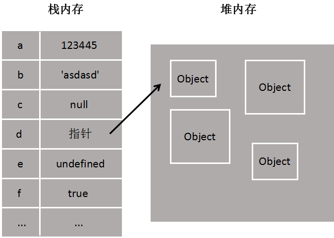

# 前端面试

#### 作者：高天阳
#### 邮箱：13683265113@163.com

```
更改历史

* 2019-06-14        高天阳     初始化文档
* 2019-06-17        高天阳     补充Js中那些隐式转换

```

## 笔试

### 1. 利用html css 编写样式，div垂直body居中、div内的text垂直居中，div高度等于body宽度的一半

> 分析：本题考点分为div的垂直居中、文本的垂直居中、body的宽度获取、margin溢出的处理

答：

```css
    body:before {
        content: "";
        display: table;
    }
    div {
        margin-top: 50%;
        height: 50vw;
        line-height: 50vw;
        position: relative;
        top: -25vw;
        background: #00A0D0;
    }
```


### 2. 下面代码输出结果是什么

```javascript
var a = function() {console.log(11)}
var b = function() {console.log(11)}
if(a == b) {
  console.log(1)
}
if({} == {}) {
  console.log(2)
}
if([] == []) {
  console.log(3)
}
if([] == false) {
  console.log(4)
}
if({} == false) {
  console.log(5)
}
if([]) {
  console.log(6)
}
```

> 分析：此题考点为JS的数据类型及隐式转换

#### 数据类型

首先，先来了解两个概念：栈 stack 和 堆 heap

##### 堆、栈

栈(stack)：先进后出，栈会**自动分配**内存空间，会**自动释放**，存放基本类型，简单的数据段，占据固定大小的空间，
使用的是**一级缓存**，他们通常都是被调用时处于存储空间中，调用完立即释放。

基本类型：String，Number，Boolean，Null，Undefined，Symbol（es6）

它们是直接按值存放的，可以直接访问。


堆(heap)：队列优先，先进先出，**动态分配**的内存，大小不定也**不会自动释放**，存放引用类型，指那些可能由多个值构成的对象，保存在堆内存中，
包含引用类型的变量，实际上保存的不是变量本身，而是指向该对象的指针。使用的是**二级缓存**，生命周期由虚拟机的垃圾回收算法来决定，
一般由程序员分配释放，若程序员不释放，程序结束时可能由OS回收。

引用类型：Function，Array，Object

当我们需要访问**引用数据类型**的值时，**首先从栈中获得该对象的地址指针，然后再从堆内存中取得所需的数据**。



##### 堆、栈的区别

栈：所有在方法中定义的变量都是放在栈内存中，随着方法的执行结束，这个方法的内存栈也自然销毁。

* 优点：存取速度比堆快，仅次于直接位于CPU中的寄存器，数据可以共享；
* 缺点：存在栈中的数据大小与生存期必须是确定的，缺乏灵活性。

堆：堆内存中的对象不会随方法的结束而销毁，即使方法结束后，这个对象还可能被另一个引用变量所引用(参数传递)。
创建对象是为了反复利用，这个对象将被保存到运行时数据区。

##### 栈和堆的溢出

栈：可以递归调用方法，这样随着栈深度的增加，JVM维持着一条长长的方法调用轨迹，直到内存不够分配，产生栈溢出。

堆：循环创建对象，通俗点就是不断的new 一个对象。

下面来看看传值和传址的区别

其实这两者区别就是基本类型和引用类型的区别，话不多说看栗子

```javascript
var a = [1,0,9,8,7];
var b = a;
var c = a[0];
console.log(b);     //[1,0,9,8,7]
console.log(c);     //1
//改变数值
b[1] = 3;
c = 5;
console.log(b[1]);  //3
console.log(a[0]);  //1
```

因为a是数组，是引用类型，赋给b的时候传的是栈中的地址，不是堆内存中的对象，c仅仅是从a堆内存中获取的一个数据值，并保存在栈中，
所以b修改的时候，会根据地址回到a堆中修改，c则直接在栈中修改，并且不能指向a堆内存中。

##### 深浅拷贝

关于引用类型，深浅拷贝在前端面试中经常被问到，和大家分享一下，先来说说浅拷贝

**浅拷贝**：也就是只复制了第一层属性，复制对象是基本类型

在复制基本类型时，直接使用等号完成，在复制引用类型时，循环遍历对象，对每个属性或值使用等号完成。

下面看个栗子

```javascript
var color1 = ['red','green']; 
var color2 = [];
//复制
for(var i  = 0;i < color1.length;i++){
  color2[i] = color1[i]; 
}
console.log(color2);  //[red,green]
color1.push('black');
console.log(color2);  //[red,green]
```

在这个栗子中，color2复制color1，因为数组中的每一项都是基本类型(string),假如数组中的某一项保存的是一个对象，
或者是一个数组，又或者说对象的某一个属性还是一个对象(也就是引用类型的某个属性还是引用类型)，此时浅拷贝就没用了，那该怎么办？

我们先来看一个引用类型属性还是引用类型的栗子(有点绕口.....）

```javascript
var a = {
        name : 'wang',
        hobby: ['reading', 'coffee']
    }
function Copy(q) {
    var m = {};
    for(var i in q) {
        m[i] = q[i];
    }
    return m;
}
var b = Copy(a);
b.age = 18;
console.log(b.name);  // wang
console.log(b.hobby);  // ['reading', 'coffee']
console.log(b.age);  // 18
console.log(a.age);  // undefined
b.hobby.push('dancing');
console.log(b.hobby); // ['reading', 'coffee', 'dancing']
console.log(a.hobby); // ['reading', 'coffee', 'dancing']
```

在上面这个小栗子中，hobby属性是一个数组。a对象中的name属性值为字符串，hobby为数组。a拷贝到b，两个属性均能顺利拷贝。
给b对象新增一个number类型的属性age时，b能够正常修改，而a中无定义。说明 子对象 b 的 age 并没有关联到 父对象 a 中，所以为undefined。

但是，若修改的属性为对象或数组时，那么父子对象之间就会发生关联。其在内存的状态，见下图


下面继续来说我们的拷贝，现在该深拷贝出场了......

**深拷贝**：对属性中所有引用类型的值，遍历到是基本类型的值为止，利用递归来实现深拷贝。

来看一个栗子

```javascript
function deepClone (obj) {
    var newObj = {}  //如果不是引用类型，直接返回
    if (typeof (obj) !== 'object') {
        return obj
    }
    //如果是引用类型，遍历属性
    else{
        for (var attr in obj) {
            //如果某个属性还是引用类型，递归调用
            newObj[attr] = deepClone(obj[attr])
        }
    }
    return newObj
}
var a = {name: 'wang'}
a.hobby = ['reading', 'coffee'];
var b = {};
b = deepClone(a);
b.hobby.push('dancing');
console.log(b.hobby); //['reading', 'coffee', 'dancing']
console.log(a.hobby); //['reading', 'coffee']
```

对于深拷贝，我们先判断它是否为引用类型，如果不是，直接返回如果是，循环遍历该对象的属性，
如果某个属性还是引用类型，则针对该属性再次调用deepClone函数。


--------

所以，现在就可以解释 `var a = function(){}; var b = function(){}; a==b` 为false了。

**变量a实际保存的是指向堆内存中对象的一个指针，而b保存的是指向堆内存中另一个对象的一个指针；虽然这两个对象的值是一样的，
但它们是独立的2个对象，占了2份内存空间；所以 a==b 为 false。**

如果 var a = {}; var b = a; 这时变量b复制了变量a保存的指针，它们都指向堆内存中同一个对象；所以 a==b 为 true。

{} == {} and [] == [] 同理不做赘述

#### 隐式类型转换

##### ToPrimitive

在发生转换的时候，js其实都是会将操作对象转化为原始的对象，这也是最为诟病的地方，因为js很难直接抛出错误，
她会用一套自己的方法去理解我们的错误，并做相应的调整，哪怕这些错误我们是无意识的。所以我们要知道她的转换方式，
才能做到知己知彼，对代码的控制更为精准。

流程如下：

1. input为原始值，直接返回；
1. 不是原始值，调用该对象的valueOf()方法，如果结果是原始值，返回原始值；
1. 调用valueOf()不是原始值，调用此对象的toString()方法，如果结果为原始值，返回原始值；
1. 如果返回的不是原始值，抛出异常TypeError。

其中PreferredType控制线调取valueOf()还是toString()。

ps: Date类型按照String去调用。

ok，通过这个隐式装箱，我们得到了操作数的原始值。接下来，我们根据不同情况，看看发生了什么呢~

##### 数学运算

想必大家用过以下做法去完成类型转换吧

```javascript
var str = '1';
var num = str - 0;

var num2 = 2;
var str2 = num2 + '';
console.log(num)
console.log(str2)
```

这种类似的数学运算会做类型转换，*，/和-操作符都是数字运算专用的。
当这些运算符与字符串一起使用时，会强制转换字符串为数字类型的值。但是‘+’尤为致命，为啥捏？

当'+'作为双目运算符时，如a+b。

它的运行如下：

1. 计算两个操作数的原始值： prima = ToPrimitive(a), prima = ToPrimitive(b)；
1. 如果原始值有String,全部转换为String，返回String相加后的结果；
1. 如果原始值没有String,全部转换为Number， 返回Number相加后的结果；

当'+'作为单目运算符时, 例如 +a.

流程是这样的：

1. 将a转换为Number,Number(a)；

举个栗子：

[] + []

```javascript
// 1. 转换为原始类型 toPrimitive([]);

[].valueOf(); // []，不是原始类型

[].toString(); // "",真是令人发指的转换

// 2. 都为string，所以返回字符串想家的结果

return "" + "";
```

{} + [] 与 [] + {}

```javascript
{} + []
// 1. 在浏览器中，JS引擎认为第一个{}为空代码块，所以 这里的 '+'是单目运算符(node中认为是对象，解析为"[object Object]")

ToPrimitive([]); //""

// 2. Number("");//0


[] + {}
// 1. ToPrimitive([]); //""
ToPrimitive({}); //"[object Object]"

// 2. 都为string
return "" + "[object Object]";//"[object Object]"
```

PS: [].valueOf 为[], 但在ES6中JS会优先调用[Symbol ToPrimitive]来转换为原始类型。

##### 比较运算

首先，比较运算分为2种， 一种为严格比较(===)，只有类型相等，值也一致时才会为true,否则为false，
另一种为抽象相等也叫宽松相等(==)，先将运算数转化为相同类型，再做比较，具体过程见 Abstract Equality Comparison Algorithm。

这个算法大致说了这么几个情况，x == y

1. xy都为Null或undefined,return true;
1. x或y为NaN, return false;
1. 如果x和y为String，Number，Boolean并且类型不一致，都转为Number再进行比较
1. 如果存在Object，转换为原始值，比较

回到开头的题目

> [] == false

```javascript
// 1.存在object, 转化为原始值
ToPrimitive([]); // ''

// 2.一个string， 另外为boolean,都转为number
Number('');//0
Number(false);//0

return 0 == 0;//true
```

> {} == false

```javascript
// 1.存在object, 转化为原始值
ToPrimitive({}); // [object Object]

// 2.一个string， 另外为boolean,都转为number
Number('[object Object]');//NAN
Number(false);//0

return NAN == 0;//false
```

> []

```javascript
ToBoolean ([]); // true
```

##### ToPrimitive

| value | toNumber | toString | toBoolean |
| :---: | :---: | :---: | :---: |
| NaN | NaN | "NaN" | false |
| Infinity | Infinity | "Infinity" | false |
| [] | 0 | "" | true |
| [1] | 1 | "1" | true |
| null | 0 | "null" | false |
| undefined | NaN | "undefined" | false |
| {} | NaN | "[object Object]" | true |
| function() | NaN | "function" | true |

##### ToNumber

| 参数 | 结果 |
| :---: | :---: |
| undefined | NaN |
| null | +0 |
| Boolean | true被转换为1，false被转换为+0 |
| Number | 无需转换 |
| String | 由字符串解析为数字，例如"324"被转换为324 |

##### ToString

| 参数 | 结果 |
| :---: | :---: |
| undefined | "undefined" |
| null | "null" |
| Boolean | "true"或"false" |
| Number | 数字作为字符串，比如"1.765" |
| String | 无需转换 |

答：4、6

> 基本类型练习： 运算符（+,-,*,/,%）操作时,转换类型 ”+“ 号运算符： 

```javascript
var a=1;var b=2
console.log('Number 类型不会转换', a+b)

var a='hello';var b='world'
console.log('String 类型不会转换', a+b)

var a=false;var b=true
console.log('Boolean 类型会转换', a+b, a+a, b+b)

var a=null
console.log('Null 类型会转换', a+a)

var a=undefined
console.log('Undefined 类型会转换', a+a)
```

```javascript
var a=1;var b='hi'
console.log('Number和String，Number会转换', a+b)

var a=1;var b=false;var c=true
console.log('Number和Boolean，Boolean会转换', a+b, a+c)

var a=1;var b=null
console.log('Number和Null，Null类型会转换', a+b, b+a)

var a=1;var b=undefined
console.log('Number和undefined，undefined类型会转换', a+b, b+a)
```

```javascript
var a='Hi';var b=false;var c=true
console.log('String和Boolean，Boolean会转换', a+b, b+a, a+c)

var a='Hi';var b=null
console.log( 'String和Null，Null类型会转换', a+b, b+a)

var a='Hi';var b=undefined
console.log('String和undefined，undefined类型会转换', a+b, b+a)
```

```javascript
var a=false;var b=undefined;var c=true
console.log('Boolean和undefined，都会转换为Number', a+b, b+a, b+c)

var a=false;var b=null;var c=true
console.log( 'Boolean和null，都会转换为Number', a+b, b+a, b+c)
```

```javascript
var a=null;var b=undefined
console.log('undefined和Null，都会转换为Number', a+b, b+a)
```

> 总结： 
>
> 当加号运算符时，String和其他类型时，其他类型都会转为 String；其他情况，都转化为Number类型，
> 注： undefined 转化为Number是 为’NaN‘， 任何Number与NaN相加都为NaN。
> 其他运算符时， 基本类型都转换为 Number，String类型的带有字符的比如： '1a' ,'a1' 转化为 NaN 与undefined 一样。
> 
> tips： 
>
> (1)NaN 不与 任何值相等 包括自身，所以判断一个值 是否为 NaN， 即用 "!==" 即可。
> (2)转换为 Boolean类型为 false 的有：null，0，''，undefined，NaN，false
> (3)number（） 与 parseInt（） 都可以将对象转化为Number类型，Number函数要比parseInt函数严格很多。基本上，只要有一个字符无法转成数值，整个字符串就会被转为NaN。


> Object类型练习： 当object与基本类型运算时： 

```javascript
var obj = {
    valueOf: function(){
        return 5;
    },
    toString: function(){
        return 6;
    }
};
 
var obj1 = {
    valueOf: function(){
        return 'a';
    },
    toString: function(){
        return 'b';
    }
};
console.log('Obj和Number运算时，会先调用valueOf方法', obj+1,obj-1,obj1+1,obj1-1,1+obj,1-obj,1+obj1,1-obj1)
console.log('Obj和String运算时，会先调用valueOf方法', obj+'a1',obj-'a1',obj1+'a1',obj1-'a1','a1'+obj,'a1'-obj,'a1'+obj1,'a1'-obj1)
console.log('Obj和Boolean运算时，会先调用valueOf方法', obj+true,obj-false,obj1+true,obj1-false,true+obj,false-obj1)
console.log('Obj和Null运算时，会先调用valueOf方法', obj+null,obj-null,obj1+null,obj1-null,null+obj,null-obj,null+obj1,null-obj1)
console.log('Obj和undefined运算时，会先调用valueOf方法', obj+undefined,obj-undefined,obj1+undefined,obj1-undefined,undefined+obj,undefined-obj,undefined+obj1,undefined-obj1)
```

当对 obj,obj1 用Number()和String()换转时

```javascript
console.log('当对Obj执行Number()和String()时', Number(obj), Number(obj1), String(obj), String(obj1))
```

```javascript
var obj3 = {
    valueOf: function(){
        return 'aaa';
    }
};
 
var obj4 = {
    toString: function(){
        return 'bbb';
    }
};
console.log(Number(obj4),String(obj3))
```

> 总结： 
>
> Number类型会先调用valueOf(), String类型会先调用toString(),  如果结果是原始值，
> 则返回原始值，否则继续用toString 或 valueOf(),继续计算，如果结果还不是原始值，则抛出一个类型错误;

```
{} + []
[] + {}
[] + []
{} + {}
```

为什么 {} + [] = 0 ?  因为 javascript在运行时, 将 第一次{} 认为是空的代码块，所以就相当于 +[] = 0.  还有 {} +5 = 5, 同理。

### 3. 利用宏任务，微任务的知识点判断程序输出

> 分析：


### 4. bind函数实现

> 分析：


### 5. trottle函数实现

> 分析：


### 6. 给定一个不含重复数字的数组arr,指定个数n,目标和sum,判断是否含有由n个不同数字相加得到sum的情况

> 分析：


## 参考资料

* [老码农的字节跳动前端面试总结（2面已凉） - 墨倾池的文章 - 知乎](https://zhuanlan.zhihu.com/p/68974750)
* [JS中的栈和堆](https://www.jianshu.com/p/67c0323aef1e)
* [浅析JS中的堆内存与栈内存](https://www.cnblogs.com/heioray/p/9487093.html)
* [{} == {} 结果为什么是false？](https://blog.csdn.net/hb_zhouyj/article/details/78343021)
* [JS的隐式转换 从 [] ==false 说起](https://www.cnblogs.com/nanchen/p/7905528.html)
* [[]、[] ==false、{} ==false](https://www.cnblogs.com/hsp-blog/p/7400802.html)
* [Js 中那些 隐式转换](https://www.cnblogs.com/ihboy/p/6700059.html)

