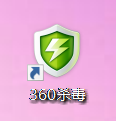
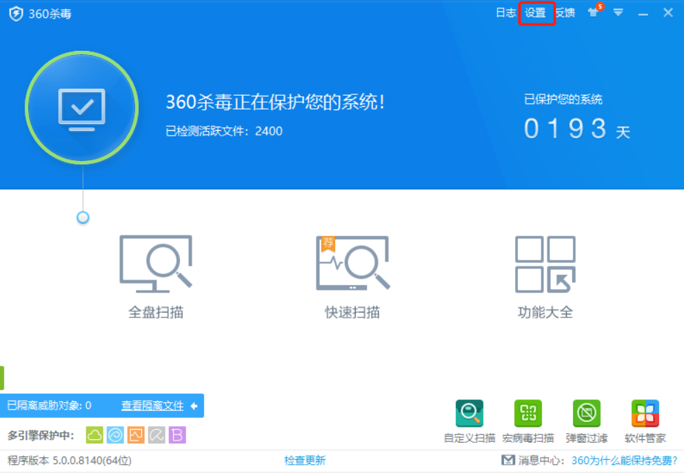
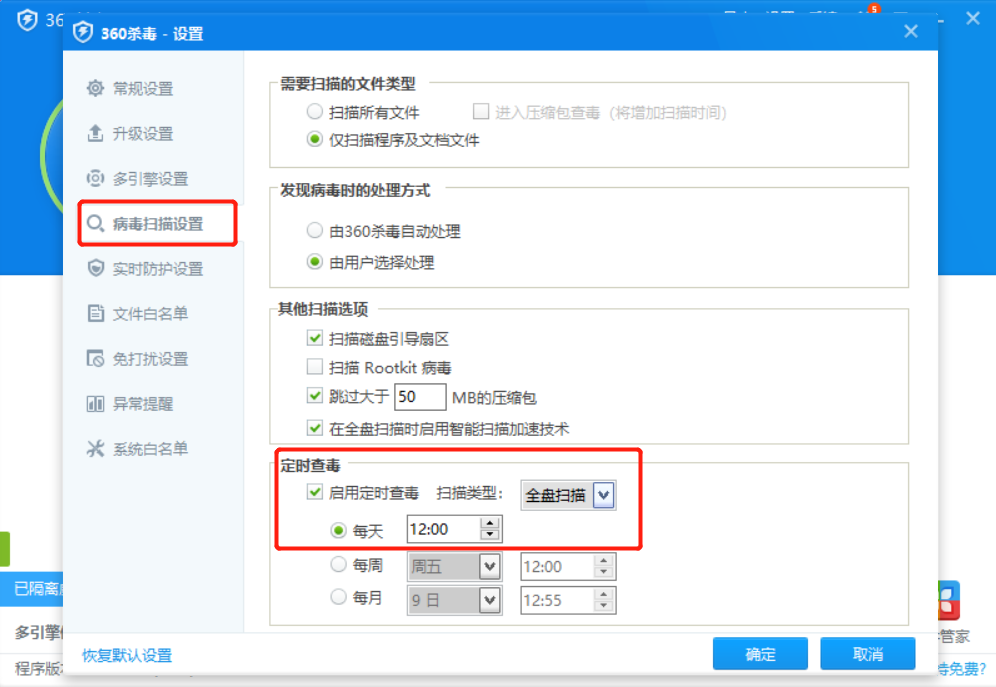
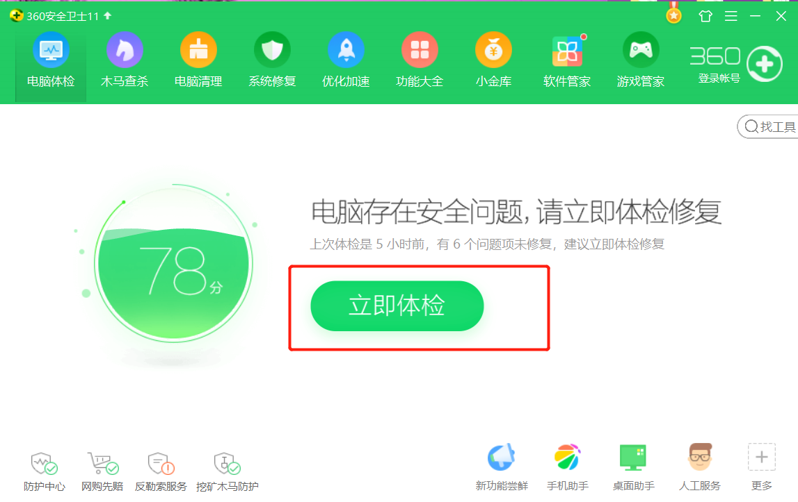
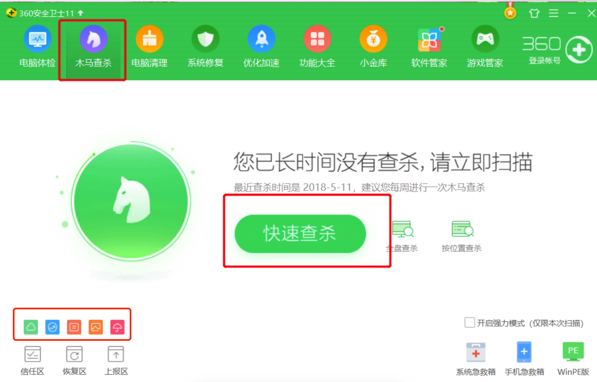

# 360杀毒使用

#### 作者：高天阳
#### 邮箱：13683265113@163.com

```
更改历史

* 2018-10-19        高天阳     初始化文档

```

## 1 简介

*全能一键扫描
    *只需一键扫描！快速、全面地诊断系统安全状况和健康程度，并进行精准修复！
*极致交互体验
    *全新设计的产品界面，更加清爽、简洁。炫酷的换肤效果，让您拥有百变杀毒！
*超强广告拦截
    *软件弹窗？浏览器弹窗？网页广告？超强广告拦截帮您通通搞定！
*纯净、纯粹
    *零广告、零打扰、零胁迫，我们一直坚持只做杀毒！

## 2 安装和使用

### 2.1 安装

[下载地址](http://sd.360.cn/download_center.html)

### 2.2 360杀毒定时杀毒设置

#### 2.2.1 打开360杀毒



#### 2.2.2 开启多引擎保护(待开启呈灰色未点亮，点击图标即可自动安装)


#### 2.2.3 单击设置打开设置列表



#### 2.2.4 打开病毒扫描设置 将定是杀毒按下图设置



### 2.3 360卫士启动方式

#### 2.3.1 打开360卫士


#### 2.3.2 点击立即体检



#### 2.3.3 切换木马查杀 点击快速查杀

