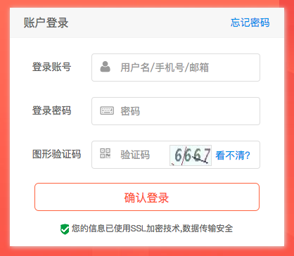

# 测试面试题

#### 作者：高天阳
#### 邮箱：13683265113@163.com

```
更改历史

* 2018-11-27        高天阳     初始化文档

```

## 1 描述下你在实际工作中，参与的项目工作流程是怎么样的。(从项目开始到最终上线结束)

答：

项目流程：发布需求=>制定计划=>原型设计=>UI设计=>系统开发=>测试=>最终上线

测试工作流程：需求分析=>提取测试点=>编写测试用例=>评审测试用例=>功能测试=>回归测试=>编写测试报告=>编写操作手册

测试工作流程：需求讨论=>需求确认=>编写项目文档=>编写测试用例=>评审测试用例=>功能测试=>回归测试=>系统测试=>编写测试报告=>编写操作手册=>项目上线

## 2 如果工作中遇到问题，你应该如何去解决。(遇到不明确的需求，或者遇到开发认为测试出的不是问题)

答：和项目经理反馈或开会讨论，对问题进行划分。如果需要解决，在bug管理平台指派给对应开发人员。如果不需要解决，在bug管理平台先将问题开放，
后期测试时，确定此bug是否对系统其他功能点有影响，若在最终判断无其他影响，再将其关闭。

## 3 参与项目整个周期你会产出那些文档。

答：测试计划、测试方案、测试指导书、测试用例(单元、集成、系统)、测试报告、用户手册、操作手册

## 4 简单说明一下(XX)文档是干什么用的。

答：

1. 测试计划：需要确定测试对象、测试组织、测试任务划分、测试失败/通过的标准、挂起恢复的条件、时间安排、资源安排、风险估计和应急计划等
1. 测试方案：侧重于规划测试活动的技术因素。如：确定被测特性、测试组网、测试对象关系图、测试原理、测试操作流程、测试需求、工具的设计、
测试用例的设计（只是说明用例的设计原则，具体的用例设计应该在用例文档指出）、测试数据的设计等等。
1. 测试指导书：指测试过程文档，用来定义测试过程中的阶段、活动、输入输出、角色职责、模板、工具等等。
1. 测试用例：测试用例是在测试过程中很重要的一类文档，它是测试工作的核心、是一组在测试时输入输出的标准、是软件需求的具体对照。
用来检验软件是否满足客户需求、体现一个测试人员的工作量、展现测试用例的设计思路。
1. 测试报告：
    1. 测试报告是产品部与技术部进行沟通的主要手段。
    1. 是一个测试活动的总结，项目是否结项的重要参考和依据。
    1. 软测试报告是对测试过程和测试结果进行分析和评估，确认测试计划是否得到完整履行、测试覆盖率是否达到预定要求以及对产品质量是否有足够信心，
    并最终在报告中给出测试和产品质量的评估结论。
1. 用户手册：用户手册是需求级别的文档，引导用户去操作该系统完成自己想要的功能。
1. 操作手册：操作手册是系统级别的文档，讲述的是如何操作、管理该系统。

## 5 文档详细作用问题：

### 5.1 测试计划与测试方案的区别：

答：

1. 区别一：
    1. 测试计划是组织层面的文档，从组织管理角度对一次测试活动进行规划测试方案是技术层面的文档
    1. 测试计划：需要确定测试对象、测试组织、测试任务划分、测试失败/通过的标准、挂起恢复的条件、时间安排、资源安排、风险估计和应急计划等；
测试方案：明确策略，细化测试特性、测试用例的规划、测试环境的规划，自动化测试框架的设计、测试工具的设计和选择等
    1. 测试计划考虑“做什么”，测试方案考虑“怎么做”
1. 区别二：
    1. 测试计划：
 对测试全过程的组织、资源、原则等进行规定和约束，并制订测试全过程各个阶段的任务以及时间进度安排，提出对各项任务
的评估、风险分析和需求管理。
    1. 测试方案：
描述需要测试的特性、测试的方法、测试环境的规划、测试工具的设计和选择、测试用例的设计方法、测试代码的设计方案。
    1. 测试计划是组织管理层面的文件，从组织管理的角度对一次测试活动进行规划。
    1. 测试方案是技术层面的文档，从技术的角度对一次测试活动进行规划。

### 5.2 测试用例所包含内容有什么：

答：用例编号、用例名称、测试背景、前置条件、测试内容、优先级、重要级、测试数据、测试步骤、预期结果、实际结果、测试人员、备注。

### 5.3 测试用例常用的设计方法有哪些：

答：等价类划分法、边界值分析法、错误推测法、判定表法、正交实验法、场景法。(因果图法、状态转化测试法等)

1. 等价类划分法：顾名思义，等价类划分，就是将测试的范围划分成几个互不相交的子集，
他们的并集是全集，从每个子集选出若干个有代表性的值作为测试用例。
2. 边界值分析法：长期的测试工作经验告诉我们，大量的错误是发生在输入或输出范围的边界上，而不是发生在输入输出范围的内部。
因此针对各种边界情况设计测试用例，可以查出更多的错误。选出的测试用例，应选取正好等于、刚刚大于、刚刚小于边界的值，
例如，对于在区间min，max的值，测试用例可以记为min，min+，max，max-。
3. 错误推测法是指：在测试程序时，人们可以根据经验或直觉推测程序中可能存在的各种错误，从而有针对性地编写检查这些错误的测试用例的方法。
这种方法没有固定的形式，依靠的是经验和直觉，很多时候，我们都会不知不觉的使用到
4. 判定表法：又称为策略表，基于策略表的测试，是功能测试中最严密的测试方法。该方法适合于逻辑判断复杂的场景，通过穷举条件获得结果，
对结果再进行优化合并，会得到一个判断清晰的策略表。
5. 正交实验法：用语言描述正交实验法会很抽象难懂，简单说，就是在各因素互相独立的情况下，设计出一种特殊的表格，找出能以少数替代全面的测试用例。
其中，上面所说的特殊表格就是正交表，是按照一定规则生成的表。虽然说是特殊的表格，实际表现形式跟一般的表格没有什么区别，正交表的主要特征是，
“均匀分布，整齐划一”，正是因为“均匀”的，所以才能以少数代替全部。

### 5.4 用户手册、操作手册的区别：

答：很显然，操作手册和用户手册都是要交付给用户的，但是这两个文档编写的角度不一样，故而使用这两个文档的用户的级别也是不同的。
如果把用户分为管理员和一般用户这两个级别，那么需要交付给管理员的就是操作手册，给一般用户的就是用户手册。

## 6 在测试过程中使用过哪些测试工具，起到什么作用：

答：

1. fiddler：对web/app进行抓包，获取请求数据，然后进行分析。
1. monkey：adb命令，进行压力测试，然后进行结果分析。
1. jmeter：压力测试。

## 7 测试工具详细使用问题：

### 7.1 fiddler是干什么用的，工作中是如何使用的：

答：fiddler可以对web和APP进行抓包，是做接口测试的，可以将网络传输发送与接受的数据包进行截获、重发、编辑、转存等操作。也可以用来检测网络安全，
例如是否有重要数据暴露在外。

### 7.2 Monkey是干什么用的，工作中是如何查看日志的：

答：monkey测试是Android平台自动化测试的一种手段，通过monkey程序模拟用户触摸屏幕、滑动trackbal、按键等操作来对设备上的程序进行压力测试，
检测程序多久时间会发生异常。

如何查看日志，日志的详细程度。怎么查看链接的设备，安装，卸载包(常用adb命令)：

参数-v指定日志详细

分为三级信息日志，-v-v-v三级日指最为详细，-v一级日志缺省信息量少。

日志级别level0

```
$ adb shell monkey –p com.ddinfo.ddmall –v 100
```

说明缺省值，仅提供启动提示、测试完成和最终结果等少量信息。

日志级别level1

```
$ adb shell monkey –p com.ddinfo.ddmall –v –v 100 
```

说明提供较为详细的日指，包括每个发送到activity的事件信息。

日志级别level2

```
$ adb shell monkey –p com.ddinfo.ddmall –v –v –v 100 
```

说明最详细日志，包括了测试中选中/未选中的activity的事件信息。

### 7.3 Jmeter是干什么用的，工作中是如何使用的：

答：Jmeter是Apache组织开发的基于Java的压力测试工具，能够对HTTP和FTP服务器进行压力测试和性能测试，也可以对任何数据库进行同样的测试。
基本操作流程：添加线程组，设置线程属性，添加HTTP或HTTPS请求，请求方法是get还是post，添加自定义参数，添加监听器，查看结果。

例如根据需求要求并发人数为1000，通过工具对数据库进行监听，并通过Xshell工具，对服务器进行监听，查看CPU和内存状态，界定此接口是否需要优化。

## 8 在测试过程中使用过哪些缺陷管理工具，怎么去设定问题的严重程度。(视本公司实际情况而定)：

答：类似jira、禅道、Bugfree等。发布问题一般都会有严重程度。如何界定严重程度每个公司都会有严重程度的等级说明，有的公司没有。
例如界面上出现了错别字，虽然不是功能错误，但可能影响了公司形象，界面的正确性，所以这个问题的严重性可以为高，或者紧急。

## 9 如果有一个项目时间紧急马上进行提测，你会如何开展工作：

答：首先做一个冒烟测试，对项目进行一遍整体流程测试，看是否能够跑通，如果可以跑通，根据测试用例测试核心模块，
如果核心模块测试没有问题，再依次测试其他功能模块，保证项目上线前所有功能可以正常上线。

## 10 如果项目即将上线，测出了一个bug，你会怎么办:

答：首先确认这个问题的准确性和严重程度，然后找到相关开发人员进行沟通，或者开会进行讨论，这个问题是否影响上线工作，
如果开会决定不影响则可以正常上线，这个问题放到下一次更新进行修复，如果问题比较严重，影响上线，则不可以上线。

## 11 打开公司官网登录页面，说明一下测试方案:




答：有效、无效、边界值、验证码、新老用户注册。

例如：

1. 用户名、邮箱、手机号是否同时可用
1. 密码是否有大小写、位数限制
1. 验证码的获取与重置
1. 登录按钮的文字反馈是否正确
1. 界面是否符合UI要求
1. 各输入框的边界测试
1. 等...
