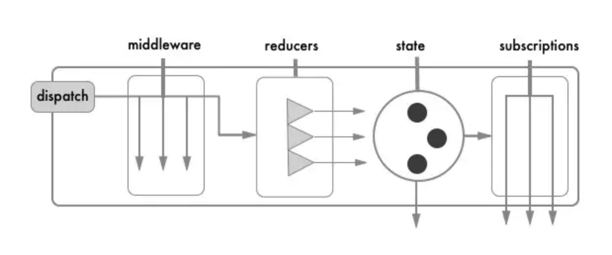
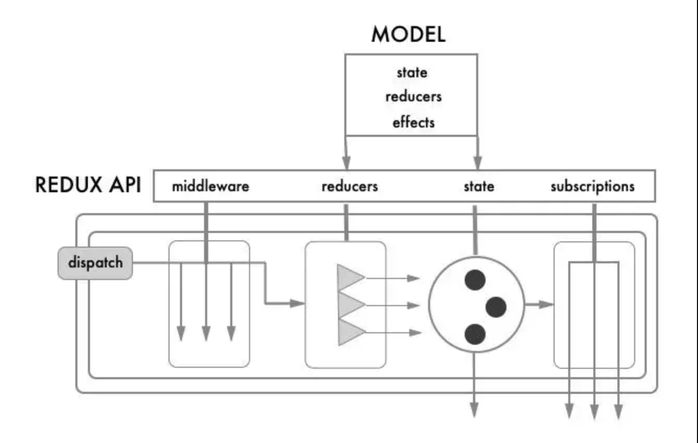

# redux探索：rematch

#### 作者：高天阳
#### 邮箱：13683265113@163.com

```
更改历史

* 2019-08-22	    高天阳	初始化文档

```

## 背景

> redux存在的问题

* 项目中redux的样板文件太分散，书写和维护都比较麻烦
* 使用thunk来处理异步操作，不是那么直观

## 快速开始

```
npm install @rematch/core
```

### Init

**init** 用来配置你的 reducers, devtools & store。

index.js

```javascript
import { init } from '@rematch/core'
import * as models from './models'

const store = init({
  models,
})
```

对于更高级的设置，查看[插件](https://rematch.gitbook.io/handbook/cha-jian)和[Redux配置选项](https://rematch.gitbook.io/handbook/)。

### Models

该model促使state， reducers， async actions 和 action creators 放在同一个地方。

models.js

```javascript
export const count = {
  state: 0, // initial state
  reducers: {
    // handle state changes with pure functions
    increment(state, payload) {
      return state + payload
    }
  },
  effects: {
    // handle state changes with impure functions.
    // use async/await for async actions
    async incrementAsync(payload, rootState) {
      await new Promise(resolve => setTimeout(resolve, 1000))
      this.increment(payload)
    }
  }
}
```
查看[reducer](https://github.com/rematch/rematch/blob/master/docs/api.md#reducers)文档以了解更多信息，包括如何从其他 modal 触发 actions。

理解模型与回答几个问题一样简单：

* 我的初始 state 是什么? **state**
* 我如何改变 state？ **reducers**
* 我如何处理异步 action？  **effects** with async/await

### Dispatch

**dispatch** 是我们如何在你的model中触发 reducers 和 effects。 Dispatch 标准化了你的action，而无需编写action types 或者  action creators。

```javascript
import { dispatch } from '@rematch/core'

                                                  // state = { count: 0 }
// reducers
dispatch({ type: 'count/increment', payload: 1 }) // state = { count: 1 }
dispatch.count.increment(1)                       // state = { count: 2 }

// effects
dispatch({ type: 'count/incrementAsync', payload: 1 }) // state = { count: 3 } after delay
dispatch.count.incrementAsync(1)                       // state = { count: 4 } after delay
```

Dispatch 能被直接调用，或者用 `dispatch[model][action](payload)`简写。

### View

* Count: [JS](https://codepen.io/Sh_McK/pen/BJMmXx?editors=1010) | [React](https://codesandbox.io/s/3kpyz2nnz6) | [Vue](https://codesandbox.io/s/n3373olqo0) | [Angular](https://stackblitz.com/edit/rematch-angular-5-count)
* Todos: [React](https://codesandbox.io/s/92mk9n6vww)

```javascript
import React from 'react'
import ReactDOM from 'react-dom'
import { Provider, connect } from 'react-redux'
import store from './index'

const Count = props => (
  <div>
    The count is {props.count}
    <button onClick={props.increment}>increment</button>
    <button onClick={props.incrementAsync}>incrementAsync</button>
  </div>
)

const mapState = state => ({
  count: state.count
})

const mapDispatch = ({ count: { increment, incrementAsync }}) => ({
  increment: () => increment(1),
  incrementAsync: () => incrementAsync(1)
})

const CountContainer = connect(mapState, mapDispatch)(Count)

ReactDOM.render(
  <Provider store={store}>
    <CountContainer />
  </Provider>,
  document.getElementById('root')
)
```

## API

```javascript
  import { init } from '@rematch/core';
  ​
  const store = init({
    models: {
      count: {
        state: 0,
        reducers: {
          add: (state, payload) => state + payload,
          del: (state, payload) => state - payload,
          'otherModel/actionName': (state, payload) => state + payload,
        },
        effets: {
          async loadData(payload, rootState) {
            const response = await fetch('http://example.com/data')
            const data = await response.json()
            this.add(data)
          }
        }
      },
      list: {}
    },
    redux: {
      reducers: {},
      middlewares: [thunk],
    },
    plugins: [loading]
  })
```

### init

对rematch进行初始化，返回一个store对象，包含了使用redux初始化store对象的所有字段。

### models: { [string]: model }

一个对象，属性的键作为rootState上的的键

### model.state: any

用来初始化model

### model.reducers: { [string]: (state, payload) => any }

一个对象，属性是用来改变model state的方法，第一个参数是这个model的上一个state，
第二个参数是payload，函数返回model下一个state。这些方法应该是纯函数。

### model.effects: { [string]: (payload, rootState) }

一个对象，异步或者非纯函数的方法放在这个对象中，可以与async/await一起使用

### redux

通过这个属性，可以兼容老项目中的redux配置。

### plugins

rematch是一个插件系统，通过这个字段可以配置第三方的插件。

redux流程：



rematch流程：



## 示例

### 简单示例

index.js

```javascript
  import React from 'react'
  import ReactDOM from 'react-dom'
  import { Provider } from 'react-redux'
  import { init } from '@rematch/core'
  import App from './App'
  ​
  const count = {
    state: 0,
    reducers: {
      increment: s => s + 1,
    },
    effects: dispatch => ({
      async asyncIncrement() {
        await new Promise(resolve => {
          setTimeout(resolve, 1000)
        })
        dispatch.count.increment()
      },
    }),
  }
  ​
  const store = init({
    module: {
      count,
    }
  })
  ​
  // Use react-redux's <Provider /> and pass it the store.
  ReactDOM.render(
    <Provider store={store}>
      <App />
    </Provider>,
    document.getElementById('root')
  )
```
​
App.js

```javascript
  import React from 'react'
  import { connect } from 'react-redux'
  ​
  // Make a presentational component.
  // It knows nothing about redux or rematch.
  const App = ({ count, asyncIncrement, increment }) => (
    <div>
      <h2>
        count is <b style={{ backgroundColor: '#ccc' }}>{count}</b>
      </h2>
  ​
      <h2>
        <button onClick={increment}>Increment count</button>{' '}
        <em style={{ backgroundColor: 'yellow' }}>(normal dispatch)</em>
      </h2>
  ​
      <h2>
        <button onClick={asyncIncrement}>
          Increment count (delayed 1 second)
        </button>{' '}
        <em style={{ backgroundColor: 'yellow' }}>(an async effect!!!)</em>
      </h2>
    </div>
  )
  ​
  const mapState = state => ({
    count: state.count,
  })
  ​
  const mapDispatch = dispatch => ({
    increment: dispatch.count.increment,
    asyncIncrement: dispatch.count.asyncIncrement,
  })
  ​
  // Use react-redux's connect
  export default connect(
    mapState,
    mapDispatch
  )(App)
```

### 复杂数据结构

一般来讲state中的数据结构是以对象的形式存储的，因为不只存储一个数据，那么例子需要作出适当调整

index.js

```javascript
import React from 'react';
import ReactDOM from 'react-dom';
import { Provider } from 'react-redux';
import { init } from '@rematch/core';
import App from './App';
const count = {
  state: {
    num: 0,
    flag: true,
    flagShow: true
  },
  reducers: {
    increment: (state, payload) => {
      return {
        ...state,
        num: payload
      }
    },
    toggle: (state, payload) => {
      return {
        ...state,
        flag: payload
      }
    },
    toggleShow: (state, payload) => {
      return {
        ...state,
        flagShow: payload
      }
    },
  },
  effects: dispatch => ({
    async asyncIncrement() {
      await new Promise(resolve => {
        setTimeout(resolve, 1000)
      })
      dispatch.count.increment()
    },
  }),
}
const store = init({
    models: {
        count
    }
})
// Use react-redux's <Provider /> and pass it the store.
ReactDOM.render(
    <Provider store={store}>
        <App />
    </Provider>,
document.getElementById('root')
)
```

app.js

```javascript
import React from 'react';
import { connect } from 'react-redux'
import { Componet } from './componet';

class App extends React.Component {

    // 未使用的constructor声明
    // constructor(props) {
    //     super(props)
    // }

    increment () {
        this.props.increment(this.props.count.num + 1)
    }
    // if切换
    toggle () {
        this.props.toggle(!this.props.count.flag)
    }
    // show 切换
    toggleShow () {
        this.props.toggleShow(!this.props.count.flagShow)
    }
    // 子组件传值
    handleClick (msg, name) {
        console.log('子组件传回父组件')
        console.log(msg, name);
    }

    // 通过匿名函数绑定this
    // handleClick = (msg, name) => {
    //     console.log('子组件传回父组件')
    //     console.log(msg, name);
    // }

    render() {
        return (
            <div>
                <h2>
                    count is <b style={{backgroundColor: '#ccc'}}>{this.props.count.num}</b>
                </h2>
                ​
                <h2>
                    <button onClick={this.increment.bind(this)}>增加count</button>
                    {' '}
                    <em style={{backgroundColor: 'yellow'}}>(normal dispatch)</em>
                </h2>
                ​
                <h2>
                    <button onClick={this.toggle.bind(this)}>类v-if实现</button>
                    <button onClick={this.toggleShow.bind(this)}>类v-show实现</button>
                    {' '}
                    <em style={{backgroundColor: 'yellow'}}>(normal dispatch)</em>
                </h2>

                <h2>
                    {'v-if当前值'}{this.props.count.flag ? 'true' : 'false'}
                </h2>
                <h2>
                    {'v-show当前值'}{this.props.count.flagShow ? 'true' : 'false'}
                </h2>

                <Componet
                    title="仿v-if、v-show"
                    msg="仿v-if、v-show"
                    v-if={this.props.count.flag}
                    v-show={this.props.count.flagShow}
                    onClick={this.handleClick.bind(this)}
                    // 通过匿名函数绑定this
                    // onClick={this.handleClick}
                />

                <h2>
                    <button onClick={this.props.asyncIncrement}>
                        Increment count (delayed 1 second)
                    </button>
                    {' '}
                    <em style={{backgroundColor: 'yellow'}}>(an async effect!!!)</em>
                </h2>
            </div>
        )
    }
}

const mapState = state => ({
  count: state.count,
})

const mapDispatch = dispatch => ({
  increment: dispatch.count.increment,
  toggle: dispatch.count.toggle,
  toggleShow: dispatch.count.toggleShow,
  asyncIncrement: dispatch.count.asyncIncrement,
})

export default connect(
    mapState,
    mapDispatch
)(App)
```

仿v-if、v-show效果展示

component.js

```javascript
import React, { Component } from 'react';

let name = 'zhangsan';
let msg = {
    name: 'zhangsan',
    age: 1212
};
export const Componet = (props) => {
    // console.log(props);
    if (props['v-if']) {
        let isShow = props['v-show'] ? 'block' : 'none';
        return (
            // 通过匿名函数绑定this
            // <ul onClick={props.onClick.bind(this, msg, name)} style={{display: isShow}} >
            <ul onClick={()=>props.onClick(msg, name)} style={{display: isShow}} >
                <li>${name}</li>
                <li>${props.title}</li>
                <li>${props.msg}</li>
                <li>zhangsan</li>
            </ul>
        );
    } else {
        return (<div></div>);
    }
};
```

## 最佳实践

### 老项目接入

主要针对已经使用thunk中间键的老项目。

#### 安装依赖，并删除依赖中的redux

> yarn add @rematch/core
>
> yarn remove redux （删除redux可能会造成eslint报错）

#### 修改redux入口文件

```javascript
  src/store/index.js
  ​
  import { init } from '@rematch/core';
  import thunk from 'redux-thunk';
  import reduxReducerConfig from '@/reducers';
  import models from '../models';
  ​
  const store = init({
    models,
    redux: {
      reducers: {
        ...reduxReducerConfig
      },
      middlewares: [thunk],
    },
  });
  ​
  export default store;
```

#### 修改reducers的入口文件

```javascript
  import { routerReducer as routing } from 'react-router-redux';
  - import { combineReducers } from 'redux';
  import dispatchConfigReducer from './dispatch-config';
  import counterReducer from './count';
  ​
  - export default combineReducers({
  -   routing,
  -   dispatchConfigReducer,
  -   counterReducer,
  - });
  ​
  + export default {
  +   routing,
  +   dispatchConfigReducer,
  +   counterReducer,
  + };
```
#### 增加model的入口文件

```javascript
  + src/models
  + src/models/re-count.js
  + src/models/config-list.js
  + src/models/index.js
  ​
  index.js
  ​
  import reCount from './re-count';
  import configList from './config-list';
  ​
  export default {
    reCount,
    configList,
  };
```

如果老项目中没有使用redux，可以使用`yarn remove thunk`删除thunk的依赖和reducers这个文件夹，
并且在init初始化的时候可以不用传redux这个配置。如果接入rematch，需要锁定版本，
rematch中引入的redux版本为4.0.0，所以老项目中的

### 新项目配置

```javascript
  index.js
  ​
  import React from 'react';
  import { render } from 'react-dom';
  import { browserHistory, Router } from 'react-router';
  import { syncHistoryWithStore } from 'react-router-redux';
  import { Provider } from 'react-redux';
  import routes from '@/routes';
  import store from '@/store';
  import '@/styles/index.less';
  ​
  const history = syncHistoryWithStore(browserHistory, store);
  ​
  render(
    <Provider store={store}>
      <Router history={history} routes={routes} />
    </Provider>,
    document.getElementById('root'),
  );
  ​
  ---------------------------------------------------------------------------------------
  ​
  // 新建store文件夹，并添加index.js
  ​
  import { init } from '@rematch/core';
  import { routerReducer as routing } from 'react-router-redux';
  import models from '../models';
  ​
  const store = init({
    models,
    redux: {
      reducers: {
        routing,
      },
    },
  });
  ​
  export default store;
  ​
  ---------------------------------------------------------------------------------------
  ​
  // 新建models文件夹，并添加index
  ​
  models结构
  ├── common
  │   ├── bizLineList.js
  │   └── index.js
  └── index.js
```

### bug

Redux DevTools 要升级到最新版，2.16.0有bug

## 同类技术比较

基于redux数据流的管理方案：`Dva`、`mirror`和`rematch`

### Dva

Dva是蚂蚁金服开源的一个数据流管理方案，基于redux和redux-saga，简化了开发体验。
Dva是一揽子的解决方案，可以使用侵入性很强的dva-cli来快速搭建项目，提供了路由层面的适配；
也可以使用dva-core来引入核心的代码，减少侵入性。

#### 缺点

* 如果使用Dva的一整套框架，现有的项目会有较大的改动
* Dva使用redux-saga来处理异步，学习成本比较高

### mirror

[mirror](https://github.com/mirrorjs/mirror)类似于Dva的一个redux数据流方案，最新一次更新在两个月之前，一直没有发布1.0的版本

### rematch

[rematch](https://github.com/rematch/rematch)的灵感来自于Dva和mirror，将两者的有点结合了起来。

#### 优点

* 使用了类似Dva的model文件结构，统一管理同步和异步操作
* 通过中间键实现了async/await的方式来处理异步，舍弃了Dva中的redux-saga
* 提供了redux的配置项，可以兼容项目中的老代码
* 支持多个store

#### 缺点

* 将model中reducers和effects的方法挂载在dispatch函数上，造成dispatch既是一个函数，又是一个对象

||Rematch|Mirror|Dva|
|:--:|:--:|:--:|:--:|
|适用框架|所有框架 / 不使用框架|React|React|
|适用路由|所有路由 / 不使用路由|RR4|RR3, RR4 / 不使用路由|
|移动端|√|x|√|
|开发者工具|Redux, Reactotron|Redux|Redux|
|插件化|√|√|√|
|reducers|√|√|√|
|effects|async/await|async/await|redux saga|
|effect params|(payload, internals)|(action, state)|(action, state)|
|监听方式|subscriptions|hooks|subscriptions|
|懒加载模型|√|√|√|
|链式 dispatch|√|√|√|
|直接 dispatch|√|||
|dispatch promises|√||√|
|加载插件|√|√|√|
|persist plugin|√|||
|package size|14.9k（gzipped: 5.1k）<br> redux + thunk: 6k（2k）|130.4k（gzipped: 33.8k）|dva-core: 72.6k（gzipped: 22.5k）|

## 参考资料

* [redux探索：rematch](https://juejin.im/post/5bfff1b7e51d45517b0ce5a7)
* [重新思考Redux](https://rematch.gitbook.io/handbook/)
* [Rematch: 重新设计 Redux](https://zhuanlan.zhihu.com/p/34199586)
* [精读《重新思考 Redux》](https://zhuanlan.zhihu.com/p/36810237)
* [react中实现防vue中的v-if 和v-show指令切换效果](https://blog.csdn.net/CodingNoob/article/details/86693591)
