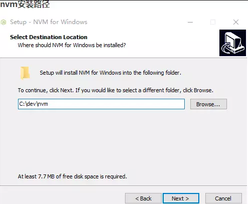
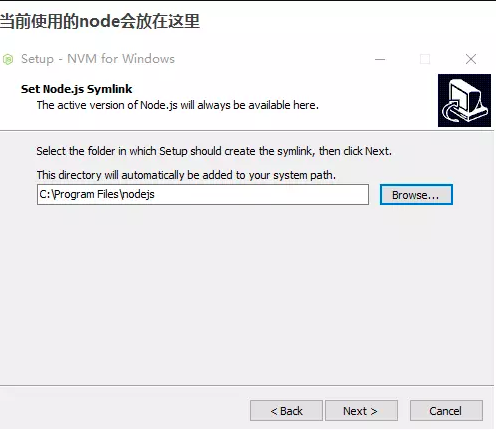
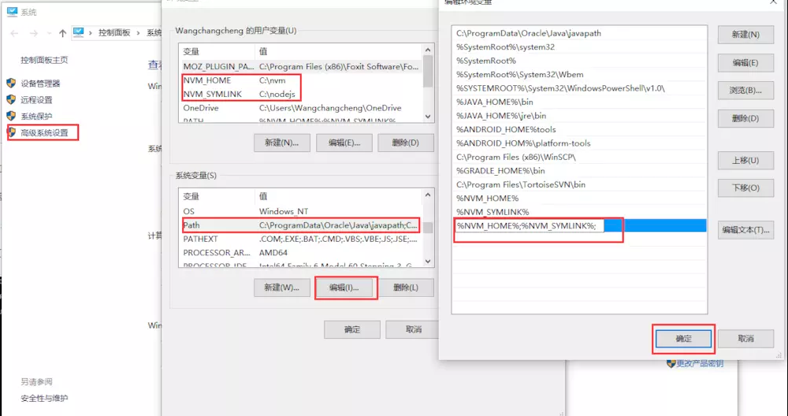
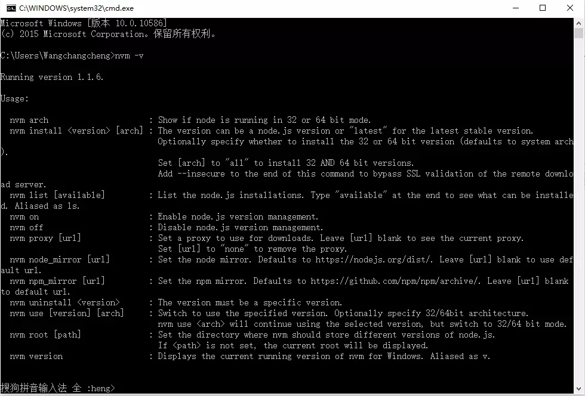
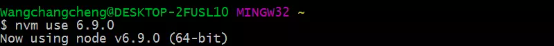
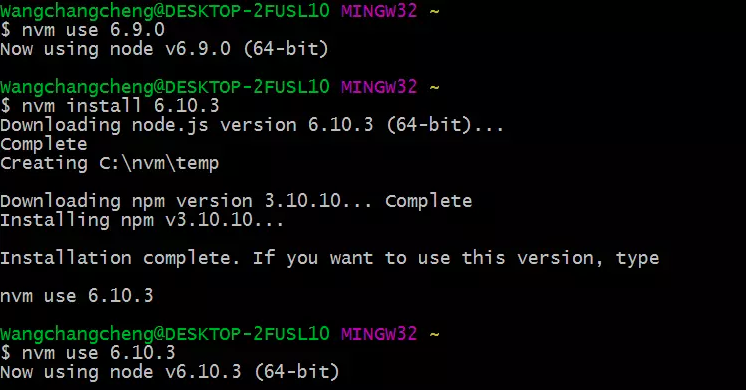
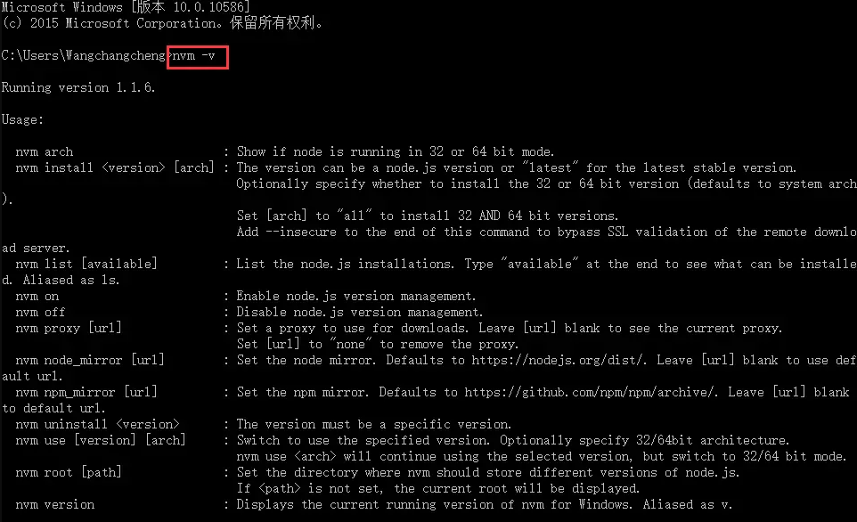

# NVM的使用

#### 作者：高天阳
#### 邮箱：13683265113@163.com

```
更改历史

* 2018-11-01        高天阳     初始化文档

```

## 1 简介

我们可能同时在进行2个项目，而2个不同的项目所使用的node版本又是不一样的，或者是要用更新的node版本进行试验和学习。
这种情况下，对于维护多个版本的node将会是一件非常麻烦的事情，而nvm就是为解决这个问题而产生的，
他可以方便的在同一台设备上进行多个node版本之间切换，而这个正是nvm的价值所在，详情可以查看官网[NVM官网](https://nvmexpress.org/)。

## 2 安装

### 2.1 Windows安装

#### 2.1.1 下载

如果已经单独安装了node，建议卸载，然后继续向下看。

直接进入安装包[下载地址](https://github.com/coreybutler/nvm-windows/releases)，选择nvm-setup.zip，下载后直接安装。



> 选择nvm安装路径



> 选择node安装位置

#### 2.1.2 配置环境变量



> 配置环境变量

#### 2.1.3 验证是否安装成功

打开命令行，执行nvm -v命令后，出现一下类似的提示说明安装成功。



> 验证nvm是否安装成功

#### 2.1.4 安装nodeJS

使用`nvm install <version> [<arch>]`命令下载需要的版本。arch参数表示系统位数，
默认是64位，如果是32位操作系统，需要执行命令：`nvm install 6.9.0 32`，出现下图表示安装完成：


> 验证nvm是否安装成功

#### 2.1.5 使用特定Node版本

执行`nvm use <version> [<arch>]` 命令开始使用特定版本。比如：`nvm use 6.9.0`或者`nvm use 6.9.0 32`



> 使用node6.9.0版本

#### 2.1.6 测试版本切换

刚刚下载了node 6.9.0版本并且成功使用，现在我们下载一个6.10.3版本，然后切换并使用。



> 切换node版本到高版本

### 2.2 Mac安装

mac下面的安装，其实就可以按照linux的安装就可以了！

安装的命令我们可以在nvm的github的资源上面得到安装方法：

mac使用的命令是：

```
curl -o- https://raw.githubusercontent.com/creationix/nvm/v0.33.8/install.sh | bash
```

在终端中执行上面的命令，安装完成以后，提示：

```
export NVM_DIR="$HOME/.nvm"
[ -s "$NVM_DIR/nvm.sh" ] && \. "$NVM_DIR/nvm.sh"  # This loads nvm
[ -s "$NVM_DIR/bash_completion" ] && \. "$NVM_DIR/bash_completion"  # This loads nvm bash_completion
```

切换到$HOME下面(快速的切换：直接输入cd 回车)，查看是否有.bash_profile,如果没有的话就创建！

创建.bash_profile命令，

```
touch .bash_profile
```

打开：

```
open .bash_profile
```

如果在linux中最好用vi打开你需要的文件，这时候把提示的内容copy进去就可以了！

使用命令查看安装的版本：

```
nvm -version
```

## 3 使用

### 3.1 NVM常用命令及含义

查看nvm可用指令，可以这样做

```
nvm -v
```

```
nvm --help                              # 显示所有信息
nvm --version                           # 显示当前安装的nvm版本
nvm install [-s] <version>              # 安装指定的版本，如果不存在.nvmrc,就从指定的资源下载安装
nvm install [-s] <version>  -latest-npm # 安装指定的版本，平且下载最新的npm
nvm uninstall <version>                 # 卸载指定的版本
nvm use [--silent] <version>            # 使用已经安装的版本  切换版本
nvm current                             # 查看当前使用的node版本
nvm ls                                  # 查看已经安装的版本
nvm ls  <version>                       # 查看指定版本
nvm ls-remote                           # 显示远程所有可以安装的nodejs版本
nvm ls-remote --lts                     # 查看长期支持的版本
nvm install-latest-npm                  # 安装罪行的npm
nvm reinstall-packages <version>        # 重新安装指定的版本
nvm cache dir                           # 显示nvm的cache
nvm cache clear                         # 清空nvm的cache
```



## 5 同类技术比较


## 参考资料

* [nvm介绍及使用](https://www.jianshu.com/p/d0e0935b150a)
* [NVM的安装和命令](https://www.cnblogs.com/SpecterGK/p/8550392.html)
