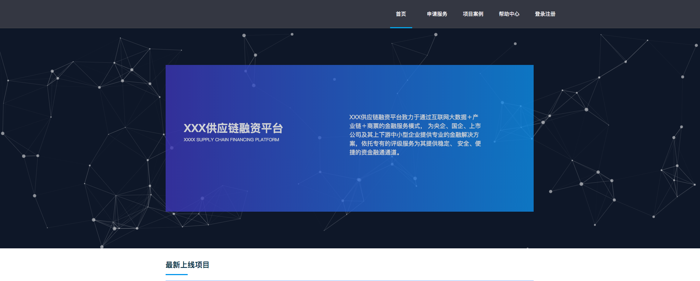

# particles.js粒子效果

#### 作者：高天阳
#### 邮箱：13683265113@163.com

```
更改历史

* 2019-06-03        高天阳     初始化文档

```

## 1 介绍

particles.jss是一个用于创建粒子的轻量级JavaScript库


## 2 安装

### 2.1 npm安装

[npm地址](https://www.npmjs.com/package/particles.js)

```
npm install particles.js
```

### 2.2 bower安装

```
bower install particles.js --save
```

### 2.3 script引入

```
<script src="particles.js"></script>
```

## 3 配置参数

| 键值 | 参数选项/ 说明 | 实例 |
| :--- | :--- | :--- |
| particles.number.value | number   数量 | 40 |
| particles.number.density.enable | boolean | true / false |
| particles.number.density.value_area | number   区域散布密度大小 | 800 |
| particles.color.value | HEX (string) <br> RGB (object) <br> HSL (object) <br> array selection (HEX) <br> random (string)<br>原子的颜色 | "#b61924"  <br> {r:182, g:25, b:36}  <br> {h:356, s:76, l:41}  <br> ["#b61924", "#333333", "999999"]  <br> "random" |

| 键值 | 参数选项/ 说明 | 实例 |
| :--- | :--- | :--- |
| particles.shape.type | string <br> array selection 原子的形状 | "circle" <br> "edge" <br> "triangle" <br> "polygon" <br> "star" <br> "image" <br> ["circle", "triangle", "image"] |
| particles.shape.stroke.width | number 原理的宽度 | 2 |
| particles.shape.stroke.color | HEX (string)  原子颜色 | "#222222" |
| particles.shape.polygon.nb_slides | number    原子的多边形边数 | 5 |
| particles.shape.image.src | path link <br> svg / png / gif / jpg  原子的图片可以使用自定义图片 | "assets/img/yop.svg" <br> "http://XXX.com/yop.png" |
| particles.shape.image.width | number <br> (for aspect ratio) 图片宽度 | 100 |
| particles.shape.image.height | number <br> (for aspect ratio) 图片高度 | 100 |

| 键值 | 参数选项/ 说明 | 实例 |
| :--- | :--- | :--- |
| particles.opacity.value | number (0 to 1)   不透明度 | 0.75 |
| particles.opacity.random | boolean    随机不透明度 | true / false |
| particles.opacity.anim.enable | boolean    渐变动画 | true / false |
| particles.opacity.anim.speed | number 渐变动画速度 | 3 |
| particles.opacity.anim.opacity_min | number (0 to 1)  渐变动画不透明度 | 0.25 |
| particles.opacity.anim.sync | boolean | true / false |

| 键值 | 参数选项/ 说明 | 实例 |
| :--- | :--- | :--- |
| particles.size.value | number 原子大小 | 20 |
| particles.size.random | boolean    原子大小随机 | true / false |
| particles.size.anim.enable | boolean    原子渐变 | true / false |
| particles.size.anim.speed | number 原子渐变速度 | 3 |
| particles.size.anim.size_min | number | 0.25 |
| particles.size.anim.sync | boolean | true / false |

| 键值 | 参数选项/ 说明 | 实例 |
| :--- | :--- | :--- |
| particles.line_linked.enable | boolean    连接线 | true / false |
| particles.line_linked.distance | number 连接线距离 | 150 |
| particles.line_linked.color | HEX (string)   连接线颜色 | #ffffff |
| particles.line_linked.opacity | number (0 to 1)    连接线不透明度 | 0.5 |
| particles.line_linked.width | number 连接线的宽度 | 1.5 |

| 键值 | 参数选项/ 说明 | 实例 |
| :--- | :--- | :--- |
| particles.move.enable | boolean    原子移动 | true / false |
| particles.move.speed | number 原子移动速度 | 4 |
| particles.move.direction | string 原子移动方向 | "none" <br> "top" <br> "top-right" <br> "right" <br> "bottom-right" <br> "bottom" <br> "bottom-left" <br> "left" <br> "top-left" |
| particles.move.random | boolean    移动随机方向 | true / false |
| particles.move.straight | boolean    直接移动 | true / false |
| particles.move.out_mode | string <br> (out of canvas)    是否移动出画布 | "out" <br> "bounce" |
| particles.move.bounce | boolean <br> (between particles)   是否跳动移动	 | true / false |
| particles.move.attract.enable | boolean    原子之间吸引 | true / false |
| particles.move.attract.rotateX | number 原子之间吸引X水平距离 | 3000 |
| particles.move.attract.rotateY | number y垂直距离 | 1500 |
| interactivity.detect_on | string  原子之间互动检测 | "canvas", "window" |

| 键值 | 参数选项/ 说明 | 实例 |
| :--- | :--- | :--- |
| interactivity.events.onhover.enable | boolean    悬停 | true / false |
| interactivity.events.onhover.mode | string <br> array selection <br> 悬停模式  | "grab"   抓取临近的 <br> "bubble"  泡沫球效果 <br> "repulse"  击退效果 <br> ["grab", "bubble"] |
| interactivity.events.onclick.enable | boolean  点击效果 | true / false |
| interactivity.events.onclick.mode | string array selection    点击效果模式 | "push" <br> "remove" <br> "bubble" <br> "repulse" <br> ["push", "repulse"] |
| interactivity.events.resize | boolean 互动事件调整 | true / false |
| interactivity.events.modes.grab.distance | number 原子互动抓取距离 | 100 |
| interactivity.events.modes.grab.line_linked.opacity | number (0 to 1) 原子互动抓取距离连线不透明度 | 0.75 |
| interactivity.events.modes.bubble.distance | number 原子抓取泡沫效果之间的距离 | 100 |
| interactivity.events.modes.bubble.size | number 原子抓取泡沫效果之间的大小 | 40 |
| interactivity.events.modes.bubble.duration | number   原子抓取泡沫效果之间的持续事件 (second) | 0.4 |
| interactivity.events.modes.repulse.distance | number 击退效果距离 | 200 |
| interactivity.events.modes.repulse.duration | number 击退效果持续事件    (second) | 1.2 |
| interactivity.events.modes.push.particles_nb | number 粒子推出的数量 | 4 |
| interactivity.events.modes.remove.particles_nb | number | 4 |
| retina_detect | boolean   视网膜检测 | true / false |

## 4 示例

```html
<!DOCTYPE html>
<html lang="en">

<head>
    <meta charset="UTF-8">
    <title>particles Demo</title>
    <style class="cp-pen-styles">
        #particles-js {
            position: absolute;
            width: 100vw;
            height: 100vh;
            z-index: -1;
        }

        body {
            background: #171e2a;
        }
    </style>
</head>

<body>
    <div id="particles-js">
    </div>
    <script src='./particles.min.js'></script>
    <script>
    //particles-js 为 HTML-DOM  ID
    particlesJS("particles-js", {
        //颗粒参数
        "particles": {
            "number": {
                //离粒子显示的数量值
                "value": 100,
                //密度
                "density": {
                    //激活
                    "enable": true,
                    //值区 值越小 显示的越多
                    "value_area": 300
                }
            },
            "color": {
                //下面是各种可接收值的格式
                //"#b61924" 
                // {r:182, g:25, b:36} 
                // {h:356, s:76, l:41} 
                // ["#b61924", "#333333", "999999"] 
                // "random"
                "value": "#ffffff"
            },
            //形状
            "shape": {
                //下面是各种可接收值的格式 都可以与下面的 nb_sides 边的数量结合使用
                //"circle"  园
                // "edge" 有边的 看起来像是嵌套的一种图形
                // "triangle" 三角形
                // "polygon" 多边形
                // "star" 星星
                // "image" 图片 对应下面的 image 参数
                // ["circle", "triangle", "image"]  数组混合参数 这样出来的形状就像是随机的多个形状
                "type": "circle",
                //
                "stroke": {
                    "width": 1,
                    "color": "#fff"
                },
                //多边形 配合上面的形状使用
                "polygon": {
                    //边数
                    "nb_sides": 5
                },
                //图片参数 配合上面的形状 type 为 image 使用
                "image": {
                    "src": "http://www.dynamicdigital.us/wp-content/uploads/2013/02/starburst_white_300_drop_2.png",
                    "width": 100,
                    "height": 100
                }
            },
            //透明度
            "opacity": {
                //数字（0到1）
                "value": 0.5,
                //布尔值
                "random": true,
                //动画参数
                "anim": {
                    //激活
                    "enable": false,
                    //速度
                    "speed": 1,
                    //时间
                    "opacity_min": 0.1,
                    //同步 
                    //布尔值
                    "sync": false
                }
            },
            //尺寸
            "size": {
                //粒子尺寸的数值 
                //注意：不可过大会报错  这个数值应该是计算推算出的一个大致的区间
                "value": 1,
                "random": false,
                "anim": {
                    "enable": false,
                    "speed": 20,
                    "size_min": 1,
                    "sync": false
                }
            },
            //连接线
            "line_linked": {
                //激活
                "enable": false,
                //距离
                "distance": 50,
                "color": "#ffffff",
                "opacity": 0.6,
                "width": 1
            },
            //移动
            "move": {
                "enable": true,
                //移动的速度
                "speed": 10,
                //移动的方向
                //下面是各种可接收值
                //"none" 
                // "top" 
                // "top-right" 
                // "right" 
                // "bottom-right" 
                // "bottom" 
                // "bottom-left" 
                // "left" 
                // "top-left"
                "direction": "none",
                "random": true,
                //直线运动 数值为 true 粒子动效不好看
                //布尔值
                "straight": false,
                //输出模式
                //下面是各种可接收值
                //"out" 跑到外面
                //"bounce"  反弹
                "out_mode": "out",
                //粒子之间碰撞是否反弹
                //布尔值
                "bounce": false,
                //吸引 激活之后粒子的方向会有些杂乱无章
                "attract": {
                    "enable": false,
                    "rotateX": 300,
                    "rotateY": 1200
                }
            }
        },
        //互动性
        "interactivity": {
            //检测
            //下面是各种可接收值
            //"canvas", "window"
            "detect_on": "canvas",
            //添加各种事件
            "events": {
                //鼠标经过
                "onhover": {
                    "enable": false,
                    //模式
                    //下面是各种可接收值
                    //"grab" 抓住  显示的是粒子间的连接线
                    // "bubble" 气泡 显示的是放大版的上面的 image src 的图片 
                    // "repulse" 浅水 使粒子无法进入鼠标固定的范围
                    // ["grab", "bubble"]  还可以用数组的形式来设置
                    "mode": "bubble"
                },
                //点击事件
                "onclick": {
                    "enable": false,
                    //下面是各种可接收值
                    //"push"  增加粒子
                    // "remove"  删除粒子
                    // "bubble" 
                    // "repulse" 
                    // ["push", "repulse"]
                    "mode": "repulse"
                },
                //调整大小
                //布尔值
                "resize": false
            },
            //给上面的可设置的模式增加更多的的参数设置
            "modes": {
                "grab": {
                    //距离
                    "distance": 150,
                    //连接线
                    "line_linked": {
                        "opacity": 1
                    }
                },
                "bubble": {
                    "distance": 200,
                    //尺寸
                    "size": 20,
                    //持续的时间
                    "duration": 2,
                    "opacity": 8,
                    //速度
                    "speed": 3
                },
                "repulse": {
                    "distance": 200,
                    "duration": 0.2
                },
                //增加
                "push": {
                    //颗粒面积
                    "particles_nb": 1
                },
                //去除
                "remove": {
                    //颗粒面积
                    "particles_nb": 2
                }
            }
        },
        "retina_detect": true //视网膜检测
    });
    </script>
</body>

</html>
```

## 5 实际效果



## 6 最佳实践

### 6.1 vue中使用

#### 6.1.1 安装

```
npm install --save particles.js
```

#### 6.1.2 引入

当你的使用范围比较小时，可以直接在当前vue文件的script中引入，即

```
//vue单文件
import particles from 'particles.js'
```

又或者你觉得这样不好管理，一定要放在main文件中也可以

```
//main文件
import particles from 'particles.js'
Vue.use(particles)
```

#### 6.1.3 配置

#### 6.1.3.1 template

这个就是动态粒子要展示的位置。

```html
<div id="particles"></div>
```

#### 6.1.3.2 script

因为涉及到dom树，所以必须在挂载结束后初始化particles.js。第一个参数id就是你在template上取得id名，
像我要写的话就是particles。第二个参数是你的data存放的路径，个人建议使用相对路径。

```
mounted(){
    particlesJS.load('id','path to your particles.data');
    // particlesJS('id', 'particles.data') // 配置文件直接写在vue之中时
}
```

#### 6.1.3.3 script

```stylus
#particles{
      position: absolute;
      width: 100%;
      height: 100%;
      background-color: #b61924;
      background-repeat: no-repeat;
      background-size: cover;
      background-position: 50% 50%;
}
```

#### 6.1.3.4 particles.json

这个文件就相当于配置文件，用于控制粒子在页面中所呈现的状态。通过修改里边的字段，来得到自己想要的效果。
如修改particles.color.value 的值就是修改粒子的颜色；修改particle.shape就是修改粒子的外观。
至于详细的参数解析可以参考官网ps：建议放在静态资源文件夹里

```stylus
{
  "particles": {
    "number": {
      "value": 60,
      "density": {
        "enable": true,
        "value_area": 800
      }
    },
    "color": {
      "value": "#ffffff"
    },
    "shape": {
      "type": "circle",
      "stroke": {
        "width": 0,
        "color": "#000000"
      },
      "polygon": {
        "nb_sides": 5
      },
      "image": {
        "src": "img/github.svg",
        "width": 100,
        "height": 100
      }
    },
    "opacity": {
      "value": 0.5,
      "random": false,
      "anim": {
        "enable": false,
        "speed": 1,
        "opacity_min": 0.1,
        "sync": false
      }
    },
    "size": {
      "value": 3,
      "random": true,
      "anim": {
        "enable": false,
        "speed": 40,
        "size_min": 0.1,
        "sync": false
      }
    },
    "line_linked": {
      "enable": true,
      "distance": 150,
      "color": "#ffffff",
      "opacity": 0.4,
      "width": 1
    },
    "move": {
      "enable": true,
      "speed": 4,
      "direction": "none",
      "random": false,
      "straight": false,
      "out_mode": "out",
      "bounce": false,
      "attract": {
        "enable": false,
        "rotateX": 100,
        "rotateY": 1200
      }
    }
  },
  "interactivity": {
    "detect_on": "Window",
    "events": {
      "onhover": {
        "enable": true,
        "mode": "grab"
      },
      "onclick": {
        "enable": true,
        "mode": "push"
      },
      "resize": true
    },
    "modes": {
      "grab": {
        "distance": 140,
        "line_linked": {
          "opacity": 1
        }
      },
      "bubble": {
        "distance": 400,
        "size": 40,
        "duration": 2,
        "opacity": 8,
        "speed": 3
      },
      "repulse": {
        "distance": 200,
        "duration": 0.4
      },
      "push": {
        "particles_nb": 4
      },
      "remove": {
        "particles_nb": 2
      }
    }
  },
  "retina_detect": true
}
```

### 6.2 效果加载失败

在实际使用过程中 出现了虽然加载 但是未能成功显示粒子效果 原因是particles的dom节点样式加载在配置文件之后 导致加载配置文件时 dom的尺寸异常
解决方案为把css样式移动到js之前 即可正常展示

## 参考资料

* [particles.js github](https://github.com/VincentGarreau/particles.js)
* [particles.js npm](https://www.npmjs.com/package/particles.js)
* [使用 particles.js 粒子效果 Demo](https://www.jianshu.com/p/6ae1ce9d9854)
* [particles.js使用及配置](https://www.cnblogs.com/wangyihong/p/8618305.html)
* [particles.js在vue上的运用](https://www.jianshu.com/p/c52b3e91c94f)

