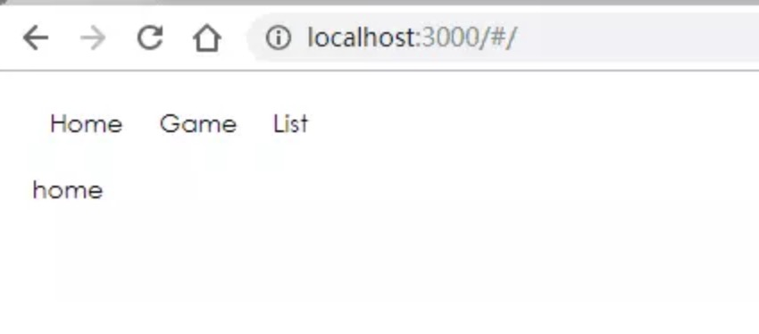
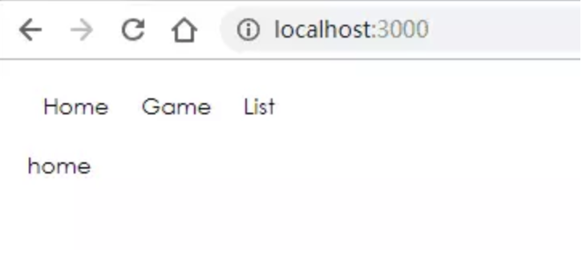
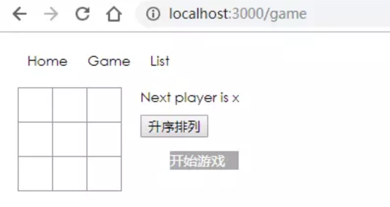
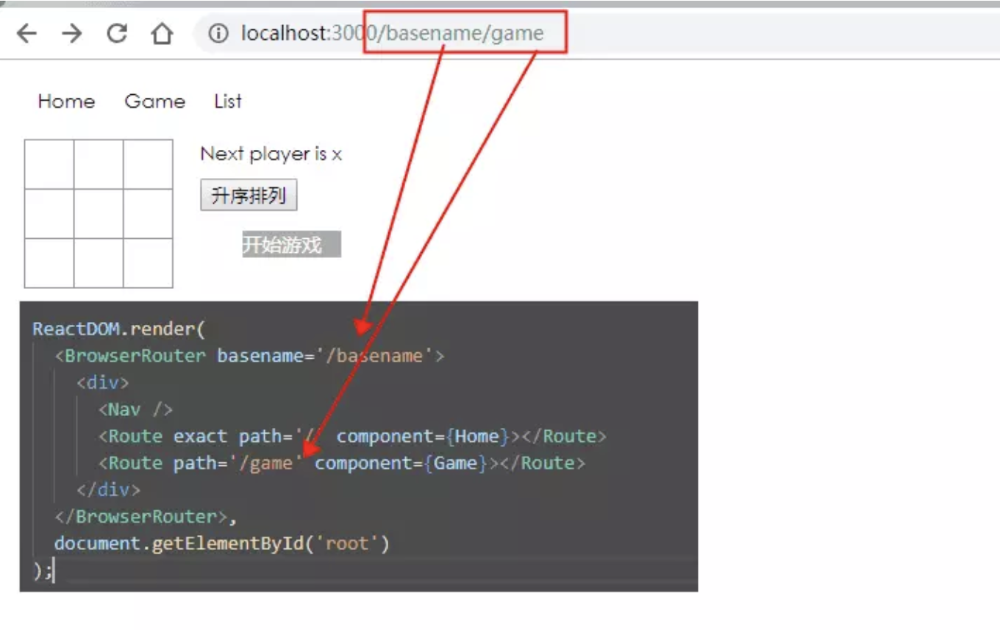
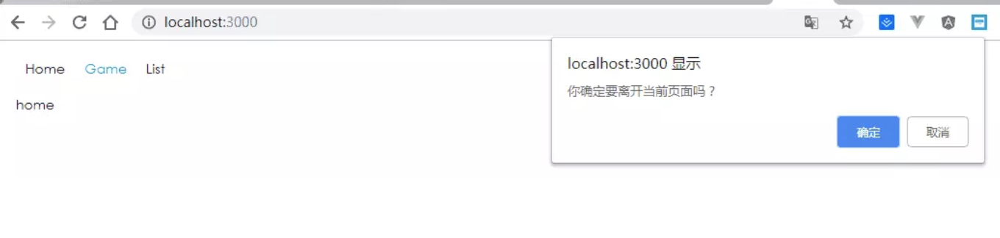
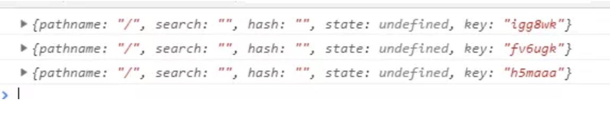
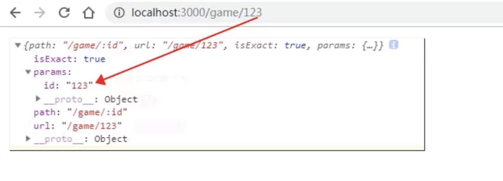
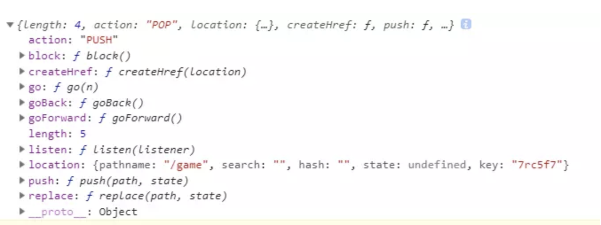

# react-router-dom

#### 作者：高天阳
#### 邮箱：13683265113@163.com

```
更改历史

* 2019-09-02	    高天阳	初始化文档

```

## 背景

react-router-v4，我称之为“第四代react-router”，react-router和react-router-dom的区别是什么呢？

为什么有时候我们看到如下的写法：

写法1:

```
import {Swtich, Route, Router, HashHistory, Link} from 'react-router-dom';
```
写法2:

```
import {Switch, Route, Router} from 'react-router';
import {HashHistory, Link} from 'react-router-dom';
```

先简单说下各自的功能：

`react-router`: 实现了路由的核心功能

`react-router-dom`: 基于`react-router`，加入了在浏览器运行环境下的一些功能，
例如：`Link`组件，会渲染一个`a`标签，
[Link组件源码`a`标签行](https://github.com/ReactTraining/react-router/blob/master/packages/react-router-dom/modules/Link.js#L76);
 `BrowserRouter`和`HashRouter`组件，前者使用`pushState`和`popState`事件构建路由，
 后者使用`window.location.hash`和`hashchange`事件构建路由。

`react-router-native`: 基于`react-router`，类似`react-router-dom`，加入了`react-native`运行环境下的一些功能。

从源码层面来说明：

首先看`react-router-dom`中的`Switch`组件的源码

```
// Written in this round about way for babel-transform-imports
import { Switch } from 'react-router'
export default Switch
```

只是从`react-router`中导入`Switch`组件，然后重新导出而已。

通过查看其他模块的源码，Route组件的源码、Router组件的源码发现，和`Swtich`一样，都是从`react-router`中导入了相应的组件，
重新导出而已，并没有对实现做什么特殊处理。

结论：

`react-router-dom`依赖`react-router`，所以我们使用`npm`安装依赖的时候，只需要安装相应环境下的库即可，不用再显式安装`react-router`。
基于浏览器环境的开发，只需要安装`react-router-dom`；基于`react-native`环境的开发，只需要安装`react-router-native`。
`npm`会自动解析`react-router-dom`包中`package.json`的依赖并安装。

`react-router-dom`中`package.json`依赖:

```
"dependencies": {
    "history": "^4.7.2",
    "invariant": "^2.2.2",
    "loose-envify": "^1.3.1",
    "prop-types": "^15.5.4",
    "react-router": "^4.2.0",
    "warning": "^3.0.0"
  }
```

安装了`react-router-dom`，`npm`会解析并安装上述依赖包。可以看到，其中包括`react-router`。

所以，回到最开始的写法。基于浏览器环境的开发，写法1就可以了。

## 如何选用

`react-router-dom` 比前者多出了 &lt;Link>、&lt;BrowserRouter> 这样的 DOM 类组件。
因此我们只需引用 `react-router-dom` 这个包就行了。当然，如果搭配 `redux` ，你还需要使用 `react-router-redux`。

## 核心

### HashRouter和BrowserRouter

`HashRouter` 和 `BrowserRouter` 像是一个 box 所有的 route 都需要放在里面。

### HashRouter

`HashRouter` 是通过 `hash` 值来对路由进行控制。使用 `HashRouter`，路由会默认有个#。




```
ReactDOM.render(
  <HashRouter>
    <div>
      <Nav />
      <Route exact path='/' component={Home}></Route>
      <Route path='/game' component={Game}></Route>
    </div>
  </HashRouter>,
  document.getElementById('root')
);
```

小游戏详见: [react 三子棋小游戏](https://www.jianshu.com/p/eec0943107a2)

### BrowserRouter

`BrowserRouter` 使用了 HTML5 history API，保证 UI 界面和 URL 保持同步。使用 `BrowserRouter` ，路由不会有个#。





```
ReactDOM.render(
  <BrowserRouter>
    <div>
      <Nav />
      <Route exact path='/' component={Home}></Route>
      <Route path='/game' component={Game}></Route>
    </div>
  </BrowserRouter>,
  document.getElementById('root')
);
```

#### basename: string

为所有位置添加一个基准URL，当需要把页面部署到服务器的二级目录时，可以使用 `basename` 设置到此目录。



#### getUserConfirmation: func

导航到此页面前执行的函数，默认使用 `window.confirm` (需同 Prompt 配合使用)
此为默认行为



```
const getConfirmation = (message, callback) => {
  const allowTransition = window.confirm(message);
  callback(allowTransition);
}

// ========================================

ReactDOM.render(
  <BrowserRouter getUserConfirmation={getConfirmation}>
    <div>
      <Prompt message="你确定要离开当前页面吗？" />
      <Nav />
      <Route exact path='/' component={Home}></Route>
      <Route path='/game' component={Game}></Route>
    </div>
  </BrowserRouter>,
  document.getElementById('root')
);
```

传送门：[react-history](https://www.npmjs.com/package/react-history)

#### forceRefresh: bool

若为 `true`，导航过程中会刷新整个页面。多在不支持 HTML5 history API 的浏览器中使用此功能。

#### keyLength: number

设置它里面路由的 `location.key` 的长度。默认是6。（key：点击同一个链接时, `location.key` 都会改变。）

`this.props.location`



#### children: node

渲染唯一子元素，React组件自带 `children` 属性。

传送门：[react.children属性](https://reactjs.org/docs/react-api.html#reactchildren)

### Route

控制路径对应显示的组件

```
ReactDOM.render(
  <BrowserRouter>
    <div>
      <Nav />
      <Route exact path='/' component={Home}></Route>
      <Route path='/game' component={Game}></Route>
    </div>
  </BrowserRouter>,
  document.getElementById('root')
);
```

### Route render methods

* &lt;Route component>
* &lt;Route render>
* &lt;Route children>

同一个 &lt;Route> 应该只使用一种渲染方法 ，大部分情况下使用 `component` 。

#### component

只有访问地址和路由匹配时，才会渲染 React 组件。Router 将根据指定的组件，
使用 `React.createElement` 创建一个新的 React 元素。（如果你向 `component` 提供一个内联函数，
那么每次渲染都会创建一个新组件，这将产生不必要的重复装载）

#### render

可以方便地进行内联渲染和包装，而无需进行不必要的组件重装。传入一个函数，在位置匹配时调用，
而不是使用 `component` 创建一个新的 React 元素。

> 警告：&lt;Route component> 优先于 &lt;Route render>，因此不要在同一个 &lt;Route> 中同时使用两者。

#### children

无论 `path` 是否匹配都可以渲染，除此之外，它的工作原理与 `render` 完全一样。
路由与 URL 不匹配时 `match` 为 `null`。因此，可以根据路由是否匹配，动态地调整用户界面。

```
const ListItemLink = ({ to, ...rest }) => (
  <Route path={to} children={({ match }) => (
    <li className={match ? 'active' : ''}>
      <Link to={to} {...rest} />
    </li>
  )} />
)

<ul>
  <ListItemLink to="/somewhere" />
  <ListItemLink to="/somewhere-else" />
</ul>
```

> 警告：&lt;Route component> 和 &lt;Route render> 优先于 &lt;Route children>，因此不要在同一个 &lt;Route> 中同时使用多个。

### Route render methods

三种渲染方式都将提供相同的三个路由属性

* `match`
* `location`
* `history`

#### match

`match` 是在使用 `router` 之后被放入 `props` 中的一个属性，
在 `class` 创建的组件中我们需要通过 `this.props.match` 来获取 `match` 之中的信息。



```
<BrowserRouter>
    <div>
      <Nav />
      <Route exact path='/' component={Home}></Route>
      <Route path='/game/:id' component={Game}></Route>
    </div>
</BrowserRouter>
```

#### history

它提供了很多有用的方法可以在路由系统中使用。



#### location

它可以认为是 URL 的对象形式表示。


#### path: string

可以是 [path-to-regexp](https://www.npmjs.com/package/path-to-regexp) 能够理解的任何有效的 URL 路径。

没有定义 `path` 的 `<Route>` 总是会被匹配。

#### exact: bool

如果为 `true`，则只有在 `path` 完全匹配 `location.pathname` 时才匹配。

|exact|path|location.pathname|matches?|
|:--:|:--:|:--:|:--:|
|true|/home|/home/list|no|
|false|/home|/home/list|yes|

#### strict: bool

如果为 `true`，则具有尾部斜杠的 `path` 仅与具有尾部斜杠的 `location.pathname` 匹配。

|path|location.pathname|matches?|
|:--:|:--:|:--:|
|/home/|/home|no|
|/home/|/home/|yes|
|/home/|/home/list|yes|

#### sensitive: bool

如果为 `true`，进行匹配时将区分大小写。

|sensitive|path|location.pathname|matches?|
|:--:|:--:|:--:|:--:|
|true|/home/|/home|yes|
|true|/Home/|/home|no|
|false|/Home|/home|yes|

## Link VS NavLink

两者都是可以控制路由跳转的，而 NavLink 的 api 更多

### Link

提供声明式的、可访问的导航链接。

#### to: string

一个字符串形式的链接地址

```
<Link to='/courses?sort=name' />
```

#### to: object

一个对象形式的链接地址，可以具有以下任何属性：

* `pathname` - 要链接到的路径
* `search` - 查询参数
* `hash` - URL 中的 hash
* `state` - 存储到 location 中的额外状态数据

```
<Link to={{
  pathname: '/courses',
  search: '?sort=name',
  hash: '#the-hash',
  state: {
    fromDashboard: true
  }
}} />
```

#### replace: bool

当设置为 `true` 时，点击链接后将替换历史堆栈中的当前条目，而不是添加新条目。默认为 `false`。
（当点击返回时将找不到设置为 `true` 的页面）

```
<Link to='/'>Home</Link>
<Link to='/game' replace>Game</Link>
<Link to='/list'>List</Link>
```

一次跳转 `/` => `/game` => `/list` => `/`
点击返回 `/` => `/list` => `/`

#### innerRef: func

允许访问组件的底层引用。

### NavLink

一个特殊版的 Link，它会在与当前 URL 匹配时为其呈现元素添加样式属性。
（其实就是像为页面导航准备的。因为导航需要有 “activated state”。）

#### activeClassName: string

当元素处于 activated state 时应用的类，默认为 `active`。与 `className` 属性一起使用。

#### activeStyle: object

当元素处于 activated state 时应用的样式。

#### exact: bool

如果为 `true`，则只有在位置完全匹配时才应用 activated 类/样式。

#### strict: bool

如果为 `true`，则在确定位置是否与当前 URL 匹配时，路径名后面的斜杠。

#### isActive: func

添加额外逻辑以确定链接是否处于激活状态的函数。

```
const oddEvent = (match, location) => {
  if (!match) {
    return false;
  }
  const eventID = parseInt(match.params.eventID);
  return !isNaN(eventID) && eventID % 2 === 1;
}

<NavLink to="/events/123" isActive={oddEvent}>Event 123</NavLink>
```

#### location: object

`isActive` 默认比较当前历史位置（通常是当前的浏览器 URL）。
你也可以传递一个不同的 `location` 进行比较。

### Prompt

跳转之前的一些确认信息。

#### message: string

当用户试图离开某个位置时弹出的提示信息。

#### message: func

将在用户试图导航到下一个位置时调用。需要返回一个字符串以向用户显示提示，或者返回 `true` 允许直接跳转。

#### when: bool

在应用程序中，你可以始终渲染 &lt;Prompt> 组件，
并通过设置 `when={true}` 或 `when={false}` 以阻止或允许相应的提示，
而不是根据某些条件来决定是否渲染 &lt;Prompt> 组件。

> 当它的值为 `true` 时，会弹出提示信息。如果为 `false` 则不会弹出。

### Redirect

&lt;Redirect> 渲染时将导航到一个新地址，
这个新地址覆盖在访问历史信息里面的本该访问的那个地址（类似服务器端重定向）。

```
import { Route, Redirect } from 'react-router-dom';

<Route exact path="/" render={() => (
  loggedIn ? (
    <Redirect to="/dashboard" />
  ) : (
    <PublicHomePage />
  )
)} />
```

#### to: string

要重定向到的 URL 字符串，可以是 [path-to-regexp](https://www.npmjs.com/package/path-to-regexp) 能够理解的任何有效的 URL 路径。
要使用的 URL 参数必须由 `from` 提供。

#### to: object

要重定向到的位置，其中 `pathname` 可以是 [path-to-regexp](https://www.npmjs.com/package/path-to-regexp) 能够理解的任何有效的 URL 路径。

```
<Redirect to={{
  pathname: '/login',
  search: '?utm=your+face',
  state: {
    referrer: currentLocation
  }
}} />
```

#### push: bool

如果为 true，重定向会将新的位置推入历史记录，而不是替换当前条目。

#### from: string

将要被重定向路径。所有匹配的 URL 参数都会提供给 `to`，必须包含在 `to` 中用到的所有参数，
未使用参数将被忽略。只能在 &lt;Switch> 组件内使用 &lt;Redirect from>

```
<Switch>
  <Redirect from='/old-path' to='/new-path' />
  <Route path='/new-path' component={Place} />
</Switch>
```

#### exact: bool

相当于 `Route.exact`。

#### strict: bool

相当于 `Route.strict`。

### Switch

常常会用来包裹Route，它里面不能放其他元素，
用于渲染与路径匹配的第一个子 &lt;Route> 或 &lt;Redirect>。

#### 这与仅仅使用列表形式的 &lt;Route> 有何不同？

&lt;Switch> 只会渲染一个路由。而单纯的 &lt;Route> 列表，
每一个与路径匹配的 &lt;Route> 都将包含在渲染范围内。

```
<Route path="/about" component={About} />
<Route path="/:user" component={User} />
<Route component={NoMatch} />
```

如果 URL 是 `/about`，那么 &lt;About>、&lt;User> 和 &lt;NoMatch> 将全部渲染，
因为它们都与路径匹配。这将允许我们以很多方式将 &lt;Route> 组合成我们的应用程序，
如侧边栏和面包屑、引导标签等。

但如果我们只想选择一个 ·&lt;Route>· 来呈现。比如我们在 URL 为 ·/about· 时不想匹配 /:user，
就是可以通过 &lt;Switch> 实现

```
<Switch>
  <Route exact path="/" component={Home} />
  <Route path="/about" component={About} />
  <Route path="/:user" component={User} />
  <Route component={NoMatch} />
</Switch>
```

#### location: object

用于匹配子元素而不是当前历史位置（通常是当前的浏览器 URL）的 [location](https://reacttraining.com/react-router/web/api/location) 对象。

#### children: node

所有 &lt;Switch> 的子元素都应该是 &lt;Route> 或 &lt;Redirect>。
只有第一个匹配当前路径的子元素将被呈现。

&lt;Route> 组件使用 `path` 属性进行匹配，而 &lt;Redirect> 组件使用它们的 `from` 属性进行匹配。
(没有 `path` 属性的 &lt;Route> 或者没有 `from` 属性的 &lt;Redirect> 将始终与当前路径匹配。）

如果给 &lt;Switch> 提供一个 `location` 属性，它将覆盖匹配的子元素上的 `location` 属性。

```
<Switch>
  <Route exact path="/" component={Home} />
  <Route path="/users" component={Users} />
  <Redirect from="/accounts" to="/users" />
  <Route component={NoMatch} />
</Switch>
```

## 参考资料

* [入坑 React-router 4](https://www.jianshu.com/p/985fbfd0dd2a#prompt)
* [react-router和react-router-dom的区别](https://blog.csdn.net/weixin_37242696/article/details/80738392)
* [ReactTraining/react-router#4648](https://github.com/ReactTraining/react-router/issues/4648)
* [react-router README](https://github.com/ReactTraining/react-router/blob/master/packages/react-router/README.md)
* [官方文档](https://reacttraining.com/react-router/web/api/BrowserRouter)
* [初探 React Router 4.0](https://blog.csdn.net/sinat_17775997/article/details/69218382)
* [React-router4简约教程](http://react-china.org/t/react-router4/15843)
* [React Router 中文文档（一）](https://segmentfault.com/a/1190000014294604#articleHeader0)
